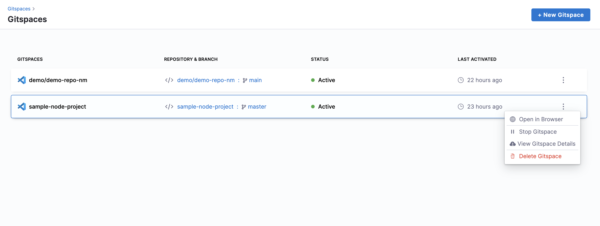
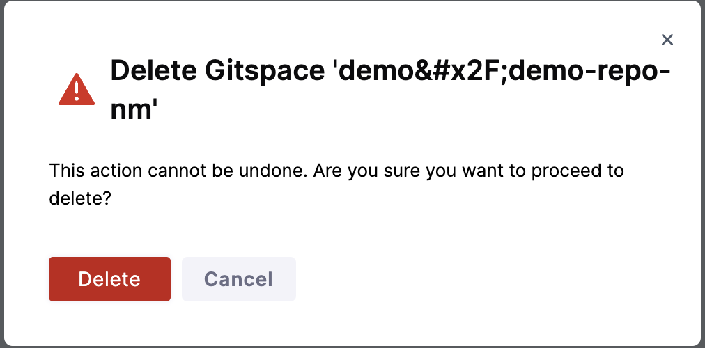

## Steps to Delete a Gitspace

1. Deleting a Gitspace is an irreversible action since deleted Gitspaces cannot be restored.  

2. On the Gitspace Page click on the **3 dots** and select **Delete Gitspace**. You will see a warning stating that this action cannot be undone. If you are sure you want to delete the Gitspace, click on **Delete**.

