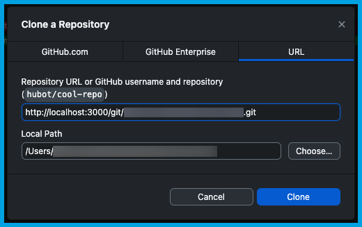
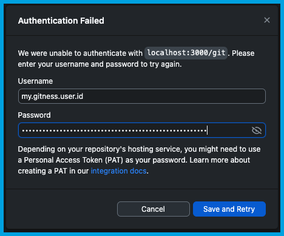

# Cloning

How to clone your Gitness repositories.

## HTTPS

1. In your [project](../administration/project-management.md), select **Repositories**, and then select the repository you want to clone.
2. On the **Files** page, select **Clone**.
3. If this is the first time you've cloned this repository, select **Generate Clone Credentials**, and then copy the **Password (API Token)** and store it somewhere secure. Clone credentials are only shown once.

   When you select **Generate Clone Credentials**, Gitness automatically creates an [API token](../administration/user-management.md#generate-user-token) in your account.

   :::caution

   Tokens carry many privileges; treat your user tokens as passwords and store them securely.

   :::

4. Copy the Gitness repository URL shown on the **Clone** dropdown, and use it to clone your repository through command line Git or with your preferred Git GUI tool.

   When cloning the repository, you will be prompted for your Gitness user ID and password, which were shown when you generated clone credentials.

5. Once cloned locally, you can work with your Gitness repository as you would with other Git repositories, by creating commits, pushing to the remote, pulling changes, and more.

### Example: Visual Studio Code

Check out this video to learn about working with Gitness repositories in Microsoft Visual Studio Code.

<iframe width="560" height="315" src="https://www.youtube.com/embed/kqaAx6zwxAE?si=Loo-xftV6woVpiir" title="YouTube video player" frameborder="0" allow="accelerometer; autoplay; clipboard-write; encrypted-media; gyroscope; picture-in-picture; web-share" allowfullscreen></iframe>

### Example: GitHub Desktop

To clone a Gitness repository in GitHub Desktop:

1. In your Gitness [project](../administration/project-management.md), select **Repositories**, and then select the repository you want to clone.
2. On the **Files** page, select **Clone**.
3. If this is the first time you've cloned this repository, select **Generate Clone Credentials**, and then copy the **Password (API Token)** and store it somewhere secure. Clone credentials are only shown once.

   When you select **Generate Clone Credentials**, Gitness automatically creates an [API token](../administration/user-management.md#generate-user-token) in your account.

   :::caution

   Tokens carry many privileges; treat your user tokens as passwords and store them securely.

   :::

4. Copy the Gitness repository URL shown on the **Clone** dropdown.
5. In GitHub Desktop, select **Current Repository**, select **Add**, and then select **Clone Repository**.
6. On the **Clone a Repository** dialog, select the **URL** tab, enter your Gitness repository URL, specify the local path where you want to clone the repo, and then select **Clone**.

   

7. On the **Authentication Failed** dialog, enter your Gitness user ID for the **Username**, enter your token for the **Password**, and then select **Save and Retry**.

   

8. Once cloned locally, you can work with your Gitness repository as you would with other Git repositories, by creating commits, pushing to the remote, pulling changes, and more.
