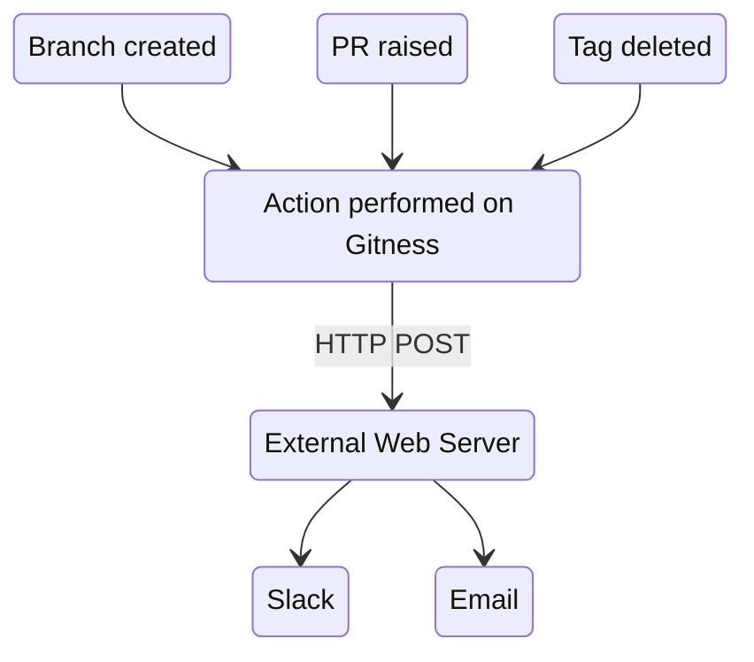

# Webhooks

Webhooks send data to HTTP endpoints from actions in your repository, such as opened pull requests, new branches, and more.



## Create a webhook

1. In the __Webhooks__ view of your repository, select __New Webhook__
2. Give the webhook a name and optional description
3. Enter your endpoint in the __Payload URL__ field
4. If your endpoint requires authentication, provide your token in the __Secret__ field
5. Select __Send me everything__ to send all events to your endpoint, or choose __Let me select individual events__
6. Select __Enable SSL verification__ if your endpoint supports it
7. Optionally uncheck __Enabled__ to disable the webhook, then select __Create Webhook__

## Payload

This is an example webhook payload for when a pull request is opened.

```jsx
{
    "trigger": "pullreq_created",
    "repo": {
        "id": 13,
        "path": "kmpySmUISimoRrJL6NL73w/myOrg/myProject/aba",
        "uid": "aba",
        "default_branch": "main",
        "git_url": "http://localhost:3000/git/kmpySmUISimoRrJL6NL73w/myOrg/myProject/aba.git"
    },
    "principal": {
        "id": 8,
        "uid": "0osgWsTZRsSZ8RWfjLRkEg",
        "display_name": "default",
        "email": "default@harness.io",
        "type": "user",
        "created": 1675390885380,
        "updated": 1675390885380
    },
    "pull_req": {
        "number": 4,
        "state": "open",
        "is_draft": false,
        "title": "aw",
        "source_repo_id": 13,
        "source_branch": "b",
        "target_repo_id": 13,
        "target_branch": "main",
        "merge_strategy": null
    },
    "target_ref": {
        "name": "refs/heads/main",
        "repo": {
            "id": 13,
            "path": "kmpySmUISimoRrJL6NL73w/myOrg/myProject/aba",
            "uid": "aba",
            "default_branch": "main",
            "git_url": "http://localhost:3000/git/kmpySmUISimoRrJL6NL73w/myOrg/myProject/aba.git"
        }
    },
    "ref": {
        "name": "refs/heads/b",
        "repo": {
            "id": 13,
            "path": "kmpySmUISimoRrJL6NL73w/myOrg/myProject/aba",
            "uid": "aba",
            "default_branch": "main",
            "git_url": "http://localhost:3000/git/kmpySmUISimoRrJL6NL73w/myOrg/myProject/aba.git"
        }
    },
    "sha": "d74b1ebfe520ac01b209dd9085f005884cc9f4cd",
    "commit": {
        "sha": "d74b1ebfe520ac01b209dd9085f005884cc9f4cd",
        "message": "Update b.txt",
        "author": {
            "identity": {
                "name": "Admin",
                "email": "admin@harness.io"
            },
            "when": "2023-01-31T22:01:55-08:00"
        },
        "committer": {
            "identity": {
                "name": "Admin",
                "email": "admin@harness.io"
            },
            "when": "2023-01-31T22:01:55-08:00"
        }
    }
}
```