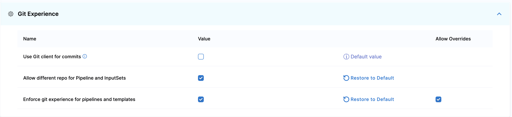
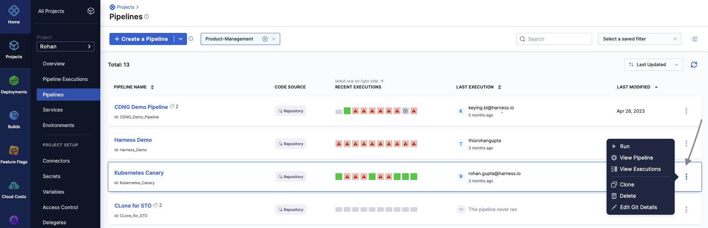
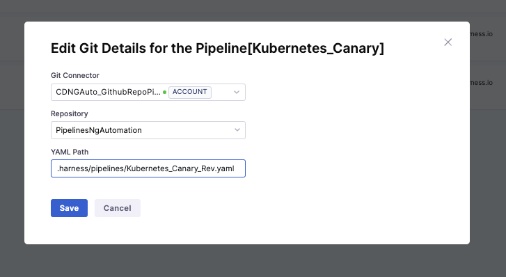
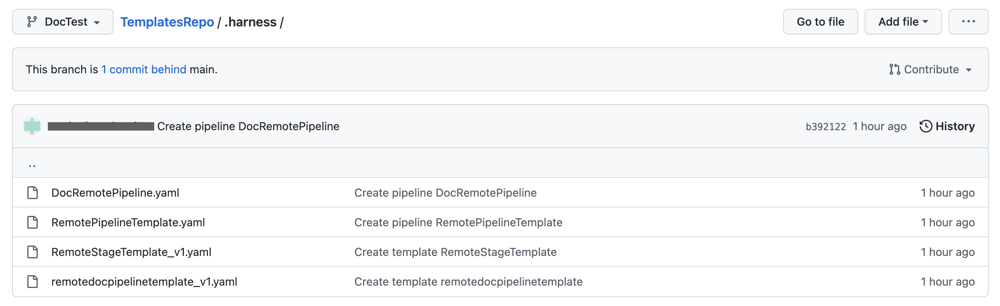
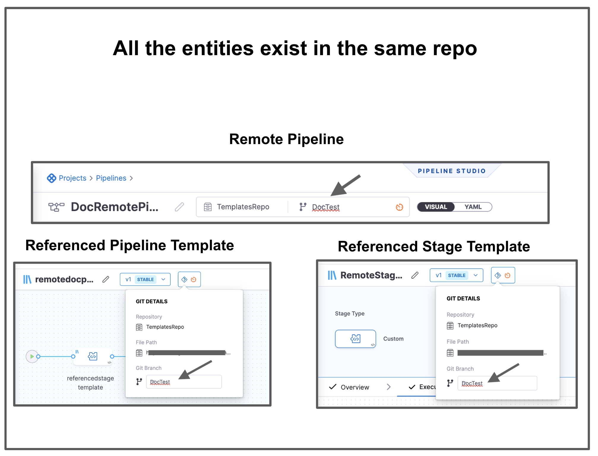
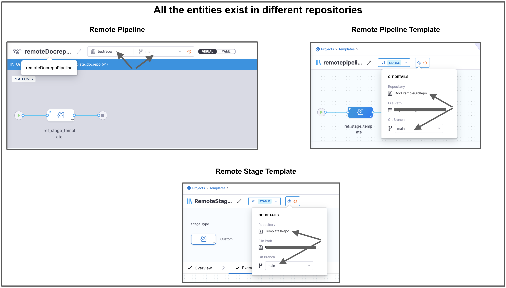
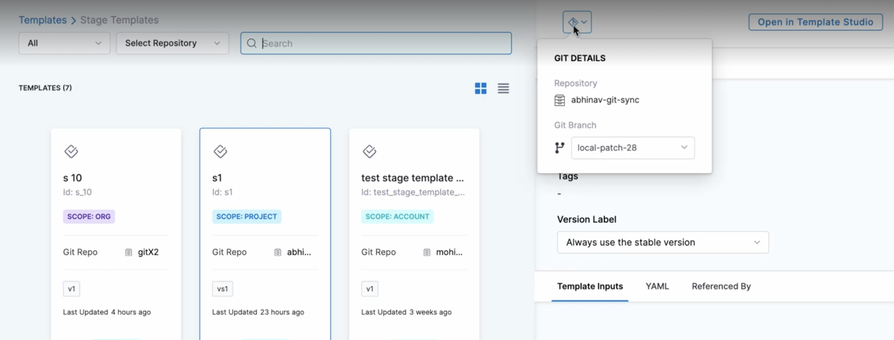
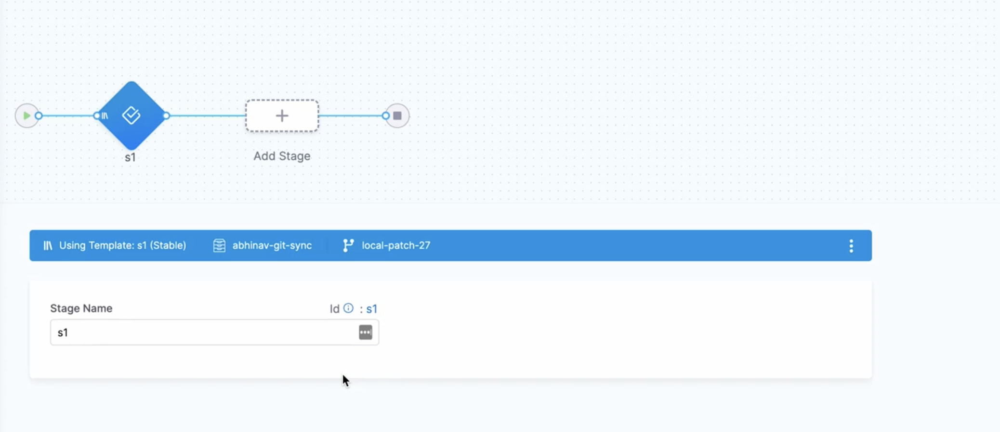

This quickstart shows you how to enable and use Git Experience for your Harness resources, such as pipelines.

Harness Git Experience lets you store your resources and configurations in Git and pick Git repos as the source of truth.

## Objectives

You'll learn how to:

1. Enable Git Experience for a pipeline.
2. Create and sync a pipeline with your Git repo.
3. Execute a pipeline

## Before you begin

Make sure you have the following set up Before you begin this quickstart:

* Make sure you have a Git repo with at least one branch.
* Make sure you have a Git connector with a Personal Access Token (PAT) for your Git account.​​
* A Personal Access Token (PAT) for your Git account.
	+ Harness needs the PAT to use the Git platform APIs.
	+ You add the PAT to Harness as a Text Secret and it is encrypted using a Harness Secret Manager.
	+ Your Git Personal Access Token is stored in your Harness secret and is a private key to which only you have access. This secret cannot be accessed or referenced by any other user. 
	  
	  Make sure you configure SSO for your GitHub token when enabling Git provider access via SSO.
	  
	+ The PAT must have the following scope:
		- GitHub:
        - Bitbucket:
	+ To enable Git Experience for your resources, make sure that you have Create/Edit permissions for them.​​

:::note
Make sure your repo has at least one branch, such as main or master. For most Git providers, you simply add a README file to the repo, and the branch is created.

:::

## Supported Git providers

The following section lists the support for Git providers for Harness Git Sync:​

* GitHub
* Bitbucket Cloud
* Bitbucket Server
* Azure Repos
* GitLab

Make sure `feature.file.editor` is not set to `false` in the `bitbucket.properties` file if you are using Bitbucket on-prem.

## Git experience requirements

You can store your resources and configurations in Git by selecting the **Remote** option while creating the resources.

For this, you must specify a Harness Git Connector, a repo, branch details, and a file path.

This topic explains how to create a remote pipeline and execute it using Harness Git Experience.

You can also store your configurations in Harness, by selecting the **Inline** option while creating resources. For more information on creating an inline pipeline, see [Pipelines and Stages](https://developer.harness.io/docs/category/pipelines).

You can store configurations of the following resources in Git:

* Pipelines
* Input sets

Harness tracks where your configuration is kept and manages the whole lifespan of resources by maintaining metadata for each resource.

## Enforce Git experience

To ensure that your resource configurations are saved only in Git repositories, you can enforce Git experience in your Harness account.
You can do this by enabling `Enforce git experience for pipelines and templates`. 

This setting applies to the following resources:

* Pipelines
* Templates

Harness disables inline pipelines and templates, and users can only create remote pipelines and templates after enabling this setting. You can still create inline input sets corresponding to existing inline pipelines.

To enforce Git experience in Harness: 

1. Go to **ACCOUNT SETTINGS**, and then select **Account Resources**.
2. Select **Default Settings**, and then select **Git Experience**.
3. Enable **Enforce git experience for pipelines and templates**.
   After you enable this setting, it applies to all the scopes (account, organization, and project) in Harness.
4. To override this setting in the child scopes, select **Allow Overrides** beside the settings.
   This forces configurations at the account scope to be saved in Git repositories only. Users can, however, still create inline pipelines and templates at the organizational and project levels.

   

## Add a remote pipeline

This quickstart explains how to add a pipeline and sync it with your Git repo. This is called the Remote option. To add an inline pipeline, see **Remote** option. To add an inline pipeline, see [Create a Pipeline](../8_Pipelines/add-a-stage.md#step-1-create-a-pipeline).

In your Project, click **Pipelines** and then click **Create a Pipeline**. The **Create New Pipeline** settings appear.

Enter a **Name** for your pipeline.

Click **Remote**. The additional settings appear to configure Git Experience.

In **Git Connector**, select or create a Git Connector to the repo for your Project. For steps, see [Code Repo Connectors](../7_Connectors/Code-Repositories/connect-to-code-repo.md).

 IMPORTANT 

Connector must use the Enable API access option and Token
The Connector must use the Enable API access option and Username and Token authentication. Harness requires the token for API access. Generate the token in your account on the Git provider and add it to Harness as a Secret. Next, use the token in the credentials for the Git Connector.​

 

For GitHub, the token must have the following scopes: 

Here's an example of a GitHub Connector with the correct settings:​

In **Repository**, select your repository. If your repository isn't listed, enter its name since only a select few repositories are filled here.

:::note
Create the repository in Git before entering it in **Select Repository**. Harness does not create the repository for you.

:::

In **Git Branch**, select your branch. If your branch isn't listed, enter its name since only a select few branches are filled here.

:::note
Create the branch in your repository before entering it in **Git Branch**. Harness does not create the branch for you. 

:::

Harness pre-populates the **YAML Path**. You can change this path and the file name. All your configurations are stored in Git in the [Harness Folder](git-experience-overview.md#harness-folder).

:::note
Make sure that your YAML path starts with `.harness/` and is unique.
:::

Click **Start**.

The pipeline Studio is displayed with your repo and branch name.

## Add a stage

Click **Add Stage**. The stage options appear.

Select a stage type and follow its steps.

The steps you see depend on the type of stage you selected.​

For more information, see [Add Stage](../8_Pipelines/add-a-stage.md).

Add a step and click **Save**.

The **Save Pipelines to Git** settings appear.

In **Select Branch to Commit**, commit to an existing or new branch.

* **Commit to an existing branch**: you can start a pull request if you like.
* **Commit to a new branch**: enter the new branch name. You can start a pull request if you like.

Click **Save**. 

:::note
If you are using Bitbucket on-prem and `feature.file.editor` is set to `false` in the `bitbucket.properties`, make sure you enable **Use Git client for commits** in the [default settings](../17_Settings/default-settings.md) at the account scope. Harness will check out the code on the delegate and use the Git client to make the commits to your Git repository.
:::

Your pipeline is saved to the repo branch.

Click the YAML file to see the YAML for the pipeline.

Edit the pipeline YAML. For example, change the name of a step.

Commit your changes to Git.

Return to Harness and refresh the page.​

A Pipeline Updated message appears.

Click **Update**.

The changes you made in Git are now applied to Harness.​

## Edit Git details for a pipeline

The Harness manager allows you to edit the Git details after the pipeline is configured and saved. You can modify following Git settings:

- Git connector
- Repository
- YAML path

To modify these Git settings, do the following:

1. In your Project, select **Pipelines**.
2. Go to the pipeline where you want to edit the Git details, and select more options (⋮).
  
3. Make changes to the settings, and then select **Save**.
  

## Execute pipeline

In your Project, click **Pipelines**.

Click on your pipeline.

Harness loads your pipeline depending on where you saved your remote pipeline.

- If you saved your pipeline on the default branch, Harness loads it from the default branch.
- If you saved your pipeline on a non-default branch, Harness uses the metadata of this pipeline to load it from the non-default branch.
- If you saved your pipeline in a branch that is no longer available, Harness throws an error. You must select a branch to load your pipeline in this case.
  

:::caution
Harness fetches your pipeline details from the default branch if you created your remote pipeline before version 77808. Select the corresponding branch and proceed to load a pipeline residing in a branch other than the default branch.

:::

<!--  -->

Click **Run**.

Click **Run Pipeline**.

## Branch selection logic for fetching referenced entities in remote pipelines

The configurations of the required resources and any referenced entities like input sets and templates are fetched from Git during pipeline fetch, creation, or execution.

Following are the possible scenarios when your remote pipelines reference entities:
- The referenced entities are stored in the same repository as the pipeline.
- The referenced entities are stored in a different repository than the pipeline.

### The referenced entities are stored in the same repository as the pipeline

Following are the key points to keep in mind when the referenced entities reside in the same repository: 

- During pipeline execution, Harness fetches the entities like templates from the same branch as the pipeline. This lets you test the templates before merging them back into the "default" branch.
- Harness recommends creating a separate project for testing templates.
- Templates and the corresponding pipelines to test them must be in the same repository.
- When you modify a template in a feature branch, the test pipeline is also present in the feature branch.
- As you can execute the pipeline from any branch, you can select the branch in which the changes to test templates were pushed. Merge the changes after testing. Upon merging, others can access them.
- This approach works best when the teams responsible for creating and managing templates are different from those responsible for executing the pipeline (Platform Engineering or DevOps teams versus Developers), so the test projects should be separate from the production projects.

Let us look at an example: 

There is a pipeline `DocRemotePipeline` that references a remote pipeline template named `remotedocpipelinetemplate`. This remote pipeline template references a remote stage template named `RemoteStageTemplate`. These 3 entities are in the same Git repo.

When you execute this pipeline, Harness fetches these entities from the branch that you have selected.

### The referenced entities are stored in a different repository than the pipeline

Harness fetches entities like templates from the default branch of the repository if they are stored in another repository.

This ensures: 
- Teams always use tested and approved templates.
- Prevents teams to execute pipelines using templates from different branches that have not yet been tested.

If your inline entities refer remote entities, Harness fetches the remote entities from the default branch.
  
Let us look at an example: 
  
There is a pipeline `remoteDocrepoPipeline` that references a remote pipeline template named `remotepipelinetemplate_docrepo`. This remote pipeline template references a remote stage template named `RemoteStageTemplate`. These 3 entities are in different Git repos.

When you execute this pipeline, Harness fetches these nested entities from the default branch of the respective repositories.

  
Harness resolves all the dependencies and then proceeds with Pipeline execution.​

### Manual branch selection

It is also possible to select the branch for the referenced entities if you have explicitly selected a feature branch.

For example, you can select a branch in your pipeline to reference templates from another branch.

Here is a demo explaining steps to select a branch for a referenced template: 

<docvideo src="https://www.loom.com/share/a1848256318c4b92aefa965402c9dca9?sid=0ed15761-4be2-4897-b9fd-73782df1a21f"/>

To specify the remote branch for the referenced template:

1. Select your remote pipeline, and then select **Add Stage**.

2. Select **Use Template**.

3. Select the branch, and then select **Use Template**.

   

   The template has now been referenced from a different branch in the remote pipeline.

   Harness displays the pipeline branch and the referenced template branch.

   

4. Select **Save**.

The parent YAML will include an example of a YAML screenshot if you explicitly select any branch for the child template.

The parent YAML will not contain a branch for the child if you do not specify a branch explicitly. 

To switch the referring child entity from a feature branch to a default branch, manually remove the field `gitBranch` from the parent YAML.

## Next steps

* [Manage Input Sets and Triggers in Simplified Git Experience​](manage-input-sets-in-simplified-git-experience.md)

