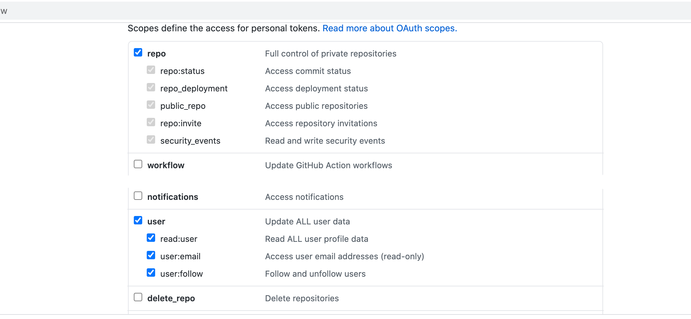

This quickstart shows you how to enable and use Git Experience for your Harness resources, such as Pipelines.

Harness Git Experience lets you store your resources and configurations in Git and pick Git repos as the source of truth.

### Objectives

You'll learn how to:

1. Enable Git Experience for a Pipeline.
2. Create and sync a Pipeline with your Git repo.
3. Execute a Pipeline

### Before you begin

Make sure you have the following set up Before you begin this quickstart:

* Make sure you have a Git repo with at least one branch.
* Make sure you have a Git connector with a Personal Access Token (PAT) for your Git account.​​
* A Personal Access Token (PAT) for your Git account.
	+ Harness needs the PAT to use the Git platform APIs.
	+ You add the PAT to Harness as a Text Secret and it is encrypted using a Harness Secret Manager.
	+ Your Git Personal Access Token is stored in your Harness secret and is a private key to which only you have access. This secret cannot be accessed or referenced by any other user.
	+ The PAT must have the following scope:
		- GitHub:
		- Bitbucket:
	+ To enable Git Experience for your resources, make sure that you have Create/Edit permissions for them.​​

Make sure your repo has at least one branch, such as main or master. For most Git providers, you simply add a README file to the repo, and the branch is created.

### Supported Git providers

The following section lists the support for Git providers for Harness Git Sync:​

* GitHub
* Bitbucket Cloud
* Bitbucket Server

Make sure `feature.file.editor` is not set to `false` in the `bitbucket.properties` file if you are using Bitbucket on-prem.

### Review: Git experience requirements

You can store your resources and configurations in Git by selecting the **Remote** option while creating the resources.

For this, you must specify a Harness Git Connector, a repo, branch details, and a file path.

This topic explains how to create a remote Pipeline and execute it using Harness Git Experience.

You can also store your configurations in Harness, by selecting the **Inline** option while creating resources. For more information on creating an inline Pipeline, see [Pipelines and Stages](https://docs.harness.io/category/pipelines).

You can store configurations of the following resources in Git:

* Pipelines
* Input Sets

Harness tracks where your configuration is kept and manages the whole lifespan of resources by maintaining metadata for each resource.

### Step 1: Add a remote pipeline

This quickstart explains how to add a Pipeline and sync it with your Git repo. This is called the Remote option. To add an inline Pipeline, see **Remote** option. To add an inline Pipeline, see [Create a Pipeline](../8_Pipelines/add-a-stage.md#step-1-create-a-pipeline).

In your Project, click **Pipelines** and then click **Create a Pipeline**. The **Create New Pipeline** settings appear.

Enter a **Name** for your Pipeline.

Click **Remote**. The additional settings appear to configure Git Experience.

In **Git Connector**, select or create a Git Connector to the repo for your Project. For steps, see [Code Repo Connectors](https://docs.harness.io/category/code-repo-connectors).

Important: Connector must use the Enable API access option and Token**Important**: The Connector must use the Enable API access option and Username and Token authentication. Harness requires the token for API access. Generate the token in your account on the Git provider and add it to Harness as a Secret. Next, use the token in the credentials for the Git Connector.​  
  
For GitHub, the token must have the following scopes:  
Here's an example of a GitHub Connector that has the correct settings:​

In **Repository**, select your repository. If your repository isn't listed, enter its name since only a select few repositories are filled here.

Create the repository in Git before entering it in **Select Repository**. Harness does not create the repository for you.In **Git Branch**, select your branch. If your branch isn't listed, enter its name since only a select few branches are filled here.

Create the branch in your repository before entering it in **Git Branch**. Harness does not create the branch for you.Harness auto-populates the **YAML Path**. You can change this path and the file name. All your configurations are stored in Git in the [Harness Folder](harness-git-experience-overview.md#harness-folder).

Make sure that your YAML path starts with `.harness/` and is unique.Click **Start**.

The Pipeline Studio is displayed with your repo and branch name.

### Step 2: Add a stage

Click **Add Stage**. The stage options appear.

Select a stage type and follow its steps.

The steps you see depend on the type of stage you selected.​

For more information, see [Add Stage](../8_Pipelines/add-a-stage.md).

Add a step and click **Save**.

The **Save Pipelines to Git** settings appear.

In **Select Branch to Commit**, commit to an existing or new branch.

* **Commit to an existing branch**: you can start a pull request if you like.
* **Commit to a new branch**: enter the new branch name. You can start a pull request if you like.

Click **Save**. Your Pipeline is saved to the repo branch.

Click the YAML file to see the YAML for the Pipeline.

Edit the Pipeline YAML. For example, change the name of a step.

Commit your changes to Git.

Return to Harness and refresh the page.​

A Pipeline Updated message appears.

Click **Update**.

The changes you made in Git are now applied to Harness.​

### Step 3: Execute pipeline

In your Project, click **Pipelines**.

Click on your Pipeline.

Select the branch from which you want to execute your Pipeline.

Click **Run**.

Your Pipeline is ready to run from the branch you just selected.

Click **Run Pipeline**.

During Pipeline execution, the configurations of the required resources and any referenced entities like Input Sets, are fetched from Git.

If the referenced entities exist in the same repo, they are fetched from the same branch that you have selected for Pipeline execution.​

If the referenced entities exist in a different repo, they are fetched from the default branch of the repo where the entities are stored.​

Harness resolves all the dependencies and then proceeds with Pipeline execution.​

### Next steps

* [Manage Input Sets and Triggers in Simplified Git Experience​](manage-input-sets-in-simplified-git-experience.md)

