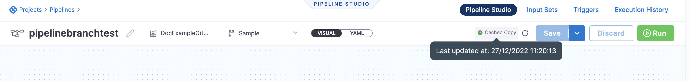
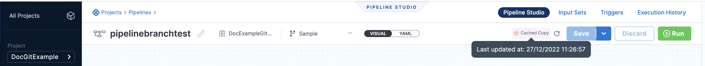
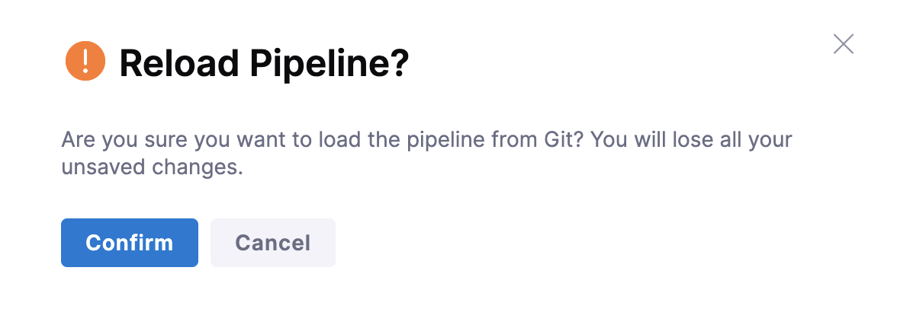
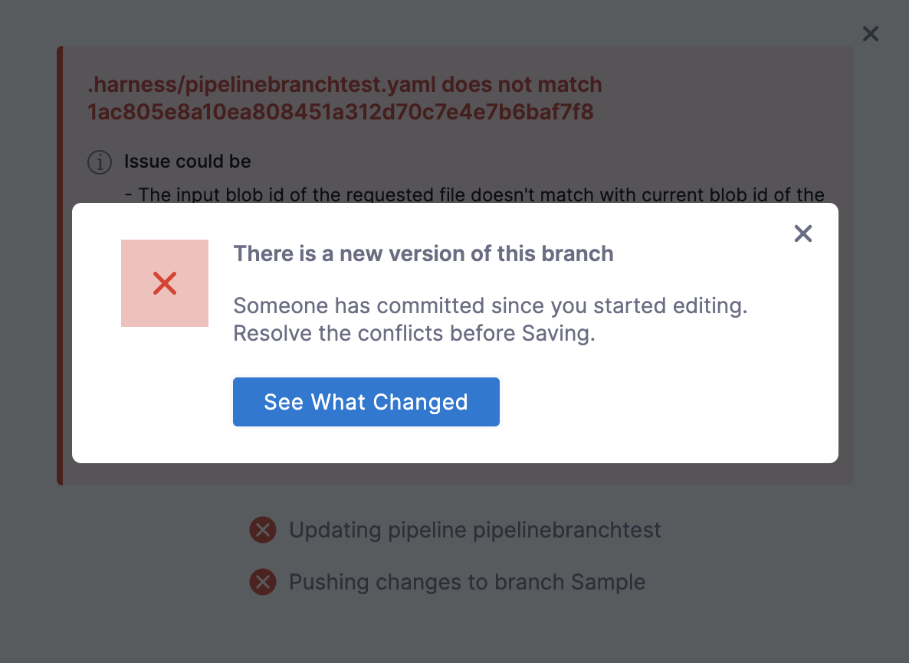

Entity caching reduces delays in loading your remote entities on the Harness UI. The Harness UI maintains a local cache to reduce delays in loading your remote entities. Caching is especially useful when there are multiple levels of nesting, such as those involving  pipeline templates, stage templates, and step templates. Loading such nested entities can be time consuming involving numerous network calls, thereby reducing the performance.

Harness caches the following remote entities:
- Remote pipelines
- Remote templates

:::note
The Git cache is only used to render entities faster in the Harness UI, not to improve pipeline execution. When executing a pipeline, Harness always fetches entities from Git to avoid using the stale data.
:::

You can reload the entities from Git and update the cache at any time. 

## Entity cache life cycle 

Harness UI uses the following cache life cycle to render a remote entity:
1. The first time you load a remote entity to the Harness UI, the Harness UI fetches the entity from Git, renders it in the UI, and then updates the cache. Subsequently, the Harness UI loads the entity from the cache.
2. Harness indicates an active cache with a green tick if an entity's cache has been updated in the last two hours.

    

   When any entity's cache was last updated more than 2 hours ago, Harness displays an orange tick against it to indicate a stale cache.

   

   Click on the refresh option to refresh cache.

   
  
  The cache status you see in the UI is only indicative of the cache status of the entity being fetched. Entities nested within the fetched entity may have different cache statuses.

3.  Harness clears the cache for any entity that hasn't been referred to or loaded on the Harness UI in the previous 72 hours. Any subsequent access (whether through API or UI) will fetch the entity from GIT, update the cache, and return the response.
   
## Caching entities saved on multiple branches

To ensure isolation between caches for different pipelines for different branches, the cache for each entity is maintained separately for each branch. 
For example, if you have a stage template saved in separate branches in Git, Harness maintains a separate cache corresponding to each branch for the stage template. When this cache step is encountered during your pipeline execution, the cache corresponding to a unique key is requested from the server. The server then looks for a cache with this key and returns the cache (if available). 

## Committing changes

When you commit changes to an entity that has been cached, Harness displays a warning if the cached version of the entity differs from that in Git.
To view the differences, click **See What Changed**.

You can do one of the following when there are differences:
- Commit your changes in the UI and override the configurations in Git.
- Discard your changes done on the UI and reload the configurations from Git.

