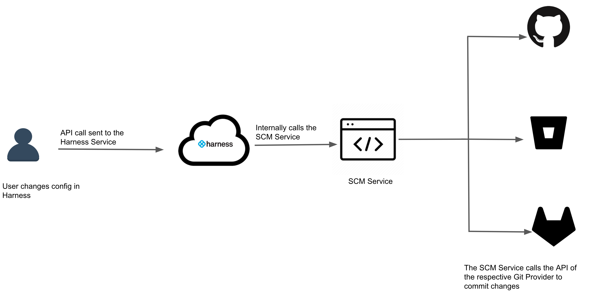
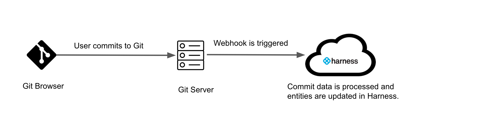

This version of Harness Git Experience has been deprecated. To try out the latest version of Git Experience, see [Harness Git Experience Quickstart](configure-git-experience-for-harness-entities.md).​Harness Git Sync provides seamless integration between your Harness Projects, Pipelines, and resources and your Git repos. You can work entirely from Git or use a hybrid method of Git and the Harness Manager. With Harness Git Sync you can synchronize your configurations with Git and keep them up-to-date.

Git Sync enables to:

* Store and retrieve Harness configurations to/from Git.
* Change Harness configuration just by changing the YAML files in Git.

This topic introduces you to Harness Git Sync.

### Before you begin

* In the Git Connectors, all Projects that connect to a given Git repo must use the same Connection Type: SSH or HTTP. For more information, see [Connection Type](../7_Connectors/ref-source-repo-provider/git-connector-settings-reference.md#connection-type).  
Let us take an example where Project1 and Project2 connect to repo Repo1. In this case, the Git connectors for both projects must use the same Connection Type.
* Do not change any Types or Identifiers (Account Id, Org Id, Project Id, Connectors, etc) for any Harness entities. Ids are immutable and if they are out of sync, Harness Git Experience will not work.
* Do not delete the branch that you used to enable Git sync. Deleting this branch will cause inconsistencies in the Harness Git Experience.0

### Limitations

* Harness Git Experience is not enabled for Pipeline Triggers at this time. You can still use Pipeline Triggers manually or via Webhooks.
* You cannot clone Pipelines through Harness in your Projects through Harness Git Experience.

#### Supported Git Providers

The following section lists the support for Git providers for Harness Git Sync:

|  |  |  |
| --- | --- | --- |
| **Git Provider** | **Status** | **Feature Flag** |
| GitHub | GA | None |
| Bitbucket Cloud | Beta | None |
| Bitbucket Self-Hosted | Not supported |  |

#### Supported Harness Entities

The following section lists the Harness Entities that Harness Git Sync supports:

|  |  |
| --- | --- |
| **Harness Entities** | **Scope** |
| Pipelines | Project |
| Connectors | Project |
| Input Sets | Project |
| Templates | Project |
| Feature Flags | Project |

### What is Harness Git Experience?

Harness Git Experience is a Git-First approach for managing Harness configurations as code, using Git as the source of truth. This means whatever you see in Git is the true state and you need not validate it in Harness. Any change you make to a Git Synced Project is pushed to Git first and then applied in Harness. It provides seamless integration between Harness and your Git repos.

This approach provides the following major benefits:

* Automation and Consistency
* Version Control
* Scalability
* Traceability

Harness Git Experience allows you to configure Projects, Pipelines, and resources in Harness using YAML. You can perform nearly everything you can do in the Harness user interface with YAML.

### How Does Harness Git Experience Work?

Harness Git Experience ensures a bi-directional or a full sync between your Harness entities and your Git repos. This means any changes you make in Harness will be pushed to Git and any changes you make to your synced entities in Git will be reflected in Harness.

Whenever you make any changes in the configuration, Harness Git Experience takes this change and pushes it to Git.

Whenever you commit a change to Git, Harness recieves the webhook request. This request contains details about the changes that must be applied to the Harness entities.

### Key Features

##### Bi-directional Sync

Any changes you make in Harness will be pushed to Git and any changes you make to your synced entities in Git will be reflected in Harness. This means you can seamlessly enable Git Sync for your existing Projects that already have Connectors and Pipelines added to it.

##### Multiple Repo Support

Your Harness Pipelines and their resources (Connectors, etc) can exist in multiple repos and folders. You can choose the repository where you wish to make the modifications before pushing each configuration. At Pipeline execution, Harness pulls them all together to execute your Pipeline as you designed it. This gives you the flexibility to manage your Git repositories in the way you want.

You can store your configurations in the following ways:

* Store configuration files along with the code repository.
* Store configuration files in a repository separate from the code.
* Store the prod configurations in one repo, and the non-prod ones in another repo, so that only the selected developers can access prod configs.
* Store the configuration files of different environments in different branches.
* Store the Pipelines in one repository, and other configuration files in another.

##### Multiple Branch Support

 Multiple users can make commits to multiple branches in your Harness Projects that are synced with the Git Provider.

##### Pipeline Changes Pushed using your SCM Credentials

Harness Git Experience uses your SCM credentials instead of a shared Harness account. This improves auditing and helps you see who made commits from within Harness. Using your SCM credentials also allows you to leverage Harness RBAC.

##### Git-like User Interface from within Harness Manager

You can test Pipeline changes on a separate branch and then merge them to the main branch. Harness Git Experience provides a full dev experience with repo, branch, and PR support.

##### Webhooks for your Synced Repos are Added Automatically

Webhooks are registered automatically for your Project when you enable Git Experience. These will be used to trigger a Git sync in your repos whenever you make any commit in Git. This keeps your repos and Harness in sync in real-time.

### What Can I Do with Harness Git Experience?

Harness Git Experience helps you do the following:

* Store and retrieve your Harness configurations to/from Git.
* Change the Harness configuration just by changing the YAML files in Git.
* Add a Pipeline in Git first and it gets added to your synced Project automatically.
* Maintain configurations like you maintain code.
* Maintain Harness CI/CD/etc Pipelines alongside the code in your repos.
* Submit config changes using the Harness Pipeline Studio (GUI and/or YAML) or entirely in Git.
* Make Harness Pipeline or resource config changes in a branch, test it in isolation (sandbox), and submit changes to master using Harness Manager or your Git platform.
* Make code and Harness CI/CD/etc Pipeline changes within a single PR.
* Control who can make changes using Prod and Non-Prod configurations in separate repos.
* Audit which Git user accounts made config changes.

### What Do I Need to Enable Harness Git Experience?

#### SCM Profile

A **Harness SCM** is required to sync entities from Harness to Git. If you try to enable Harness Git Experience without first setting up an SCM, Harness will warn you and require you to set one up.

The Harness SCM stores your user profile information like username and PAT to connect to the Git provider. When you sync a Project with a repo, these credentials are used for the sync.

For detailed steps to add an SCM, see [Add Source Code Managers](https://docs.harness.io/article/p92awqts2x-add-source-code-managers).

Any commit activities you perform when you make changes to the Project in Harness require your SCM credentials. Additional tasks, such as registering a webhook, require your Git Connector credentials.Git ConnectorA Harness Git Connector is used to sync your Harness Project with your Git repo. You can set up a [Git Connector](https://docs.harness.io/category/code-repo-connectors) first and simply select it when setting up Git Experience, or you can create a Git Connector as part of the Git Experience setup.

You will need a Harness Git Connector to connect with the Git provider and perform operations like generating a webhook. Your Git Connector credentials are used to commit to Git when operations are performed using API.

**Important:** The Connector must use the **Enable API access** option and Username and **Token** authentication. Harness requires the token to access the Git API. Generate the token in your account on the Git provider and add it to Harness as a Secret. Next, use the token in the credentials for the Git Connector.For detailed steps to add a Git Connector, see [Code Repo Connectors](https://docs.harness.io/category/code-repo-connectors).

#### Repository

Harness configurations are stored in repositories. These configuration files can be kept in the same repository as the code, or they can be kept separate. You can map your Project to multiple repositories.

You must have valid Git credentials and a repo within this Git account before you enable Harness Git Experience.#### Default Branch

Harness Git Experience enables you to have multiple branches to support various branching workflows. When you create/modify entities from Harness, you can commit in one of the following ways:

* Commit to an existing branch without PR
* Commit to an existing branch with a PR
* Commit to a new branch without PR
* Commit to a new branch with PR

There is a [default branch](https://git-scm.com/book/en/v2/Git-Branching-Branches-in-a-Nutshell#_git_branches_overview) for every repo. If an entity exists in multiple branches of a given repo, then the entity from the default branch is used.

#### Harness Folder

Your Harness Projects and resources are stored in Git in the **Harness Folder**. 

When you set up Git Experience and sync Harness with a Git repo, you specify the repos and branches to use for your Harness Pipelines and resources. Harness then adds a .harness folder to these locations. This is the Harness Folder.

Harness scans the **.harness** folder recursively to find all the config files in it. All of the Harness entities are synced to the .harness folder in your repository.

You can store your YAML files in any subfolder within the Harness Folder. Harness does not enforce a specific format or structure within the .harness folder. You can have multiple Harness Folders to store configs.

For example, if you have two Connectors in a single Project you can have one Harness folder for each Connector or a common Harness Folder for the entire Project.

Harness Folders can reside anywhere in Git repos and their subdirectories.

Create the folder in your repo before setting up Git Experience. You will enter the name of the folder in Harness. Harness does not create the folder for you.### How is Harness NextGen Git Support Different from FirstGen?

Not sure if you are using FirstGen or NextGen? See [Harness FirstGen vs Harness NextGen](https://docs.harness.io/article/1fjmm4by22).Harness NextGen Git Experience functionality is different than Harness FirstGen Harness Git Sync. If you used FirstGen Git Sync, you will find the Harness NextGen Git Experience setup and usage different and improved.

If you're a Harness FirstGen user, you're likely familiar with Harness Git Sync. The following table shows the differences between Harness FirstGen Git Sync and NextGen Harness Git Experience:

|  |  |  |
| --- | --- | --- |
| **Feature** | **FirstGen** | **NextGen** |
| Bi-direction Git sync | ✓ | ✓ |
| Git branching | X | ✓ |
| Primary data source | Mongo | Git |
| Optional Git sync | ✓ | ✓ |
| Multi-repo support | X | ✓ |
| Flexible folders | X | ✓ |
| User credentials support | X | ✓ |
| Multi-branch support | X | ✓ |
| Automatic Webhook integration | X | ✓ |

### Blog Post

The following blog post walks you through Harness Git Experience:

[The Git Sync Experience In Harness](https://harness.io/blog/continuous-delivery/git-sync-experience/)

### Next steps

* [Harness Git Experience Quickstart](harness-git-experience-quickstart.md)
* [Git Experience How-tos](https://docs.harness.io/article/soavr3jh0i-git-experience-how-tos)
* [Diagnose and Fix Git Sync Errors](https://ngdocs.harness.io/article/24ehx5oa94-git-sync-errors)

