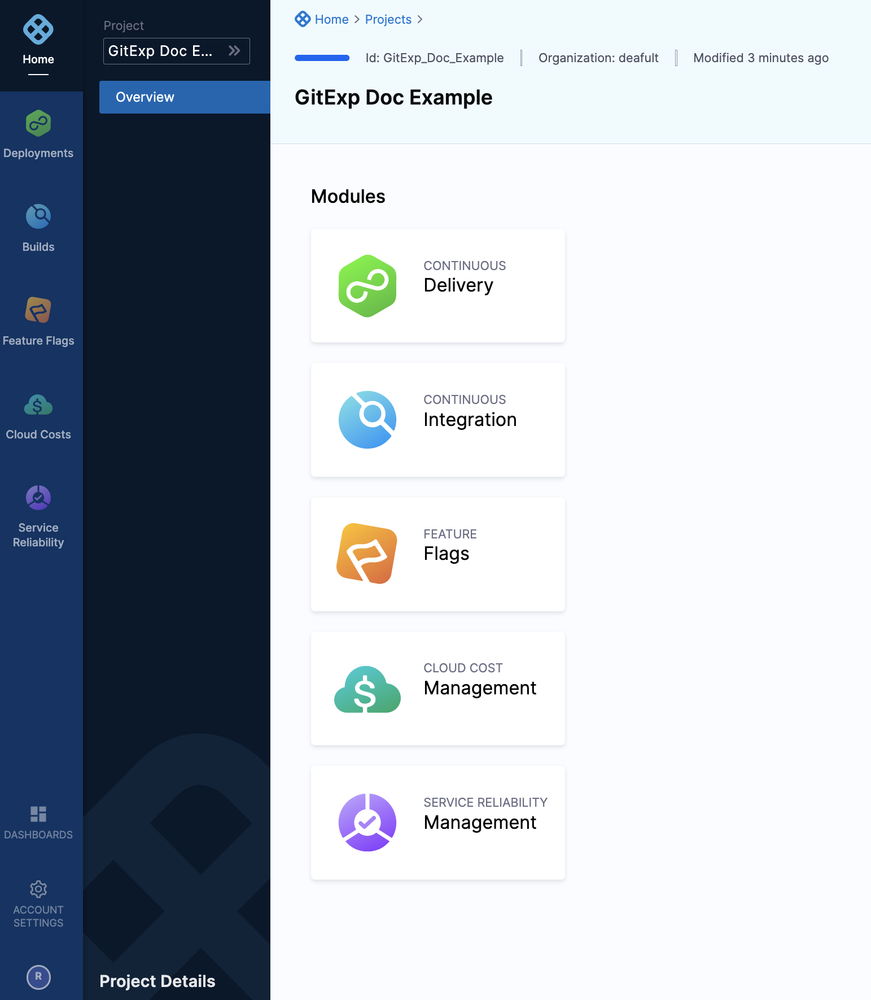
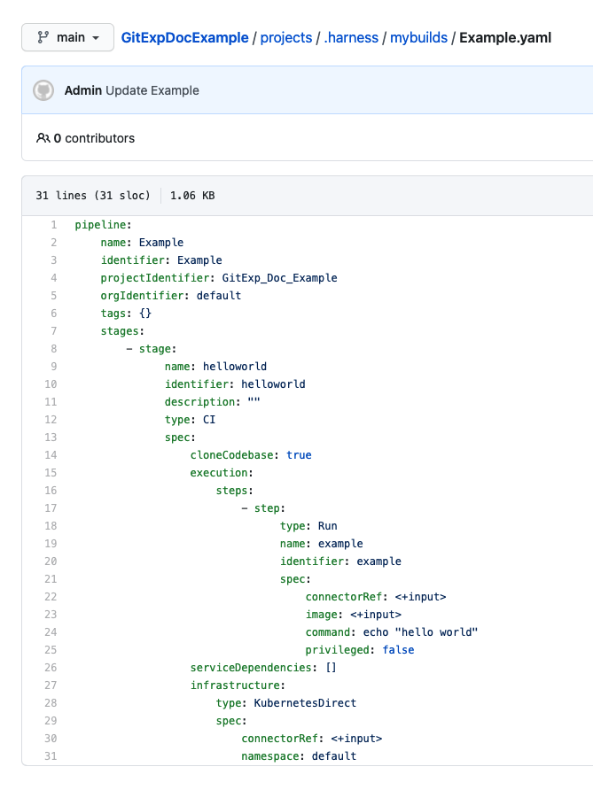

This version of Harness Git Experience has been deprecated. To try out the latest version of Git Experience, see [Harness Git Experience Quickstart](configure-git-experience-for-harness-entities.md).This quickstart shows you how to enable and use Harness Git Experience.

Harness Git Experience integrates your Harness Projects, Pipelines, and resources with your Git repos. You can manage and run your Harness Pipelines and resources entirely from Git or use a hybrid method. With Harness Git Experience, your Git repos are always the single source of truth.

See also: [Git Experience How-tos](https://docs.harness.io/article/soavr3jh0i-git-experience-how-tos), [Harness Git Experience Overview](harness-git-experience-overview.md).### Objectives

You'll learn how to:

1. Connect your SCM to Harness.
2. Enable Harness Git Experience in a new Project.
3. Create and sync a new Pipeline with your Git repo.

### Before you begin

You'll need a Git repo with at least one branch and a Personal Access Token (PAT) for your account. Harness needs the PAT to use the Git platform APIs. The PAT is encrypted using a [Harness Secret Manager](../6_Security/1-harness-secret-manager-overview.md). Your Git Personal Access Token is stored in your Harness secret and is a private key to which only you have access. This secret cannot be accessed or referenced by any other user.

Make sure your repo has at least one branch, such as main or master. For most Git providers, you simply add a README file to the repo and the branch in created.### Step 1: Add a Source Code Manager

A Harness Source Code Manager (SCM) contains your personal account for a Git provider such as GitHub or AWS CodeCommit. You can add one SCM to your account for each provider.

In Harness, click your account profile at the bottom of the navigation.


In **My Source Code Managers**, click **Add Source Code Manager**.

In **Add a Source Code Manager**, enter a name for the SCM.

Select the SCM type, such as GitHub.

Enter the authentication credentials.

We'll use GitHub in this example, but you can find the settings for all of the SCMs in [Source Code Manager Settings](../7_Connectors/ref-source-repo-provider/source-code-manager-settings.md).

Here's a GitHub example:


Click **Add**. The new SCM is listed under **My Source Code Managers**.

### Step 2: Enable Git Experience in a Project

In the Git provider, you want to use for syncing your Project, create a repo(s) for the Project.

In the repo, add a folder named **projects**.

You can use multiple repos in the Harness Git Experience for a Project. For example, you could add Pipelines to one repo and Connectors to another.For this example, we'll use one repo and the folder named **projects**.

Here's a new GitHub repo named **GitExpDocExample**.


You do not need all of the resources used by your Pipelines to be synched to your repo. For example, you could use account-level resources such as Delegate or Docker Registry Connectors. These will work fine.In Harness, create a new Project. See [Create Organizations and Projects](../1_Organizations-and-Projects/2-create-an-organization.md).

Here's a new Project named **GitExp Doc Example**.


When you're done you'll have a new Project containing the modules according to your license.


In your **Project** select a module such as CI or CD.

Click **Project Setup**, and then click **Git Management**.

**Enable Git Experience** appears.


Click **Enable Git Experience**.

The **Configure Harness Folder** settings appear.


In **Repository name**, enter a name for the repo. It doesn't have to be the same as the Git repo name. The name you enter here will appear in Harness only. It'll identify the Project repo.

For example, here's the **Repository name** `GitExpDocExample` after Harness Git Experience is enabled:


In **Select Connector**, select or create a Git Connector to the repo for your Project. For steps, see [Code Repo Connectors](https://docs.harness.io/category/code-repo-connectors).

Important: Connector must use the Enable API access option and Token**Important:** the Connector must use the **Enable API access** option and Username and **Token** authentication. Harness needs the PAT to access the Git platform APIs. Generate the token in your account on the Git provider and add it to Harness as a Secret. Next, use the token in the credentials for the Git Connector. For details on source code manager settings, see [Source Code Manager Settings](../7_Connectors/ref-source-repo-provider/source-code-manager-settings.md).


For GitHub, the token must have the following scopes:


For other Git providers, see [Code Repo Connectors](https://docs.harness.io/category/code-repo-connectors).

Here's an example of a GitHub Connector that has the correct settings:


Once you add a Connector, in **Repository URL**, you should see the repo URL.

Click **Test Connection**. Once Harness verifies the connection, you will see **Connection Successful**.

In **Select Harness Folder**, enter the name of a folder at the repo root or the name of a subfolder in the repo.

The folder must already exist in the repo. You will also need to add a readme file to that folder as Git providers typically don't let you create empty folders.When you complete Harness Git Experience setup, Harness will create the a special folder inside the folder you entered. The special folder is called the Harness Folder and all files are stored there.

The Harness Folder is named **.harness**. This allows you to identify Harness Project YAML files in your repos.

Later, when you add Pipelines and resources to this Project, you can specify their default folders.

When a Pipeline in one repo needs to access a Connector/Secret/etc in another repo at runtime, the Pipeline will always use the Connector/Secret/etc in their default branch and folder.

**Root or Subfolder?** You can specify the repo root or a subfolder in **Select Harness Folder**.

Using a subfolder?If you want to use a subfolder, create the subfolder in your repo before entering it in **Select Harness Folder**. Harness does not create the folder for you.

You will also need to add a readme file to that subfolder as Git providers typically don't let you create empty folders.

Once you have the subfolder, you will enter the name of the subfolder in **Select Harness Folder**.

For example, here is the subfolder **subfolder\_example** in a repo and how it is added to the **Select Harness Folder** setting:


In **Select Default Branch**, select the branch that you want to use, such as **main**.

Here's an example of the Configure Harness Folder settings for a repo and root folder:


When you're ready, click **Save**.

In **Select Connectivity Mode**, you have two options:

* **Connect Through Manager:** Harness SaaS will connect to your Git repo whenever you make a change and Git and Harness sync.
* **Connect Through Delegate:** Harness will make all connections using the Harness Delegate. This option is used for [Harness On-Prem](https://docs.harness.io/article/tb4e039h8x-harness-on-premise-overview) frequently, but it is also used for Harness SaaS.Secrets: if you select **Connect Through Manager**, the Harness Manager decrypts the secrets you have set up in the Harness Secrets Manager. This is different than **Connect Through Delegate** where only the Harness Delegate, which sits in your private network, has access to your key management system. See Harness Secrets Manager Overview.For this quickstart, select **Connect Through Manager**, and then click **Save and Continue.**  
Harness Git Experience is enabled and the new repo and folder are listed:

### Step 3: Review the Harness Git Experience in your Project

Harness does not automatically add a folder to your repo until you create a Pipeline or resource like a Connector in your Project.

You can see the repo setting in your Project before creating Pipelines and resources.

In your Project, click one of your modules. In this example, we'll use **Builds**.

Click **Pipelines**.

At the top of the page, you can see **All Repositories**.


Click **All Repositories** and select the name of the repo you entered in **Repository name** earlier.


You can now select any branch from the repo.


Harness Git Experience is enabled!

### Step 4: Add a Pipeline

Now you can create Pipelines and resources and store their YAML files in your Git repo's branches and folders.

Git is the single source of truth. The Pipelines and resources are stored in the repo first and then synced with Harness.

In your Harness Project, click **Builds**. If you don't have the **Builds** module, use another module.

In **Builds**, click **Pipelines**.

At the top of the page is **All Repositories**.


You select the repo and branch here to display the Pipelines stored in them. It does not affect the repo and branch where you create a new Pipeline. You will select that repo and branch in the **Create New Pipeline** settings next.

Click **+Pipelines** to create a new Pipeline. The **Create New Pipeline** settings appear.

Give the Pipeline a name such as **Example**.

In **Git Repository Details**, select the repo and branch where you want to store the Pipeline YAML file. You will select a folder in that repo and branch later.

Click **Start**.

We're simply demonstrating Harness Git Experience, so we'll create a very simple Pipeline.

Click **Add Stage** and then click **Build**.

In **About Your Stage**, enter the name **helloworld**.

Enable **Clone Codebase**.

In **Connector**, select or create a Git Connector to the repo for your Project. For steps, see [Code Repo Connectors](https://docs.harness.io/category/code-repo-connectors).

Click **Set Up Stage**.

Next, you can just paste the following YAML into the Pipeline to create a very simple Pipeline.

Click **YAML** and then paste in the following YAML.


```
pipeline:  
    name: Example  
    identifier: Example  
    allowStageExecutions: false  
    projectIdentifier: DocGitSync  
    orgIdentifier: default  
    tags: {}  
    properties:  
        ci:  
            codebase:  
                connectorRef: DocRepo  
                build: <+input>  
    stages:  
        - stage:  
              name: helloworld  
              identifier: helloworld  
              description: ""  
              type: CI  
              spec:  
                  cloneCodebase: true  
                  infrastructure:  
                      type: KubernetesDirect  
                      spec:  
                          connectorRef: examplek8  
                          namespace: example-delegate-new  
                  execution:  
                      steps:  
                          - step:  
                                type: Run  
                                name: example  
                                identifier: example  
                                spec:  
                                    connectorRef: exampledocker  
                                    image: sample  
                                    command: echo test
```
Replace `projectIdentifier: GitExp_Doc_Example` with the identifier of your Project.

You can see the Project ID right after `projects` in the URL of the page:

`https://app.harness.io/.../projects/GitExp_Doc_Example/...`

Click **Save**. The **Save Pipeline to Git** settings appear.


Click **Save**. The Pipeline is ready. Now we can save it to Git.

### Step 5: Save the Pipeline to Git

When you click **Save**, the **Save Pipelines to Git** settings appear.

In **Harness Folder**, select one of the folders set up in the Project's Git Experience settings.

The YAML file for the Pipeline will be saved to this folder. But you can add subfolders in **File Path**.

In **File Path**, enter a name for the YAML file, such as `Example.yaml`. Harness will generate one automatically from the Pipeline name, but you can add your own.

To enter a subfolder of the Harness Folder you selected, enter the folder name in front of the file name like `mybuilds/Example.yaml`.

In this example, we use `mybuilds/Example.yaml`.

In **Commit Details**, enter a message.

In **Select Branch to Commit**, commit to an existing or new branch.

* **Existing branch:** you can start a pull request if you like.
* **New branch:** enter the new branch name. You can start a pull request if you like.

Here's a simple example:


Click **Save**.


The Pipeline is saved to the repo branch and folder.

### Step 6: View the Pipeline in Git and Harness Git Experience

In your Git repo, locate the branch, folder, and file.

Harness created a **.harness** folder under the folder you selected in **Harness Folder.**

If you added a folder to **File Path**, open that folder.

Click the YAML file for your Pipeline. The YAML is displayed.


In your Harness Project, click **Project Setup**, and then click **Git Management**.

In **Git Management**, click **Entities**.

In **Entities by repositories**, expand the Project name.

The Pipeline is listed along with its file path in the repo.


Now you have a Pipeline stored in Git.

### Next steps

Congratulations! You now have Harness Git Experience set up, synced with your Git repo, and storing a new Pipeline.

Next, explore other Harness features:

* [CI Pipeline Quickstart](../../continuous-integration/ci-quickstarts/ci-pipeline-quickstart.md)
* [Kubernetes CD Quickstart](https://docs.harness.io/article/knunou9j30-kubernetes-cd-quickstart)
* [Git Experience How-tos](https://docs.harness.io/article/soavr3jh0i-git-experience-how-tos)

