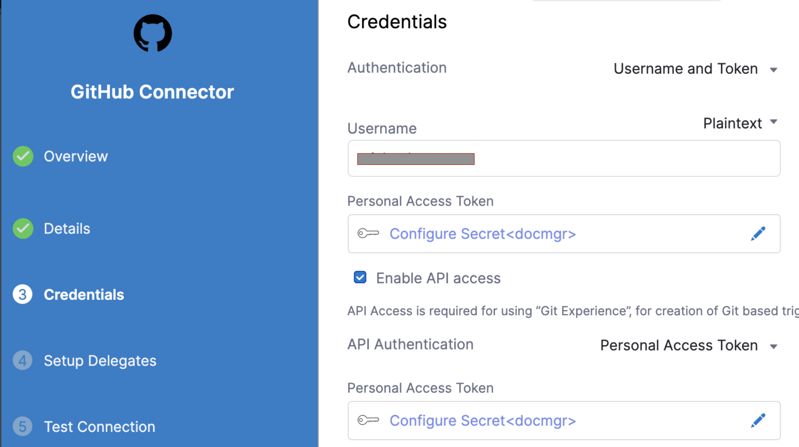

Harness lets you create a Pipeline in the following ways:

* Create an inline Pipeline and save its configuration in Harness.
* Create a remote Pipeline and save its configuration in Git.
* Import a Pipeline from Git and save its configuration in Git.

This topic explains how to import a Pipeline from your Git repo to Harness.

### Before you begin

* [Harness Git Experience Overview](git-experience-overview.md)
* [Harness Git Experience Quickstart​](configure-git-experience-for-harness-entities.md)
* [Manage a Harness Pipeline Repo Using Git Experience](manage-a-harness-pipeline-repo-using-git-experience.md)

### Permissions

* Make sure you have **Create/Edit** permissions for Pipelines.

### Step: Import pipeline

You can import a Pipeline from the CI or CD module in Harness.

This topic shows you how to import a Pipeline to the CD module.

1. In Harness, click **Deployments**.
2. Select your Project and click on **Pipelines**.
3. Select **Import From Git**.
   
   
   
   The **Import Pipeline From Git** settings appear.

   

4. Enter a **Name** for your Pipeline.
5. In **Git Connector**, select or create a Git Connector to connect to your Git repo. For steps, see [Code Repo Connectors](https://docs.harness.io/category/code-repo-connectors).Important: Connector must use the Enable API access option and Token**Important**: The Connector must use the Enable API access option and Username and Token authentication. Harness requires the token for API access. Generate the token in your account on the Git provider and add it to Harness as a Secret. Next, use the token in the credentials for the Git Connector.​  

  

For GitHub, the token must have the following scopes:  

Here's an example of a GitHub Connector that has the correct settings:

​

6. In **Repository**, select the repository from where you want to import the Pipeline. If your repository isn't listed, enter its name since only a select few repositories are filled here.Create the repository in Git before entering it in **Select Repository**. Harness does not create the repository for you.
7. In **Git Branch**, select the branch from where you want to import the Pipeline. If your branch isn't listed, enter its name since only a select few branches are filled here.Create the branch in your repository before entering it in **Git Branch**. Harness does not create the branch for you.
8. Enter the **YAML Path** from where you want to import the Pipeline. All your configurations are stored in Git in the [Harness Folder](harness-git-experience-overview.md#harness-folder).Make sure that your YAML path starts with `.harness/` and the YAML file already exists in the specified Git repo and branch.
9. Click **Import**.  
Click on your Pipeline to proceed.  
By default, Harness fetches your Pipeline details from the default branch. If you have imported Pipeline from some other branch you will see the below error.
Select the branch from where you imported the Pipeline and continue.

### See also

* [Manage Input Sets and Triggers in Simplified Git Experience​](manage-input-sets-in-simplified-git-experience.md)
* [Manage a Harness Pipeline Repo Using Git Experience](manage-a-harness-pipeline-repo-using-git-experience.md)

