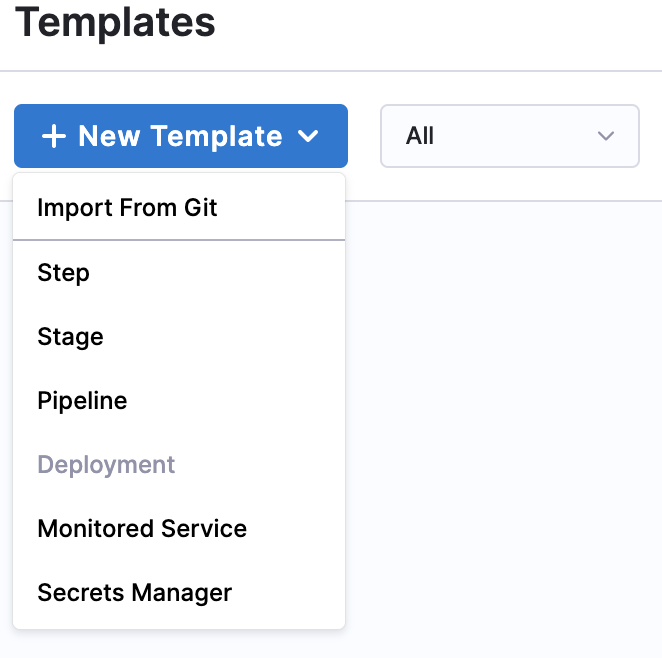
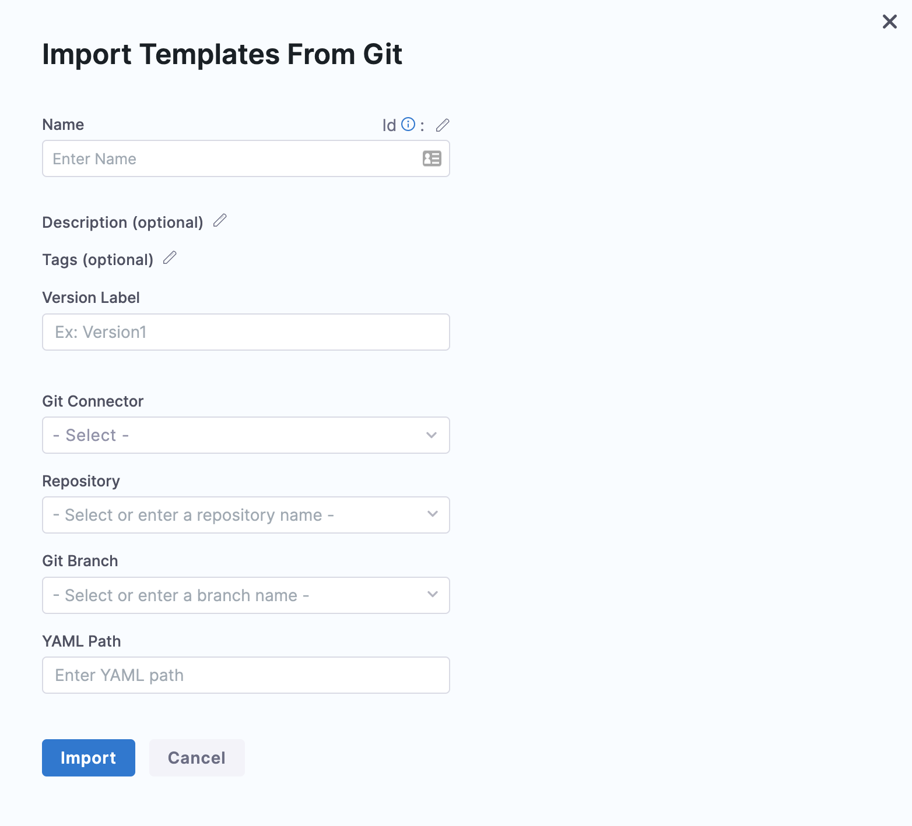
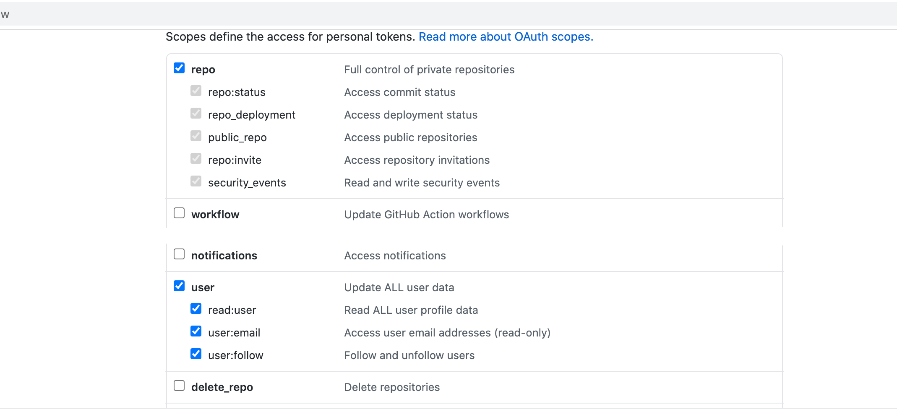
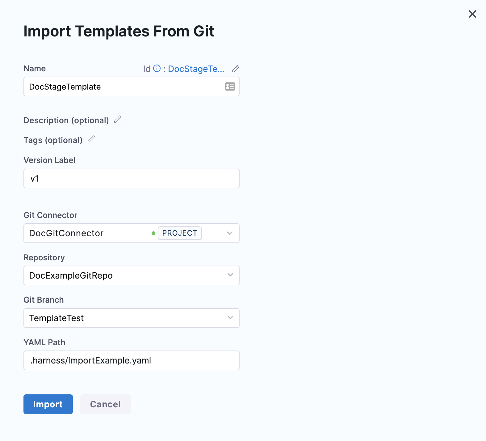
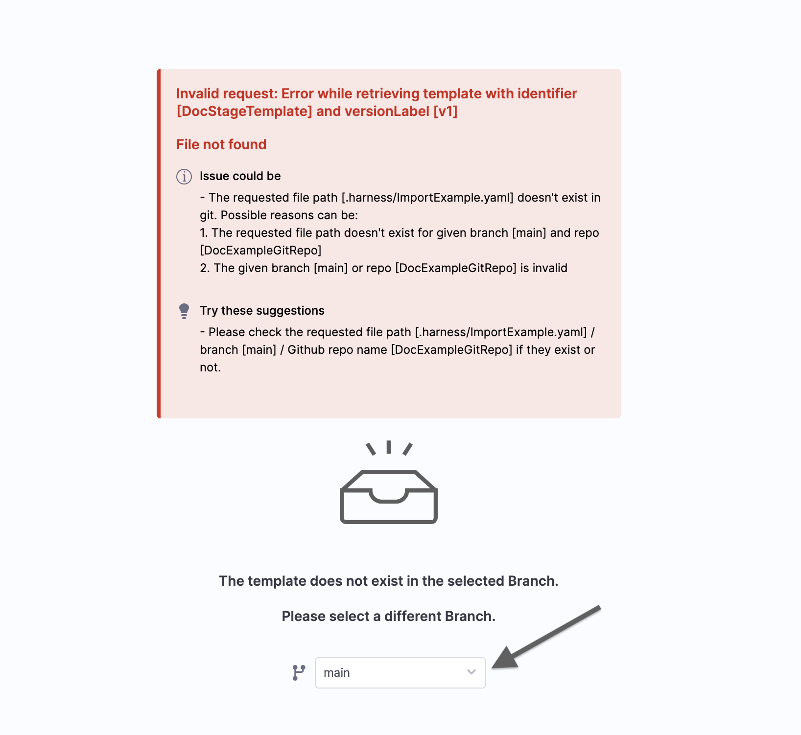

Harness enables you to add Templates to create reusable logic and Harness entities (like Steps, Stages, and Pipelines) in your Pipelines. You can link these Templates in your Pipelines or share them with your teams for improved efficiency.

Templates enhance developer productivity, reduce onboarding time, and enforce standardization across the teams that use Harness.

You can create Templates in Harness in the following ways:

* Create an inline Template and save its configuration in Harness.
* Create a remote Template and save its configuration in Git.
* Import a Template from Git and save its configuration in Git.

This topic explains how to import a Template from your Git repo to Harness.

### Before you begin

* See [Harness Git Experience Overview](git-experience-overview.md)
* See [Harness Git Experience Quickstart​](configure-git-experience-for-harness-entities.md)
* See [Templates Overview](../13_Templates/template.md)

### Permissions

* To import a Template, make sure you have the **Create/Edit** permissions for Templates.

### Step: Import a template

You can import a Template in the Account, Org, or Project scope.

This topic explains how to import a Template in the Project scope.

1. In your Harness Account, go to your Project.  
You can import a Template from the CI or CD module in Harness.  
This topic shows you how to import a Template to the CD module.
2. Click **Deployments**.
3. In **PROJECT SETUP**, click **Templates**.
4. Click **New Template** and then click **Import From Git**.
The **Import Template From Git** settings appear.
5. Enter a **Name** for your Template.
6. In **Version Label**, enter a version for the Template.
7. In **Git Connector**, select or create a Git Connector to connect to your Git repo. For steps, see [Code Repo Connectors](https://harness.helpdocs.io/category/xyexvcc206-ref-source-repo-provider).Important: Connector must use the Enable API access option and TokenThe Connector must use the Enable API access option and Username and Token authentication. Harness requires a token for API access. Generate the token in your account on the Git provider and add it to Harness as a Secret. Next, use the token in the credentials for the Git Connector.​  
  
For GitHub, the token must have the following scopes:  

8. In **Repository**, select the repository from where you want to import the Template. If you don't see your repository in the list, enter its name since only a select few repositories are filled here.Create the repository in Git before entering it in **Select Repository**. Harness does not create the repository for you.
9. In **Git Branch**, select the branch from where you want to import the Template. If you don't see your branch in the list, enter its name since only a select few branches are filled here.Create the branch in your repository before entering it in **Git Branch**. Harness does not create the branch for you.
10. Enter the **YAML Path** from where you want to import the Template. All your configurations are stored in Git in the [Harness Folder](harness-git-experience-overview.md#harness-folder).
11. Click **Import**.  
Click on your Template to proceed.  
By default, Harness fetches your Template details from the default branch. If you have imported Template from some other branch, select the branch from where you imported the Template and continue.

