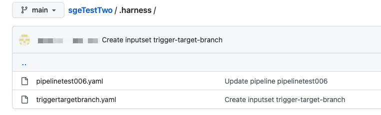

Once you have saved your Pipeline in your repo, you can set up your Input Sets and Triggers. You can set up your Input Set definitions in your repo along with your Pipeline. You can then set up your Triggers to use specific Input Sets in your repo.

This topic covers a simple workflow for setting up your Input Sets and Triggers. It does not cover these topics in detail. For details on those, see:

* [Run Pipelines using Input Sets and Overlays](../8_Pipelines/run-pipelines-using-input-sets-and-overlays.md)
* [Trigger Pipelines using Git Event Payloads](../11_Triggers/trigger-pipelines-using-custom-payload-conditions.md)

### Before you begin

You'll need the following:

* A Git repo with at least one branch and a Personal Access Token (PAT) for your account. Harness needs the PAT to use the Git platform APIs. The PAT is encrypted using a Harness Secret Manager. Your Git Personal Access Token is stored in your Harness secret and is a private key to which only you have access. This secret cannot be accessed or referenced by any other user.Make sure your repo has at least one branch, such as main or master. For most Git providers, you simply add a README file to the repo, and the branch is created.
* A Harness Pipeline with Git Experience enabled. In this how-to, you will cross-check your updates in both your codebase and in the Harness UI. See [Harness Git Experience QuickStart](https://newdocs.helpdocs.io/article/grfeel98am/preview).

### Initial setup

#### Step 1: Select the branch

When you edit your Pipeline in the Harness UI, you are editing a branched version of that Pipeline. Make sure that you are editing in the correct branch. You can switch branches using the branch picker in the top left.

#### Step 2: Create an input set

With Git Experience enabled, any Input Sets you create get stored in the same repo and branch as the Pipeline definition. In this step, you will create a simple Input Set and save it with your Pipeline.

Click **Run**. The Run Pipeline screen appears.

Under Build Type, select Git Branch.

For the Branch Name, select **Expression** and enter `<+trigger.targetBranch>` as a runtime expression.

Click **Save as Input Set**. In the popup that appears, enter the name of the Input Set. (Note that the Yaml Path field auto-populates with the path (.harness/) and filename based on the name you enter.)

Click **Save**. The Save Input Sets to Git screen appears.

Select **Commit to an existing branch** and click **Save**. The Input Set is now saved with your Pipeline under `.harness` in your repo and branch.

In the Run Pipeline screen, click **Cancel**.

#### Step 3: Create a trigger for the pipeline

Now that you have a Pipeline and Input Set in your default branch, create a Trigger that uses the Input Set you just created.

In the Pipeline Studio, create a new Trigger as described in [Trigger Pipelines using Git Event Payload Conditions](../11_Triggers/trigger-pipelines-using-custom-payload-conditions.md).

In the Pipeline Input tab, select the Input Set you just created and click **Create Trigger**.

You now have a Pipeline, Input Set, and Trigger that you can use in new branches that you create from the default branch. When a webhook payload arrives, the Trigger selects the branch to use based on the Pipeline Reference Branch field (`<+trigger.branch>`) and the Git Branch field in the Input Set (`<+trigger.branch>`).

### Example workflow: Create a custom pipeline in a new branch

Suppose you're a developer working on a new feature in your own branch. You want your Pipeline to run some additional tests on your code before it generates an artifact. In this example workflow, we customize the Pipeline and Input Set in a new branch. Then we create a Trigger specifically for that branch.

#### Step 1: Check `.harness` is in the new branch

This workflow assumes that your branch has a `.harness` subfolder with the same Pipeline and Input Set as `main`.

If you created the new branch from `main` *after* you did the initial setup described above, proceed to the next step.

If you created the new branch from `main` *before* you did the initial setup, commit the `.harness` folder in `main` to the new branch.

#### Step 2: Update the pipeline

In the Pipeline Studio, check the branch pull-down to make sure you're in the correct branch. (You might need to refresh the page to see the new branch.)

Update the Pipeline with the branch-specific behavior you want the Pipeline to perform. (In this example workflow, you would add some Run Test Steps to your Build Stage.)

When you finish updating, click **Save** and save the Pipeline in your new branch.

#### Step 3: Create a branch-specific trigger

In this step, you will create a Trigger specifically for the new branch. Do the following:

* In the Configuration tab, include the branch in the trigger name. For example, **build-on-push-to-my-new-feature-branch**.
* In the Conditions tab, set the Condition to trigger on the specified branch only. If you want to trigger on a Pull Request, for example, set the Target Branch field to `my-new-feature-branch`.  
You might also want to set the Changed Files field to exclude the .harness folder. This will ensure that updates to your Harness configs don't trigger unwanted builds.

  

* In the Pipeline Input tab, specify the branch name in the **Pipeline Reference Branch** field.
  
  

### Notes

Review the following notes in case you encounter issues using Git Experience with Input Sets.

#### Pipeline reference branch field

When Git Experience is enabled for your Pipeline, the Pipeline Input tab includes the **Pipeline Reference Branch** field. This field is set to `<+trigger.branch>` by default. This means that any Build started by this Trigger uses the Pipeline and Input Set definitions in the branch specified in the webhook payload.

This default is applicable *only* if the Trigger is webhook-based. For all other Trigger types, you need to enter a specific branch name.

#### Create input set before creating trigger

If you want to use an Input Set as part of a Trigger, create and sync the Input Set before creating the Trigger.

For more details, go to [Manage a Harness Pipeline Repo Using Git Experience](manage-a-harness-pipeline-repo-using-git-experience.md).

