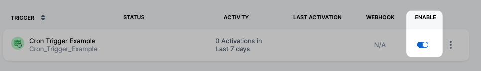
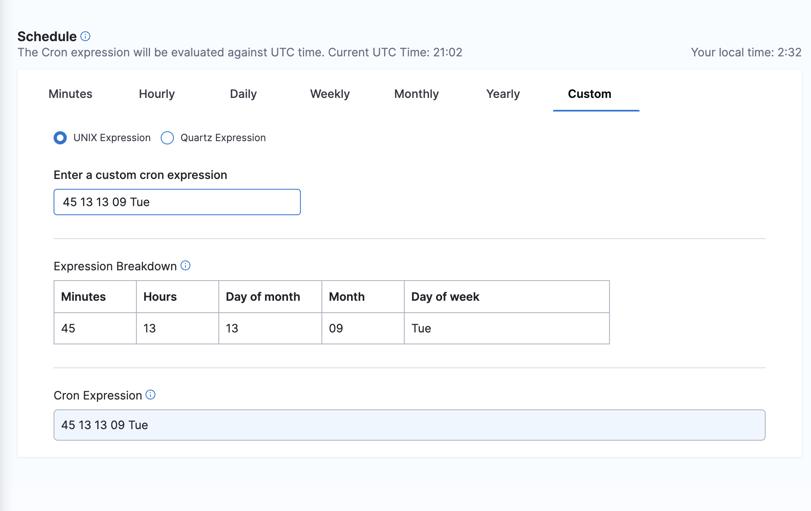

You can schedule Pipeline executions using Cron-based Triggers.

For example, you can have a Pipeline run every Monday at 1AM. Harness will generate the Cron expression (`0 1 * * MON`).

For general Triggers reference, see [Triggers Reference](../8_Pipelines/w_pipeline-steps-reference/triggers-reference.md).

### ​Before you begin

* [Learn Harness' Key Concepts](https://docs.harness.io/article/hv2758ro4e-learn-harness-key-concepts)
* [Kubernetes CD Quickstart](https://docs.harness.io/article/knunou9j30-kubernetes-cd-quickstart)
* [CI Pipeline Quickstart](../../continuous-integration/ci-quickstarts/ci-pipeline-quickstart.md)

### ​Step 1: Add a trigger to a pipeline​

Open your Harness Pipeline in Pipeline Studio.

Click **Triggers**.

Click **New Trigger**.

Click **Cron**.

For Git-based Trigger types or CodeCommit, see [Trigger Pipelines using Git Events](triggering-pipelines.md).

In **Trigger Overview**, enter a name, description, and Tags for the Trigger.

### ​Step 2: Schedule the trigger​

In **Schedule**, use the settings to schedule the Trigger.

When you edit a Cron Trigger later, you can type or paste in a Cron expression.

The Cron expression will be evaluated against UTC time.

Here's a reminder of Cron expression formatting:


```
0 0 4 7 ? 2014  
| | | |   | |  
| | | |   | \------- YEAR (2014)  
| | | |   \--------- DAY_OF_WEEK (NOT_SPECIFIED)  
| | | \------------- MONTH (JULY)  
| | \--------------- DAY_OF_MONTH (4th)  
| \----------------- HOUR (0- MIDNIGHT LOCAL TIME)  
\------------------- MINUTE (0)
```
### ​Step 3: Set pipeline input

Pipelines often have [Runtime Inputs](../20_References/runtime-inputs.md) like codebase branch names or artifact versions and tags.

Provide values for the inputs. You can also use [Input Sets](../8_Pipelines/input-sets.md).

Click **Create Trigger**.

The Trigger is now added to the Triggers page.

### Step 4: Enable or disable trigger

Use the Enable setting to turn the Trigger on and off.


That's it. Your Pipeline will run when the Cron expression equals the current time.

### Option: Run once

To specify a run-once schedule, specify a fully qualified date and time.

Simply enter the time, day of month, month, and then allow for any day of the week.

The below example runs on **At 1:45 PM, on day 13 of the month, and on Tuesday, only in September**

`45 13 13 09 Tue`


### See also

* [Triggers Reference](../8_Pipelines/w_pipeline-steps-reference/triggers-reference.md)

