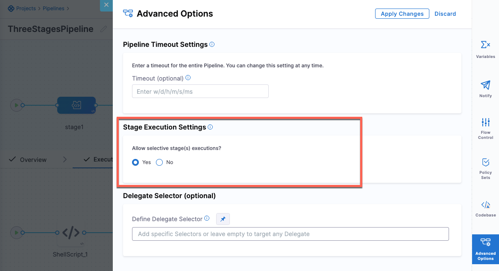
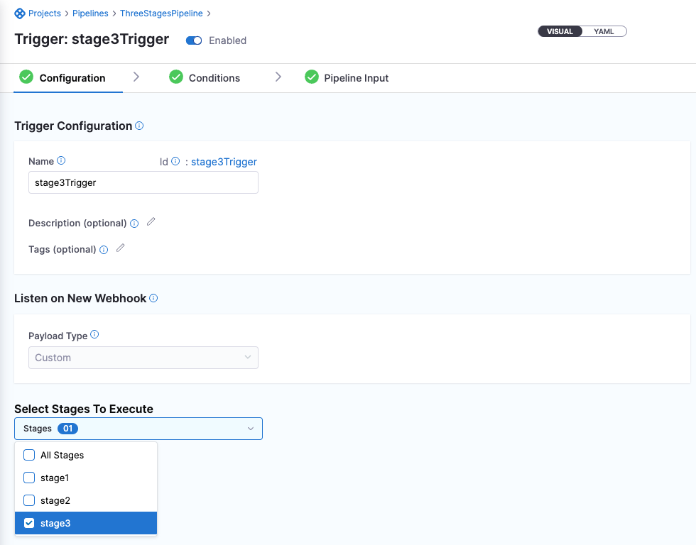

You can set webhook triggers to run specific pipeline stages using the [Allow selective stage(s) executions?](/docs/platform/pipelines/run-specific-stage-in-pipeline/) option. 

:::note

Currently, this feature is behind the feature flag, `CDS_NG_TRIGGER_SELECTIVE_STAGE_EXECUTION`. Contact [Harness Support](mailto:support@harness.io) to enable the feature.

:::

import Variables from '/docs/platform/11_Triggers/shared/variables-not-supported.md'

<Variables />

## Requirements

Make sure that you have met the following requirements:
* You have a Harness pipeline with a [CD stage](https://developer.harness.io/docs/continuous-delivery/onboard-cd/cd-concepts/cd-pipeline-basics).
* You have set the service and infrastructure as runtime inputs so that you can provide the value in **Trigger>** **Configuration** tab.

## Execute a specific pipeline stage using triggers

1. Select a pipeline whose stage you want to execute using triggers.
2. Make sure that the **Selective Execution Settings>** **[Allow selective stage(s) executions?](/docs/platform/pipelines/run-specific-stage-in-pipeline/)** in **Advanced Options** of the pipeline is set to **Yes**.
   
    

3. When you create a trigger, in the **Configuration** tab, select the stages you want to execute.
   
   
  
  Here is a sample trigger YAML: 
  
  ```yaml
  trigger:
  name: stage3Trigger
  identifier: stage3Trigger
  enabled: true
  description: ""
  tags: {}
  stagesToExecute:
    - stage3
  orgIdentifier: NgTriggersOrg
  projectIdentifier: viniciusTest
  pipelineIdentifier: ThreeStagesPipeline
  source:
    type: Webhook
    spec:
      type: Custom
      spec:
        payloadConditions: []
        headerConditions: []
  inputYaml: |
    pipeline:
      identifier: ThreeStagesPipeline
      stages:
        - stage:
            identifier: stage3
            type: Custom
            variables:
              - name: stage3var
                type: String
                value: stage3Var

  ```