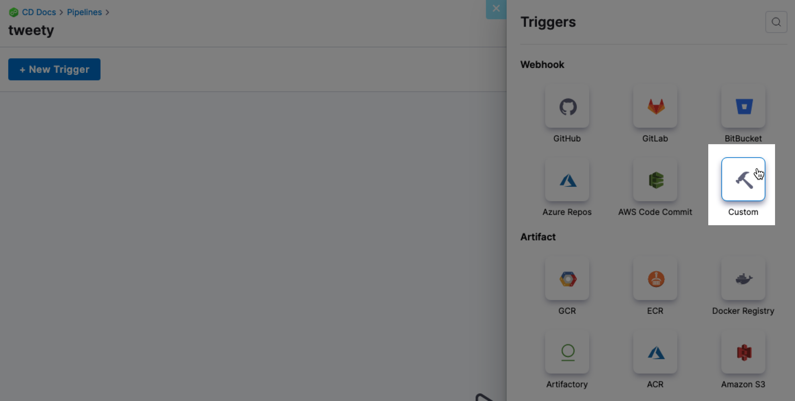
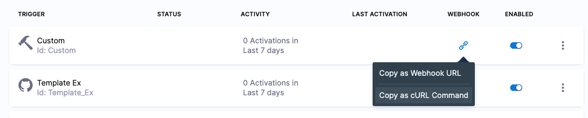
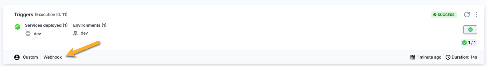

This topic shows you how to create and run Custom Triggers for your Harness pipelines using platform-agnostic Webhooks and cURL commands.

### Overview

In addition to Triggers that use Git providers, artifact providers, manifests, and cron scheduling, Harness includes Custom Triggers that you can use to run Pipelines via a platform-agnostic Webhook.

Once you create a Custom Trigger, Harness provides the Webhook URL and cURL command to initiate the Trigger.


You can do the following with a Custom Trigger:

* Start a deployment using a cURL command.
* Use a REST call to get deployment status.
* Start a deployment using a URL provided by Harness.

### Create the custom trigger

1. In your Harness Pipeline in Pipeline Studio, click **Triggers**.
2. Click **New Trigger**.
3. In **Webhook**, click **Custom**.  

4. Name the new Trigger and click **Continue**.

The **Payload Type** is set as Custom. If this were a Git provider Trigger, you would specify the repo URL and events for the Trigger.

For more details, see [Trigger Pipelines using Git Event Payload Conditions](trigger-pipelines-using-custom-payload-conditions.md) and [Trigger Pipelines using Git Events](triggering-pipelines.md).

### Conditions

Conditions specify criteria in addition to events and actions.

Conditions help to form the overall set of criteria to trigger a Pipeline based on changes in a given source.

For example:

* Execute Pipeline if the source/target branch name matches a pattern.
* Execute Pipeline if the event is sent for file changes from specific directories in the Git repo. This is very useful when working with a monorepo (mono repository). It ensures that only specific Pipelines are triggered in response to a change.

Conditions support Harness built-in expressions for accessing Trigger settings, Git payload data and headers.

JEXL expressions are also supported.

For details on these settings, see [Triggers Reference](../8_Pipelines/w_pipeline-steps-reference/triggers-reference.md).

Conditions are ANDed together (boolean AND operation). All Conditions must match an event payload for it to execute the Trigger.### Pipeline Input

Pipelines often have [Runtime Inputs](../20_References/runtime-inputs.md) like codebase branch names or artifact versions and tags.

Provide values for the inputs. You can also use [Input Sets](../8_Pipelines/input-sets.md).

Click **Create Trigger**.

The Trigger is now added to the Triggers page.

### Trigger a deployment using cURL

1. On the Triggers page, in the **Webhook** column, click the link icon for your Trigger and then click **Copy as cURL Command**.


Here's an example of the cURL command:


```
curl -X POST  -H 'content-type: application/json' --url 'https://app.harness.io/gateway/pipeline/api/webhook/custom/v2?accountIdentifier=H5W8iol5TNWc4G9h5A2MXg&orgIdentifier=default&projectIdentifier=CD_Docs&pipelineIdentifier=Triggers&triggerIdentifier=Custom' -d '{"sample_key": "sample_value"}'
```
Run this command in a Terminal to trigger a Pipeline execution. The response will look something like this:


```
{  
   "status":"SUCCESS",  
   "data":{  
      "eventCorrelationId":"632394c7b018985c661747be",  
      "apiUrl":"https://app.harness.io/gateway/pipeline/api/webhook/triggerExecutionDetails/632394c7b018985c661747be?accountIdentifier=H5W8iol5TNWc4G9h5A2MXg",  
      "uiUrl":"https://app.harness.io/ng/#/account/H5W8iol5TNWc4G9h5A2MXg/cd/orgs/default/projects/CD_Docs/deployments?pipelineIdentifier=Triggers&page=0",  
      "uiSetupUrl":"https://app.harness.io/ng/#/account/H5W8iol5TNWc4G9h5A2MXg/cd/orgs/default/projects/CD_Docs/pipelines/Triggers/pipeline-studio/"  
   },  
   "metaData":null,  
   "correlationId":"5f86c64b-b1a2-4385-88b0-2eaf1085c310"  
}
```
The Execution History page shows that the execution was triggered by a Custom Trigger:


### Links in the response

The JSON response of the Custom Trigger cURL command contains several links.


```
{  
   "status":"SUCCESS",  
   "data":{  
      "eventCorrelationId":"632394c7b018985c661747be",  
      "apiUrl":"https://app.harness.io/gateway/pipeline/api/webhook/triggerExecutionDetails/632394c7b018985c661747be?accountIdentifier=H5W8iol5TNWc4G9h5A2MXg",  
      "uiUrl":"https://app.harness.io/ng/#/account/H5W8iol5TNWc4G9h5A2MXg/cd/orgs/default/projects/CD_Docs/deployments?pipelineIdentifier=Triggers&page=0",  
      "uiSetupUrl":"https://app.harness.io/ng/#/account/H5W8iol5TNWc4G9h5A2MXg/cd/orgs/default/projects/CD_Docs/pipelines/Triggers/pipeline-studio/"  
   },  
   "metaData":null,  
   "correlationId":"5f86c64b-b1a2-4385-88b0-2eaf1085c310"  
}
```
The following section describe each link and what you can do with them.

#### apiUrl

**apiUrl** can be used to track deployment status programmatically, such as using a REST call.

See [Get Deployment Status using REST](#get-deployment-status-using-rest) below.


#### uiUrl

The **uiUrl** from the cURL command output can be used directly in a browser.

To run a deployment from a browser, paste the URL from **uiUrl** into the browser location field and hit **ENTER**.

The browser will open **app.harness.io** and display the running deployment.

#### uiSetupUrl

In the JSON response of a Pipeline executed by a Custom Trigger, the **uiSetupUrl** label displays the URL or the Pipeline that was run.

### Get Deployment Status using REST

The **apiUrl** property in the JSON response can be used to track deployment status programmatically, such as using a REST call.

The `eventCorrelationId` contains the same Id as the URL in `apiUrl`.To get deployment status using a REST call (in this example, cURL), use the following cURL command, replacing **API\_URL** with the URL from **apiUrl**:


```
curl -X GET --url "API_URL"
```
For example:


```
curl -X GET --url "https://app.harness.io/gateway/pipeline/api/webhook/triggerExecutionDetails/632394c7b018985c661747be?accountIdentifier=H5W8iol5TNWc4G9h5A2MXg"
```
The response from the cURL command will contain the status of the deployment. For example: 


```
{  
   "status":"SUCCESS",  
   "data":{  
      "webhookProcessingDetails":{  
         "eventFound":true,  
         "eventId":"632394c7b018985c661747be",  
         "accountIdentifier":"xxx",  
         "orgIdentifier":"default",  
         "projectIdentifier":"CD_Docs",  
         "triggerIdentifier":"Custom",  
         "pipelineIdentifier":"Triggers",  
         "pipelineExecutionId":"_iodHvEhT2y_Mn_DLaR32A",  
         "exceptionOccured":false,  
         "status":"TARGET_EXECUTION_REQUESTED",  
         "message":"Pipeline execution was requested successfully",  
         "payload":"{\"sample_key\": \"sample_value\"}",  
         "eventCreatedAt":1663276236705,  
         "runtimeInput":"pipeline: {}\n"  
      },  
      "executionDetails":{  
         "pipelineExecutionSummary":{  
            "pipelineIdentifier":"Triggers",  
            "planExecutionId":"_iodHvEhT2y_Mn_DLaR32A",  
            "name":"Triggers",  
            "status":"Success",  
            "tags":[  
                 
            ],  
            "executionTriggerInfo":{  
               "triggerType":"WEBHOOK_CUSTOM",  
               "triggeredBy":{  
                  "uuid":"systemUser",  
                  "identifier":"Custom",  
                  "extraInfo":{  
                     "execution_trigger_tag_needed_for_abort":"H5W8iol5TNWc4G9h5A2MXg:default:CD_Docs:Triggers",  
                     "triggerRef":"H5W8iol5TNWc4G9h5A2MXg/default/CD_Docs/Custom",  
                     "eventCorrelationId":"632394c7b018985c661747be"  
                  }  
               },  
               "isRerun":false  
            },  
            "governanceMetadata":{  
               "id":"0",  
               "deny":false,  
               "details":[  
                    
               ],  
               "message":"",  
               "timestamp":"1663276236674",  
               "status":"pass",  
               "accountId":"H5W8iol5TNWc4G9h5A2MXg",  
               "orgId":"default",  
               "projectId":"CD_Docs",  
               "entity":"accountIdentifier%3AH5W8iol5TNWc4G9h5A2MXg%2ForgIdentifier%3Adefault%2FprojectIdentifier%3ACD_Docs%2FpipelineIdentifier%3ATriggers",  
               "type":"pipeline",  
               "action":"onrun",  
               "created":"1663276236657"  
            },  
            "moduleInfo":{  
               "cd":{  
                  "__recast":"io.harness.cdng.pipeline.executions.beans.CDPipelineModuleInfo",  
                  "envGroupIdentifiers":[  
                       
                  ],  
                  "envIdentifiers":[  
                     "dev"  
                  ],  
                  "environmentTypes":[  
                     "PreProduction"  
                  ],  
                  "infrastructureIdentifiers":[  
                     null  
                  ],  
                  "infrastructureNames":[  
                     null  
                  ],  
                  "infrastructureTypes":[  
                     "KubernetesDirect"  
                  ],  
                  "serviceDefinitionTypes":[  
                     "Kubernetes"  
                  ],  
                  "serviceIdentifiers":[  
                     "dev"  
                  ]  
               }  
            },  
            "layoutNodeMap":{  
               "XZoMGLJIRgm11QqGYbIElA":{  
                  "nodeType":"Deployment",  
                  "nodeGroup":"STAGE",  
                  "nodeIdentifier":"trigger",  
                  "name":"trigger",  
                  "nodeUuid":"XZoMGLJIRgm11QqGYbIElA",  
                  "status":"Success",  
                  "module":"cd",  
                  "moduleInfo":{  
                     "cd":{  
                        "__recast":"io.harness.cdng.pipeline.executions.beans.CDStageModuleInfo",  
                        "serviceInfo":{  
                           "__recast":"io.harness.cdng.pipeline.executions.beans.ServiceExecutionSummary",  
                           "identifier":"dev",  
                           "displayName":"dev",  
                           "deploymentType":"Kubernetes",  
                           "gitOpsEnabled":false,  
                           "artifacts":{  
                              "__recast":"io.harness.cdng.pipeline.executions.beans.ServiceExecutionSummary$ArtifactsSummary",  
                              "sidecars":[  
                                   
                              ]  
                           }  
                        },  
                        "infraExecutionSummary":{  
                           "__recast":"io.harness.cdng.pipeline.executions.beans.InfraExecutionSummary",  
                           "identifier":"dev",  
                           "name":"dev",  
                           "type":"PreProduction"  
                        }  
                     }  
                  },  
                  "startTs":1663276236851,  
                  "endTs":1663276251023,  
                  "edgeLayoutList":{  
                     "currentNodeChildren":[  
                          
                     ],  
                     "nextIds":[  
                          
                     ]  
                  },  
                  "nodeRunInfo":{  
                     "whenCondition":"<+OnPipelineSuccess>",  
                     "evaluatedCondition":true,  
                     "expressions":[  
                        {  
                           "expression":"OnPipelineSuccess",  
                           "expressionValue":"true",  
                           "count":1  
                        }  
                     ]  
                  },  
                  "failureInfo":{  
                     "message":""  
                  },  
                  "failureInfoDTO":{  
                     "message":"",  
                     "failureTypeList":[  
                          
                     ],  
                     "responseMessages":[  
                          
                     ]  
                  },  
                  "nodeExecutionId":"YC_1XgBQSUu79da21J7aVA",  
                  "executionInputConfigured":false  
               }  
            },  
            "modules":[  
               "cd"  
            ],  
            "startingNodeId":"XZoMGLJIRgm11QqGYbIElA",  
            "startTs":1663276236674,  
            "endTs":1663276251126,  
            "createdAt":1663276236698,  
            "canRetry":true,  
            "showRetryHistory":false,  
            "runSequence":11,  
            "successfulStagesCount":1,  
            "runningStagesCount":0,  
            "failedStagesCount":0,  
            "totalStagesCount":1,  
            "executionInputConfigured":false,  
            "allowStageExecutions":false,  
            "stagesExecution":false  
         }  
      }  
   },  
   "metaData":null,  
   "correlationId":"4b76cec6-c4b3-408c-b66b-7e14540c6e14"  
}
```
### Custom Trigger authorization using API keys

You can use Harness API keys in your cURL command

#### Adding authorization to custom webhook Triggers

#### Enforcing authorization for custom webhook Triggers

