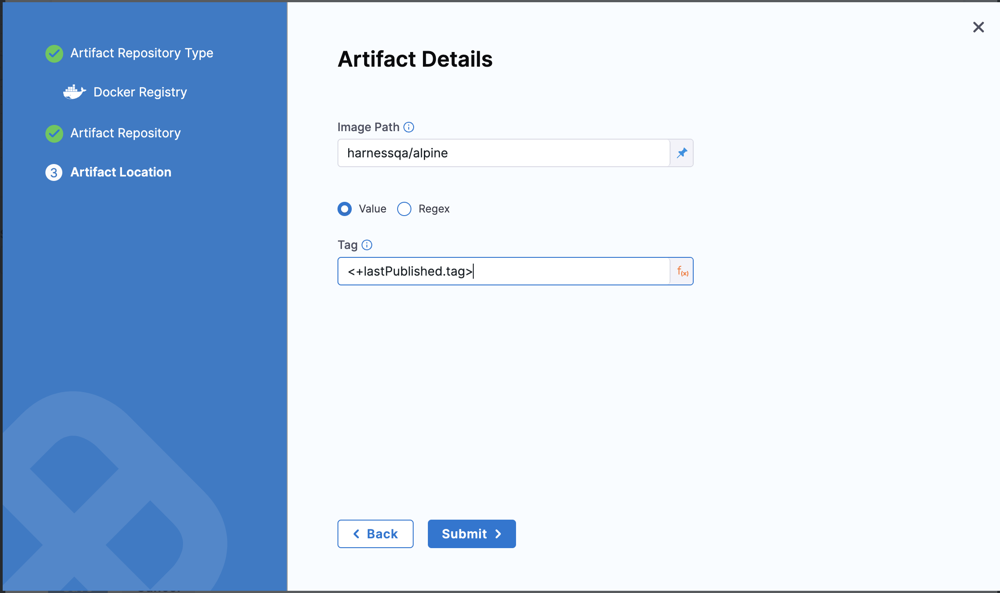
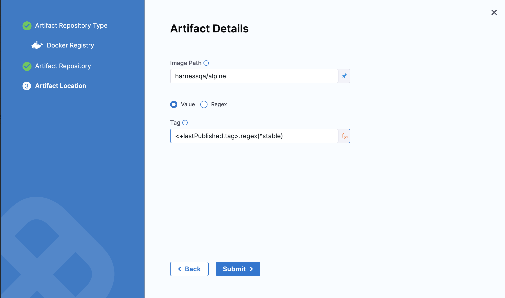

```mdx-code-block
import Tabs from '@theme/Tabs';
import TabItem from '@theme/TabItem';
```

:::note

Currently, this feature is behind the feature flags `NG_SVC_ENV_REDESIGN` and `CD_TRIGGERS_REFACTOR`. Contact [Harness Support](mailto:support@harness.io) to enable the feature.

:::

You can trigger Harness pipelines in response to a new artifact version being added to a registry.

For example, every time a new Docker image is pushed to your Docker Hub account, it triggers a CD pipeline that deploys it automatically.

**On New Artifact Triggers** listen to the registry where one or more of the artifacts in your pipeline are hosted.

You can set conditions on the triggers, such as matching a Docker tag or label or a traditional artifact build name or number.

This trigger is a simple way to automate deployments for new builds.

:::note

An artifact source does not need to be defined in the service definition for the trigger to work. The only possible scenario of failure is during the initial collection of the artifact within one minute of creating the trigger. For instance, suppose the Docker registry contains 10 tags for a specific image and a trigger is created. In that case, the delegate's polling job retrieves all 10 tags and sends them to the manager, which does not initiate any pipelines. This is because running the pipeline for all 10 tags that were pushed before creation of the trigger could leave the system in an undesirable state. However, when an 11th or any subsequent tag is pushed, the trigger executes and initiates the pipeline.

:::

import Variables from '/docs/platform/11_Triggers/shared/variables-not-supported.md'

<Variables />

### Important notes

* If more than one artifact is collected during the polling interval (one minute), only one deployment will be started and will use the last artifact collected.
* The trigger is executed based on **file names** and not metadata changes.
* Do not trigger on the **latest** tag of an artifact, such as a Docker image. With latest, Harness only has metadata, such as the tag name, which has not changed, and so Harness does not know if anything has changed. The trigger will not be executed.
* In Harness, you can select who is able to create and use triggers within Harness, but you must use your repository's RBAC to control who can add the artifacts or initiate the events that start the Harness trigger.
* Whenever you create a trigger for the first time, Harness recommends submitting a tag or pushing an artifact to verify its functionality. By doing this, the trigger will execute and the pipeline will run as expected when subsequent tags are pushed.
* Whenever a trigger is created or updated, it takes about five to ten minutes for the polling job to start, and for the trigger to be in a working state. Harness recommends that you wait for five to ten minutes after a trigger is created or updated to push the artifact. 
* The polling stops when you disable a trigger. Artifact polling restarts after reenabling the trigger. Harness recommends that you submit a tag or push an artifact and verify the flow as this is treated as a new polling job.
* Due to a Docker API limitation, image build numbers/tags are always listed in lexical order. To ensure that executions are triggered with the image pushed last, a best practice is to create build numbers or tags that can be sorted lexically using their creation date. Using this method, higher build numbers are assigned for higher creation dates. This ensures that the image pushed last is used when more than one image is pushed over a short period of time, such as less than 5 minutes.

Familiarize yourself with Harness CD pipelines, such as the one you create in the [Kubernetes CD Quickstart](/docs/continuous-delivery/deploy-srv-diff-platforms/kubernetes/kubernetes-cd-quickstart).

### Visual summary

This 5 minutes video walks you through building an app from source code and pushing it to Docker Hub using Harness CIE, and then having an **On New Artifact Trigger** execute a CD pipeline to deploy the new app release automatically.

<!-- Video:
https://www.youtube.com/embed/nIPjsANiKRk-->
<docvideo src="https://www.youtube.com/embed/nIPjsANiKRk" />


### Artifact polling

Once you have created a trigger to listen for new artifacts, Harness will poll for new artifacts continuously.

Polling is immediate because Harness uses a perpetual task framework that constantly monitors for new builds/tags.

### Using the <+trigger.artifact.build> and <+lastPublished.tag> expressions

When you add a Harness service to the CD stage, you can set the artifact tag to use in **Artifacts Details**.


If you use a [Fixed Value](../20_References/runtime-inputs.md) for the artifact **Tag** (for example, **2**), when the trigger executes the pipeline, Harness will deploy the artifact with that tag (**2**).

If you want the pipeline to deploy the artifact version that initiated the trigger, use the expression `<+trigger.artifact.build>`.


If you want the pipeline to deploy the last successful published artifact version, use the expression, `<+lastPublished.tag>`.

:::info note
The `lastPublished` tag returns the lexicographically last published tag for container image based artifact sources.
:::



If you want the pipeline to deploy the last successful published artifact version of matching regex, use the expression, `<+lastPublished.tag>.regex(regex)`.




You can also set tag as a runtime input and then use `<+trigger.artifact.build>` in the trigger's [Pipeline Input](#step-3-select-pipeline-inputs) settings.

### Create an artifact trigger

1. Select a Harness pipeline that includes an artifact in the stage's **Service Definition**.

   

   You reference an artifact in the stage's service definition in your manifests using the expression `<+artifact.image>`. Go to [Add Container Images as Artifacts for Kubernetes Deployments](/docs/continuous-delivery/deploy-srv-diff-platforms/kubernetes/cd-kubernetes-category/add-artifacts-for-kubernetes-deployments/) for more details.

2. Select **Triggers**.
3. Select **New Trigger**.
4. The **On New Artifact Trigger** options are listed under **Artifact**. Each of the **Artifact** options are described below.
5. Select the artifact registry where your artifact is hosted. If you artifact is hosted on Docker Hub and you select GCR, you won't be able to set up your trigger.


```mdx-code-block
<Tabs>
<TabItem value="Docker Registry Artifacts" label="Docker Registry Artifacts">
```

1. In **Configuration**, in **Name**, enter a name for the trigger.
2. In **Listen on New Artifact**, select **Define Artifact Source**. This is where you tell Harness what artifact repository to poll for changes.
3. Create or select the connector to connect Harness to the repository, and then select **Continue**. For steps on Docker Registry connectors, go to [Add Docker Registry Artifact Servers](../../first-gen/firstgen-platform/account/manage-connectors/add-docker-registry-artifact-servers.md).
4. In **Artifact Details**, enter the artifact for this trigger to listen for and select **Submit**. For example, in Docker Hub, you might enter `library/nginx`. The artifact is now listed in trigger.
   
   
   
5. Select **Continue**.

   In your Docker Registry connector, to connect to a public Docker registry like Docker Hub, use `https://registry.hub.docker.com/v2/`. To connect to a private Docker registry, use `https://index.docker.io/v2/`.
   
```mdx-code-block
</TabItem>
<TabItem value="GCR Artifacts" label="GCR Artifacts">
```

1. In **Configuration**, in **Name**, enter a name for the trigger.
2. In **Listen on New Artifact**, select **Define Artifact Source**.
3. Create or select the GCP connector to connect Harness to GCR, and then select **Continue**. For steps on GCP connectors, go to [Add a Google Cloud Platform (GCP) Connector](../7_Connectors/Cloud-providers/connect-to-google-cloud-platform-gcp.md).
4. In **Artifact Details**, in GCR Registry URL, select the location of the registry, listed as **Hostname** in GCR.
   
   
   
5. In **Image Path**, enter the artifact for this trigger to listen for. You can click the copy button in GCR and then paste the path into Harness.
   
   
   
6.  Select **Submit**, and then select **Continue**. 

```mdx-code-block
</TabItem>
<TabItem value="ECR Artifacts" label="ECR Artifacts">
```

1. In **Configuration**, in **Name**, enter a name for the trigger.
2. In **Listen on New Artifact**, select **Define Artifact Source**.
3. Create or select the AWS Connector to connect Harness to ECR, and then select **Continue**. For steps on AWS connectors, go to [AWS Connector Settings Reference](../7_Connectors/Cloud-providers/ref-cloud-providers/aws-connector-settings-reference.md).
4. In **Artifact Details**, in **Region**, select the region for the ECR service you are using.
5. In **Image Path**, enter the path to the repo and image. You can copy the URI value from the repo in ECR. For example, `public.ecr.aws/l7w9l6a8/todolist` (public repo) or `085111111113.dkr.ecr.us-west-2.amazonaws.com/todolist` (private repo).
6. Select **Continue**.

```mdx-code-block
</TabItem>
<TabItem value="AWS S3" label="AWS S3">
```

1. In **Configuration**, in **Name**, enter a name for the trigger.
2. In **Listen on New Artifact**, select **Define Artifact Source**.
3. Create or select the AWS Connector to connect Harness to S3, and then select **Continue**. For steps on AWS Connectors, go to [AWS Connector Settings Reference](../7_Connectors/Cloud-providers/ref-cloud-providers/aws-connector-settings-reference.md).
4. In **Artifact Details**, in **Region**, select the region for the S3 service you are using. While S3 is regionless, Harness needs a region for the S3 API.
5. In **Bucket Name**, enter the S3 bucket name.
6. In **File Path Regex**, enter a regex like `todolist*.zip`. The expression must either contain a `*` or end with `/`.
7. Select **Continue**.

```mdx-code-block
</TabItem>
<TabItem value="Artifactory" label="Artifactory">
```

1. In **Configuration**, in **Name**, enter a name for the trigger.
2. In **Listen on New Artifact**, click **Define Artifact Source**.
3. Create or select the Artifactory connector to connect Harness to Artifactory, and then select **Continue**. For steps on Artifactory connectors, go to [Artifactory Connector Settings Reference](../7_Connectors/Cloud-providers/ref-cloud-providers/artifactory-connector-settings-reference.md).
4. In **Artifact Details**, in **Repository Format**, select **Generic** or **Docker**.
	1. Generic:
		1. **Repository:** enter the **Name** of the repo.
		2. **Artifact Directory:** enter the **Repository Path**.
	2. Docker:
		1. **Repository:** enter the **Name** of the repo.
		2. **Artifact/Image Path:** enter the **Repository Path**.
		3. **Repository URL (optional):** enter the **URL to file**.
5. Select **Continue**.

```mdx-code-block
</TabItem>
<TabItem value="ACR" label="ACR">
```

1. In **Configuration**, in **Name**, enter a name for the trigger.
2. In **Listen on New Artifact**, select **Define Artifact Source**.
3. Create or select the Azure connector to connect Harness to ACR, and then select **Continue**. For steps on Azure connectors, go to [Add a Microsoft Azure Cloud Connector](../7_Connectors/Cloud-providers/add-a-microsoft-azure-connector.md).
4. In **Artifact Details**, in **Subscription Id**, select the Subscription Id from the ACR registry.
5. In **Registry**, select the registry you want to use.
6. In **Repository**, select the repository to use.
7. Select **Continue**.

```mdx-code-block
</TabItem>
<TabItem value="Bamboo" label="Bamboo">
```

1. In **Configuration**, in **Name**, enter a name for the trigger.
2. In **Listen on New Artifact**, select **Define Artifact Source**.
3. Create or select the Bamboo connector to connect Harness to Bamboo, and then select **Continue**.
4. In **Artifact Details**, specify the plan name, artifact paths, and builds to monitor.
5. Select **Continue**.

```mdx-code-block
</TabItem>    
</Tabs>
```

### Set conditions

In **Conditions**, enter any conditions that must be matched in order for the trigger to execute.

#### Regex and wildcards

You can use wildcards in the condition's value and you can select **Regex**.

For example, if the build is `todolist-v2.0`:

* With regex not selected, both `todolist*` or `*olist*` will match.
* With regex selected, the regex `todolist-v\d.\d` will match.

If the regex expression does not result in a match, Harness ignores the value.

Harness supports standard Java regex. For example, if regex is enabled and the intent is to match any branch, the wildcard should be `.*` instead of simply a wildcard `*`. If you wanted to match all of the files that end in `-DEV.tar` you would enter `.*-DEV\.tar`.

#### Set metadata conditions

On New Artifact Triggers support conditions based on artifact metadata expressions.

You can define conditions based on metadata apart from the artifact build and JEXL conditions.

To configure a condition based on artifact metadata, do the following:

1. In the configuration of an artifact trigger, select **Conditions**.
2. In **Metadata Conditions**, select **Add**.
4. Enter an expression in **Attribute**.
5. Select an operator and a value to match to the metadata attribute when the expression is resolved.

When the trigger is executed, the metadata condition is evaluated and, if the condition matches, the pipeline is executed.

Here are the artifact metadata expressions you can use:


```mdx-code-block
<Tabs>
  <TabItem value="Docker registry" label="Docker registry" default>
```

You can use the following expressions:

```bash
<+pipeline.stages.DS.spec.artifacts.primary.metadata.image>
<+pipeline.stages.DS.spec.artifacts.primary.metadata.tag>
<+pipeline.stages.DS.spec.artifacts.primary.metadata.SHAV2>
<+pipeline.stages.DS.spec.artifacts.primary.metadata.SHA>
<+pipeline.stages.DS.spec.artifacts.primary.metadata.url>
<+pipeline.stages.DS.spec.artifacts.primary.dockerConfigJsonSecret>
```


```mdx-code-block
  </TabItem>
  <TabItem value="ECR" label="ECR">
```

You can use the following expressions:

```bash
<+pipeline.stages.DS.spec.artifacts.primary.metadata.image>
<+pipeline.stages.DS.spec.artifacts.primary.metadata.tag>
<+pipeline.stages.DS.spec.artifacts.primary.metadata.SHAV2>
<+pipeline.stages.DS.spec.artifacts.primary.metadata.SHA>
<+pipeline.stages.DS.spec.artifacts.primary.dockerConfigJsonSecret>
```


```mdx-code-block
  </TabItem>
  <TabItem value="ACR" label="ACR">
```

You can use the following expressions:

```bash
<+pipeline.stages.s1.spec.artifacts.primary.metadata.image>
<+pipeline.stages.s1.spec.artifacts.primary.metadata.registryHostname>
<+pipeline.stages.s1.spec.artifacts.primary.metadata.tag>
<+pipeline.stages.s1.spec.artifacts.primary.metadata.SHAV2>
<+pipeline.stages.s1.spec.artifacts.primary.metadata.SHA>
<+pipeline.stages.s1.spec.artifacts.primary.metadata.url>
```


```mdx-code-block
  </TabItem>
  <TabItem value="GAR" label="GAR">
```

Here are the expressions for Google Artifact Registry (GAR).

```bash
<+pipeline.stages.firstS.spec.artifacts.primary.metadata.image>
<+pipeline.stages.firstS.spec.artifacts.primary.metadata.registryHostname>
<+pipeline.stages.firstS.spec.artifacts.primary.metadata.SHAV2>
<+pipeline.stages.firstS.spec.artifacts.primary.metadata.SHA>
```


```mdx-code-block
  </TabItem>
  <TabItem value="Artifactory" label="Artifactory">
```

You can use the following expressions:

```bash
<+pipeline.stages.tas_0.spec.artifacts.primary.metadata.fileName>
<+pipeline.stages.tas_0.spec.artifacts.primary.metadata.url>
```


```mdx-code-block
  </TabItem>
  <TabItem value="Jenkins" label="Jenkins">
```

You can use the following expressions:

```bash
<+pipeline.stages.SSH_Jenkins_ArtifactSource.spec.artifacts.primary.metadata.url>
```

```mdx-code-block
  </TabItem>
  <TabItem value="Nexus 2" label="Nexus 2">
```

You can use the following expressions:

```bash
<+pipeline.stages.SSH_Nexus2_NPM.spec.artifacts.primary.metadata.fileName>
<+pipeline.stages.SSH_Nexus2_NPM.spec.artifacts.primary.metadata.package>
<+pipeline.stages.SSH_Nexus2_NPM.spec.artifacts.primary.metadata.repositoryName>
<+pipeline.stages.SSH_Nexus2_NPM.spec.artifacts.primary.metadata.version>
<+pipeline.stages.SSH_Nexus2_NPM.spec.artifacts.primary.metadata.url>
```

```mdx-code-block
  </TabItem>
  <TabItem value="Nexus 3" label="Nexus 3">
```

You can use the following expressions:

```bash
<+pipeline.stages.SSH_Nexus3_Maven.spec.artifacts.primary.metadata.extension>
<+pipeline.stages.SSH_Nexus3_Maven.spec.artifacts.primary.metadata.fileName>
<+pipeline.stages.SSH_Nexus3_Maven.spec.artifacts.primary.metadata.imagePath>
<+pipeline.stages.SSH_Nexus2_NPM.spec.artifacts.primary.metadata.repositoryName>
<+pipeline.stages.SSH_Nexus2_NPM.spec.artifacts.primary.metadata.version>
<+pipeline.stages.SSH_Nexus2_NPM.spec.artifacts.primary.metadata.url>
<+pipeline.stages.SSH_Nexus3_Maven.spec.artifacts.primary.metadata.artifactId>
<+pipeline.stages.SSH_Nexus3_Maven.spec.artifacts.primary.metadata.groupId>
```

```mdx-code-block
  </TabItem>  
</Tabs>
```


### Select pipeline inputs

If your pipeline uses [Input Sets](../8_Pipelines/input-sets.md), you can select the input set to use when the trigger executes the pipeline.

### Enable or disable trigger

You can enable or disable triggers using the enabled toggle:


### Reuse trigger YAML to create new triggers

You can reuse triggers by copying and pasting trigger YAML. This can be helpful when you have advanced conditions you don't want to set up each time.


:::note

Trigger artifact expressions used in a pipeline are resolved when you rerun a pipeline that was activated by a trigger.

:::

### See also

* [Schedule Pipelines using Triggers](schedule-pipelines-using-cron-triggers.md)
* [Trigger Pipelines using Git Events](triggering-pipelines.md)

