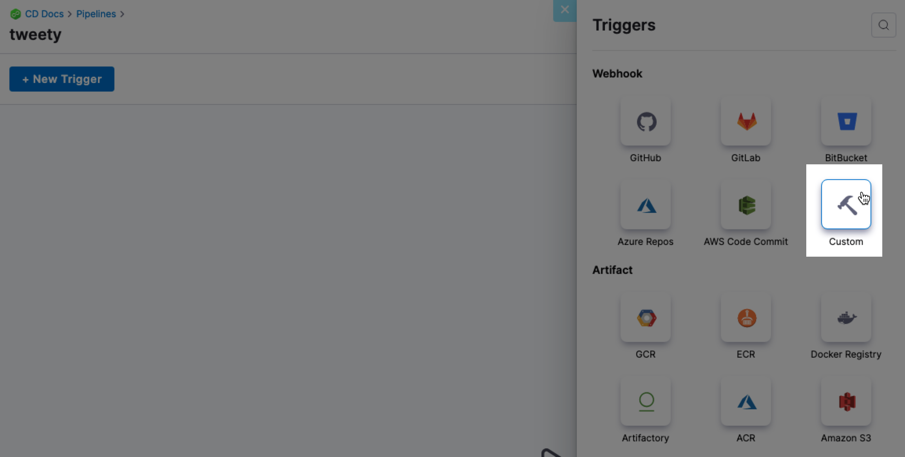

Harness includes a [native CI system](https://developer.harness.io/docs/category/get-started-with-ci) that can build and test code and push your artifact to any repository. You can set [triggers](https://developer.harness.io/docs/category/triggers) on Harness pipelines that execute a pipeline when a change is made in the code or artifact repository.

In some cases, you might be using a third-party CI system. You can still execute Harness pipelines when changes are made to the code or artifact repositories used by that system.

This topic describes how to set up and use a custom webhook trigger and run it as a cURL command for your third-party CI system.

import Variables from '/docs/platform/11_Triggers/shared/variables-not-supported.md'

<Variables />

## Requirements

Make sure you have: 
* A Harness pipeline with a [CD stage](https://developer.harness.io/docs/continuous-delivery/onboard-cd/cd-concepts/cd-pipeline-basics).
* A [Harness service with an artifact source](https://developer.harness.io/docs/continuous-delivery/onboard-cd/cd-concepts/services-and-environments-overview).

## Configure the artifact image path and tag as runtime inputs

1. Select the pipeline you want to trigger. 
2. Select the CD stage that deploys the service with the artifact you want to execute the trigger.
3. In **Service**, select the pencil icon next to the service name.
4. In **Edit Service**, in **Artifacts**, select the pencil icon to edit the artifact source.
  
   
   
4. Verify if the appropriate artifact repository type is selected, then select **Continue**.
5. Verify if the appropriate artifact connector is selected, then select **Continue**. 
6. In **Artifact Details**, select **Runtime input** for **Image Path** and **Tag**.
   
   

7. Select **Submit**.
   
## Create a custom trigger

1. In your pipeline, select **Triggers** at the top of the page.

    
   
2. Select **New Trigger**.
3. In **Webhook**, select **Custom**.
   
    

4. Name the new trigger, then select **Continue**.
   
    

5. In **Conditions**, specify any [conditions](https://developer.harness.io/docs/platform/pipelines/w_pipeline-steps-reference/triggers-reference/) to be met before running the pipeline, and select **Continue**. 
   
    For example, execute the pipeline if the source or target branch name matches a pattern.

    

6. In **Pipeline Input**, define payloads for **Image Path** and **Tag** so that Harness can map them later when running the trigger.

    

7. Select **Create Trigger**. 
   
## Trigger the pipeline from a thrid-party CI system

1. In your pipeline **Triggers**, locate the trigger you created, select the link in the **Webhook** column, and select **Copy as cURL Command**.

    
    
2. Paste the cURL command in an editor and edit the body fields to provide the payload information.

   To avoid format issues, we recommend that you use VS Code or Sublime Text to edit the payload information before running the command in a Terminal.

   Below is a sample cURL command with image and tag fields.
   
    ```
    curl -X POST -H 'content-type: application/json' -H 'X-Api-Key: sample_api_key' --url 'https://app.harness.io/gateway/pipeline/api/webhook/custom/v2?accountIdentifier=<your_account_identifier>&orgIdentifier=default&projectIdentifier=CD_Docs&pipelineIdentifier=Container&triggerIdentifier=Trigger_to_CI' -d '{"image": "library/nginx", "tag":"stable"}'
    ```

    The `-H 'X-Api-Key: sample_api_key'` parameter is used to authorize custom triggers. You can use [Harness API keys](/docs/platform/Resource-Development/APIs/add-and-manage-api-keys) with this parameter. For more information, go to [Custom trigger authorization using API keys](#custom-trigger-authorization-using-api-keys).
    

3. Run the updated cURL command in a Terminal. 

    Sample success message:
 
    ```
    {
        "status":"SUCCESS",
        "data":{
            "eventCorrelationId":"<event_correlation_id>",
            "apiUrl":"https://app.harness.io/gateway/pipeline/api/webhook/triggerExecutionDetails/<event_correlation_id>?accountIdentifier=<account_identifier>",
            "uiUrl":"https://app.harness.io/ng/#/account/<account_identifier>/cd/orgs/default/projects/CD_Docs/deployments?pipelineIdentifier=<pipeline_name>&page=0",
            "uiSetupUrl":"https://app.harness.io/ng/#/account/<account_identifier>/cd/orgs/default/projects/CD_Docs/pipelines/<pipeline_name>/pipeline-studio/"
        },
        "metaData":null,
        "correlationId":"<correlation_id>"
    }
    ```
   
4. In Harness, go to **Deployments** or the pipeline's **Execution History** to see the pipeline triggered by your custom webhook trigger.
