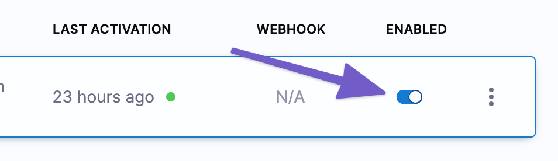

:::note
Currently, this feature is behind the feature flags `NG_SVC_ENV_REDESIGN` and `CD_TRIGGERS_REFACTOR`. Contact [Harness Support](mailto:support@harness.io) to enable the feature.

:::

You can trigger Harness Pipelines in response to a new Helm chart version being added to an HTTP Helm repo.

For example, every time a new Helm chart is pushed to an HTTP Helm repo, it triggers a CD Pipeline that deploys it automatically.

Helm Chart Triggers simply listen to the repo where one or more of the Helm charts in your Pipeline are hosted.

You can set conditions on the Triggers, such as matching one or more chart versions.

This Trigger is a simple way to automate deployments for new Helm charts.

### Before you begin

* You should be familiar with Harness CD Pipelines for Helm charts, such as the one you create in the [Helm Chart deployment tutorial](https://docs.harness.io/article/cifa2yb19a-helm-cd-quickstart).

### Summary and important notes

The following requirements and notes apply to Harness Helm Chart Triggers.

#### What can I trigger with a Helm Chart change?

When you add a Helm Chart Trigger to a Pipeline, you tell Harness what Helm Chart to listen on for changes. When a new version of the Helm Chart is added in its repo, Harness initiates the Trigger and the Pipeline is executed.

Typically, you add a Helm Chart Trigger to a Pipeline that deploys the same Helm Chart. The Helm Chart is added to the CD stage in the Pipeline, as part of the Harness Service **Manifest**. And the same Helm Chart is added to the Trigger.

However, the Helm Chart you specify in the Trigger does not have to be used in the Pipeline. 

You can have a change in a Helm Chart trigger any Pipeline, even one that isn't deploying a Helm Chart. 

You can have a change in a Helm Chart trigger a Pipeline that deploys a different Helm Chart. 

#### Chart polling

Once you have created a Trigger to listen for new Helm chart versions, Harness will poll for new charts continuously.

Polling is immediate because Harness uses a perpetual task framework that constantly monitors for new versions.

Harness looks to see what has changed in the repo to determine if a new chart version has been added. If Harness detects a change, it will initiate the Trigger.

#### Chart versions in artifacts

When you add the Helm Chart to Harness as a Manifest, you have different options for the Chart Version.


* **Fixed Value:** if you use [Fixed Value](../20_References/runtime-inputs.md) for **Chart Version** (for example, `0.1.4`), Helm Chart Triggers will work, but Harness will not select the latest chart version. Instead, Harness will select the hardcoded chart version in **Chart Version** (`0.1.4`).
* **Runtime Input:** if you use [Runtime Input](../20_References/runtime-inputs.md) for **Chart Version**, you can enter the version to use in your Trigger as part of the Trigger Pipeline Inputs. See [Select Pipeline Inputs](trigger-pipelines-on-new-helm-chart.md#step-4-select-pipeline-inputs) below.
* **Expression:** if you use [Expression](../20_References/runtime-inputs.md) for **Chart Version**, you can:
	+ Use a [Harness variable expression](../12_Variables-and-Expressions/harness-variables.md), like a Service variable.
	+ Use the expression `<+trigger.manifest.version>` to have the new chart version that initiated the Trigger passed in as the version to deploy.


#### OCI Helm registries are not supported with Harness Triggers

You cannot use [OCI Helm Registries](../7_Connectors/connect-to-an-artifact-repo.md) with Helm Chart Triggers.

### Create a Helm Chart Trigger

Typically, you add a Helm Chart Trigger to a Pipeline that deploys a Helm Chart. The Helm Chart is added to the CD stage in the Pipeline, as part of the Harness Service **Manifest**.

1. Select a Harness Pipeline that includes a Helm Chart in the Stage's **Service Definition**.

   

   See [Helm Chart deployment tutorial](https://docs.harness.io/article/cifa2yb19a-helm-cd-quickstart) for details on adding Helm Charts to a Stage's **Service Definition**.

Next, let's add the Trigger.

2. Click **Triggers**.
3. Click **New Trigger**.
4. Click the **Helm Chart** Trigger listed under **Manifest**. The **On New Manifest** Trigger settings appear.
5. In **Configuration**, in **Name**, enter a name for the Trigger.

### Select the Helm Chart for the Trigger to listen on

Define what Helm Chart you want Harness to listen on for the Trigger. 

1. In **Listen on New Artifact**, click **Define Manifest Source**.
2. In **Specify Helm Chart Store**, select the repo type.
	1. HTTP Helm: go to [HTTP Helm Repo Connector Settings Reference](../7_Connectors/ref-source-repo-provider/http-helm-repo-connector-settings-reference.md).
	2. Google Cloud Storage: go to [Google Cloud Platform (GCP) Connector Settings Reference](../7_Connectors/ref-cloud-providers/gcs-connector-settings-reference.md).
	3. AWS S3: go to [AWS Connector Settings Reference](../7_Connectors/ref-cloud-providers/aws-connector-settings-reference.md).
3. Once you have selected a Connector, click **Continue**.
4. In **Manifest Details**, enter the name of the Helm Chart to listen on in **Chart Name**. For example, `nginx` or `etcd`.
5. In **Helm Version**, select the version of Helm your repo uses.


:::note
The required settings are determined by the Helm Chart Store you selected.

:::

6. Click **Submit**.

The Helm Chart is added to the Trigger. Now Harness will poll that Helm Chart for any changes.


### Set Conditions

In **Conditions**, enter any conditions that must be matched in order for the Trigger to execute. For example, the Helm version number.

#### Regex and Wildcards

You can use wildcards in the condition's value and you can select **Regex**.

For example, if the build is `todolist-v2.0`:

* With Regex not selected, both `todolist*` or `*olist*` will match.
* With Regex selected, the regex `todolist-v\d.\d` will match.

If the regex expression does not result in a match, Harness ignores the value.

Harness supports standard Java regex. For example, if Regex is enabled and the intent is to match filename, the wildcard should be `.*` instead of simply a wildcard `*`. If you wanted to match all of the files that end in `-DEV.tgz` you would enter `.*-DEV\.tgz`.

### Select Pipeline Inputs

If your Pipeline uses [Runtime Inputs](../20_References/runtime-inputs.md) or [Input Sets](../8_Pipelines/input-sets.md), you can select the inputs to use when the Trigger executes the Pipeline.

For example, here's an example where you select Runtime Inputs in the Trigger:


### Test Trigger

1. Once your Trigger is set up, click **Create Trigger**. The new Trigger is listed.

Once the Pipeline is executed using the Trigger, in **Deployments**, you can see the Trigger and the user who initiated the deployment.


If you look at the Trigger in your Pipeline again you can see its activation records:


And these records are also in the Trigger details:


You can test the Trigger by pushing a new chart version to your Helm Chart registry.

You can build and push to your registry using Harness CIE. See [CI Pipeline Quickstart](../../continuous-integration/ci-quickstarts/ci-pipeline-quickstart.md).Here's a simple curl example using a Nexus repo that works as a Helm chart HTTP server.

Add repo:


```
helm repo add nexus_http https://nexus3.dev.example.io/repository/<repo_name>/ --username '<username>' --password '<password>'
```
Fetch chart:


```
helm fetch nexus_http/<chart_name>
```
Next, update the version in your chart.

Package the chart:


```
helm package <filename>
```
Push the new version to the Helm HTTP Server:


```
curl -u <username>:<password> https://nexus3.dev.example.io/repository/<repo_name>/ --upload-file <chart_name>-<chart_version>.tgz -v
```
Now your Helm chart HTTP server should have the new version of the Helm chart.

### Option: enable or disable Trigger

You can enable or disable Triggers using the Enabled toggle:


### Option: reuse Trigger YAML to create new Triggers

You can reuse Triggers by copying and pasting Trigger YAML. This can be helpful when you have advanced Conditions you don't want to set up each time.


### See also

* [Schedule Pipelines using Triggers](schedule-pipelines-using-cron-triggers.md)
* [Trigger Pipelines using Git Events](triggering-pipelines.md)

