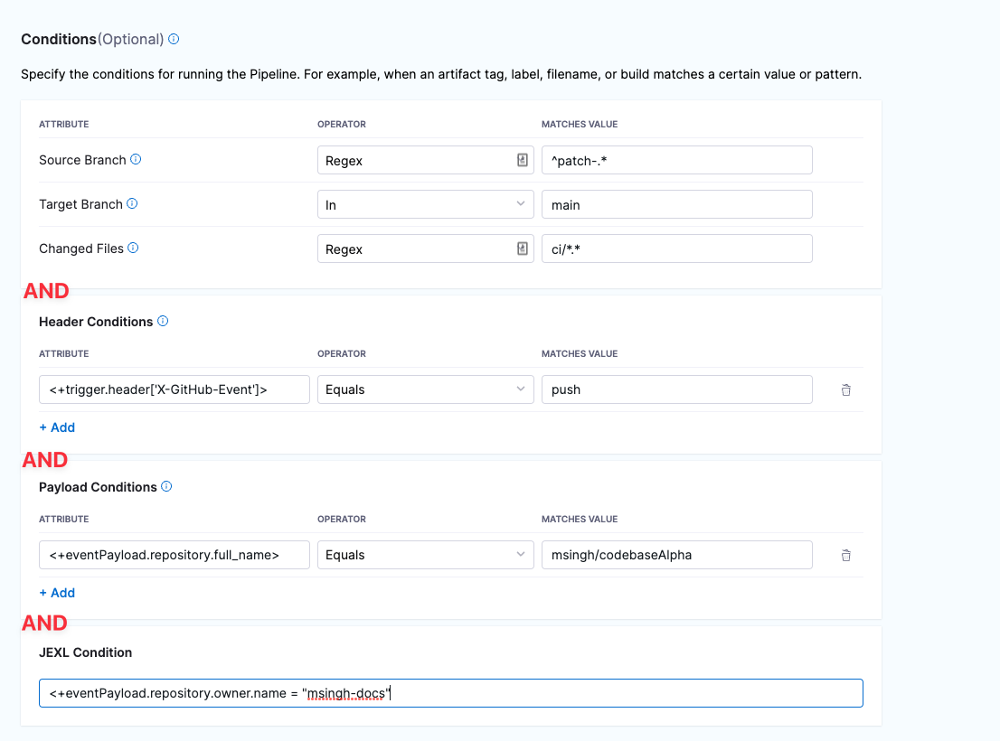

You can trigger Pipelines in response to Git events that match specific payload conditions you set up in the Harness Trigger.

For example, when a pull request or push event occurs on a Git repo and your Trigger settings match the payload conditions, a CI or CD Pipeline can execute.

In this example, we create a Custom Trigger for GitHub payload conditions.

This topic covers payload conditions in detail. For a general overview of creating Triggers using Git Events, see [Trigger Pipelines using Git Events](triggering-pipelines.md).For general Triggers reference, see [Triggers Reference](../8_Pipelines/w_pipeline-steps-reference/triggers-reference.md).

### Before you begin

* [Learn Harness' Key Concepts](https://ngdocs.harness.io/article/hv2758ro4e-learn-harness-key-concepts)
* [Kubernetes CD Quickstart](https://ngdocs.harness.io/article/knunou9j30-kubernetes-cd-quickstart)
* [CI Pipeline Quickstart](../../continuous-integration/ci-quickstarts/ci-pipeline-quickstart.md)
* [Trigger Pipelines using Git Events](triggering-pipelines.md)

### Limitations

* Currently, Harness supports Git-based Triggers for the most common Git providers. Harness includes a Custom Trigger for other repo providers.
* The **IN** and **NOT IN** operators do not support Regex.

#### Important Notes

* All Triggers in a Harness account have the same URL. This means that you must set up your Trigger Conditions carefully to ensure that a Pipeline triggers Builds for relevant events only.
* If a Build does not start in response to an incoming event, do the following:
	+ Check the execution history (click Execution History in the top right of the Pipeline Studio).
	+ Verify that the runtime inputs are correct.
	+ Check the payloads sent from the Git provider and compare the relevant fields with the Conditions in your Triggers. For example, in GitHub you can view the full payload of each event sent from a specific Webhook.

### Step 1: Add a Trigger to a Pipeline

1. Open your Harness Pipeline in **Pipeline Studio**.
2. Click **Triggers**.
3. Click **New Trigger**.
4. Choose your Git SaaS provider, such as **GitHub** or **BitBucket**, or **Custom** if you are using a different provider.

### Step 2: Configure the Trigger

In the Configuration tab of the new Trigger, specify the following:

* **Name** and **Description**
* **Payload Type:** This should match your Git SaaS provider.
* **Connector:** A [Connector](https://docs.harness.io/category/code-repo-connectors) to your Git SaaS provider. (This is required for all Git trigger types except **Custom**.) In the Credentials page of the Connector setup wizard, make sure that API access is selected with the correct permissions.  
A Connector is required for all Git trigger types except Custom. For Custom Triggers, you set up the external tool to send paylods to to the Trigger URL. The specific steps to do this vary depending on the external tool
* **Event:** Select the Git event type for the Webhook.  
If the event type you select results in the **Actions** settings appearing, select the actions for the Webhook or select **Any Actions**.
* **Auto-abort Previous Execution:** Use this option if you want to override active Pipeline executions. When the branch of interest is updated, the Pipeline aborts any active Builds on the branch before it launches the new Build.

### Step 3: Set Trigger Conditions

Conditions specify criteria in addition to events and actions.

Conditions help to form the overall set of criteria to trigger a Pipeline based on changes in a given source.

Conditions support Harness built-in expressions for accessing Trigger settings, Git payload data, and headers.

#### Option 1: Branches and Changed Files

You can configure Triggers based on the source branches, target branches, and changed files in a Git merge.

If you want to specify multiple paths, use the Regex operator.

#### Option 2: Header Condition

In the Header condition, enter the Git Webhook Header data that matches your value. 

The header expression format is `<+trigger.header['key-name']>`. 

For example: `<+trigger.header['X-GitHub-Event']>`.

Refer to [Built-in Git Trigger and Payload Expressions](../8_Pipelines/w_pipeline-steps-reference/triggers-reference.md#built-in-git-trigger-and-payload-expressions) for more trigger expressions in Harness.

#### Option 3: Payload Condition

Conditions based on the values of the JSON payload. Harness treats the JSON payload as a data model and parses the payload and listens for events on a JSON payload key.

To reference payload values, you use `<+eventPayload.` followed by the path to the key name.

For example: `<+eventPayload.repository.full_name>`

For details on Payload Condition, see [Payload Condition](../8_Pipelines/w_pipeline-steps-reference/triggers-reference.md#payload-conditions).

#### Option 4: JEXL Condition

JEXL expressions are also supported. For example: `<+eventPayload.repository.owner.name> == "repositoryOwnerName"`

JEXL expressions are also supported. Here are some examples:

* `<+trigger.payload.pull_request.diff_url>.contains("triggerNgDemo")`
* `<+trigger.payload.pull_request.diff_url>.contains("triggerNgDemo") || <+trigger.payload.repository.owner.name> == "wings-software"`
* `<+trigger.payload.pull_request.diff_url>.contains("triggerNgDemo") && (<+trigger.payload.repository.owner.name> == "wings-software" || <+trigger.payload.repository.owner.name> == "harness")`

For details on Trigger settings, see [Triggers Reference](../8_Pipelines/w_pipeline-steps-reference/triggers-reference.md).

If you select multiple conditions, the conditions are ANDed together (boolean AND operation). All Conditions must match an event payload for it to execute the Trigger. If you select any one condition, Trigger will execute based on the condition you entered.

Click **Continue**.

### Step 4: Set Pipeline Input

Pipelines often have [Runtime Inputs](../20_References/runtime-inputs.md) like codebase branch names or artifact versions and tags.

Provide values for the inputs. You can also use [Input Sets](../8_Pipelines/input-sets.md).

Click **Create Trigger**.

The Trigger is now added to the Triggers page.

### Step 5: Register Webhook in the Git Provider

When you create or edit the custom webhook trigger, you need to copy the webook URL and add it to your repo webhooks. However, make sure you have the following permissions for GitHub Personal Access Token for webhook registration to work:

* Scopes: select all the repo, user, and admin:repo\_hook options

You should also be repo admin.

1. In the **Pipeline Studio**, click **Triggers.**
2. Select your Custom Webhook.
3. Click on Webhook URL icon.
4. Click the link button to copy the webhook URL.
   
   
   
5. Log in to your repo in the Git provider and navigate to its Webhook settings.   
All Webhook URLs in an account have the same format: `https://app.harness.io/gateway/ng/api/webhook?accountIdentifier=ACCOUNT_ID`
6. Create a new webhook and paste the URL you copied from Harness in Step 4.
7. Make sure that the content type of the outbound requests is **Application/json**.
8. Make sure that **Enable verification** is enabled.
9. Select the events that you would like to trigger this webhook.  
In this example, we select **Just the push event**. It means that this webhook will only be triggered if there is a push event.
10. Click **Update webhook**.

### Step 6: Test Trigger

Make a change on the repo and push the changes to Github and see if it executes the Trigger. For example, change a file, commit it on the main branch, and make a push event.

In your Git provider repo, you can see that the request and response were successful.

Note that the webhook conditions specified in [Step 3](trigger-pipelines-using-custom-payload-conditions.md#step-3-set-trigger-conditions) match the Payload data. As a result, the Pipeline was triggered.

In Harness, view the **Pipeline execution**.

In Harness CI, click **Builds** (1). You can see the source branch (2), target branch (3), and the push request comment and number (4).

Click the push request number and it opens the Git provider repo at the push request.

If you open the Trigger in the Pipeline, you will see a status in **Last Activation Details**.

Activation indicates that the Trigger was successful in requesting Pipeline execution.

### See also

* [Triggers Reference](../8_Pipelines/w_pipeline-steps-reference/triggers-reference.md)
* [Harness Git Sync Overview](../10_Git-Experience/git-experience-overview.md)
* [Trigger Pipelines Using Git Events](triggering-pipelines.md)

