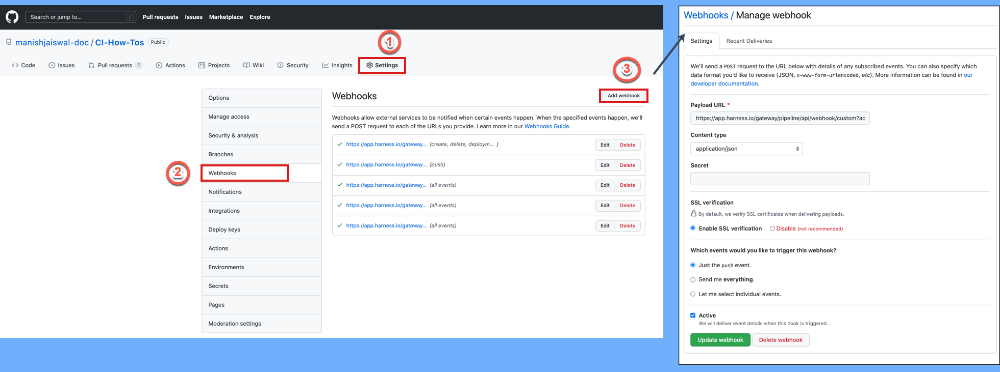

You can trigger pipelines in response to Git events that match specific payload conditions you set up in a Harness trigger. For example, when a pull request or push event occurs on a Git repo and your trigger settings match the payload conditions, a CI or CD pipeline can run.

Triggers enable event-driven CI/CD and support the practice of every commit building and/or deploying to a target environment.

This topic demonstrates how to create a trigger for GitHub payload conditions. It shows how to use **Conditions** settings to create a highly-specific trigger; however **Conditions** are optional, and you can create simple triggers that respond to, for example, any Pull Request activity on a certain repo. For information about triggers settings, go to the [Triggers reference](../8_Pipelines/w_pipeline-steps-reference/triggers-reference.md). For information about the Harness Git Experience, go to the [Harness Git Experience Overview](../10_Git-Experience/git-experience-overview.md)

:::info

* Currently, Harness supports Git-based triggers for the most common Git providers. You can use a [Custom Trigger](./trigger-deployments-using-custom-triggers.md) for other repo providers.
* In Harness, you can select who is able to create and use triggers within Harness, but you must use your Git provider's RBAC to control who can initiate the Git events that start the Harness Trigger.

:::

import Variables from '/docs/platform/11_Triggers/shared/variables-not-supported.md'

<Variables />

<details>
<summary>Video summary</summary>

Here's a two minute video showing you how to create and run a Trigger in response to Git events.

<!-- Video:
https://www.youtube.com/watch?v=y8s351IJLXw-->
<docvideo src="https://www.youtube.com/watch?v=y8s351IJLXw" />

</details>

## Add a trigger to a pipeline

These steps assume you're familiar with [creating CD pipelines](/docs/continuous-delivery/deploy-srv-diff-platforms/kubernetes/kubernetes-cd-quickstart) or [creating CI pipelines](../../continuous-integration/ci-quickstarts/ci-pipeline-quickstart.md). Your pipeline must have a defined codebase for the trigger to listen on. For more information, go to [Create and Configure a Codebase](../../continuous-integration/use-ci/codebase-configuration/create-and-configure-a-codebase.md).


1. Go to your pipeline in Harness.
2. Select **Triggers**.
3. Select **New Trigger**.
4. Choose your SCM provider.

You can select the **Custom** trigger type if you are using an unsupported Git provider. Go to the [Custom Trigger documentation](./trigger-deployments-using-custom-triggers.md) for guidance on creating custom triggers.

## Configure the trigger

:::caution

All triggers in a Harness account have the same URL: `https://app.harness.io/gateway/ng/api/webhook?accountIdentifier=ACCOUNT_ID`. This means that you must set up your trigger conditions carefully to ensure that triggers start pipelines for relevant events only.

:::

1. On the trigger's **Configuration** tab, enter a **Name** and **Description**.
2. **Payload Type** is automatically populated based on the selected SCM provider.
3. For **Connector**, select a [code repo connector](/docs/category/code-repo-connectors) for your SCM provider.

   * A connector is required for all Git trigger types except **Custom**. In the connector's **Credentials** settings, make sure API access is enabled.
   * For **Custom** triggers, you must set up the external tool to send payloads to to the trigger URL. Refer to your tool's documentation for instructions on sending payloads.

4. For **Event**, select a [Git event type](/docs/platform/Pipelines/w_pipeline-steps-reference/triggers-reference#event-and-actions), and, if required, select one or more **Actions**.
5. Configure additional settings, such as **Auto-abort Previous Execution**, **Configure Secret**, and **Polling Frequency**, according to your desired trigger configuration.

For details on trigger settings, go to the [Triggers reference](../8_Pipelines/w_pipeline-steps-reference/triggers-reference.md).

## Set trigger conditions

**Conditions** specify additional trigger criteria beyond the **Event** and **Actions**. Conditions are optional, but they are necessary if you want to create specific, limited-scope triggers. Conditions can use Harness built-in expressions for accessing trigger settings, Git payload data, and headers.

Here are some examples of trigger conditions:

* Trigger a pipeline when a specific value is passed in the source payload.
* Trigger a pipeline when there's a change in a specific file or a pull request.
* Trigger a pipeline based on a specific artifact tag convention.
* Trigger a pipeline if the source or target branch in the Git event matches a specified pattern.
* Trigger a pipeline if there are file changes in specific directories in the Git repo (This is useful when working with a mono-repository; it ensures that pipelines only run in response to certain changes, rather than every change).

:::info Conditions are cumulative

Triggers are like complex filters in which the **Conditions** are `AND`-ed together. To execute a trigger, the event payload must match *all* trigger conditions.

For example, the configuration in the following image requires that the event match all conditions for **Source Branch**, **Target Branch**, **Changed Files**, **Header Conditions**, **Payload Conditions**, and **JEXL Condition** to activate the trigger.


If you want a trigger that uses `OR`, `NOT`, or other operators across the payload, define only a **JEXL Condition** and leave the other conditions empty (unless you want to `AND` them to your JEXL condition).

:::

Some information about **Conditions** is provided in the following sections. For much more detail on **Conditions**, including **Operators**, go to the [Triggers reference](../8_Pipelines/w_pipeline-steps-reference/triggers-reference.md).

<details>
<summary>Branches and Changed Files</summary>

You can configure triggers based on the source branches, target branches, and changed files involved in a Git event.

If you want to specify multiple paths, use the **Regex** operator. You can also use a Regex to specify all files in a parent folder, such as `ci/*`. This is shown in the **Changed Files** row in the following screenshot.


For more information about **Attributes**, **Operators**, **Matching Values**, and **Conditions**, go to the [Triggers reference](../8_Pipelines/w_pipeline-steps-reference/triggers-reference.md).

</details>

<details>
<summary>Header Conditions</summary>

In **Header Conditions**, define attributes for Git webhook header data and corresponding values to match.

In the **Attribute** field, the header expression format is `<+trigger.header['key-name']>`, such as `<+trigger.header['X-GitHub-Event']>`.

For more information about **Attributes**, **Operators**, **Matching Values**, and **Header Conditions**, go to the [Triggers reference](../8_Pipelines/w_pipeline-steps-reference/triggers-reference.md).

</details>

<details>
<summary>Payload Conditions</summary>

CThese conditions are based on the values of the webhook's JSON payload. Harness treats the JSON payload as a data model and parses the payload and listens for events on a JSON payload key.

To reference payload values, you use `<+eventPayload.[path-to-key-name]`, for example `<+eventPayload.repository.full_name>`.

For more information about **Attributes**, **Operators**, **Matching Values**, and **Payload Conditions**, go to the [Triggers reference](../8_Pipelines/w_pipeline-steps-reference/triggers-reference.md).

</details>

<details>
<summary>JEXL Condition</summary>

You can refer to payload data and headers using [JEXL expressions](https://commons.apache.org/proper/commons-jexl/reference/syntax.html). That includes all constants, methods, and operators in [JexlOperator](https://commons.apache.org/proper/commons-jexl/apidocs/org/apache/commons/jexl3/JexlOperator.html).

Be careful when you combine Harness variables and JEXL expressions:

* **Invalid expression format:** `<+pipeline.variables.MAGIC.toLowerCase()>`
  * This expression is ambiguous. It could be evaluated as a Harness variable (return the value of variable `pipeline.variables.MAGIC.toLowerCase()`) or as a JEXL operation (return the lowercase of literal string `pipeline.variables.MAGIC`).
* **Valid expression format:** `<+<+pipeline.variables.MAGIC>.toLowerCase()>`
  * First, this expression gets the value of the variable `pipeline.variables.MAGIC`, and then it returns the value converted to all lowercase.

Here are some examples of valid combined JEXL and Harness expressions:

* `<+trigger.payload.pull_request.diff_url>.contains("triggerNgDemo")`
* `<+trigger.payload.pull_request.diff_url>.contains("triggerNgDemo") || <+trigger.payload.repository.owner.name> == "wings-software"`
* `<+trigger.payload.pull_request.diff_url>.contains("triggerNgDemo") && (<+trigger.payload.repository.owner.name> == "wings-software" || <+trigger.payload.repository.owner.name> == "harness")`

For more information about **Attributes**, **Operators**, **Matching Values**, and **JEXL Conditions**, go to the [Triggers reference](../8_Pipelines/w_pipeline-steps-reference/triggers-reference.md).

</details>

## Set pipeline input

Pipelines often have [Runtime Inputs](../20_References/runtime-inputs.md), such as codebase branch names or artifact versions and tags.

1. Provide values for the inputs or use [Input Sets](../8_Pipelines/input-sets.md).
2. Select **Create Trigger** to save your trigger.

The trigger is added to the triggers page. The last step is [webhook registration](#register-the-webhook-in-the-git-provider).

## Register the webhook in the Git provider

For all Git providers supported by Harness, non-custom webhooks are automatically created in the repo. For details about automatically-registered Git events, go to the [Triggers reference](../8_Pipelines/w_pipeline-steps-reference/triggers-reference.md).


However, if automatic registration fails or you created a custom webhook, you must manually copy the webhook URL and add it to your repo webhooks.

:::info Required permissions

To configure a functioning Git event webhook trigger:

* You must have the appropriate level of access to configure repo webhooks in your Git provider.
* The personal access token use for [code repo connector](/docs/category/code-repo-connectors) authentication must have the appropriate scopes.

For example, for GitHub, you must be a repo admin and the GitHub personal access token used in the pipeline's GitHub connector must include all `repo`, `user`, and `admin:repo_hook` options for **Scopes**.


For information about other provider's token scopes, go to:

* [GitLab - Personal access token scopes](https://docs.gitlab.com/ee/user/profile/personal_access_tokens.html#personal-access-token-scopes)
* [Bitbucket Cloud - Repository access token permissions](https://support.atlassian.com/bitbucket-cloud/docs/repository-access-token-permissions/)
* [AWS - Permissions for actions on triggers](https://docs.aws.amazon.com/codecommit/latest/userguide/auth-and-access-control-permissions-reference.html#aa-triggers)

:::

1. Go to your pipeline in Harness and select **Triggers**.
2. Select your custom webhook.
3. Select the link icon to copy the webhook URL.

   

4. Log in to your repo in your SCM provider and navigate to the repo's webhook settings.
5. Create a new webhook and paste the webhook URL you copied from Harness.
6. Make sure that the content type for outbound requests is **Application/json**.
7. Make sure that **Enable verification** is enabled.
8. Select the events that you would like to trigger this webhook. The following example selected **Just the push event**, which means that this webhook is only triggered if there is a push event.
9. Select **Update webhook**.

   

For more information about manual webhook registration, go to the [Triggers reference](../8_Pipelines/w_pipeline-steps-reference/triggers-reference.md).

<details>
<summary>Common causes of Webhook registration failed errors</summary>

Webhook registration is immediate but the Harness Triggers page does not refresh immediately. Simply refresh the page to see if the webhook registers successfully.

If you see **Webhook registration failed**, here are the common causes:

- Github repository does not exist: 
  - Ensure you selected the correct repo.
- The token used in the Harness connector does not have read write permissions:
  - Ensure that it has the **repo**, **user**, and **admin:repo\_hook** options enabled.
  - If your Git provider organization uses SSO, ensure that the token is authorized for access to the organization containing the repo.
- The **Enable API access** option in the connector is not enabled.
  - Ensure this option is enabled and the Personal Access Token used in the settings has the **repo**, **user**, and **admin:repo\_hook** options enabled. 

Once you have fixed the issue, simply edit the Harness trigger, select **Continue** to navigate through its settings, and then select **Update Trigger**.

Once you are back on the Triggers page, refresh the page to verify that the webhook was registered.

</details>

:::note

Ensure that multiple Webhooks are not registered for the same repo. This can trigger multiple builds or deployments with a single push event.

:::

## Test the trigger

To test the trigger, make (and push) a change in your repo. If you created a Pull Request (or similar) trigger, you'll also need to create a Pull Request.

In your Git repo, you can see that the request and response were successful.


Note that if you specified [Conditions](#set-trigger-conditions) the payload data must match your conditions to activate the trigger.

In Harness, view the **Pipeline execution**. In Harness CI, click **Builds** (1). You can see the source branch (2), target branch (3), and the pull request comment and number (4).


Select the pull request number to go to your repo at the pull request event.

On the list of triggers for a pipeline, you can see when each trigger was last activated.


**Activation** means the trigger was able to *request* pipeline execution; it doesn't mean that the webhook didn't work.

**Failed** usually means the pipeline has a configuration issue that prevented the trigger from initiating a pipeline.

## Trigger type expression

You can use the Harness expression `<+pipeline.triggerType>` to see how the pipeline was executed.

You can echo the expression like this:

```
echo "pipeline.triggerType: " <+pipeline.triggerType>
```

For example, if the pipeline is executed manually, the `<+pipeline.triggerType>` expression will resolve to `MANUAL`. If the pipeline is executed by a Webhook trigger, the expression will resolve to `WEBHOOK`.

```
pipeline.triggerType:  WEBHOOK
```

### Null comparisons

You can also use JEXL comparisons with Trigger expressions.

For example, let's look at an example that uses the `?` ternary operator in a JEXL expression. 

This ternary operator takes three operands: a Boolean expression, and two values or expressions that are evaluated based on the Boolean expression. 


:::note

The ternary operator is also known as the conditional operator because it evaluates a Boolean expression and returns one of two possible values, depending on whether the expression is true or false.

:::

In the following example, we use the `<+pipeline.triggerType>` expression to see how the pipeline was executed. 

If the expression evaluates to `WEBHOOK` (`true`), we expose and resolve the `<+trigger.commitSha>` to show the commit SHA that fired the trigger. If the expression does not resolve to `WEBHOOK` (`false`), we show the pipeline execution Id.

```
echo <+<+pipeline.triggerType> == "WEBHOOK" ? <+trigger.commitSha>:<+pipeline.executionId>>
```

We can do the same using the `MANUAL` value:

```
echo <+<+pipeline.triggerType> == "MANUAL" ? <+pipeline.executionId>:<+trigger.commitSha>>
```

Here's a sample pipeline that demonstrates these comparisons.

<details>
<summary>Pipeline with trigger expressions comparisons</summary>

```yaml
pipeline:
  name: Trigger
  identifier: Trigger
  projectIdentifier: CD_Docs
  orgIdentifier: default
  tags: {}
  stages:
    - stage:
        name: Custom
        identifier: Custom
        description: ""
        type: Custom
        spec:
          execution:
            steps:
              - step:
                  type: ShellScript
                  name: Echo
                  identifier: Echo
                  spec:
                    shell: Bash
                    onDelegate: true
                    source:
                      type: Inline
                      spec:
                        script: |-
                          echo "pipeline.triggerType: " <+pipeline.triggerType>
                          echo "pipeline.executionId: " <+pipeline.executionId>
                          echo "trigger.commitSha: " <+trigger.commitSha>
                    environmentVariables: []
                    outputVariables: []
                  timeout: 10m
              - step:
                  type: ShellScript
                  name: Triggered by WEBHOOK
                  identifier: Comparison_2
                  spec:
                    shell: Bash
                    onDelegate: true
                    source:
                      type: Inline
                      spec:
                        script: echo <+<+pipeline.triggerType> == "WEBHOOK" ? <+trigger.commitSha>:<+pipeline.executionId>>
                    environmentVariables: []
                    outputVariables: []
                  timeout: 10m
              - step:
                  type: ShellScript
                  name: Triggered by MANUAL
                  identifier: Comparison
                  spec:
                    shell: Bash
                    onDelegate: true
                    source:
                      type: Inline
                      spec:
                        script: echo <+<+pipeline.triggerType> == "MANUAL" ? <+pipeline.executionId>:<+trigger.commitSha>>
                    environmentVariables: []
                    outputVariables: []
                  timeout: 10m
        tags: {}
```

</details>

### Troubleshooting

If a pipeline does not start in response to an incoming event, do the following:

* Check the execution history (select **Execution History** in the top right of the Pipeline Studio).
* Verify that the runtime inputs are correct.
* Check the payloads sent from the Git provider and compare the relevant fields with your trigger conditions. For example, in GitHub you can view the full payload of each event sent from a specific webhook.
