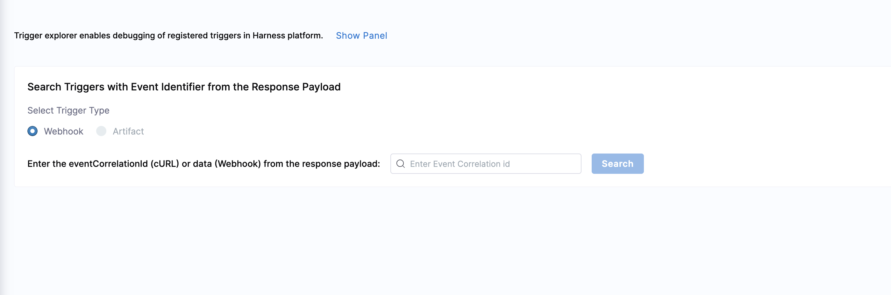

```mdx-code-block
import Tabs from '@theme/Tabs';
import TabItem from '@theme/TabItem';
```

:::info note
Currently, this feature is behind the feature flag `CDS_TRIGGER_ACTIVITY_PAGE`. Contact [Harness Support](mailto:support@harness.io) to enable the feature.
:::

You can troubleshoot failures of your cURL or webhook initiated triggers in the Harness platform.

After a trigger runs, you can use the **Trigger Explorer** to troubleshoot cURL or webhook initiated failures. For cURL, you enter the `eventCorrelationId` from the response. For webhooks, you enter the `data` value from the webhook response payload.

## Troubleshoot webhook failures

To troubleshoot webhook failures, do the following:

```mdx-code-block
<Tabs>
  <TabItem value="cURL trigger" label="cURL trigger">
```

1. Open your Harness pipeline in Pipeline Studio.
2. Select **Triggers**.
3. Select **Trigger Explorer**.
4. Select **Webhook**.
5. In **Enter Event Correlation id**, enter the `eventCorrelationId` value from the cURL response payload.

   

6. Select **Search**.

   Harness returns the following information:

   - **Event Correlation Id**
   - **Trigger Name**
   - **Trigger Status**
   - **Message**
   - **Payload**

### cURL example

**Sample cURL command**

```shell
~ % curl -X POST -H 'content-type: application/json' --url 'https://app.harness.io/gateway/pipeline/api/webhook/custom/v2?accountIdentifier=H5W8iol5TNWc4G9h5A2MXg&orgIdentifier=default&projectIdentifier=CD_Docs&pipelineIdentifier=tweety&triggerIdentifier=Custom' -d '{"sample_key": "sample_value"}'
```

**Sample response**

```json
{"status":"FAILED","data":{"eventCorrelationId":"64e3e215d2bb844cfab9e155","apiUrl":"https://app.harness.io/gateway/pipeline/api/webhook/triggerExecutionDetails/64e3e215d2bb844cfab9e155?accountIdentifier=H5W8iol5TNWc4G9h5A2MXg","uiUrl":"https://app.harness.io/ng/#/account/H5W8iol5TNWc4G9h5A2MXg/cd/orgs/default/projects/CD_Docs/deployments?pipelineIdentifier=tweety&page=0","uiSetupUrl":"https://app.harness.io/ng/#/account/H5W8iol5TNWc4G9h5A2MXg/cd/orgs/default"}}
```

In this example, you enter the `eventCorrelationId` value in the **Search** field.


```mdx-code-block
  </TabItem>
  <TabItem value="Webhook trigger" label="Webhook trigger">
```

1. Open your Harness pipeline in Pipeline Studio.
2. Select **Triggers**.
3. Select **Trigger Explorer**.
4. Select **Webhook**.
5. In **Enter Event Correlation id**, enter the `data` value from the webhook response payload.

   

6. Select **Search**.

   Harness returns the following information:

   - **Event Correlation Id**
   - **Trigger Name**
   - **Trigger Status**
   - **Message**
   - **Payload**

### Webhook example

The pipeline below runs when a repo has a PR.

This example uses the [tweety repo](https://github.com/michaelcretzman/linux_tweet_app).

**Sample pipeline URL**

`https://app.harness.io/ng/account/H5W8iol5TNWc4G9h5A2MXg/cd/orgs/default/projects/CD_Docs/pipelines/tweety/executions?storeType=INLINE`

**Sample response**

```json
{"status":"FAILED","data":"64e3e5b58cdd8704d75bd99d","metaData":null,"correlationId":"1a75bbef-862c-469e-b8ab-e06dd95e4999"}
```

In this example, you enter the `data` value in the **Search** field.

```mdx-code-block
  </TabItem>
</Tabs>
```