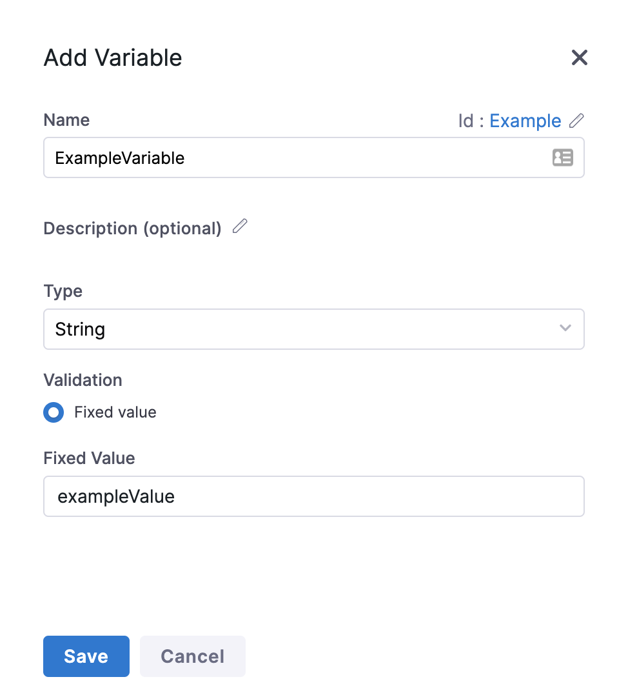

In your Pipelines, Variables can be added at the Pipeline-level, which makes them available to all Stages in the Pipeline. Within a Stage, you can add Variables at the Stage and Service-level. Here's [a video](https://youtu.be/lqbmO6EVGuU) covering those Variable types.

But what about when you need to use the same Variable across multiple Pipelines, or even Pipelines in multiple Projects?

With Account-level, Org-level, and Project-level Variables, Harness lets you store values that you can share and use across multiple Pipelines in multiple Projects.

This topic explains how to add Variables as an Account-level and Org-level Resource in Harness.


:::note
For details on Harness built-in variables, see [Built-in Harness Variables Reference](harness-variables.md).

:::

### Before you begin

* [Learn Harness' Key Concepts](https://ngdocs.harness.io/article/hv2758ro4e-learn-harness-key-concepts).
* Make sure you have [all permissions](../4_Role-Based-Access-Control/9-add-manage-roles.md) on Variables to add and manage Variables.
  
  

### Limitations

* Harness supports only String type Account-level, Org-level, and Project-level Variables. This is only a temporary limitation. You can use Secrets in Pipeline, Stage, and Service variables.
* If you delete a Variable that is referenced using [expressions](harness-variables.md) in entities like Pipelines, the reference expressions are not deleted. At runtime, when the expressions are resolved, the expression will resolve as null.

### Visual Summary

Here is a quick overview of how Variables can be shared across Pipelines.


### Step 1: Add Account, Org, and Project Variables

You can add a Variable to the Account, Organization, or Project [scope](../4_Role-Based-Access-Control/1-rbac-in-harness.md#rbac-scope).

#### Account

In Harness, click **Account Settings**.

Click **Account Resources** and then click **Variables**.


Click **New Variable**. The **Add Variable** settings appear.


Enter a **Name** for your Variable.

In **Fixed Value**, enter a value for your Variable.

Click **Save**.



#### Org

Click **Account Settings**.

Click **Organizations**.

Select an Org.

In **Organization Resources**, click **Variables**.


Click **New Variable**.

Enter a name, select the variable type (for example, **String**), and enter a value.

For example, here's a variable named **organiz\_var**.


Note the Id. That Id is used to reference the variable.

Click **Save**.

#### Project

In a Harness Project, click **Project Setup**, and then click **Variables**.

Click **New Variable**.

Enter a name, select the variable type (for example, **String**), and enter a value.

For example, here's a variable named **proj\_var**.


Note the Id. That Id is used to reference the variable.

Click **Save**.

### Step 2: Reference Variables in a Pipeline

To reference an Account and Org-level Variable, you must use the following expression in your Pipeline:

`<+variable.[scope].[variable_id]>`

* Account-level reference: `<+variable.account.[var Id]>`
* Org-level reference: `<+variable.org.[var Id]>`
* Project-level reference: `<+variable.[var Id]>`


:::note
The expression to reference **Project** scope Variables is `<+variable.Example>`. You do not need to specify `scope` to reference Project Variables.

:::

For example, to reference the Variable you just created, the expression will be:

`<+variable.account.Example>`

Let us add the Variable in a Pipeline now.

In Harness go to a Pipeline in the same Org as the variable you created.

In **Execution**, add a [Shell Script](https://docs.harness.io/article/k5lu0u6i1i-using-shell-scripts) step and reference the variables:


```
echo "account var: "<+variable.account.acct_var>  
echo "org var: "<+variable.org.organiz_var>  
echo "project var: " <+variable.proj_var>
```
When you run the Pipeline, the variable references are resolved and output:


### Review: Using an Account, Org, or Project Variable in a Service Variable

In **Service**, in **Advanced**, click **Add Variable**.


The **Add Variable** settings appear.

In **Variable** **Name**, enter a name for your Variable.

Select **String** as **Type** and click **Save**.

Your Variable is now listed under **Variables**.

In **VALUE**, select **Expression** and enter `<+variable.account.acct_var>`.


Now, when you run your Pipeline the referenced value is evaluated at runtime.

Copy the Service variable from **Variables**:


In your Shell Script step, reference the Service variable with `<+stage.spec.serviceConfig.serviceDefinition.spec.variables.serv_var>`.

Run the Pipeline and see that the value for the Account Variable is passed into the Service Variable:


You can refer to a Variable in most settings. For example, if you an Account Variable storing a Service named **Example**, you can refer to it inline using the same expression.


Now, when you run your Pipeline the referenced value is evaluated at runtime.

