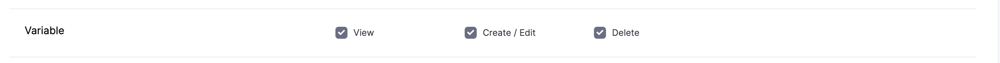

You can add Harness variables at account, org, project, and pipeline levels.

Account, org, and project variables store values that you can share and use across multiple pipelines in multiple projects.

Pipeline variables include variables added to the pipelines, stages, services, and environments used in the pipelines.

This topic explains how to add and reference variables in Harness.


:::note
Harness include many built-in variables for obtaining information like artifact versions, etc. For details on Harness built-in variables, go to [Built-in and custom Harness variables reference](harness-variables.md).

:::

## Before you begin

* [Learn Harness' Key Concepts](../../getting-started/learn-harness-key-concepts.md).
* Make sure you have the required [permissions](../4_Role-Based-Access-Control/9-add-manage-roles.md) on **Variables** to add and manage variables.
  
  

## Important notes

* Harness supports only string type account-level, org-level, and project-level variables.
  * You can use secrets in pipeline, stage, and service variables.
* If you delete a variable that is referenced using [expressions](harness-variables.md) in entities like pipelines, the reference expressions are not deleted. At runtime, when the expressions are resolved, the expression will resolve as null.
* Variables include a **Required** setting. This feature is supported for pipeline, stage, service, and environment variables. The **Required** options is also enforced when the variable is defined in a template and the template is included in a pipeline. 

## Visual summary

In the following illustration, the variables in **Common To Pipelines** are account, org, or project level variables. The variables in **Specific to Pipeline** are pipeline-level variables.


## Add account, org, and project variables

You can add a variable to the account, organization, or project [scope](../4_Role-Based-Access-Control/1-rbac-in-harness.md#rbac-scope).

### Account

1. In Harness, select **Account Settings**.
2. Select **Account Resources**, and then select **Variables**.
   
   <docimage path={require('./static/add-a-variable-02.png')} width="60%" height="60%" title="Click to view full size image" />  
3. Select **New Variable**. The **Add Variable** settings appear.
  
   <docimage path={require('./static/add-a-variable-03.png')} width="30%" height="30%" title="Click to view full size image" />  
4. Enter a **Name** for your variable.
5. In **Fixed Value**, enter a value for your variable.
6. Select **Save**.
   <docimage path={require('./static/add-a-variable-04.png')} width="30%" height="30%" title="Click to view full size image" />  

### Org

1. Select **Account Settings**.
2. Select **Organizations**.
3. Select an org.
4. In **Organization Resources**, select **Variables**.
   
   <docimage path={require('./static/add-a-variable-05.png')} width="60%" height="60%" title="Click to view full size image" />  
5. Select **New Variable**.
6. Enter a name, select the variable type, and then enter a value.
7. For example, here's a variable named **organiz\_var**.
   
     
8.  Note the Id. That Id is used to reference the variable.
9.  Select **Save**.

### Project

```mdx-code-block
import Tabs from '@theme/Tabs';
import TabItem from '@theme/TabItem';
```
```mdx-code-block
<Tabs>
  <TabItem value="API" label="API">
```

Use the [createVariable](https://apidocs.harness.io/tag/Variables#operation/createVariable) API to create a new variable.

Here's an example:

```json
curl -i -X POST \
  'https://app.harness.io/ng/api/variables?accountIdentifier=H5W8iol5TNWc4G9h5A2MXg' \
  -H 'Content-Type: application/json' \
  -H 'x-api-key: HARNESS_API_KEY' \
  -d '{
    "variable": {
      "identifier": "myvar123",
      "name": "myvar123",
      "description": "testvar",
      "orgIdentifier": "default",
      "projectIdentifier": "CD_Docs",
      "type": "String",
      "spec": {
        "valueType": "FIXED",
        "fixedValue": "bar"
      }
    }
  }'
```

```mdx-code-block
  </TabItem>
  <TabItem value="Harness Manager" label="Harness Manager">
```

1. In a Harness Project, select **Project Setup**, and then select **Variables**.
2. Select **New Variable**.
3. Enter a name, select the variable type, and then enter a value.
4. For example, here's a variable named **proj\_var**.
   
     
5. Note the Id. That Id is used to reference the variable.
6. Select **Save**.

```mdx-code-block
  </TabItem>
</Tabs>
```

## Pipeline, stage, service, and environment

Variables added to pipelines and stages are available to all stages in the pipeline. 

Variables added to a service and environment are available in all stages that use that service and environment. Here's a [video](https://youtu.be/lqbmO6EVGuU) covering those variable types.

You can also override service variables at the environment level. For more information, go to [Overriding services at the environment level](/docs/continuous-delivery/x-platform-cd-features/environments/service-overrides).

## Reference variables in a pipeline

To reference an account and org-level variable, you must use the following expression in your Pipeline:

`<+variable.SCOPE.VARIABLE_ID>`

* Account-level reference: `<+variable.account.VARIABLE_ID>`
* Org-level reference: `<+variable.org.VARIABLE_ID>`
* Project-level reference: `<+variable.VARIABLE_ID>`


:::note

The expression to reference **Project** scope variables is `<+variable.VARIABLE_ID>`. You do not need to specify `scope` to reference project variables.

:::

Let's add the variable in a pipeline.

1. In Harness, go to a pipeline in the same org as the variable you created.
2. In a stage **Execution** section, add a [Shell Script](/docs/continuous-delivery/x-platform-cd-features/cd-steps/cd-general-steps/using-shell-scripts) step and reference the variables:


```
echo "account var: "<+variable.account.acct_var>  
echo "org var: "<+variable.org.organiz_var>  
echo "project var: " <+variable.proj_var>
```

When you run the Pipeline, the variable references are resolved and output:


### Use an account, org, or project variable in a service variable

1. In **Service**, in **Advanced**, select **Add Variable**.
   
   <docimage path={require('./static/807ab89c31339b661d773c5622579ee361c66fdd2fdc05bf49bb1898532af047.png')} width="60%" height="60%" title="Click to view full size image" />  

2. The **Add Variable** settings appear.
3. In **Variable** **Name**, enter a name for your variable.
4. Select **String** as **Type** and select **Save**.
5. Your variable is now listed under **Variables**.
6. In **Value**, select **Expression** and enter `<+variable.account.acct_var>`.
   
   
7. Now, when you run your pipeline the referenced value is evaluated at runtime.
8. In your pipeline stage, copy the service variable from the **Variables** panel:
   
   
9. In your Shell Script step, reference the service variable with:
    
    `<+stage.spec.serviceConfig.serviceDefinition.spec.variables.serv_var>`
10. Run the pipeline and see that the value for the account variable is passed into the service variable:
    
    

You can refer to a variable in most settings. For example, if you have an account variable storing a service named **Example**, you can refer to it inline using the same expression.


Now, when you run your Pipeline the referenced value is evaluated at runtime.

### Export service variables as environment variables in a Shell Script step

You can use the **Export Service Variables as Env Variables** setting to export service variables as environment variables. This setting is available at account, organization, and project levels.

To enable this setting, go to **Account Settings > Account Resources > Default Settings > Pipeline**, and then expand **Pipeline**. Next, set the **Export Service Variables as Env Variables** setting to `true`.

Once you enable this setting, a service's variables are available as Bash variables in any Shell Script step in a stage that deploys that service. You can access the service variables like you access any Bash variables. For example, the service variable, `var1` is available for use in a Shell Script step as `$var1`.

When you [add a service](#use-an-account-org-or-project-variable-in-a-service-variable), you can select variables of type **String**, **Secret**, or **Number**. 

Let's consider an example where you have added the following service variables: 

| **Variable name** | **Type** | **Value** |
| :--- | :--- | :--- |
| `svar1` | String | normalValue |
| `svar2` | String | value-with-hyphen |
| `svar3` | String | value_with_underscores |
| `secretServiceVar` | Secret | `yourSecret` |
| `nvar1` | Number | 1 |
| `svar4` | String | abc%def%123 |
| `svar5$abc` | String | key_With_Dollar |
| `svar6` | String | abc,ghj,klk |

In your Shell Script step, you can use these service variables as environment variables if you had enabled the **Export Service Variables as Env Variables** setting.

:::info Limitation

Shell scripts executing on remote hosts cannot export the correct value if you're using special characters such as `-`, `_`, `$`, `%`, and spaces in Bash.

:::

When you run the pipeline, you can see the value of the service variables passed as environment variables.

<docimage path={require('./static/export-srv-var-as-env-var.png')} width="100%" height="100%" title="Click to view full size image" />  


