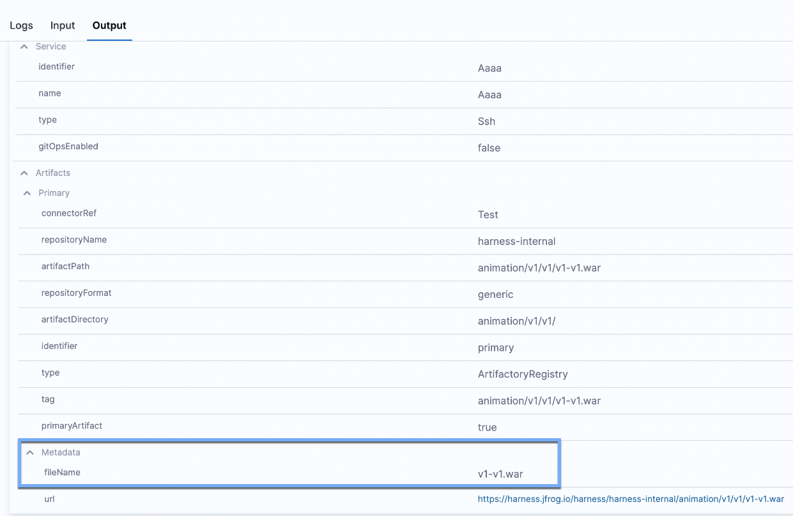
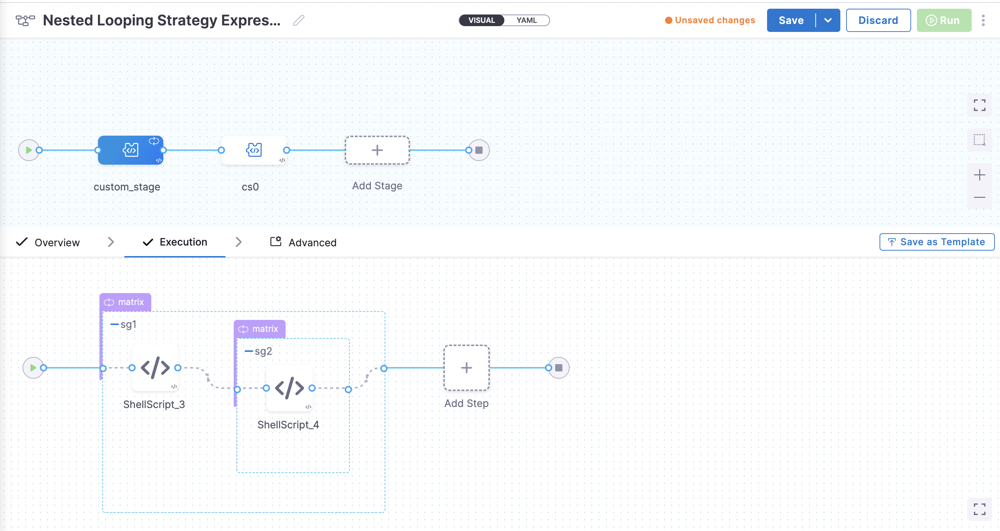

This topic describes default (built-in) and custom Harness expressions, as well as the prefixes used to identify user-created variables. This list will be updated when new expressions are added to Harness.

Looking for how-tos? For more information, go to [Variable Expressions How-tos](/docs/category/variables-and-expressions).

## Variable expression basics

Let's quickly review what Harness built-in and custom variable expressions are and how they work.

### What is a Harness variable expression?

Harness variables are a way to refer to something in Harness, such as an entity name or a configuration setting. At pipeline runtime, Harness evaluates all variable expressions and replaces them with the resulting value.

Harness variables are powerful because they let you template configuration information, pipeline settings, and values in your scripts, and they enable your pipelines to pass information between stages and settings.

When you use a variable, you add it as an expression.

Harness expressions are identified using the `<+...>` syntax. For example, `<+pipeline.name>` references the name of the pipeline where the expression is evaluated.

The content between the `<+...>` delimiters is passed on to the [Java Expression Language (JEXL)](http://commons.apache.org/proper/commons-jexl/) where it is evaluated. Using JEXL, you can build complex variable expressions that use JEXL methods. For example, here is an expression that uses Webhook Trigger payload information:

```
<+trigger.payload.pull_request.diff_url>.contains("triggerNgDemo") || <+trigger.payload.repository.owner.name> == "wings-software"
```
Harness pre-populates many variables, as documented below, and you can set your own variables in the form of context output from [shell scripts](/docs/continuous-delivery/x-platform-cd-features/cd-steps/cd-general-steps/using-shell-scripts) and other steps.

### Java string methods

You can use all Java string methods on Harness variable expressions.

The example mentioned in the previous section used `contains()`:

`<+trigger.payload.pull_request.diff_url>.contains("triggerNgDemo")`

Let's look at another example. For a variable called `abc` with value, `def:ghi`. You can use `split()` like this:

```
echo <+<+pipeline.variables.abc>.split(':')[1]>
```
The output of this expression is `ghi`.

The correct way to use a Java method with a variable is `<+<+expression>.methodName()>`.

For example, let's use a variable `myvar` using the methods `substring` and `indexOf` with value `Hello`. You can use these methods like this: 

`<+<+stage.variables.myvar>.substring(<+<+stage.variables.myvar>.indexOf("e")>)>`

This expression evaluates to `ello`.

### FQNs and expressions

Everything in Harness can be referenced by a Fully Qualified Name (FQN) expression.

The FQN is the path to a setting in the YAML of your pipeline.


You can use the expression in nearly any setting in the pipeline editor.

You don't need to build the expression yourself. Harness provides multiple places where you can copy the variable expression.

For example, you can click the copy button in a pipeline execution to get the expressions of output settings and values.


When building a pipeline in Pipeline Studio, you can copy the FQN of a setting using **Variables**.


### Stage level and pipeline level expressions

You can create variables at the pipeline and stage level and reference them using the FQN expressions within their scope.

Click **Variables** in the pipeline to view all the inputs and copy their expressions.

<docimage path={require('./static/21a3df06a049a40a2787e3f0e929617974284e0afd8a86ebe8890d8a4d9c871d.png')} width="60%" height="60%" title="Click to view full size image" />  

The pipeline and stage level variable expressions follow these formats:

- **Pipeline-level** expressions use the format `<+pipeline.variables.VAR_NAME>`.
- **Stage-level** expressions use these formats:
  - **Use in this stage:** Use this option to reference the input anywhere in its stage. The format is `<+stage.variables.VAR_NAME>`.
  - **Use anywhere in the pipeline:** Use this option to reference the input anywhere in the pipeline. The format is `<+pipeline.stages.STAGE_NAME.VAR_NAME>`.
- **Pipeline-level** variables can be accessed as a collection of key-value pairs using `<+pipeline.variables>`.
- **Stage-level** variables can be accessed as a collection of key-value pairs using `<+stage.variables>`.

### Expression examples

Here is an example of a Shell script step echoing some common variable expressions.

```
echo "Harness account name: "<+account.name>  
  
echo "Harness comp name: "<+account.companyName>  
  
echo "pipeline executionId: "<+pipeline.executionId>  
  
echo "pipeline sequenceId: "<+pipeline.sequenceId>  
  
echo "stage name: "<+stage.name>  
  
echo "service name: "<+service.name>  
  
echo "service variables: "<+serviceVariables.example_var>   
  
echo "artifact image: "<+artifacts.primary.image>  
  
echo "artifact image path: "<+artifacts.primary.imagePath>  
  
echo "environment name: "<+env.name>  
  
echo "infrastructure connectorRef: "<+infra.connectorRef>  
  
echo "infrastructure namespace: "<+infra.namespace>  
  
echo "infrastructure releaseName: "<+infra.releaseName>
```

Here is an example of the output.

```
Harness account name: Harness.io  
  
Harness comp name: Harness.io  
  
pipeline executionId: T4a7uBs7T-qWhNTr-LnFDw  
  
pipeline sequenceId: 16  
  
stage name: dev  
  
service name: nginx  
  
service variables: foo  
  
artifact image: index.docker.io/library/nginx:stable  
  
artifact image path: library/nginx  
  
environment name: quickstart  
  
infrastructure connectorRef: account.harnesstestpmdemocluster  
  
infrastructure namespace: default  
  
infrastructure releaseName: docs  
  
Command completed with ExitCode (0)
```

Here is another example of how to use `<+stage.variables>`.

```
for var in <+stage.variables>;
do

    IFS=":"
    read -r key value <<< "$var"
    unset IFS
    echo "Key: $key"
    echo "Value: $value"

done
```

The above Bash script prints all the key-value pairs for the stage variables.
If the `<+stage.variables>` is `{"a":"A","b":"B","c":"C"}` then the output will be as follows:

```
Executing command ...
Key: a
Value: A
Key: b
Value: B
Key: c
Value: C
Command completed with ExitCode (0)
```

### Input and output variables

You can reference the inputs and outputs of any part of your pipeline.

* **Input variable expressions** reference the values and setting selections you made *in your pipeline*.
* **Output variable expressions** reference *the results* of a pipeline's execution.

#### Input variables in the pipeline

You can copy and reference the input settings for steps using the pipeline **Variables** panel.

<docimage path={require('./static/2d3f480ea623c75e83c074a1e8a6d90d1fb1eccc1d9c3bcda1184179483ef529.png')} width="60%" height="60%" title="Click to view full size image" />  

Input variables follow this format:

- **Stage-level**: `<+execution.steps.STEP_Id.SETTING>`.
- **Pipeline-level**: `<+pipeline.stages.STAGE_Id.spec.execution.steps.STEP_Id.SETTING>`.

:::note

Pipeline and stage custom variable expressions use the *variable name* to reference the variable. The execution step variables use the stage and step *identifier (Id)* in references.

:::

#### Input and output variable expressions in executions

Inputs and outputs are displayed for every part of the pipeline execution.

Here are the inputs and outputs for a Kubernetes rollout deployment step.

| **Inputs** | **Outputs** |
| :--- | :--- |
| <docimage path={require('./static/rolloutdeployment1.png')} width="100%" height="100%" title="Click to view full size image" /> | <docimage path={require('./static/rolloutdeployment3.png')} width="100%" height="100%" title="Click to view full size image" /> |

You can copy the expressions for the names or values of any input or output.

| **Name** | **Value** |
| :--- | :--- |
|  <docimage path={require('./static/name.png')} width="100%" height="100%" title="Click to view full size image" />|<docimage path={require('./static/value.png')} width="100%" height="100%" title="Click to view full size image" />  |

Here are the **Name** and **Value** expressions for the `podIP` setting.

* Name:

  ```
  <+pipeline.stages.k8s_deployment.spec.execution.steps.rolloutDeployment.deploymentInfoOutcome.serverInstanceInfoList[0].podIP>
  ```  
* Value: `10.100.0.6`

### Using expressions in settings

You can use Harness variable expressions in most settings.

When you select the **Expression** option for a setting, you can type `<+` and the list of available variable expressions appears.


Select a variable expression to use it as the value for this setting.

At runtime, Harness will replace the variable with the runtime value.

You can also paste expressions that don't appear. For example, expressions that reference settings in previous stages.

For more information, go to [Fixed Values, Runtime Inputs, and Expressions](../20_References/runtime-inputs.md).

## Expression guidelines and boundaries

Review the following guidelines to avoid errors when using variable expressions.

### Scope

When Harness automatically presents variable expressions in a setting, it only exposes the expressions that can be used in that setting. You will not see a variable expression available in a setting where it cannot be used.

This does not prevent you from trying to use an expression outside of its scope.

Here are some guidelines to help you use expressions successfully:

- Don't refer to a step's expressions within the same step.
- Don't refer to the settings for a subsequent step in a previous step.
- Don't refer to inputs or outputs of a stage's **Execution** tab in the stage's **Service** or **Environment** tabs. 
  - The execution takes place after the service and environment settings are used. Consequently, the expressions used in the execution cannot be resolved when running the service and environment sections.


:::note Exception
You can reference the environment name variable, `<+env.name>`, in a service's Values YAML file, specs, and config files.
:::

### Only use expressions after they can be resolved

When Harness encounters an expression during pipeline execution, it tries to resolve the expression with the information it has at that point in the execution. Consequently, you can use an expression only after Harness has the required information. If you try to use an expression before Harness has its information, it will fail.

In this illustration, you can see how the information in each section of the stage is referenced.

<docimage path={require('./static/harness-variables-20.png')} width="80%" height="80%" title="Click to view full size image" />

Here is how you reference the information in each of these sections.

* **Service expressions** can only be resolved after Harness has progressed through the **Service** section of the pipeline.
	+ Consequently, service expressions can be used in the **Infrastructure** and **Execution** sections.
* **Infrastructure expressions** can only be used after Harness has progressed through the **Infrastructure** section of the pipeline.
	+ In **Infrastructure**, you can reference **Service** settings.
	+ Since **Execution** follows **Infrastructure**, you can reference **Infrastructure** expressions in **Execution**.
* **Execution expressions** apply to steps in **Execution**.
	+ Each step's **Execution** expressions can only be used after Harness has progressed through that step in the **Execution** section:  

<docimage path={require('./static/harness-variables-21.png')} width="80%" height="80%" title="Click to view full size image" />


### Variable expressions in conditional execution settings

Stages and steps support variable expressions in the JEXL conditions of their **Conditional Execution** settings.

You can only use variable expressions in the JEXL conditions that can be resolved before the stage is run.

Conditional execution settings are used to determine if the stage *should be run*, and therefore you cannot use variable expressions that can't be resolved until the stage *is run*.

For more information on conditional execution, go to [Stage and Step Conditional Execution Settings](../8_Pipelines/w_pipeline-steps-reference/step-skip-condition-settings.md).

### Variable value size

A variable value (the evaluated expression) is limited to 256 KB.

### Expressions not allowed in comments of Values YAML or Kustomize patches

You cannot use Harness expressions in comments in:

- Values YAML files (values.yaml) in Kubernetes, Helm chart, or Native Helm deployments.
- Kustomize patches files.

For example, here is a values.yaml file with a Harness expression in the comment:

```yaml
name: test
replicas: 4
image: <+artifacts.primary.image>
dockercfg: <+artifacts.primary.imagePullSecret>
createNamespace: true
namespace: <+infra.namespace>
# using expression <+infra.namespace>
```

This values.yaml file will not process successfully. Remove any expressions from comments and the file will process successfully.


### Scripts within expressions

You cannot write scripts within an expression `<+...>`. For example, the following script will not work.


```
if ((x * 2) == 5) { <+pipeline.name = abc>; } else { <+pipeline.name = def>; }
```
### Variable names across the pipeline

Variable names must be unique within the same stage. You can use same variable names in different stages of the same pipeline or other pipelines, but not within the same stage.

### Hyphens in variable names

Do not use hyphens (dashes) in variable names, as some Linux distributions and deployment-related software do not allow them. Also, hyphens (dashes) in variable names can cause issues with headers.

For example, `<+execution.steps.httpstep.spec.headers.x-auth>` will not work.

As a workaround, you can put the variable name in `["..."]`. For example, `<+execution.steps.httpstep.spec.headers["x-auth"]>`

This also works for nested expressions. For example:

`<+execution.steps.httpstep.spec.newHeaders["x-auth"]["nested-hyphen-key"]>`

`<+execution.steps.httpstep.spec.newHeaders["x-auth"].nonhyphenkey>`

### Variable expression name restrictions

A variable name is the name in the variable expression, such as `foo` in `<+stage.variables.foo>`.

Variable names may only contain `a-z, A-Z, 0-9, _`. They cannot contain hyphens or dots.

Certain platforms and orchestration tools, like Kubernetes, have their own naming restrictions. For example, Kubernetes doesn't allow underscores. Ensure that whatever expressions you use resolve to the allowed values of your target platforms.

### Reserved words

The following keywords are reserved, and cannot be used as a variable name or property.

`or and eq ne lt gt le ge div mod not null true false new var return shellScriptProvisioner class`

For more information, go to [JEXL grammar details](https://people.apache.org/~henrib/jexl-3.0/reference/syntax.html).

### Number variables

Number type variables are always treated as doubles (double-precision floating-point).

* -1.79769313486231E308 to -4.94065645841247E-324 for negative values.
* 4.94065645841247E-324 to 1.79769313486232E308 for positive values.

For example, here is a pipeline variable of number type.


```
  variables:  
    - name: double_example  
      type: Number  
      description: ""  
      value: 10.1
```
The expression to reference that pipeline variable, `<+pipeline.variables.double_example>`, will be treated as a double when it is resolved to `10.1`.

#### Numbers as doubles and strings

Whether the number in a variable is treated as a double or string depends on the field that you use it in.

If you enter `123` in a string setting, such as a **Name**, it is treated as a string. If you enter `123` in a count setting, such as **Instances**, it is treated as a double.

### Contains method

When using `contains`, ensure the expression is wrapped within `<+ >` and the specific string is within `"`.

For example, `<+stage.name.contains("s1")>`.

### Split method

When using `split`, ensure the expression is wrapped within `<+ >`.

For example, `<+pipeline.variables.abc.split(':')[1]>`.

### Complex expression

When using a complex expression, ensure the expression is wrapped within `<+ >`.

For example:

```
<+ <+trigger.payload.pull_request.diff_url.contains("triggerNgDemo")> || <+trigger.payload.repository.owner.name> == "wings-software">
```


### Ternary operators

When using ternary conditional `?:` operators, do not use spaces between the operators and values. Ensure the expression is wrapped within `<+ >`.

For example, `<+condition ? <value_if_true> : <value_if_false>>` will not work. 

Use `<+condition?<value_if_true>:<value_if_false>>` instead.

### Equals operator

When using the `==` operator, ensure the expression is wrapped within `<+ >`.

For example, `<+<+pipeline.name> == "pipeline1">` or `<+<+stage.variables.v1> == "dev">`.

### Variable concatenation

Harness recommends that you use the Java string method for concatenating pipeline variables. Ensure the expression is wrapped within `<+ >`.

For example, instead of `<+pipeline.variable.var1>_suffix`, use these syntaxes:

- `<+pipeline.variables.var1.concat("_suffix")>`
- `<+<+pipeline.variables.var1>.concat("_suffix")>`
- `<+<+pipeline.variables.var1> + "_suffix">` 


## Built-in CIE codebase variables reference

In Harness, you set up your [codebase](/docs/continuous-integration/use-ci/codebase-configuration/create-and-configure-a-codebase.md) by connecting to a Git repo using a Harness [connector](../7_Connectors/Code-Repositories/ref-source-repo-provider/git-connector-settings-reference.md) and cloning the code you wish to build and test in your pipeline.

Harness also retrieves your Git details and presents them in your build stage once a pipeline is run.

Using Harness built-in expressions, you can refer to the various attributes of your codebase in Harness steps and settings.

Here is a simple example of a Shell Script step echoing some common codebase variable expressions.


```
echo <+codebase.commitSha>  
echo <+codebase.targetBranch>  
echo <+codebase.sourceBranch>  
echo <+codebase.prNumber>  
echo <+codebase.prTitle>  
echo <+codebase.commitRef>  
echo <+codebase.repoUrl>  
echo <+codebase.gitUserId>  
echo <+codebase.gitUserEmail>  
echo <+codebase.gitUser>  
echo <+codebase.gitUserAvatar>  
echo <+codebase.pullRequestLink>  
echo <+codebase.pullRequestBody>  
echo <+codebase.state>
```
For more information, go to [Built-in CIE Codebase Variables Reference](/docs/continuous-integration/use-ci/codebase-configuration/built-in-cie-codebase-variables-reference.md).

## Account

### <+account.identifier>

The entity [identifier](../20_References/entity-identifier-reference.md) of the Harness account.


### <+account.name>

Harness account name.

### <+account.companyName>

The name of the company for the account.

### Custom account variables

For more information, go to [Add Account, Org, and Project-level Variables](add-a-variable.md).

## Org

### <+org.identifier>

The entity [identifier](../20_References/entity-identifier-reference.md) of an organization.


### <+org.name>

The name of the org.

### <+org.description>

The description of the org.

### Custom org variables

For more information, go to [Add Account, Org, and Project-level Variables](add-a-variable.md).

## Project

### <+project.name>

The name of the Harness project.

### <+project.description>

The description of the Harness project.

### <+project.tags>

All Harness Tags attached to the project.

### <+project.identifier>

The entity [identifier](../20_References/entity-identifier-reference.md) of the Harness project.

### Custom project variables

For more information, go to [Add Account, Org, and Project-level Variables](add-a-variable.md).

## Pipeline

### Pipeline-level variables

Here is a quick video that explains how to create and reference pipeline, stage, and service variables.

<!-- Video:
https://www.youtube.com/watch?v=lqbmO6EVGuU-->
<docvideo src="https://www.youtube.com/watch?v=lqbmO6EVGuU" />

### <+pipeline.identifier>

The [identifier](../20_References/entity-identifier-reference.md) (Id) for the pipeline.


### <+pipeline.executionId>

Every execution of a pipeline is given a universally unique identifier (UUId). The UUId can be referenced anywhere.

For example, in the following execution URL, the UUId follows `executions` and is `kNHtmOaLTu66f_QNU-wdDw`.


```
https://app.harness.io/ng/#/account/12345678910/cd/orgs/default/projects/CD_Quickstart/pipelines/Helm_Quickstart/executions/kNHtmOaLTu66f_QNU-wdDw/pipeline
```

### <+pipeline.executionUrl>

The execution URL of the pipeline. This is the same URL you see in your browser when you are viewing the pipeline execution.

For example:

```
https://app.harness.io/ng/#/account/12345678910/cd/orgs/default/projects/CD_Docs/pipelines/Triggers/executions/EpE_zuNVQn2FXjhIkyFQ_w/pipeline
```

:::important
The expression <+pipeline.execution.Url> has been deprecated.
:::


### <+pipeline.name>

The name of the current pipeline.


### <+pipeline.sequenceId>

The incremental sequential Id for the execution of a pipeline. A `<+pipeline.executionId>` does not change, but a `<+pipeline.sequenceId>` is incremented with each run of the pipeline.

The first run of a pipeline receives a sequence Id of 1 and each subsequent execution is incremented by 1.

For CD pipelines, the Id is named execution. For CI pipelines, the Id is named builds.


You can use `<+pipeline.sequenceId>` to tag a CI build when you push it to a repository, and then use `<+pipeline.sequenceId>` to pull the same build and tag in a subsequent stage. For examples, go to [Build and test on a Kubernetes cluster build infrastructure tutorial](https://developer.harness.io/tutorials/ci-pipelines/kubernetes-build-farm/) and [Integrating CD with other Harness modules](/docs/continuous-delivery/get-started/integrating-CD-other-modules).

### <+pipeline.startTs>

The start time of a pipeline execution in [Unix Epoch format](https://www.epoch101.com/). For more information, go to [Triggers](/docs/category/triggers).

### <+pipeline.triggerType>

The type of trigger. For more information, go to [Triggers](/docs/category/triggers).

Here are the possible `<+pipeline.triggerType>` and `<+trigger.type>` values.

| **<+pipeline.triggerType>** | **<+trigger.type>** | **Description** |
| :--- | :--- | :--- |
| ARTIFACT | Artifact | New artifact trigger. For example, new Docker Hub image tag |
| SCHEDULER_CRON | Scheduled | Scheduled Cron trigger |
| MANUAL | *null* | Pipeline triggered using the RUN button in the user interface |
| WEBHOOK_CUSTOM | Custom | Custom webhook trigger |
| WEBHOOK | Webhook | SCM webhook trigger. For example, GitHub pull request |

### <+pipeline.triggeredBy.name>

The name of the user or the trigger name if the pipeline is triggered using a webhook. For more information, go to [Trigger Pipelines using Git Events](../11_Triggers/triggering-pipelines.md).

If a user name is not present in the event payload, the `<+pipeline.triggeredBy.name>` expression will resolve as empty. For example, in the SaaS edition of Bitbucket, a user name is not present.

### <+pipeline.triggeredBy.email>

The email of the user who triggered the pipeline. This returns NULL if the pipeline is triggered using a webhook. For more information, go to [Trigger How-tos](/docs/category/triggers).

### <+pipeline.selectedStages>

The list of stages selected for execution. 

### <+pipeline.delegateSelectors>

The pipeline level delegate selectors selected via runtime input.  

## Deployment, pipeline, stage, and step status

Deployment status values are a Java enum. The list of values can be seen in the deployments **Status** filter:


You can use any status value in a JEXL condition. For example, `<+pipeline.stages.stage1.status> == "FAILED"`.

#### Stage status

The expression `<+pipeline.stages.STAGE_ID.status>` resolves to the status of a stage.

You must use the expression after the stage in execution.

#### Step status

The expression `<+pipeline.stages.STAGE_ID.spec.execution.steps.STEP_ID.status>` resolves to the status of a step. For example, `<+pipeline.stages.MyStageName.spec.execution.steps.mystep.status>`.

You must use the expression after the step in execution.

## InputSet

Displays the Input Set values for the execution as a JSON value. The list of values can be searched via `<+inputSet>`.

Here's an example where the **Timeout** settings for the two steps preceding the step using `<+inputSet>` are using values from an Input Set:

```
{pipeline:identifier:Custom} {pipeline:stages:[{stage:identifier:Custom}]} {pipeline:stages:[{stage:type:Custom}]} {pipeline:stages:[{stage:spec:{execution:steps:[{step:identifier:ShellScript_1}}}]} {pipeline:stages:[{stage:spec:{execution:steps:[{step:type:ShellScript}}}]} {pipeline:stages:[{stage:spec:{execution:steps:[{step:timeout:10s}}}]} {pipeline:stages:[{stage:spec:{execution:{step:identifier:json_format}]}}]} {pipeline:stages:[{stage:spec:{execution:{step:type:ShellScript}]}}]} {pipeline:stages:[{stage:spec:{execution:{step:timeout:10m}]}}]}
```

## Stage

The following variables provide information on the pipeline stage.

### Stage-level variables

Here is a quick video that explains how to create and reference pipeline, stage, and service variables.

<!-- Video:
https://www.youtube.com/watch?v=lqbmO6EVGuU-->
<docvideo src="https://www.youtube.com/watch?v=lqbmO6EVGuU" />

Once you've created a stage, its settings are in the **Overview** tab. For example, here is the **Overview** tab for a deploy stage.


In **Advanced**, you can add **Stage Variables**.

Stage variables are custom variables you can add and reference in your stage and pipeline. They're available across the pipeline. You can override their values in later stages.

You can even reference stage variables in the files fetched at runtime.

For example, you could create a stage variable `name` and then reference its identifier in the Kubernetes values.yaml file used by this stage: `name: <+stage.variables.name>`:


```
name: <+stage.variables.name>  
replicas: 2  
  
image: <+artifacts.primary.image>  
...
```
When you run this pipeline, the value for `name` is used for the values.yaml file. The value can be a fixed value, expression, or runtime input.

You reference stage variables **within their stage** using the expression `<+stage.variables.VARIABLE_NAME>`.

You reference stage variables **outside their stage** using the expression `<+pipeline.stages.STAGE_NAME.variables.VARIABLE_NAME>`.

### <+stage.name>

The name of the stage where the expression is evaluated.


### <+stage.description>

The description of the stage where the expression is evaluated.

### <+stage.tags>

The tags on the stage where the expression is evaluated. For more information, go to [Tags Reference](../20_References/tags-reference.md).

These tags are different from Docker image tags.

### <+stage.identifier>

The [entity identifier](../20_References/entity-identifier-reference.md) of the stage where the expression is evaluated.

### <+stage.output.hosts>

Lists all of the target hosts when deploying to multiple hosts.

When you are deploying to multiple hosts, such as with an SSH, WinRM, or deployment template stage, you can run the same step on all of the target hosts.

To run the step on all hosts, you use the repeat [Looping Strategy](../8_Pipelines/looping-strategies-matrix-repeat-and-parallelism.md) and identify all the hosts for the stage as the target.


```
repeat:  
  items: <+stage.output.hosts>
```
Here is an example with a Shell script step.


For examples, see the looping strategies used in the [Secure Shell (SSH) deployments](/docs/continuous-delivery/deploy-srv-diff-platforms/traditional/ssh-ng).

### <+stage.executionUrl>

The execution URL of the stage. This is the same URL you see in your browser when you are viewing the pipeline execution.

Use the following fully qualified expression to get the execution URL for a specific stage in the pipeline: 

```
<+pipeline.stages.STAGE_ID.executionUrl>

```

### <+stage.delegateSelectors>

The stage level delegate selectors selected via runtime input

## Service

Currently, there are two versions of services and environments, v1 and v2. Services and environments v1 are being replaced by services and environments v2.

The use of variable expressions is different between v1 and v2.

For more information, go to [Services and Environments Overview](/docs/continuous-delivery/get-started/services-and-environments-overview).

### Service-level variables for service v2

To reference a service variable, use the expression `<+serviceVariables.VARIABLE_NAME>`.

For example, `<+serviceVariables.myvar>`.

### Service-level variables for service v1

Here is a quick video that explains how to create and reference pipeline, stage, and service variables.


<!-- Video:
https://www.youtube.com/watch?v=lqbmO6EVGuU-->
<docvideo src="https://www.youtube.com/watch?v=lqbmO6EVGuU" />

### <+serviceConfig.serviceDefinition.spec.variables.VAR\_NAME>

The value of the service-level variable in `VAR_NAME`.


Use expression anywhere after the service step in the pipeline.

To reference the variables, click the copy button.


There are two options:

* **Copy variable name:** use this option if you will only be referencing this variable in the current stage. Expression:
	+ `<+serviceConfig.serviceDefinition.spec.variables.NAME>`
* **Copy fully qualified name:** use this option if you will be referencing this variable in another stage. Example:
	+ `<+pipeline.stages.STAGE_NAME.spec.serviceConfig.serviceDefinition.spec.variables.NAME>`

You can use these expressions in any setting in your pipeline. Select the expression option and enter the expression.


To override the service variable in a script, reference its name and use a new value.

### <+service.name>

The name of the service where the expression is evaluated.


### <+service.description>

The description of the service where the expression is evaluated.

### <+service.tags>

The tags on the service where the expression is evaluated.

To reference a specific tag use `<+service.tags.TAG_KEY>`.

### <+service.identifier>

The [entity identifier](../20_References/entity-identifier-reference.md) of the service where the expression is evaluated.

### <+service.type>

Resolves to stage service type, such as Kubernetes.


### <+service.gitOpsEnabled>

Resolves to a boolean value to indicate whether the GitOps option is enabled (true) or not (false).


For details on using the GitOps option, go to [Harness GitOps ApplicationSet and PR Pipeline Tutorial](/docs/continuous-delivery/gitops/harness-cd-git-ops-quickstart).

## Manifest

There are generic and deployment type-specific expressions for manifests.

Manifest settings are referenced by **Id**.

You can always determine the expressions you can use by looking at the service YAML.

For example, the expression `<+manifests.mymanifest.valuesPaths>` can be created by using the manifest Id and the `valuesPaths` key in the YAML.


```
...  
      manifests:  
        - manifest:  
            identifier: mymanifest  
            type: K8sManifest  
            spec:  
              store:  
                type: Harness  
                spec:  
                  files:  
                    - account:/Templates  
              valuesPaths:  
                - account:/values.yaml  
              skipResourceVersioning: false  
...
```
Let's look at a few generic manifest expressions.

### <+manifests.MANIFEST_ID.identifier>

Resolves to the manifest Id in Harness.


```
...  
      manifests:  
        - manifest:  
            identifier: mymanifest  
...
```
### <+manifests.MANIFEST_ID.type>

Resolves to the manifest type. For example, `K8sManifest`.


```
...  
      manifests:  
        - manifest:  
            identifier: mymanifest  
            type: K8sManifest  
...
```
### <+manifests.MANIFEST_ID.store>

Resolves to where the manifest is stored. For example, this manifest is stored in the [Harness File Store](/docs/continuous-delivery/x-platform-cd-features/services/add-inline-manifests-using-file-store).


```
...  
      manifests:  
        - manifest:  
            identifier: mymanifest  
            type: K8sManifest  
            spec:  
              store:  
                type: Harness  
                spec:  
                  files:  
                    - account:/Templates  
...
```
### <+manifest.MANIFEST_ID.commitId>

The commit Id of the manifests used in a service. This is captured in the [output section](#input-and-output-variable-expressions-in-executions) of a deployment step.

You can copy the expressions for the Id and value of `commitId`.

For example:

Name: `<+pipeline.stages.satr.spec.execution.steps.rolloutDeployment.output.manifest.values.commitId>`

Value: `8d30fc49e6ed13155590b7d8c16931cd1a7b5bac`

## Artifact

In order to use an artifact expression, you must select an artifact in the service definition of the Harness service you are deploying.

If you have not selected an artifact, you will be prompted to select an artifact at runtime. If the artifact in the service definition is a runtime input, you will be prompted also.

This is true even if the stage does not deploy an artifact, such as a custom stage. 

For example, here is how the common artifact expressions resolve for a Kubernetes deployment with a Docker image on Docker Hub:

* **<+artifacts.primary.tag>:** `stable`
* **<+artifacts.primary.image>:** `index.docker.io/library/nginx:stable`
* **<+artifacts.primary.imagePath>:** `library/nginx`
* **<+artifacts.primary.imagePullSecret>:** `****`
* **<+artifacts.primary.dockerConfigJsonSecret>:** `****`
* **<+artifacts.primary.type>:** `DockerRegistry`
* **<+artifacts.primary.connectorRef>:** `DockerHub`


<details>
<summary>Example output for all artifact expressions</summary>

Here's an example where we use a Shell Script step to echo all the artifact expressions.

```
echo "artifacts.primary.image: "<+artifacts.primary.image>
echo "artifacts.primary.connectorRef: "<+artifacts.primary.connectorRef>
echo "artifacts.primary.digest: "<+artifacts.primary.digest>
echo "artifacts.primary.identifier: "<+artifacts.primary.identifier>
echo "artifacts.primary.imagePath: "<+artifacts.primary.imagePath>
echo "artifacts.primary.imagePullSecret: "<+artifacts.primary.imagePullSecret>
echo "artifacts.primary.label: "<+artifacts.primary.label>
echo "artifacts.primary.metadata: "<+artifacts.primary.metadata>
echo "artifacts.primary.primaryArtifact: "<+artifacts.primary.primaryArtifact>
echo "artifacts.primary.tag: "<+artifacts.primary.tag>
echo "artifacts.primary.type: "<+artifacts.primary.type>
```

Here's the output:

```
Executing command ...
artifacts.primary.image: index.docker.io/johndoe/tweetapp:21
artifacts.primary.connectorRef: Docker_Hub_with_Pwd
artifacts.primary.digest: null
artifacts.primary.identifier: primary
artifacts.primary.imagePath: johndoe/tweetapp
artifacts.primary.imagePullSecret: 123abc
artifacts.primary.metadata: {image=index.docker.io/johndoe/tweetapp:21, tag=21}
artifacts.primary.primaryArtifact: true
artifacts.primary.tag: 21
artifacts.primary.type: DockerRegistry
Command completed with ExitCode (0)
```

</details>


### <+artifacts.primary.tag>

Not Harness tags. This expression evaluates to the tags on the artifact pushed, pulled, or deployed. For example, AMI tags. If you are deploying the Docker image `nginx:stable-perl`, the tag would be `stable-perl`.

### <+artifacts.primary.image>

The full location to the Docker image. For example, `docker.io/bitnami/nginx:1.22.0-debian-11-r0`.

For non-containerized artifacts, use `<+artifacts.primary.path>`, described [below](#artifact_path).  To see just the image name, use `<+artifacts.primary.imagePath>`.

Use `<+artifacts.primary.image>` or `<+artifacts.primary.imagePath>` in your values YAML file when you want to deploy an artifact you have added to the **Artifacts** section of a CD stage service definition.

For example, here is the **Artifacts** section with an artifact:


Here is the Values YAML file referencing the artifact in **Artifacts**:


```
name: example  
replicas: 2  
  
image: <+artifacts.primary.image>  
# dockercfg: <+artifacts.primary.imagePullSecret>  
  
createNamespace: true  
namespace: <+infra.namespace>  
  
...
```
For more information, go to [Example Kubernetes Manifests using Go Templating](/docs/continuous-delivery/deploy-srv-diff-platforms/kubernetes/cd-k8s-ref/example-kubernetes-manifests-using-go-templating).

### <+artifacts.primary.path>

The full path to the non-containerized artifact. This expression is used in non-containerized deployments.

### <+artifacts.primary.filePath>

The file name of the non-containerized artifact. This expression is used in non-containerized deployments. For example, a ZIP file in AWS S3.

### <+artifacts.primary.imagePath>

The image name, such as `nginx`. To see the entire image location use `<+artifacts.primary.image>`.

### <+artifacts.primary.imagePullSecret>

If some cases, your Kubernetes cluster might not have the permissions needed to access a private Docker registry. For these cases, the values.yaml or manifest file in service definition **Manifests** section must use the `dockercfg` parameter.

If the Docker image is added in the service definition **Artifacts** section, you can reference it as `dockercfg: <+artifacts.primary.imagePullSecret>`.

values.yaml:


```
name: <+stage.variables.name>  
replicas: 2  
  
image: <+artifacts.primary.image>  
dockercfg: <+artifacts.primary.imagePullSecret>  
  
createNamespace: true  
namespace: <+infra.namespace>  
...
```
Go to [Pull an Image from a Private Registry for Kubernetes](/docs/continuous-delivery/deploy-srv-diff-platforms/kubernetes/cd-kubernetes-category/pull-an-image-from-a-private-registry-for-kubernetes) for more information.

### <+artifacts.primary.dockerConfigJsonSecret>

In some cases, your Kubernetes cluster might not have the permissions needed to access a private Docker registry. For such cases, the values.yaml or manifest files in the service definition **Manifests** section must use the `dockerconfigjson` parameter.

If the Docker image is added in the service definition **Artifacts** section, you can reference it as `dockerconfigjson: <+artifact.dockerConfigJsonSecret>`.

Here is a sample values.yaml:

```
name: <+stage.variables.name>  
replicas: 2  
  
image: <+artifacts.primary.image>  
dockerconfigjson: <+artifacts.primary.dockerConfigJsonSecret>
  
createNamespace: true  
namespace: <+infra.namespace>  
...
```

For more information, go to [Pull an Image from a Private Registry for Kubernetes](/docs/continuous-delivery/deploy-srv-diff-platforms/kubernetes/cd-kubernetes-category/pull-an-image-from-a-private-registry-for-kubernetes).

### <+artifacts.primary.type>

The type of repository used to add this artifact in the service **Artifacts**. For example, Docker Hub, ECR, or GCR.

### <+artifacts.primary.connectorRef>

The [entity identifier](../20_References/entity-identifier-reference.md) for the connector used to connect to the artifact repository.


### <+artifacts.primary.label.get("")>

This expression resolves to the Docker labels of a Docker image.

For example, here are the labels for a Docker image:

* `maintainer=dev@someproject.org`
* `build_date=2017-09-05`
* `multi.author=John Doe`
* `key-value=xyz`
* `multi.key.value=abc`

In a Harness Shell script step or any setting where you want use the labels, you can reference them.


```
echo <+artifacts.primary.label.get("maintainer")>  
echo <+artifacts.primary.label.get("build_date")>  
echo <+artifacts.primary.label.get("multi.author")>  
echo <+artifacts.primary.label.get("key-value")>  
echo <+artifacts.primary.label.get("multi.key.value")>
```
When you run the pipeline, the expressions will resolve to their respective label values.


### <+artifacts.primary.metadata.SHA> or <+artifacts.primary.metadata.SHAV2>

Digest/SHA256 hash of the Docker image.
	
Since Docker image manifest API supports two schema versions, schemaVersion1 and schemaVersion2, there could be SHA values corresponding to each version.

Here are the expressions for referencing each version:

SHA value of schemaVersion1: `<+artifacts.primary.metadata.SHA>`

SHA value of schemaVersion2: `<+artifacts.primary.metadata.SHAV2>`

### <+artifact.primary.identifier>

The Id of the Primary artifact added in a Service **Artifacts** section.


### <+artifact.metadata.fileName>

The file name of the Artifactory artifact. 

This variable is added to the metadata of the Artifactory artifacts with generic repository format. You can view this variable in the **Output** tab of the **Service** step of a pipeline execution.



### Sidecar artifacts

Sidecar artifact expressions use the **Sidecar Identifier** to reference the sidecar artifact.


The sidecar identifier is set when you add the sidecar artifact. You can see it in the artifact listing.


Here are the sidecar expressions:

* `<+artifacts.sidecars.SIDECAR_IDENTIFIER.imagePath>`
* `<+artifacts.sidecars.SIDECAR_IDENTIFIER.image>`
* `<+artifacts.sidecars.SIDECAR_IDENTIFIER.type>`
* `<+artifacts.sidecars.SIDECAR_IDENTIFIER.tag>`
* `<+artifacts.sidecars.SIDECAR_IDENTIFIER.connectorRef>`

## Environment

### Environment-level variables for service v2

Currently, there are two versions of services and environments, v1 and v2. Services and environments v1 are being replaced by services and environments v2.

The use of variable expressions is different between v1 and v2.

For more information, go to [Services and Environments Overview](/docs/continuous-delivery/get-started/services-and-environments-overview).

To reference an environment-level variable, use the expression `<+env.variables.variableName>`.

For example, to reference an environment variable named `envvar`, use the following expression:

`<+env.variables.envvar>`


### <+env.name>

The name of the stage environment.


### <+env.identifier>

The [entity identifier](../20_References/entity-identifier-reference.md) of the stage's environment.

### <+env.description>

The description of the environment.

### <+env.type>

The environment type, such as `Production` or `PreProduction`.

The available values are:
- `PreProduction`
- `Production`

### <+env.envGroupName>

The name of the environment group to which the environment belongs (if defined). This expression resolves only if the deployment is done to an environment group.

### <+env.envGroupRef>

The environment group reference. This expression resolves only if the deployment is done to an environment group.

You can evaluate the expression using JEXL in the **Conditional Execution** settings of steps or stages:

```
<+env.type> != "Production"
```

:::note

Environment expressions can be used in service steps as well.

:::

## Infrastructure

The following expressions provide information about the pipeline infrastructure settings. The infrastructure in a pipeline is the **Infrastructure Definition** in the Harness environment used in the CD stage's **Environment** section.

### <+infra.name>

The name of the infrastructure definition used in the pipeline stage.


### <+infra.connectorRef>

The Id of the connector used in the infrastructure definition.

### <+infra.connector.name>

The name of the connector used in the infrastructure definition.

### <+INFRA\_KEY>

:::note

This expression is `<+INFRA_KEY>` exactly. `INFRA_KEY` is not a placeholder.

:::

The infrastructure key. The key is a unique string that identifies a deployment target infrastructure. It is typically used in the **Release Name** setting to add labels to release for tracking.

For example, in the infrastructure definition of a deploy stage, the `<+INFRA_KEY>` is used in the **Release Name** to give the release a unique name.


When you deploy, Harness adds the release name as a label. For example, in a Kubernetes deployment you can see `harness.io/release-name=release-2f9eadcc06e2c2225265ab3cbb1160bc5eacfd4f`.


```
...  
Pod Template:  
  Labels:  app=hello  
           deployment=hello  
           harness.io/release-name=release-2f9eadcc06e2c2225265ab3cbb1160bc5eacfd4f  
  Containers:  
   the-container:  
    Image:      monopole/hello:1  
...
```
Harness can now track the release for comparisons and rollback.

### <+infra.namespace>

The namespace used in the infrastructure definition.

### <+infra.releaseName>

The release name used in the infrastructure definition.

## Step

The following instance expressions are for stage steps.

### <+step.name>

The step name.

### <+step.identifier>

The step [identifier](https://developer.harness.io/docs/platform/references/entity-identifier-reference/).

### <+step.executionUrl>

The execution URL of the step. This is the same URL you see in your browser when you are viewing the pipeline execution.

Use the following fully qualified expression to get the execution URL for a specific step in the pipeline: 

```
<+pipeline.stages.STAGE_ID.spec.execution.steps.STEP_ID.executionUrl>
```


## Instances

The following instance expressions are supported in SSH, WinRM, and custom deployments using deployment templates. These deployments can be done on physical data centers, AWS, and Azure.

For details on these deployment types, go to [Secure Shell (SSH) deployments](/docs/continuous-delivery/deploy-srv-diff-platforms/traditional/ssh-ng), [WinRM deployments](/docs/continuous-delivery/deploy-srv-diff-platforms/traditional/win-rm-tutorial), and [Custom deployments using Deployment Templates](/docs/continuous-delivery/deploy-srv-diff-platforms/custom-deployment-tutorial).

To use these instance expressions in a step, you must use the repeat [Looping Strategy](../8_Pipelines/looping-strategies-matrix-repeat-and-parallelism.md) and identify all the hosts for the stage as the target.

```
repeat:  
  items: <+stage.output.hosts>
```


For examples, see [Run a script on multiple target instances](/docs/continuous-delivery/x-platform-cd-features/cd-steps/cd-general-steps/run-a-script-on-multiple-target-instances).

For Microsoft Azure, AWS, or any platform-agnostic Physical Data Center (PDC):

* `​<+instance.hostName>​`
* `​<+instance.host.instanceName>`
* `​<+instance.name>`

For Microsoft Azure or AWS:

* `​<+instance.host.privateIp>​`
* `​<+instance.host.publicIp>`

### Deployment templates

For [Deployment Templates](/docs/continuous-delivery/deploy-srv-diff-platforms/custom-deployment-tutorial), you can use `<+instance...>` expressions to reference host(s) properties.

The `<+instance...>` expressions refer to the **Instance Attributes** in the deployment template:


The following expressions refer to instance(s) collected by the mandatory **instancename** field.

* `​<+instance.hostName>​`
* `​<+instance.host.instanceName>`
* `​<+instance.name>`

The expression `<+instance.host.properties.PROPERTY_NAME>` can used to reference the other properties you added to **Instance Attributes**.

For example, in the example above you can see the `artifact` field name mapped to the `artifactBuildNo` property.

To reference `artifact` you would use `<+instance.host.properties.artifact>`.

`instance.name` has the same value as `instance.hostName`. Both are available for backward compatibility.
### <+instance.hostName>

The host/container/pod name where the microservice/application is deployed.

If you use this variable in a pipeline, such as in a Shell script step, Harness will apply the script to all target instances. You do not have to loop through instances in your script.

### ​<+instance.host.instanceName>

The same as `<+instance.hostName>`. 

### <+instance.name>

The name of the instance on which the service is deployed.

If you use this variable in a pipeline, such as in a Shell script step, Harness will apply the script to all target instances. You do not have to loop through instances in your script.

### <+instance.host.privateIp>

The private IP of the host where the service is deployed.

If you use this variable in a pipeline, such as in a Shell script step, Harness will apply the script to all target instances. You do not have to loop through instances in your script.

### <+instance.host.publicIp>

The public IP of the host where the service is deployed.

If you use this variable in a pipeline, such as in a Shell script step, Harness will apply the script to all target instances. You do not have to loop through instances in your script.

## Strategy

You can use Harness expressions to retrieve the current execution status of the [looping strategy](https://developer.harness.io/docs/platform/pipelines/looping-strategies-matrix-repeat-and-parallelism/) for nodes (stages/steps) using a matrix or repeat strategy.
  
The statuses of the nodes (stages/steps) using a looping strategy are `RUNNING`, `FAILED`, `SUCCESS`.

Harness provides the following expressions to retrieve the current status of the node (stage/step) using a looping strategy. The expressions are available in pipelines during execution and rollback.

### <+strategy.currentStatus>

The current status of the looping strategy for the node with maximum depth.

When this expression is used in a step, Harness will resolve it to the looping strategy current status of the first parent node (stage/step) of the step.

In cases where both the step and the stage have the looping strategy configured, the expression will resolve to the looping strategy status of the current step.

If the step (or step group) does not have the looping strategy configured, the expression will instead resolve to the looping strategy status of the  current stage.

### <+strategy.node.STRATEGY_NODE_IDENTIFIER.currentStatus>

The current status of the looping strategy for the node with a specific stage/step identifier, `STRATEGY_NODE_IDENTIFIER`.

For example, `echo <+strategy.node.cs1.currentStatus>`.

### <+strategy.node.get("STRATEGY_NODE_IDENTIFIER").currentStatus>

The current status of the looping strategy for the node with a specific stage/step identifier, `STRATEGY_NODE_IDENTIFIER`.

For example, `echo <+strategy.node.get("ShellScript_1").currentStatus>`.

### identifierPostFix overview

When you use a looping strategy like matrix or parallelism on a stage/step/step group, Harness automatically generates the unique Ids of the child stages/steps/step groups created by the looping operation.

The `identifierPostFix` is a postfix added to the identifiers of nodes (stage/step/step group) during execution when the node is a child of the looping strategy. This ensures that all children of the looping strategy have unique identifiers.

For example, here is a matrix strategy for a stage:

```
strategy:
  matrix:
    repo:
      - docker
      - gcr
      - ecr
```

The above matrix will spawn 3 stages by picking `repo` values `docker`, `gcr`, and `ecr`.

The `identifierPostfix` values would be `_docker`, `_gcr`, and `_ecr` for the different combinations of each stage run.

Let's look at an example for parallelism:

```
strategy:
  parallelism: 4
```

The above strategy will spawn 4 stages/steps and the `identifierPostfix` values will be `_0`, `_1`, `_2`, and `_3`.


### <+strategy.identifierPostFix>

This expression retrieves the `identifierPostFix` of the current node or any parent node that is a child of the looping strategy.

When used in a step, Harness resolves `<+strategy.identifierPostFix>` to the `identifierPostFix` of the child node belonging to the first looping strategy parent node (either stage or step).

If both the step and stage have the looping strategy configured, the expression resolves to the `identifierPostFix` of the step.

If the step (or stepGroup) does not have the looping strategy configured, the expression resolves to the `identifierPostFix` of the stage.

Let's look at an example using the execution of a stage with the identifier `build_and_upload` and matrix looping strategy.

Multiple child stages will be created from the `build_and_upload` stage. These child stages will have identifiers with the postfix appended, such as `build_and_upload_0`, `build_and_upload_docker`, etc. In this scenario, using the expression `<+strategy.identifierPostFix>` will result in value `_0` or `_docker`.

### <+step.identifierPostFix>

This expression returns the `identifierPostFix` of the current step when the step is a child of a looping strategy.

### <+stage.identifierPostFix>

This expression retrieves the `identifierPostFix` of the stage when the current node's stage is a child of a looping strategy.

### <+stepGroup.identifierPostFix>

This expression returns the `identifierPostFix` of the step group when the current node is under the step group, or when the current node is the step group itself, and that step group is a child of a looping strategy.

### <+strategy.node.STRATEGY_NODE_IDENTIFIER.identifierPostFix>

This expression retrieves the `identifierPostFix` for the node that is the child of a looping strategy with the identifier `STRATEGY_NODE_IDENTIFIER`.
For example, let's consider two nested step groups, sg1 and sg2 (child of sg1). Both sg1 and sg2 have a looping strategy configured. The expression, `<+stepGroup.identifierPostFix>` always retrieves the `identifierPostFix` of sg2. 

Use the following expressions to obtain the `identifierPostFix` for a specific step group:

* `<+strategy.node.sg1.identifierPostFix>`: Retrieves the `identifierPostFix` for the node with the identifier sg1 (parent step group).
* `<+strategy.node.sg2.identifierPostFix>`: Retrieves the `identifierPostFix` for the node with the identifier sg2 (child step group).



Similarly, you can use other strategy expressions for any specific strategy level if a looping strategy is configured for both the parent and child nodes.

### <+strategy.node.STRATEGY_NODE_IDENTIFIER.*>

Using this format, you can retrieve the values of any strategy expressions associated with looping strategies at various levels. This is useful when looping strategies are configured within nested levels. 

Here are some examples:
* `<+strategy.node.sg1.iteration>`: Retrieves the current iteration of the node with the identifier sg1 (parent step group).
* `<+strategy.node.sg2.iteration>`: Retrieves the current iteration of the node with the identifier sg2 (child step group).
* `<+strategy.node.some_node_with_looping_strategy.iteration>`: Retrieves the current the iteration of the node with identifier `some_node_with_looping_strategy` (`some_node_with_looping_strategy` can be any type of node stage, step, or step group).
* `<+strategy.node.sg1.iterations>`: Retrieves the total iterations of the node with the identifier sg1.
* `<+strategy.node.sg2.iterations>`: Retrieves the total iterations of the node with the identifier sg2.
* `<+strategy.node.some_node_with_looping_strategy.iterations>`: Retrieves the total iterations of the node with the identifier `some_node_with_looping_strategy`.
* `<+strategy.node.sg1.matrix.key1>`: Retrieves the value for the matrix axis key1 for the node with the identifier sg1 if a matrix looping strategy is configured for sg1.
* `<+strategy.node.sg2.matrix.key1>`: Retrieves the value for the matrix axis key1 for the node with the identifier sg2 if a matrix looping strategy is configured for sg2.
* `<+strategy.node.some_node_with_looping_strategy.matrix.key1>`: Retrieves the value for the matrix axis key1 for the node with the identifier `some_node_with_looping_strategy` if a matrix looping strategy is configured for `some_node_with_looping_strategy`.


## Triggers

### <+trigger.artifact.build>

Resolves to the artifact version (such as a Docker Tag) that initiated an [On New Artifact Trigger](../11_Triggers/trigger-on-a-new-artifact.md).

When you add a new artifact trigger, you select the artifact to listen on, and its **Tag** setting is automatically populated with `<+trigger.artifact.build>`.


The `<+trigger.artifact.build>` used for **Tag** makes sure that the new artifact version that executed the trigger is used for the deployment.

Adding a new tag to the artifact fires the trigger and executes the pipeline. Harness resolves `<+trigger.artifact.build>` to the tag that fired the trigger. This makes sure that the new tag is used when pulling the artifact and the new artifact version is deployed.

### Git trigger and payload expressions

Harness includes built-in expressions for referencing trigger details such as a PR number.

For example:

* `<+trigger.type>`
	+ Webhook.
* `<+trigger.sourceRepo>`
	+ Github, Gitlab, Bitbucket, Custom
* `<+trigger.event>`
	+ PR, PUSH, etc.

For a complete list, see [Triggers Reference](../8_Pipelines/w_pipeline-steps-reference/triggers-reference.md).

### Triggers and RBAC

Harness RBAC is applied to triggers in Harness, but it is not applied to the repositories used by the triggers.

For example, you might have an [On New Artifact Trigger](../11_Triggers/trigger-on-a-new-artifact.md) that is started when a new artifact is added to the artifact repo. Or a [Webhook Trigger](../11_Triggers/triggering-pipelines.md) that is started when a PR is merged.

You can select who can create and use these triggers within Harness. However, you must use your repository's RBAC to control who can add the artifacts or initiate events that start the Harness trigger.

## Kubernetes

### ${HARNESS\_KUBE\_CONFIG\_PATH}

The path to a Harness-generated kubeconfig file containing the credentials you provided to Harness. The credentials can be used by kubectl commands by exporting its value to the KUBECONFIG environment variable.

Harness only generates this kubeconfig file when a delegate is outside of the target cluster and is making a remote connection. When you set up the Kubernetes cluster connector to connect to the cluster, you select the **Specify master URL and credentials** option. The master URL and credentials you supply in the connector are put in the kubeconfig file and used by the remote delegate to connect to the target cluster.

Consequently, you can only use `${HARNESS_KUBE_CONFIG_PATH}` when you are using a delegate outside the target cluster and a Kubernetes cluster connector with the **Specify master URL and credentials** option.

If you are running the script using an in-cluster delegate with the **Use the credentials of a specific Harness Delegate** credentials option, then there are no credentials to store in a kubeconfig file since the Delegate is already an in-cluster process.

You can use this variable in a [Shell script](/docs/continuous-delivery/x-platform-cd-features/cd-steps/cd-general-steps/using-shell-scripts) step to set the environment variable at the beginning of your kubectl script:

`export KUBECONFIG=${HARNESS_KUBE_CONFIG_PATH}`

For example:


```
export KUBECONFIG=${HARNESS_KUBE_CONFIG_PATH} kubectl get pods -n default
```
The `${HARNESS_KUBE_CONFIG_PATH}` expression can be used in scripts in Shell script steps. It cannot be used in other scripts such as a Terraform script.

### kubernetes.release.revision

Harness expression for the deployment revision number.

You can use the expression `<+kubernetes.release.revision>` in values.yaml, OpenShift Params, and Kustomize Patches. 

This will help you to:
  - Reference the current Harness release number as part of your manifest.
  - Reference versioned ConfigMaps and Secrets in custom resources and fields unknown by Harness.

**Important:** Users must update their delegate to version 1.0.79100 to use this expression.

## Tag expressions

You can reference tags using Harness expressions.

You simply reference the tagged entity and then use `tags.TAG_NAME`, like `<+pipeline.tags.docs>`

For example, here are several different references:

* `<+pipeline.tags.TAG_NAME>`
* `<+stage.tags.TAG_NAME>`
* `<+pipeline.stages.STAGE_ID.tags.TAG_NAME>`
* `<+serviceConfig.service.tags.TAG_NAME>`

## Migrating FirstGen expressions to NextGen

When migrating Harness FirstGen expressions to Harness NextGen, review the following table.

:::note

All FirstGen expressions use the `${...}` format. For example, `${approvedBy.name}`. In NextGen, this has been replaced by `<+...>`. For example, `<+approvedBy.name>`.

:::

| FirstGen                                                              | Next Gen                                                                                                                                                                                                                                                                             |
| --------------------------------------------------------------------- | ------------------------------------------------------------------------------------------------------------------------------------------------------------------------------------------------------------------------------------------------------------------------------------ |
| **Approvals**                                                             | **Approvals**                                                                                                                                                                                                                                                                            |
| approvedBy.name                                                       | pipeline.stages.STAGE_ID.spec.execution.steps.HarnessApproval.output.approvalActivities[0].user.name                                                                                                                                                                                    |
| approvedBy.email                                                      | pipeline.stages.STAGE_ID.spec.execution.steps.HarnessApproval.output.approvalActivities[0].user.email                                                                                                                                                                                   |
| **HTTP Step**                                                             | **HTTP Step**                                                                                                                                                                                                                                                                            |
| httpResponseCode                                                      | httpResponseCode                                                                                                                                                                                                                                                                     |
| httpResponseBody                                                      | httpResponseBody                                                                                                                                                                                                                                                                     |
| httpMethod                                                            | httpMethod                                                                                                                                                                                                                                                                           |
| httpUrl                                                               | httpUrl                                                                                                                                                                                                                                                                              |
| httpResponseMethod                                                    | pipeline.stages.HTTP.spec.execution.steps.STEP_ID.output.httpMethod                                                                                                                                                                                                                     |
| httpResponseCode                                                      | pipeline.stages.HTTP.spec.execution.steps.STEP_ID.output.httpResponseCode                                                                                                                                                                                                               |
| httpResponseBody                                                      | pipeline.stages.HTTP.spec.execution.steps.STEP_ID.output.httpResponseBody                                                                                                                                                                                                               |
| **Artifacts**                                                             | **Artifacts**                                                                                                                                                                                                                                                                            |
| artifact.metadata.image                                               | artifact.image                                                                                                                                                                                                                                                                       |
| artifact.source.dockerconfig                                          | artifact.imagePullSecret                                                                                                                                                                                                                                                             |
| artifact.serviceIds                                                   | NA                                                                                                                                                                                                                                                                                   |
| artifact.metadata.tag                                                 | artifact.tag                                                                                                                                                                                                                                                                         |
| artifact.url                                                          | artifact.metadata.url                                                                                                                                                                                                                                                                |
| artifact.buildNo                                                      | artifact.tag                                                                                                                                                                                                                                                                         |
| artifact.metadata.image                                               | artifact.imageartifact.image. Path for sidecar artifact: artifacts.sidecars.sidecarId.PROPERTY                                                                                                                                                                             |
| artifact.metadata.KEY                                               | artifact.metadata.KEY                                                                                                                                                                                                                                                              |
| artifact.displayName                                                  |                                                                                                                                                                                                                                                                                      |
| artifact.description                                                  | NA                                                                                                                                                                                                                                                                                   |
| artifact.source.username                                              | NA                                                                                                                                                                                                                                                                                   |
| artifact.source.registryUrl                                           | Dependent on artifact source type: artifact.docker.repositoryUrlartifact.gcr.repositoryUrl                                                                                                                                                                                    |
| artifact.source.repositoryName                                        | Dependent on artifact source type: artifact.docker.repositoryName                                                                                                                                                                                                                 |
| artifact.label.label-key                                              |                                                                                                                                                                                                                                                                                      |
| artifact.revision                                                     | artifact.tag                                                                                                                                                                                                                                                                         |
| artifact.metadata.artifactId                                          | artifact.metadata.artifactId                                                                                                                                                                                                                                                         |
| artifact.bucketName                                                   | artifact.metadata.bucketName                                                                                                                                                                                                                                                         |
| artifact.key                                                          | artifact.metadata.key                                                                                                                                                                                                                                                                |
| artifact.buildFullDisplayName                                         |                                                                                                                                                                                                                                                                                      |
| artifact.artifactPath                                                 | artifact.metadata.artifactPath                                                                                                                                                                                                                                                       |
| artifact.metadata.repositoryName                                      | artifact.metadata.repositoryName                                                                                                                                                                                                                                                     |
| artifact.metadata.harness                                             | artifact.metadata.harness                                                                                                                                                                                                                                                            |
| artifact.metadata.groupId                                             | artifact.metadata.groupId                                                                                                                                                                                                                                                            |
| artifact.fileName                                                     | artifact.metadata.fileName                                                                                                                                                                                                                                                           |
| artifact.label.get("[label-key]")                                     |                                                                                                                                                                                                                                                                                      |
| artifact.metadata.getSHA()                                            | artifact.metadata.SHA                                                                                                                                                                                                                                                                |
| Application                                                           | Application (account, org, project)                                                                                                                                                                                                                                                  |
| app.name                                                              | account.nameaccount.companyNameorg.nameproject.nameproject.identifier                                                                                                                                                                                                |
| app.description                                                       | project.descriptionorg.description                                                                                                                                                                                                                                               |
| app.accountId                                                         | account.identifier                                                                                                                                                                                                                                                                   |
| app.defaults.[variable_name]                                            | variable.[variable_Id]                                                                                                                                                               |
| **Service**                                                               | **Service**                                                                                                                                                                                                                                                                              |
| service.name                                                          | service.name  |
| service.description                                                   | service.description                                                                                                                                                                                                                                                                  |
| serviceVariable.VAR_NAME                                         | serviceVariables.VAR_NAME                                                                                              |
| service.manifest                                                      | manifest.name                                                                                                                                                                                                                                                                        |
| service.manifest.repoRoot                                             | manifest.repoName                                                                                                                                                                                                                                                                    |
| **Environment**                                                           | **Environment**                                                                                                                                                                                                                                                                          |
| env.description                                                       | FQN: stages.STAGE_ID.spec.infrastructure.environment.name. Alias: env.description. FQN: stages.STAGE_ID.spec.infrastructure.environment.description                                                                                                                          |
| env.environmentType                                                   | env.type                                                                                                                                                                                                                                                                             |
| env.name                                                              | env.name                                                                                                                                                                                                                                                                             |
| env.accountId                                                         | account.identifier                                                                                                                                                                                                                                                                   |
| env.keywordsenvironmentVariable.variable_name                     | env.variables.var_name                                                                                                                                                                                                                                                               |
| **Infrastructure**                                                        | **Infrastructure**                                                                                                                                                                                                                                                                       |
| infra.kubernetes.namespace                                            | infra.namespace or infra.releaseName. FQN: stages.STAGE_ID.spec.infrastructure.infrastructureDefinition.spec.namespace                                                                                                                                                      |
| infra.route                                                           |                                                                                                                                                                                                                                                                                      |
| infra.tempRoute                                                       |                                                                                                                                                                                                                                                                                      |
| infra.name                                                            | infra.name                                                                                                                                                                                                                                                                           |
| infra.cloudProvider.name                                              | infra.connectorRef                                                                                                                                                                                                                                                                   |
| **Workflow**                                                              | **Workflow (Stage level expressions)**                                                                                                                                                                                                                                                   |
| workflow.releaseNo                                                    | stage.identifier                                                                                                                                                                       |
| workflow.lastGoodReleaseNo                                            | N/A                                                                                                                                                                                                                                                                                  |
| workflow.lastGoodDeploymentDisplayName                                | N/A                                                                                                                                                                                                                                                                                  |
| workflow.displayName                                                  | stage.namepipeline.name                                                                                                                                                                                                                                                          |
| workflow.description                                                  | stage.descriptionpipeline.description                                                                                                                                                                                                                                            |
| workflow.pipelineResumeUuid                                           | NA                                                                                                                                                                                                                                                                                   |
| workflow.pipelineDeploymentUuid                                       | pipeline.executionIdpipeline.sequenceId                                                                                                                                                                                                                                          |
| workflow.startTs                                                      | pipeline.startTs                                                                                                                                                                                                                                                                     |
| workflow.variables.VAR_NAME                                           | pipeline.variables.VAR_NAME or stage.variables.VAR_NAME                                                                                                                                                                                                                              |
| timestampId                                                           |                                                                                                                                                                                                                                                                                      |
| deploymentUrl                                                         | pipeline.executionUrl​                                                                                                                                                                                                                                                              |
| context.published_name.var_name                                       |                                                                                                                                                                                                                                                                                      |
| deploymentTriggeredBy                                                 | pipeline.triggeredBy.name​pipeline.triggeredBy.email​                                                                                                                                                                                                                            |
| currentStep.name                                                      | step.name                                                                                                                                                                                                                                                                            |
| regex.extract("v[0-9]+.[0-9]+", artifact.fileName)                    | N/A                                                                                                                                                                                                                                                                                  |
| currentStep.type                                                      | N/A                                                                                                                                                                                                                                                                                  |
| **Pipeline Variables**                                                    | **Pipeline Variables**                                                                                                                                                                                                                                                                   |
| pipeline.name                                                         | pipeline.name                                                                                                                                                                                                                                                                        |
| deploymentUrl                                                         | pipeline.executionUrl​                                                                                                                                                                                                                                                              |
| deploymentTriggeredBy                                                 | pipeline.triggeredBy.name​pipeline.triggeredBy.email​                                                                                                                                                                                                                            |
| **Rollback Artifact Variables**                                           | **Rollback Artifact Variables**                                                                                                                                                                                                                                                          |
| rollbackArtifact.url                                                  | NA                                                                                                                                                                                                                                                                                   |
| rollbackArtifact.buildNo                                              | artifact.tagrollback, artifact.imagerollback, artifact.imagePathrollback, artifact.typerollback, artifact.connectorRef, for sidecar artifact: rollbackArtifact.sidecars.sidecar_Id.[property]                                                                            |
| rollbackArtifact.buildFullDisplayName                                 |                                                                                                                                                                                                                                                                                      |
| rollbackArtifact.ArtifactPath                                         |                                                                                                                                                                                                                                                                                      |
| rollbackArtifact.description                                          |                                                                                                                                                                                                                                                                                      |
| rollbackArtifact.displayName                                          |                                                                                                                                                                                                                                                                                      |
| rollbackArtifact.fileName                                             |                                                                                                                                                                                                                                                                                      |
| rollbackArtifact.key                                                  |                                                                                                                                                                                                                                                                                      |
| rollbackArtifact.metadata.image                                       | rollbackArtifact.image                                                                                                                                                                                                                                                               |
| rollbackArtifact.metadata.tag                                         | rollbackArtifact.tag                                                                                                                                                                                                                                                                 |
| rollbackArtifact.source.registryUrl                                   |                                                                                                                                                                                                                                                                                      |
| **Instance**                                                              | **Instance**                                                                                                                                                                                                                                                                             |
| instance.name                                                         | instance.name                                                                                                                                                                                                                                                                        |
| instance.hostName                                                     | instance.hostName                                                                                                                                                                                                                                                                    |
| instance.host.hostName                                                | instance.host.hostName                                                                                                                                                                                                                                                               |
| instance.host.ip                                                      | instance.host.privateIpinstance.host.publicIp. The privateIp and publicIp are supported for Azure, AWS, SSH/WinRM deployments.                                                                                                                                         |
| instance.dockerId                                                     | TBD                                                                                                                                                                                                                                                                                  |
| instance.host.publicDns                                               | NA                                                                                                                                                                                                                                                                                   |
| instance.EcsContainerDetails.completeDockerId                         | pipeline.stages.STAGE_IDENTIFIER.spec.execution.steps.STEP_IDENTIFIER.steps.STEP_IDENTIFIER.deploymentInfoOutcome.serverInstanceInfoList[x].containers[x].runtimeId                                                                                                            |
| instance.ecsContainerDetails.taskId                                   | pipeline.stages.STAGE_IDENTIFIER.spec.execution.steps.STEP_IDENTIFIER.steps.STEP_IDENTIFIER.deploymentInfoOutcome.serverInstanceInfoList[x].taskArn                                                                                                                            |
| instance.ecsContainerDetails.taskArn                                  | pipeline.stages.STAGE_IDENTIFIER.spec.execution.steps.STEP_IDENTIFIER.steps.STEP_IDENTIFIER.deploymentInfoOutcome.serverInstanceInfoList[x].taskArn                                                                                                                            |
| [step__name].serviceName                                              | N/A                                                                                                                                                                                                                                                                                  |
| ECS__Service__Setup.serviceName                                       | service.nameThis expression only works if customer chooses to use this in service definition manifest as wellorpipeline.stages.ecs.spec.execution.steps.[Step Id].output.serviceName                                                                                     |
| ECS__Service__Setup.clusterName                                       | infra.cluster                                                                                                                                                                                                                                                                        |
| instance.EcsContainerDetails.dockerId                                 | pipeline.stages.STAGE_IDENTIFIER.spec.execution.steps.STEP_IDENTIFIER.steps.STEP_IDENTIFIER.deploymentInfoOutcome.serverInstanceInfoList[x].containers[x].runtimeId                                                                                                            |
| **Host** (Deprecated) All host properties are available using Instance    | **Host** (Deprecated) All host properties are available using Instance                                                                                                                                                                                                                   |
| host.name                                                             |                                                                                                                                                                                                                                                                                      |
| host.ip                                                               |                                                                                                                                                                                                                                                                                      |
| host.publicDns                                                        |                                                                                                                                                                                                                                                                                      |
| host.ec2Instance.instanceId                                           |                                                                                                                                                                                                                                                                                      |
| host.ec2Instance.instanceType                                         |                                                                                                                                                                                                                                                                                      |
| host.ec2Instance.imageId                                              |                                                                                                                                                                                                                                                                                      |
| host.ec2Instance.architecture                                         |                                                                                                                                                                                                                                                                                      |
| host.ec2Instance.kernelId                                             |                                                                                                                                                                                                                                                                                      |
| host.ec2Instance.keyName                                              |                                                                                                                                                                                                                                                                                      |
| host.ec2Instance.privateDnsName                                       |                                                                                                                                                                                                                                                                                      |
| host.ec2Instance.privateIpAddress                                     |                                                                                                                                                                                                                                                                                      |
| host.ec2Instance.publicDnsName                                        |                                                                                                                                                                                                                                                                                      |
| host.ec2Instance.publicIpAddress                                      |                                                                                                                                                                                                                                                                                      |
| host.ec2Instance.subnetId                                             |                                                                                                                                                                                                                                                                                      |
| host.ec2Instance.vpcId                                                |                                                                                                                                                                                                                                                                                      |
| host.hostName                                                         |                                                                                                                                                                                                                                                                                      |
| **Terraform**                                                             | **Terraform**                                                                                                                                                                                                                                                                            |
| terraform.clusterName                                                 | STEP_ID.output.OUTPUT_NAME. For example: pipeline.stages.stage1.spec.execution.steps.TerraformApply.output.clusterName                                                                                                                                                                  |
| terraformApply.tfplan                                                 |                                                                                                                                                                                                                                                                                      |
| terraformDestroy.tfplan                                               |                                                                                                                                                                                                                                                                                      |
| terraformPlan.jsonFilePath()                                          | execution.steps.TERRAFORM_PLAN_STEP_ID.plan.jsonFilePath. For example: execution.steps.terraformPlan.plan.jsonFilePath                                                                                                                                                                    |
| terraformPlan.destroy.jsonFilePath()                                  | execution.steps.TERRAFORM_PLAN_STEP_ID.plan.jsonFilePath For example: execution.steps.terraformPlan.plan.jsonFilePath                                                                                                                                                                    |
| terraformApply.add                                                    |                                                                                                                                                                                                                                                                                      |
| terraformApply.change                                                 |                                                                                                                                                                                                                                                                                      |
| terraformApply.destroy                                                |                                                                                                                                                                                                                                                                                      |
| terraformDestroy.add                                                  |                                                                                                                                                                                                                                                                                      |
| terraformDestroy.change                                               |                                                                                                                                                                                                                                                                                      |
| terraformDestroy.destroy                                              |                                                                                                                                                                                                                                                                                      |
| terraformApply.tfplanHumanReadable                                    | execution.steps.TERRAFORM_PLAN_STEP_ID.plan.humanReadableFilePath. For example: execution.steps.terraformPlan.plan.humanReadableFilePath                                                                                                                                                  |
| terraformDestroy.tfplanHumanReadable                                  | execution.steps.TERRAFORM_PLAN_STEP_ID.plan.humanReadableFilePath. For example: execution.steps.terraformPlan.plan.humanReadableFilePath                                                                                                                                                  |
| terraform.OUTPUT_NAME                                               | pipeline.stages.STAGE_ID.spec.execution.steps.TerraformApply.output.OUTPUT_NAME                                                                                                                                                                                                  |
| **CloudFormation**                                                        | **CloudFormation**                                                                                                                                                                                                                                                                       |
| cloudformation.OUTPUT_NAME                                          | pipeline.stages.stage1.spec.execution.steps.CreateStack.output.OUTPUT_NAME                                                                                                                                                                                                         |
| cloudformation.region                                                 | pipeline.stages.stage1.spec.execution.steps.CreateStack.output.region                                                                                                                                                                                                                |
|                                                                       |                                                                                                                                                                                                                                                                                      |
| **HARNESS_KUBE_CONFIG_PATH**                                              | **HARNESS_KUBE_CONFIG_PATH**                                                                                                                                                                                                                                                             |
| infra.kubernetes.infraId                                              | N/A                                                                                                                                                                                                                                                                                  |
| **Helm**                                                                  | **Helm**                                                                                                                                                                                                                                                                                 |
| infra.helm.releaseNameservice.name-env.name-infra.helm.shortId    | pipeline.stages.STAGE_ID.spec.infrastructure.infrastructureDefinition.spec.output.releaseName, pipeline.stages.STAGE_ID.spec.execution.steps.rolloutDeployment.deploymentInfoOutcome.serverInstanceInfoList[2].releaseName                                                 |
| infra.helm.shortId                                                    | N/A                                                                                                                                                                                                                                                                                  |
| helmChart.description                                                 | service.description                                                                                                                                                                                                                                                                  |
| helmChart.displayName                                                 | pipeline.stages.STAGE_ID.spec.serviceConfig.output.manifestResults.SERVICE_ID.chartName                                                                                                                                                                                          |
| helmChart.metadata.basePath                                           | N/A                                                                                                                                                                                                                                                                                  |
| helmChart.metadata.bucketName                                         | N/A                                                                                                                                                                                                                                                                                  |
| helmChart.metadata.repositoryName                                     | N/A                                                                                                                                                                                                                                                                                  |
| helmChart.metadata.url                                                | N/A                                                                                                                                                                                                                                                                                  |
| helmChart.name                                                        | pipeline.stages.STAGE_ID.spec.execution.steps.rolloutDeployment.output.releaseName                                                                                                                                                                                                 |
| helmChart.version                                                     | pipeline.stages.STAGE_ID.spec.serviceConfig.output.manifestResults.SERVICE_ID.helmVersion                                                                                                                                                                                             |
| Nested Expression: secrets.getValue("terraform-aws-env_name-id") | secrets.getValue("test_secret" + pipeline.variables.envVar), or secrets.getValue("test_secret".concat(pipeline.variables.envVar))                                                                                                                                             |
| **Email Step**                                                            | **Email Step**                                                                                                                                                                                                                                                                           |
| toAddress                                                             | pipeline.stages.STAGE_ID.spec.execution.steps.STEP_ID.spec.to                                                                                                                                                            |
| ccAddress                                                             | pipeline.stages.STAGE_ID.spec.execution.steps.STEP_ID.spec.cc                                                                                                                                                                                                                            |
| subject                                                               | pipeline.stages.STAGE_ID.spec.execution.steps.STEP_ID.spec.subject                                                                                                                                                                                                                         |
| body                                                                  | pipeline.stages.STAGE_ID.spec.execution.steps.STEP_ID.spec.body                                                                                                                                                                                                                            |
| **AMI**                                                                   | **AMI**                                                                                                                                                                                                                                                                                  |
| ami.newAsgName                                                        | Rolling: pipeline.stages.STAGE_ID.spec.execution.steps.AsgRollingDeployStep.output.asg.autoScalingGroupName. Blue Green: pipeline.stages.STAGE_ID.spec.execution.steps.AsgRollingDeployStep.output.prodAsg.autoScalingGroupName                                                  |
| ami.oldAsgName                                                        | Rolling: pipeline.stages.STAGE_ID.spec.execution.steps.AsgRollingDeployStep.output.asg.autoScalingGroupName. Blue Green: pipeline.stages.STAGE_ID.spec.execution.steps.AsgRollingDeployStep.output.stageAsg.autoScalingGroupName                                                 |
| **Tanzu Application Services**                                            | **Tanzu Application Services**                                                                                                                                                                                                                                                           |
| pcf.finalRoutes                                                       | pcf.finalRoutes                                                                                                                                                                                                                                                                      |
| pcf.oldAppRoutes                                                      | pcf.oldAppRoutes                                                                                                                                                                                                                                                                     |
| pcf.tempRoutes                                                        | pcf.tempRoutes                                                                                                                                                                                                                                                                       |
| pcf.newAppRoutes                                                      | pcf.newAppRoutes                                                                                                                                                                                                                                                                     |
| pcf.newAppRoutes[0]                                                   | pcf.newAppRoutes[0]                                                                                                                                                                                                                                                                  |
| pcf.newAppName                                                        | pcf.newAppName                                                                                                                                                                                                                                                                       |
| pcf.newAppGuid                                                        | pcf.newAppGuid                                                                                                                                                                                                                                                                       |
| pcf.oldAppName                                                        | pcf.oldAppName                                                                                                                                                                                                                                                                       |
| pcf.activeAppName                                                     | pcf.activeAppName                                                                                                                                                                                                                                                                    |
| pcf.inActiveAppName                                                   | pcf.inActiveAppName                                                                                                                                                                                                                                                                  |
| pcf.oldAppGuid                                                        | pcf.oldAppGuid                                                                                                                                                                                                                                                                       |
| pcf.oldAppRoutes[0]                                                   | pcf.oldAppRoutes[0]                                                                                                                                                                                                                                                                  |
| infra.pcf.cloudProvider.name                                          | infra.connector.name                                                                                                                                                                                                                                                                 |
| infra.pcf.organization                                                | infra.organization                                                                                                                                                                                                                                                                   |
| infra.pcf.space                                                       | infra.space                                                                                                                                                                                                                                                                          |
| host.pcfElement.applicationId                                         | pcf.newAppGuid                                                                                                                                                                                                                                                                       |
| host.pcfElement.displayName                                           | Basic or Canary deployment: pcf.newAppName. Blue Green deployment: pcf.inActiveAppName                                                                                                                                                                                                                |
| host.pcfElement.instanceIndex                                         |                                                                                                                                                                                                                                                                                      |
| **CONFIG File**                                                           | **CONFIG File**                                                                                                                                                                                                                                                                          |
|                                                                       | configFile.getAsString("cf_file")                                                                                                                                                                                                                                                    |
|                                                                       | configFile.getAsBase64("cf_file")                                                                                                                                                                                                                                                    |
|                                                                       | configFile.getAsString("cf_secret")                                                                                                                                                                                                                                                  |
|                                                                       | configFile.getAsBase64("cf_secret")                                                                                                                                                                                                                                                  |
|                                                                       | fileStore.getAsString("/folder1/configFileProject")                                                                                                                                                                                                                                  |
|                                                                       | fileStore.getAsBase64("account:/folder1/folder2/ConfigFile")                                                                                                                                                                                                                         |

For more information migrating to NextGen, go to the following:

- [Harness FirstGen vs Harness NextGen](https://developer.harness.io/docs/getting-started/harness-first-gen-vs-harness-next-gen)
- [FirstGen and NextGen CD parity matrix](/docs/continuous-delivery/get-started/upgrading/feature-parity-matrix/)
- [Harness CD upgrading FAQ](/docs/continuous-delivery/get-started/upgrading/cdng-upgrade-faq/)

For more information, go to:

* [Codebase Variables Reference](/docs/continuous-integration/use-ci/codebase-configuration/built-in-cie-codebase-variables-reference.md)
* [Fixed Values, Runtime Inputs, and Expressions](../20_References/runtime-inputs.md).

