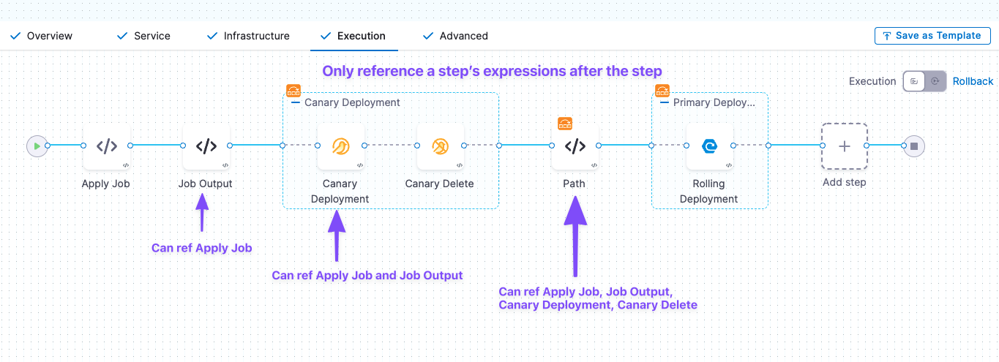
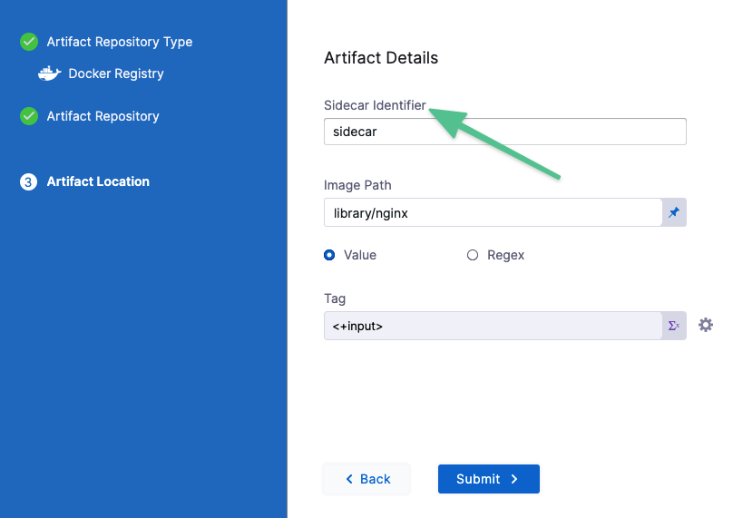

This topic describes the default (built-in) and custom Harness expressions, as well as the prefixes used to identify user-created variables. This list will be periodically updated when new expressions are added to Harness.

Looking for how-tos? See [Variable Expressions How-tos](https://docs.harness.io/category/variables-and-expressions).

### Variable Expression Basics

Let's quickly review what Harness built-in and custom variable expressions are and how they work.

#### What is a Harness Variable Expression?

Harness variables are a way to refer to something in Harness, such as an entity name or a configuration setting. At Pipeline runtime, Harness evaluates all variables and replaces them with the resulting value.

Harness variables are powerful because they let you template configuration information, Pipeline settings, and values in your scripts, and they enable your Pipelines to pass information between Stages and settings.

When you use a variable, you add it as an expression.

Harness expressions are identified using the `<+...>` syntax. For example, `<+pipeline.name>` references the name of the Pipeline where the expression is evaluated.

The content between the `<+...>` delimiters is passed on to the [Java Expression Language (JEXL)](http://commons.apache.org/proper/commons-jexl/) where it is evaluated. Using JEXL, you can build complex variable expressions that use JEXL methods. For example, here's an expression that uses Webhook Trigger payload information:


```
<+trigger.payload.pull_request.diff_url>.contains("triggerNgDemo") || <+trigger.payload.repository.owner.name> == "wings-software"
```
Harness pre-populates many variables, as documented below, and you can set your own variables in the form of context output from [shell scripts](https://docs.harness.io/article/k5lu0u6i1i-using-shell-scripts) and other steps.

#### You can use all Java String methods

You can use all Java String methods on Harness variables expressions.

The above example used `contains()`:

`<+trigger.payload.pull_request.diff_url>.contains("triggerNgDemo")`

Let's look at another example. Imagine you have a variable called `abc` with the value `def:ghi`. You can use `split()` like this:


```
echo <+pipeline.variables.abc.split(':')[1]>
```
The result would be `ghi`.

#### FQNs and Expressions

Everything in Harness can be referenced by a Fully Qualified Name (FQN) expression.

The FQN is the path to a setting in the YAML of your Pipeline:


You can select the expression for a setting or value in the Pipeline editor or execution.

You don't need to build the expression yourself. Harness provides multiple places where you can copy the variable expression.

For example, you can click the copy button in a Pipeline execution to get the expressions of settings and values.


When building a Pipeline in Pipeline Studio, you can copy the FQN of a setting using **Variables**.


#### Stage-level and Pipeline-level Expressions

Every section and step in a stage contains input information you can reference as expressions.

Click **Variables** in the Pipeline to view all the inputs and copy their expressions.


There are two expressions for each input:

* **Stage-level:** use this option to reference the input anywhere in its Stage.
* **Pipeline-level:** begins with `pipeline.stages`. Use this option to reference the input anywhere in the Pipeline.

#### Expression Example

Here is a simple example of a Shell Script step echoing some common variable expressions:


```
echo "Harness account name: "<+account.name>  
  
echo "Harness comp name: "<+account.companyName>  
  
echo "pipeline executionId: "<+pipeline.executionId>  
  
echo "pipeline sequenceId: "<+pipeline.sequenceId>  
  
echo "stage name: "<+stage.name>  
  
echo "service name: "<+service.name>  
  
echo "service variables: "<+serviceVariables.example_var>   
  
echo "artifact image: "<+artifact.image>  
  
echo "artifact.imagePath: "<+artifact.imagePath>  
  
echo "environment name: "<+env.name>  
  
echo "infrastructure connectorRef: "<+infra.connectorRef>  
  
echo "infrastructure namespace: "<+infra.namespace>  
  
echo "infrastructure releaseName: "<+infra.releaseName>
```
Here is an example of the output:


```
Harness account name: Harness.io  
  
Harness comp name: Harness.io  
  
pipeline executionId: T4a7uBs7T-qWhNTr-LnFDw  
  
pipeline sequenceId: 16  
  
stage name: dev  
  
service name: nginx  
  
service variables: foo  
  
artifact image: index.docker.io/library/nginx:stable  
  
artifact.imagePath: library/nginx  
  
environment name: quickstart  
  
infrastructure connectorRef: account.harnesstestpmdemocluster  
  
infrastructure namespace: default  
  
infrastructure releaseName: docs  
  
Command completed with ExitCode (0)
```
#### Input and Output Variable Expressions

You can reference the inputs and outputs of any part of your Pipeline.

* **Input variable expressions** reference the values and setting selections you made in your Pipeline.
* **Output variable expressions** reference the results of a Pipeline execution.

You can reference inputs in Pipeline **Variables**:


##### Input and Output Variable Expressions in Executions

Inputs and outputs are displayed for every part of the Pipeline execution.

Here's the inputs and outputs for a Kubernetes Rollout Deployment step:


|  |  |
| --- | --- |
| **Inputs** | **Outputs** |
|  |  |

You can copy the expressions for the names or values of any input or output.


|  |  |
| --- | --- |
| **Name** | **Value** |
|  |  |

Here are the **Name** and **Value** expressions for the `podIP` setting:

* Name:
```
<+pipeline.stages.Deploy_Service.spec.execution.steps.rolloutDeployment.deploymentInfoOutcome.serverInstanceInfoList[0].podIP>
```
* Value: `10.100.0.6`

#### Using Expressions in Settings

You can use Harness variable expressions in most settings.

When you select **Expression** in a setting, you type `<+` and a value and the list of available variables appears:


Simply click a variable expression name to use it as the value for this setting.

At runtime, Harness will replace the variable with the runtime value.

You can also paste in expressions that don't appear. Such as expressions that reference settings in previous Stages.

See [Fixed Values, Runtime Inputs, and Expressions](../20_References/runtime-inputs.md).

#### Only Use Expressions After They'll Be Resolved

When Harness encounters an expression during Pipeline execution, it tries to resolve it with the information it has at that point in the execution. Consequently, you can only use an expression after Harness has the required information. If you try to use an expression before Harness has its information, it will fail.

In this illustration, you can see how the information in each section of the Stage are referenced:


Here's how you reference the information in each of these sections:

* **Service expressions** can only be used after Harness has progressed through the **Service** section of the Pipeline.
	+ **Service** expressions they can be used in **Infrastructure** and **Execution**.
* **Infrastructure expressions** can only be used after Harness has progressed through the **Infrastructure** section of the Pipeline.
	+ In **Infrastructure**, you can reference **Service** settings.
	+ Since **Execution** follows **Infrastructure**, you can reference **Infrastructure** expressions in **Execution**.
* **Execution expressions** apply to steps in **Execution**.
	+ Each step's **Execution** expressions can only be used after Harness has progressed through that step in the **Execution** section:
  

##### Variable Expressions in Conditional Execution Settings

Stages and Steps support variable expressions in the JEXL conditions of their **Conditional Execution** settings.

You can only use variable expressions in the JEXL conditions that can be resolved before the stage.

Since **Conditional Execution** settings are used to determine if the stage should be run, you cannot use variable expressions that can't be resolved until the stage is run.

For more information on Conditional Execution, see [Stage and Step Conditional Execution Settings](../8_Pipelines/w_pipeline-steps-reference/step-skip-condition-settings.md).

### Variable Expression Limitations and Restrictions

Review the following variable expression limitations and restrictions to avoid errors when using variable expressions.

#### Scope

Harness permits variables only within their scope. You will not see a variable available in a field where it cannot be used.

You cannot refer to a Pipeline step's expressions within the same step.

For example, if you have an HTTP step with the Id `foo` you cannot use the expression `<+execution.steps.foo.spec.url>` to reference the HTTP URL within that same step. Put another way, you can only reference a step's settings from a different step.

#### Variable Value Size

A variable value (the evaluated expression) is limited to 256 KB.

#### Scripts Within Expressions

You cannot write scripts within an expression `<+...>`. For example, the following script will not work:


```
if ((x * 2) == 5) { <+pipeline.name = abc>; } else { <+pipeline.name = def>; }
```
#### Variable Names Across the Pipeline

Variables names must be unique in the same Stage. You can use the same variable names in different Stages in the same Pipeline or other Pipelines.

#### Hyphens in Variable Names

Do not use hyphens (dashes) in variable names, as some Linux distributions and deployment-related software do not allow them. Also, it can cause issues with headers.

For example, `<+execution.steps.httpstep.spec.headers.x-auth>` will not work.

As a workaround, you can put the variable name in `["..."]`, like this:

`<+execution.steps.httpstep.spec.headers["x-auth"]>`

This also works for nested expressions:

`<+execution.steps.httpstep.spec.newHeaders["x-auth"]["nested-hyphen-key"]>`

`<+execution.steps.httpstep.spec.newHeaders["x-auth"].nonhyphenkey>`

#### Variable Expression Name Restrictions

A variable name is the name in the variable expression, such as `foo` in `<+stage.variables.foo>`.

Variable names may only contain `a-z, A-Z, 0-9, _`. They cannot contain hyphens or dots.

Certain platforms and orchestration tools, like Kubernetes, have their own naming restrictions. For example, Kubernetes doesn't allow underscores. Make sure that whatever expressions you use resolve to the allowed values of your target platforms.

#### Reserved Words

The following keywords are reserved, and cannot be used as a variable name or property:

`or and eq ne lt gt le ge div mod not null true false new var return shellScriptProvisioner`

See [JEXL grammar details](https://people.apache.org/~henrib/jexl-3.0/reference/syntax.html).

#### Number variables

Number type variables are always treated as a Double (double-precision floating-point):

* -1.79769313486231E308 to -4.94065645841247E-324 for negative values
* 4.94065645841247E-324 to 1.79769313486232E308 for positive values

For example, here's a pipeline variable of Number type:


```
  variables:  
    - name: double_example  
      type: Number  
      description: ""  
      value: 10.1
```
The expression to reference that pipeline variable, `<+pipeline.variables.double_example>`, will be treated as a Double when it is resolved to `10.1`.

##### Numbers as doubles and strings

Whether the number in a variable is treated as a double or string depends on the field that you use it in.

If you entered 123 in a string filed, such as a name, it is treated as a string. If you entered 123 in a count field, such as instance count, it is treated as a double.

### Built-in CIE Codebase Variables Reference

In Harness, you set up your [Codebase](https://docs.harness.io/article/6vks5ym7sq-edit-a-ci-pipeline-codebase-configuration) by connecting to a Git repo using a Harness [Connector](../7_Connectors/ref-source-repo-provider/git-connector-settings-reference.md) and cloning the code you wish to build and test in your Pipeline.

Harness also retrieves your Git details and presents them in your Build stage once a Pipeline is run.

Using Harness built-in expressions, you can refer to the various attributes of your Codebase in Harness stages.

Here is a simple example of a Shell Script step echoing some common Codebase variable expressions:


```
echo <+codebase.commitSha>  
echo <+codebase.targetBranch>  
echo <+codebase.sourceBranch>  
echo <+codebase.prNumber>  
echo <+codebase.prTitle>  
echo <+codebase.commitRef>  
echo <+codebase.repoUrl>  
echo <+codebase.gitUserId>  
echo <+codebase.gitUserEmail>  
echo <+codebase.gitUser>  
echo <+codebase.gitUserAvatar>  
echo <+codebase.pullRequestLink>  
echo <+codebase.pullRequestBody>  
echo <+codebase.state>
```
See [Built-in CIE Codebase Variables Reference](../../continuous-integration/ci-technical-reference/built-in-cie-codebase-variables-reference.md).

### Account

#### <+account.identifier>

The entity [identifier](../20_References/entity-identifier-reference.md) of the Harness account.


#### <+account.name>

Harness account name.

#### <+account.companyName>

The name of the company for the account.

#### Custom Account Variables

See [Add Account, Org, and Project-level Variables](add-a-variable.md).

### Org

#### <+org.identifier>

The entity [identifier](../20_References/entity-identifier-reference.md) of an organization.


#### <+org.name>

The name of the Org.

#### <+org.description>

The description of the Org.

#### Custom Org Variables

See [Add Account, Org, and Project-level Variables](add-a-variable.md).

### Project

#### <+project.name>

The name of the Harness Project.

#### <+project.description>

The description of the Harness Project.

#### <+project.tags>

All Harness Tags attached to the Project.

#### <+project.identifier>

The entity [identifier](../20_References/entity-identifier-reference.md) of the Harness Project.

#### Custom Project Variables

See [Add Account, Org, and Project-level Variables](add-a-variable.md).

### Pipeline

#### Pipeline-level Variables

Here's a quick video that explains how to create and reference Pipeline, Stage, and Service variables:

#### <+pipeline.identifier>

The [Entity Identifier](../20_References/entity-identifier-reference.md) (Id) for the Pipeline.


#### <+pipeline.executionId>

Every execution of a Pipeline is given a universally unique identifier (UUID). The UUID can be referenced anywhere.

For example, in the following execution URL the UUID follows `executions` and is `kNHtmOaLTu66f_QNU-wdDw`:


```
https://app.harness.io/ng/#/account/12345678910/cd/orgs/default/projects/CD_Quickstart/pipelines/Helm_Quickstart/executions/kNHtmOaLTu66f_QNU-wdDw/pipeline
```
#### <+pipeline.execution.url>

The execution URL of the Pipeline. This is the same URL you see in your browser when you are viewing the Pipeline execution.

For example:


```
https://app.harness.io/ng/#/account/H5W8iol5TNWc4G9h5A2MXg/cd/orgs/default/projects/CD_Docs/pipelines/Triggers/executions/EpE_zuNVQn2FXjhIkyFQ_w/pipeline
```
#### <+pipeline.name>

The name of the current Pipeline.


#### <+pipeline.sequenceId>

The incremental sequential ID for the execution of a Pipeline. A `<+pipeline.executionId>` does not change, but a `<+pipeline.sequenceId>` is incremented with each run of the Pipeline.

The first run of a Pipeline receives a sequence ID of 1 and each subsequent execution is incremented by 1.

For CD Pipelines the ID is named Execution. For CI Pipelines the ID is named Builds.


You can use `<+pipeline.sequenceId>` to tag a CI build when you push it to a repo, and then use `<+pipeline.sequenceId>` to pull the same build and tag in a subsequent stage. See [CI Pipeline Quickstart](../../continuous-integration/ci-quickstarts/ci-pipeline-quickstart.md).

#### <+pipeline.startTs>

The start time of a Pipeline execution in [Unix Epoch format](https://www.epoch101.com/). See [Trigger How-tos](https://docs.harness.io/category/triggers).

#### <+pipeline.triggerType>

The type of Trigger. See [Trigger How-tos](https://docs.harness.io/category/triggers).

#### <+pipeline.triggeredBy.name>

The name of the user or the Trigger name if the Pipeline is triggered using a Webhook. See [Trigger Pipelines using Git Events](../11_Triggers/triggering-pipelines.md).

If a user name is not present in the event payload, the `<+pipeline.triggeredBy.name>` expression will resolve as empty. For example, in the SaaS edition of Bitbucket, a user name is not present.

#### <+pipeline.triggeredBy.email>

The email of the user who triggered the Pipeline. This returns NULL if the Pipeline is triggered using a webhook. See [Trigger How-tos](https://docs.harness.io/category/triggers).

### Deployment and Step Status

Deployment status values are a Java enum. The list of values can be seen in the Deployments **Status** filter:


You can use any status value in a JEXL condition. For example, `<+pipeline.stages.stage1.status> == "FAILED"`.

#### Step status

The expression `<+execution.steps.[step Id].status>` resolves to the status of a step. For example, `<+execution.steps.mystep.status>`.

You must use the expression after the step in Execution.

### Stage

#### Stage-level Variables

Here's a quick video that explains how to create and reference Pipeline, Stage, and Service variables:

Once you've created a stage, its settings are in the **Overview** tab. For example, here's the **Overview** tab for a Deploy stage:


In **Advanced**, you can add **Stage Variables**.

Stage variables are custom variables you can add and reference in your stage and Pipeline. They're available across the Pipeline. You can override their values in later stages.

You can even reference stage variables in the files fetched at runtime.

For example, you could create a stage variable `name` and then reference its identifier in the Kubernetes values.yaml file used by this stage: `name: <+stage.variables.name>`:


```
name: <+stage.variables.name>  
replicas: 2  
  
image: <+artifact.image>  
...
```
When you run this Pipeline, the value for `name` is used for the values.yaml file. The value can be a Fixed Value, Expression, or Runtime Input.

You reference stage variables **within their stage** using the expression `<+stage.variables.[variable name]>`.

You reference stage variables **outside their stage** using the expression `<+pipeline.stages.[stage name].variables.[variable name]>`.

#### <+stage.name>

The name of the stage where the expression is evaluated.


#### <+stage.description>

The description of the stage where the expression is evaluated.

#### <+stage.tags>

The tags on the stage where the expression is evaluated. See [Tags Reference](../20_References/tags-reference.md).

These tags are different from Docker image tags.

#### <+stage.identifier>

The [entity identifier](../20_References/entity-identifier-reference.md) of the stage where the expression is evaluated.

#### <+stage.output.hosts>

Lists all of the target hosts when deploying to multiple hosts.

When you are deploying to multiple hosts, such as with an SSH, WinRM, or Deployment Template stage, you can run the same step on all of the target hosts.

To run the step on all hosts, you use the Repeat [Looping Strategy](../8_Pipelines/looping-strategies-matrix-repeat-and-parallelism.md) and identify all the hosts for the stage as the target:


```
repeat:  
  items: <+stage.output.hosts>
```
Here's an example with a Shell Script step:


For examples, see the looping strategies used in the [Secure Shell (SSH) deployment tutorial](https://docs.harness.io/article/mpx2y48ovx-ssh-ng).

### Service

Currently, there are two versions of Services and Environments, v1 and v2. Services and Environments v1 is being replaced by Services and Environments v2.

The use of variable expressions is different between v1 and v2.

For more information, go to [Services and Environments Overview](https://docs.harness.io/article/9ryi1ay01f-services-and-environments-overview).

#### Service-level Variables for Service v2

To reference a Service variable, use the expression `<+serviceVariables.[variable name]>`.

For example, `<+serviceVariables.myvar>`.

#### Service-level Variables for Service v1

Here's a quick video that explains how to create and reference Pipeline, Stage, and Service variables:

#### <+serviceConfig.serviceDefinition.spec.variables.[var\_name]>

The value of the Service-level variable in `[var_name]`.


Use expression anywhere after the Service step in the Pipeline.

To reference the variables, click the copy button:


There are two options:

* **Copy variable name:** use this option if you will only be referencing this variable in the current Stage. Expression:
	+ `<+serviceConfig.serviceDefinition.spec.variables.[name]>`
* **Copy fully qualified name:** use this option if you will be referencing this variable in another Stage. Example:
	+ `<+pipeline.stages.[stage_name].spec.serviceConfig.serviceDefinition.spec.variables.[name]>`

You can use these expressions in any setting in your Pipeline. You simply select the Expression option and enter the expression:


To override the Service variable in a script, you simply reference its name and use a new value.

#### <+service.name>

The name of the Service where the expression is evaluated.


#### <+service.description>

The description of the Service where the expression is evaluated.

#### <+service.tags>

The tags on the Service where the expression is evaluated.

To reference a specific tag use `<+service.tags.[tag_key]>`.

#### <+service.identifier>

The [entity identifier](../20_References/entity-identifier-reference.md) of the Service where the expression is evaluated.

#### <+service.type>

Resolves to stage Service type, such as Kubernetes.


#### <+service.gitOpsEnabled>

Resolves to a boolean value to indicate whether the GitOps option is enabled (true) or not (false).


For details on using the GitOps option, go to [Harness GitOps ApplicationSet and PR Pipeline Tutorial](https://docs.harness.io/article/lf6a27usso-harness-git-ops-application-set-tutorial).

### Manifest

There are generic and deployment type-specific expressions for manifests.

Manifest settings are referenced by **name**.

You can always determine the expressions you can use by looking at the Service YAML.

For example, the expression `<+manifests.mymanifest.valuesPaths>` can be created by using the manifest name and the valuesPaths key in the YAML:


```
...  
      manifests:  
        - manifest:  
            identifier: mymanifest  
            type: K8sManifest  
            spec:  
              store:  
                type: Harness  
                spec:  
                  files:  
                    - account:/Templates  
              valuesPaths:  
                - account:/values.yaml  
              skipResourceVersioning: false  
...
```
Let's look at a few generic manifest expressions.

#### <+manifests.[manifest name].identifier>

Resolves to the manifest Id in Harness.


```
...  
      manifests:  
        - manifest:  
            identifier: mymanifest  
...
```
#### <+manifests.[manifest name].type>

Resolves to the manifest type. For example, `K8sManifest`:


```
...  
      manifests:  
        - manifest:  
            identifier: mymanifest  
            type: K8sManifest  
...
```
#### <+manifests.[manifest name].store>

Resolves to where the manifest is stored. For example, this manifest is stored in the [Harness File Store](https://docs.harness.io/article/oaihv6nry9-add-inline-manifests-using-file-store):


```
...  
      manifests:  
        - manifest:  
            identifier: mymanifest  
            type: K8sManifest  
            spec:  
              store:  
                type: Harness  
                spec:  
                  files:  
                    - account:/Templates  
...
```
### Artifact

If an artifact expression is in a manifest or step and you have not selected an artifact in a Service Definition, or set the artifact is set as a Runtime Input, you will be prompted to select an artifact at runtime. This is true even if the Stage does not deploy an artifact (such as a Custom Stage or a Stage performing a [Kustomize](https://docs.harness.io/article/uiqe6jz9o1-kustomize-quickstart) deployment). If you want to reference an artifact that isn't the primary deployment artifact without being prompted, you can use an expression with quotes, like `docker pull <+artifact<+".metadata.image">>`.The artifact expressions will resolve to settings and values specified in a Service's **Artifacts** section.


|  |  |
| --- | --- |
|  |  |

For example, here's how the common artifact expressions resolve for a Kubernetes deployment with a Docker image on Docker Hub:

* **<+artifact.tag>:** `stable`
* **<+artifact.image>:** `index.docker.io/library/nginx:stable`
* **<+artifact.imagePath>:** `library/nginx`
* **<+artifact.imagePullSecret>:** `eJjcmV0em1hbiIsInBhc3N3b3JkIjoiIzhDNjk3QVhUdSJ9fQ==:`
* **<+artifact.type>:** `DockerRegistry`
* **<+artifact.connectorRef>:** `DockerHub`

Here's a script you can add to a [Shell Script](https://docs.harness.io/article/k5lu0u6i1i-using-shell-scripts) step to view the artifact info:


```
echo "artifact.tag: "<+artifact.tag>  
echo "artifact.image: "<+artifact.image>  
echo "artifact.imagePath: "<+artifact.imagePath>  
echo "artifact.imagePullSecret: "<+artifact.imagePullSecret>  
echo "artifact.type: "<+artifact.type>  
echo "artifact.connectorRef: "<+artifact.connectorRef>
```
Here's the example log from the deployment:


```
Executing command ...  
artifact.tag: stable  
artifact.image: index.docker.io/library/nginx:stable  
artifact.imagePath: library/nginx  
artifact.imagePullSecret: eyJodHRwczovL2luZGV4LmRvY2tlci5pby92MS8iOnsidXNlcm5hbWUiOiJjcmV0em1hbiIsInBhc3N3b3JkIjoiIzhDNjk3QVhUdSJ9fQ==  
artifact.type: DockerRegistry  
artifact.connectorRef: DockerHub  
Command completed with ExitCode (0)
```
#### <+artifact.tag>

Not Harness Tags. This expression evaluates to the tags on the artifact pushed, pulled, or deployed. For example, AMI tags, or if you are deploying Docker image `nginx:stable-perl` then `stable-perl` is the tag.

#### <+artifact.image>

The full location to the Docker image. For example, `docker.io/bitnami/nginx:1.22.0-debian-11-r0`.

For non-containerized artifacts, use `<+artifact.path>`, described [below](#artifact_path).To see just the image name, use `<+artifact.imagePath>`.

You use `<+artifact.image>` or `<+artifact.imagePath>` is your Values YAML file when you want to deploy an artifact you have added to the **Artifacts** section of a CD stage Service Definition.

For example, here's the **Artifacts** section with an artifact:


Here's the Values YAML file referencing the artifact in **Artifacts**:


```
name: example  
replicas: 2  
  
image: <+artifact.image>  
# dockercfg: <+artifact.imagePullSecret>  
  
createNamespace: true  
namespace: <+infra.namespace>  
  
...
```
See [Example Kubernetes Manifests using Go Templating](https://docs.harness.io/article/qvlmr4plcp-example-kubernetes-manifests-using-go-templating).

#### <+artifact.path>

The full path to the non-containerized artifact. This expression is used in non-containerized deployments.

#### <+artifact.filePath>

The file name of the non-containerized artifact. This expression is used in non-containerized deployments. For example, a ZIP file in AWS S3.

#### <+artifact.imagePath>

The image name, such as `nginx`. To see the entire image location use `<+artifact.image>`.

#### <+artifact.imagePullSecret>

If some cases, your Kubernetes cluster might not have the permissions needed to access a private Docker registry. For these cases, the values.yaml or manifest file in Service Definition **Manifests** section must use the `dockercfg` parameter.

If the Docker image is added in the Service Definition **Artifacts** section, then you reference it like this: `dockercfg: <+artifact.imagePullSecret>`.

values.yaml:


```
name: <+stage.variables.name>  
replicas: 2  
  
image: <+artifact.image>  
dockercfg: <+artifact.imagePullSecret>  
  
createNamespace: true  
namespace: <+infra.namespace>  
...
```
See [Pull an Image from a Private Registry for Kubernetes](https://docs.harness.io/article/o1gf8jslsq-pull-an-image-from-a-private-registry-for-kubernetes).

#### <+artifact.type>

The type of repository used to add this artifact in the Service **Artifacts**. For example, Dockerhub, Ecr, or Gcr.

#### <+artifact.connectorRef>

The [entity identifier](../20_References/entity-identifier-reference.md) for the Connector used to connect to the artifact repo.


#### <+artifact.label.get("")>

This expression resolves to the Docker labels of a Docker image.

For example, here are the labels for a Docker image:

* `maintainer=dev@someproject.org`
* `build_date=2017-09-05`
* `multi.author=John Doe`
* `key-value=xyz`
* `multi.key.value=abc`

In a Harness Shell Script step or any setting where you want use the labels, you can reference them:


```
echo <+artifact.label.get("maintainer")>  
echo <+artifact.label.get("build_date")>  
echo <+artifact.label.get("multi.author")>  
echo <+artifact.label.get("key-value")>  
echo <+artifact.label.get("multi.key.value")>
```
When you run the Pipeline, the expressions will resolve to their respective label values:


#### <+artifact.primary.identifier>

The Id of the Primary artifact added in a Service **Artifacts** section.


#### Sidecar Artifacts

Sidecar artifact expressions use the **Sidecar Identifier** to reference the sidecar artifact.



The sidecar identifier is set when you add the sidecar artifact. It can bee seen in the artifact listing:


Here are the sidecar expressions:

* `<+artifacts.sidecars.[sidecar_identifier].imagePath>`
* `<+artifacts.sidecars.[sidecar_identifier].image>`
* `<+artifacts.sidecars.[sidecar_identifier].type>`
* `<+artifacts.sidecars.[sidecar_identifier].tag>`
* `<+artifacts.sidecars.[sidecar_identifier].connectorRef>`

### Environment

#### Environment-level Variables for Service v2

Currently, there are two versions of Services and Environments, v1 and v2. Services and Environments v1 is being replaced by Services and Environments v2.

The use of variable expressions is different between v1 and v2.

For more information, go to [Services and Environments Overview](https://docs.harness.io/article/9ryi1ay01f-services-and-environments-overview).

To reference an Environment-level variable, use the expression `<+env.variables.[variable name]>`.

For example, here is an Environment variable named `envvar`.


You would reference it as `<+env.variables.envvar>`.

#### <+env.name>

The name of the stage Environment.


#### <+env.identifier>

The [entity identifier](../20_References/entity-identifier-reference.md) of the stage's Environment.

#### <+env.description>

The description of the Environment.

#### <+env.type>

The Environment Type, such as Production or Non-Production.

### Infrastructure

#### <+infra.name>

The name of the Infrastructure Definition used in the Pipeline stage.


#### <+infra.connectorRef>

The name of the Connector used in the Infrastructure Definition.

#### <+INFRA\_KEY>

The infrastructure key. The key is a unique string that identifies a deployment target infrastructure. It is typically used in the **Release Name** setting to add labels to release for tracking.

For example, in a Deploy stage's Infrastructure Definition, the `<+INFRA_KEY>` is used in the **Release Name** to give the release a unique name:


When you deploy, Harness adds the Release Name as a label. For example, in a Kubernetes deployment you can see `harness.io/release-name=release-2f9eadcc06e2c2225265ab3cbb1160bc5eacfd4f`:


```
...  
Pod Template:  
  Labels:  app=hello  
           deployment=hello  
           harness.io/release-name=release-2f9eadcc06e2c2225265ab3cbb1160bc5eacfd4f  
  Containers:  
   the-container:  
    Image:      monopole/hello:1  
...
```
Harness can now track the release for comparisons and rollback.

#### <+infra.namespace>

The namespace used in the Infrastructure Definition.

#### <+infra.releaseName>

The release name used in the Infrastructure Definition.

### Instances

The following instance expressions are supported in SSH, WinRM, and custom deployments using Deployment Templates. These deployments can be done on Physical Data Centers, AWS, and Azure.

For details on these deployment types, go to [Secure Shell (SSH) deployment tutorial](https://docs.harness.io/article/mpx2y48ovx-ssh-ng), [WinRM deployment tutorial](https://docs.harness.io/article/l8795ji7u3-win-rm-tutorial), and [Custom deployments using Deployment Templates tutorial](https://docs.harness.io/article/6k9t49p6mn-custom-deployment-tutorial).

To use these instance expressions in a step, you must use the Repeat [Looping Strategy](../8_Pipelines/looping-strategies-matrix-repeat-and-parallelism.md) and identify all the hosts for the stage as the target:


```
repeat:  
  items: <+stage.output.hosts>
```


For examples, see [Run a script on multiple target instances](https://docs.harness.io/article/c5mcm36cp8-run-a-script-on-multiple-target-instances).

For Microsoft Azure, AWS, or any platform-agnostic Physical Data Center (PDC):

* `​<+instance.hostName>​`
* `​<+instance.host.instanceName>`
* `​<+instance.name>`

For Microsoft Azure or AWS:

* `​<+instance.host.privateIp>​`
* `​<+instance.host.publicIp>`

#### Deployment Templates

For [Deployment Templates](https://docs.harness.io/article/6k9t49p6mn-custom-deployment-tutorial), you can use `<+instance...>` expressions to reference host(s) properties.

The `<+instance...>` expressions refer to the **Instance Attributes** in the Deployment Template:


The following expressions refer to instance(s) collected by the mandatory **instancename** field:

* `​<+instance.hostName>​`
* `​<+instance.host.instanceName>`
* `​<+instance.name>`

The expression `<+instance.host.properties.[property name]>` can used to reference the other properties you added to **Instance Attributes**.

For example, in the example above you can see the `artifact` field name mapped to the `artifactBuildNo` property.

To reference `artifact` you would use `<+instance.host.properties.artifact>`.

`instance.name` has the same value as `instance.hostName`. Both are available for backward compatibility.
#### <+instance.hostName>

The host/container/pod name where the microservice/application is deployed.

If you use this variable in a Pipeline, such as in a Shell Script step, Harness will apply the script to all target instances. You do not have to loop through instances in your script.

#### ​<+instance.host.instanceName>

The same as `<+instance.hostName>`. 

#### <+instance.name>

The name of the instance on which the service is deployed.

If you use this variable in a Pipeline, such as in a Shell Script step, Harness will apply the script to all target instances. You do not have to loop through instances in your script.

#### <+instance.host.privateIp>

The private IP of the host where the service is deployed.

If you use this variable in a Pipeline, such as in a Shell Script step, Harness will apply the script to all target instances. You do not have to loop through instances in your script.

#### <+instance.host.publicIp>

The public IP of the host where the service is deployed.

If you use this variable in a Pipeline, such as in a Shell Script step, Harness will apply the script to all target instances. You do not have to loop through instances in your script.

### Triggers

#### <+trigger.artifact.build>

Resolves to the artifact version (such as a Docker Tag) that initiated an [On New Artifact Trigger](../11_Triggers/trigger-on-a-new-artifact.md).

When you add an On New Artifact Trigger, you select the artifact to listen on and its **Tag** setting is automatically populated with `<+trigger.artifact.build>`.


The `<+trigger.artifact.build>` is used for **Tag** to ensure that the new artifact version that executed the Trigger is used for the deployment.

When a new tag is added to the artifact, the Trigger is fired and the Pipeline executes. Harness then resolves `<+trigger.artifact.build>` to the tag that fired the Trigger. This ensures that the new tag is used when pulling the artifact and that version is deployed.

#### Git Trigger and Payload Expressions

Harness includes built-in expressions for referencing trigger details such as a PR number.

For example:

* `<+trigger.type>`
	+ Webhook.
* `<+trigger.sourceRepo>`
	+ Github, Gitlab, Bitbucket, Custom
* `<+trigger.event>`
	+ PR, PUSH, etc.

For a complete list, see [Triggers Reference](../8_Pipelines/w_pipeline-steps-reference/triggers-reference.md).

#### Triggers and RBAC

Harness RBAC is applied to Triggers in Harness, but it is not applied to the repos used by the Triggers.

For example, you might have an [On New Artifact Trigger](../11_Triggers/trigger-on-a-new-artifact.md) that is started when a new artifact is added to the artifact repo. Or a [Webhook Trigger](../11_Triggers/triggering-pipelines.md) that is started when a PR is merged.

In Harness, you can select who is able to create and use these Triggers within Harness, but you must use your repos' RBAC to control who can add the artifacts or initiate the events that start the Harness Trigger.

### Kubernetes

#### ${HARNESS\_KUBE\_CONFIG\_PATH}

The path to a Harness-generated kubeconfig file containing the credentials you provided to Harness. The credentials can be used by kubectl commands by exporting its value to the KUBECONFIG environment variable.

Harness only generates this kubeconfig file when a Delegate is outside of the target cluster and is making a remote connection. When you set up the Kubernetes Cluster Connector to connect to the cluster, you select the **Specify master URL and credentials** option. The master URL and credentials you supply in the Connector are put in the kubeconfig file and used by the remote Delegate to connect to the target cluster.

Consequently, you can only use `${HARNESS_KUBE_CONFIG_PATH}` when you are using a Delegate outside the target cluster and a Kubernetes Cluster Connector with the **Specify master URL and credentials** option.

If you are running the script using an in-cluster Delegate with the **Use the credentials of a specific Harness Delegate** credentials option, then there are no credentials to store in a kubeconfig file since the Delegate is already an in-cluster process.

You can use this variable in a [Shell Script](https://docs.harness.io/article/k5lu0u6i1i-using-shell-scripts) step to set the environment variable at the beginning of your kubectl script:

`export KUBECONFIG=${HARNESS_KUBE_CONFIG_PATH}`

For example:


```
export KUBECONFIG=${HARNESS_KUBE_CONFIG_PATH} kubectl get pods -n default
```
The `${HARNESS_KUBE_CONFIG_PATH}` expression can be used in scripts in Shell Script steps. It cannot be used in other scripts such as a Terraform script.

### Tag Expressions

You can reference Tags using Harness expressions.

You simply reference the tagged entity and then use `tags.[tag name]`, like `<+pipeline.tags.docs>`

For example, here are several different references:

* `<+pipeline.tags.[tag name]>`
* `<+stage.tags.[tag name]>`
* `<+pipeline.stages.s1.tags.[tag name]>`
* `<+serviceConfig.service.tags.[tag name]>`

### See also

* [Codebase Variables Reference](../../continuous-integration/ci-technical-reference/built-in-cie-codebase-variables-reference.md)
* [Fixed Values, Runtime Inputs, and Expressions](../20_References/runtime-inputs.md).

