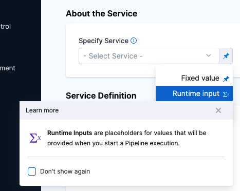

The Harness Template Library enables you to standardize and create Templates that you can use across Harness Pipelines and teams.

A Stage Template is a Harness CD, CI, or Approval Stage Template that can be used in any Pipeline in any Project.

This topic walks you through the steps to create a CD Stage Template, but the steps are the same for the other Stage types.

### Objectives

You'll learn how to: 

* Create a Deploy Stage Template.
* Define Stage Template parameters.
* Use the Deploy Stage Template in a Pipeline.

### Before you begin

* Review [Template Library Overview](template.md).
* Review [Harness Key Concepts](https://docs.harness.io/article/4o7oqwih6h-harness-key-concepts) to establish a general understanding of Harness.
* The Stage Template in this quickstart is added to a CD Pipeline. If you are new to Harness CD, see [CD Quickstarts](https://ngdocs.harness.io/category/c9j6jejsws-cd-quickstarts).
* You can also create CI Build Stage Templates and Manual and Jira Approval Stage Templates. See ​[CIE Quickstarts](../../continuous-integration/ci-quickstarts/ci-pipeline-quickstart.md) and [Using Manual Harness Approval Stages](../9_Approvals/adding-harness-approval-stages.md) and [Adding Jira Approval Stages and Steps](../9_Approvals/adding-jira-approval-stages.md).
* The Stage Template in this quickstart uses Runtime Inputs. Runtime Inputs are placeholders for values that will be provided when you start a Pipeline execution. See [Fixed Values, Runtime Inputs, and Expressions](../20_References/runtime-inputs.md).

### Review: Templates

* You can add Templates to Template Libraries at any [scope](../4_Role-Based-Access-Control/1-rbac-in-harness.md#rbac-scope).
* [Tags](../20_References/tags-reference.md) can be used to group Templates. You can search or filter Templates using these tags.
* You can have nested Templates. You can refer to a stage Template from your Pipeline Template.

### Step 1: Create a Template

First, we'll create a Project-level Template in the **Deployments** module. You can do this in any Project.

Navigate to the **Deployments** module and in **Projects** select the desired project.

Next select **Templates** under Project Setup.

Click **New Template**.

Select **Stage** to create a Stage Template**.**

The **Create New Stage Template** settings appear.

In **Name**, enter a name for the stage. You can enter **Quickstart**.

In **Version Label**, enter the version of the stage. You can enter **v1**.

 Click **Save**.

### Step 2: Add Stage Parameters

 **Select Stage Type** settings appear.

Select **Deploy**. The Deploy stage type is a CD Stage that enables you to deploy any Service to your target environment. Other options include Build for CI, and Approval for Manual and Jira Approval Stages. More options will be added soon.

The **About Your Stage** settings appear, select the type of deployment this Stage must perform. Service is selected by default. A Stage can deploy Services, and other workloads.

Click **Set Up Stage**. The Template Studio page appears.

In **Specify Service**, select **Runtime input**.

Harness Services represent your microservices or applications logically. You can propagate the same Service to as many stages as you need.

**Use Runtime Inputs instead of variable expressions:** when you want to Template settings in a Stage or step template, use [Runtime Inputs](../20_References/runtime-inputs.md) instead of variable expressions. When Harness tries to resolve variable expressions to specific Stage-level settings using fully-qualified names, it can cause issues at runtime. Every Pipeline where the Stage or step Template is inserted must use the same names for fully-qualified name references to operate. With Runtime Inputs, you can supply values for a setting at deployment runtime.In **Deployment Type**, Kubernetes is selected by default. Deployment Type defines how your Service will be deployed.

Click **Next**.

In **Specify Environment**, select **Runtime input**. Environments represent your deployment targets logically (QA, Prod, etc). You can add the same Environment to as many stages are you need.

In **Infrastructure Definition**, select **Kubernetes**. Infrastructure Definition represents your target infrastructure physically. They are the actual clusters, hosts, etc. By separating Environments and Infrastructure Definitions, you can use the same Environment in multiple stages while changing the target infrastructure settings with each stage.

Under **Cluster Details**, select **Runtime input** in both **Connector** and **Namespace** fields. The namespace must already exist during deployment. Harness will not create a new namespace if you enter one here.

Click **Next**. The Execution Strategies dialog box appears.

Select **Rolling** and click **Use Strategy**.

In **Execution**, you can see the **Rollout Deployment** step is added automatically.

Your Template is now ready.

Click **Save**, add a comment, and click **Save** again.

The Template is published successfully.

#### Option: Variables

You can add variables to your Template as needed.

You can add the following types of values to your variables:

* **Fixed values** - These cannot be overridden.
* **Default values in the Template** - These can be overridden.
* **Expressions** - These can be provided during consumption or at runtime.
* **Combination of variables and fixed values** - These variables will be automatically created as part of the template.

### Step 3: Add the Stage Template to a Pipeline

You can use the CD Stage Template in any Pipeline in your Project now that you have it.

To add a Stage Template to a Pipeline, open the Pipeline, and then click **Add Stage**.

The **Select Stage Type** settings appear.

Click **Use Template**. The next page lists all the Project-level Templates.

Select the Quickstart Template that you created.

Click the **Activity Log** to track all Template events. It shows you details like who created the Template and Template version changes.

In **Details**, click **Version Label** and select **Always use the** **Stable** **version** of the Template.

Selecting this option makes sure that any changes that you make to this version are propagated automatically to the Pipelines using this Template.

Click **Use Template.**

The **About your stage** dialog appears. Enter **Quickstart** and click **Set Up Stage**.

The Template Stage is added to your Pipeline.

The stage is added and not copied by the Template icon in the stage.

If you had used **Copy to Pipeline**, this icon would not be there and you could change settings in the stage.

You can now enter all the Runtime Inputs for this Pipeline execution.

Click **Save**.

You'll notice that you can Change and Remove the Template as needed.

### Option: Copy to Pipeline

You can copy the contents of a specific Template to your Pipeline using the **Copy to Pipeline** option. This does not add any reference to the Template. Copying a Template to a Pipeline is different from linking a Template to your Pipeline. You can't change any stage parameters when you link to a Template from your Pipeline.

To copy a Template, go to your Pipeline. Click **Add Stage**.

The **Select Stage Type** settings appear.

Click **Use Template**. Select the Template you want to copy.

Click **Copy to Pipeline**.

Enter a name for your stage. Click **Set Up Stage**.

The Template contents are now copied to your Pipeline stage.

You can change any settings in the stage that you have copied from a Template.

### Next steps

* [Run Step Template Quickstart](run-step-template-quickstart.md)
* [HTTP Step Template Quickstart](harness-template-library.md)

