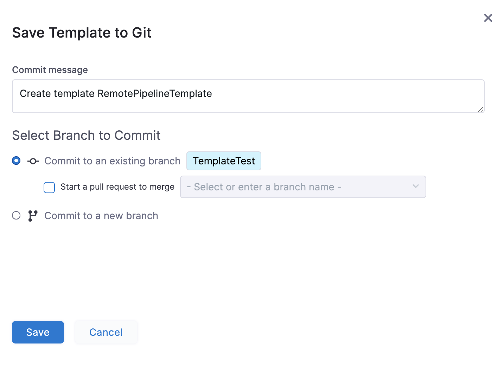
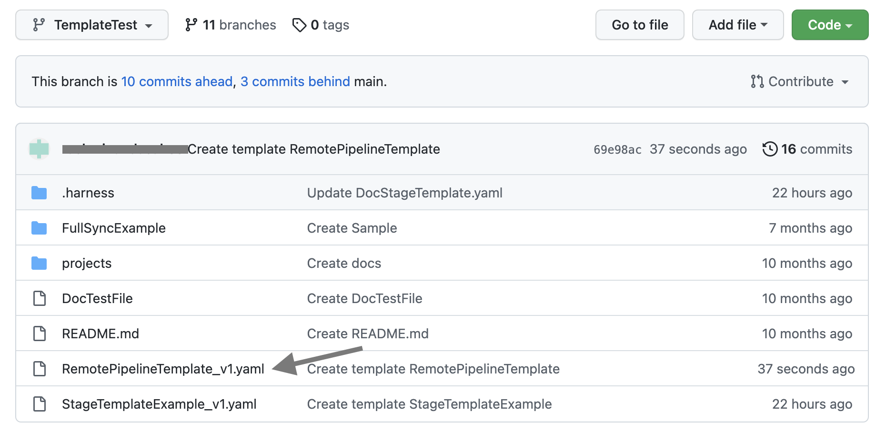
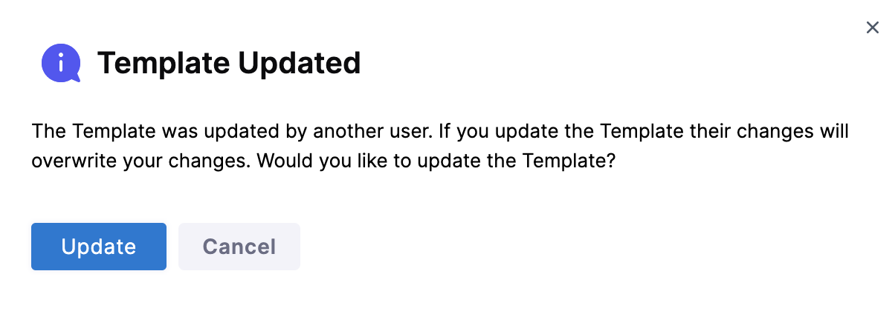

Currently, this feature is behind the feature flag `NG_TEMPLATE_GITX`. Contact Harness Support to enable the feature.​​Harness enables you to add Templates to create re-usable logic and Harness entities (like Steps, Stages, and Pipelines) in your Pipelines.​ You can link these Templates in your Pipelines or share them with your teams for improved efficiency.

Templates enhance developer productivity, reduce onboarding time, and enforce standardization across the teams that use Harness.​

A Pipeline Template lets you distribute reusable pipelines across your team or among multiple teams.​ Instead of building pipelines from scratch, Pipeline templates simplify the process by having parameters already built-in.

For example, you can automate your build and deploy services by adding a Pipeline Template.​ You can link the following Templates to your Pipeline Template:

* Build stage - To push the artifact to the registry, run tests, and security scans.​
* Staging deploy stage - To deploy to Dev, QA.​
* Approval stage - To add approval stages for PROD.​
* Prod deploy stage - To deploy to Production.​

You can create a Template and save it either in Harness or in a Git repository using the Inline or Remote option respectively.​​

This topic walks you through the steps to create a Remote Pipeline Template.​​

### Before you begin

* Review [Harness Key Concepts​​](https://docs.harness.io/article/4o7oqwih6h-harness-key-concepts)
* See [Templates Overview​](template.md)
* See [CIE Quickstarts​​](../../continuous-integration/ci-quickstarts/ci-pipeline-quickstart.md)

### Permissions

To create a Remote Pipeline Template make sure you have **Create/Edit** and **Access** permissions for Templates.​

### Remote Pipeline Template Overview

Harness Pipeline Templates give you the ability to enforce consistency. You can save your Pipeline Templates in different Git repositories. These are called Remote Pipeline Templates.

For example, if you have a core Pipeline that you want all of your teams to use, you can put the template in a core repo and then refer to it. Now you can reuse this Template.​

For information on inline Pipeline Templates, see [Create a Pipeline Template](create-pipeline-template.md).

### Use a Remote Pipeline Template

Harness Templates let you reuse a Pipeline Template to create a Pipeline, or share it with your teams for enhanced efficiency.

Whenever you use a Remote Pipeline, Harness resolves the repositories when your Pipeline starts up. ​

You can have one of the following scenarios when using a Template in your Pipeline:​​

* ​Remote Pipeline Template and the Pipeline exist in the same Git repo.​
* Remote Pipeline Template and the Pipeline exist in different Git repos​.​

Let us see how you can use Template in each of these situations.​​

#### Remote Pipeline Template and the Pipeline exist in the same Git repo

In order to use the Template in your Pipeline if your remote Pipeline Template and Pipeline are both present in the same Git repository, make sure your Pipeline and Template are both present in the same branch.​​​

#### Remote Pipeline Template and the Pipeline exist in different Git repos

In order to use the Template in your Pipeline if your remote Pipeline Template and Pipeline are present in different Git repositories,​ make sure your Template is present in the default branch of the specific repo.​​

### Step 1: Create a Remote Pipeline Template

You can create a Stage Template from your Account, Org or Project. ​This topic explains the steps to create a Stage Template from the Project scope.

1. In your Harness Account, go to your Project.​​
2. In **Project SETUP** click **Templates**.​
3. Click **New Template** and then click **Pipeline**.​ The **Create New Pipeline Template** settings appear.
4. In **Name**, enter a name for the Template.​​
5. In **Version Label**, enter a version for the Template.​​
6. Click **Remote**.​
7. In **Git Connector**, select or create a Git Connector to the repo for your Project.​ For steps, see [Code Repo Connectors](https://docs.harness.io/category/code-repo-connectors).Important: Connector must use the Enable API access option and TokenThe Connector must use the Enable API access option and Username and Token authentication. ​Harness requires the token for API access. Generate the token in your account on the Git provider and add it to Harness as a Secret. Next, use the token in the credentials for the Git Connector.​​  
  
For GitHub, the token must have the following scopes:​  

8. In **Repository**, select your repository.​ If your repository isn't listed, enter its name since only a select few repositories are filled here.​Create the repository in Git before entering it in Select Repository. ​Harness does not create the repository for you.​
9. In **Git Branch**, select your branch.​ If your branch isn't listed, enter its name since only a select few branches are filled here.Create the branch in your repository before entering it in Git Branch. ​Harness does not create the branch for you.​​
10. ​Harness auto-populates the **YAML Path**.​ You can change this path and the file name.
11. Click **Start**.​​​

### Step 2: Add a Stage

1. Click **Add Stage**. ​The **Select Stage Type** settings appear.
2. Select **Deploy**. ​The Deploy stage type is a CD Stage that enables you to deploy any Service to your target environment.  
The **About Your Stage** settings appear.​
3. In **Stage Name**, enter a name for your Stage.​  
Select the entity that this stage should deploy.
4. In **Deployment Type**, click **Kubernetes**.
5. Click **Set Up Stage**.​

### Step 3: Add Service details

1. In **Select Service**, select an existing Service that you want to deploy from the Specify Service drop-down list or create a new one.​ You can also use [Fixed Values, Runtime Inputs, and Expressions](../20_References/runtime-inputs.md).
2. Click **Continue**.
3. In **Specify Environment**, select an existing environment or add a new one.​
4. In **Specify Infrastructure**, select an existing infrastructure or add a new one.​ Click **Continue.**  
The **Execution Strategies** settings appear.

### Step 5: Define Execution Strategies

1. In **Execution Strategies**, select the deployment strategy for your Pipeline Template.​  
This topic uses the example of Rolling deployment.​  
For more information on different execution strategies, see [Deployment Concepts and Strategies.](https://docs.harness.io/article/0zsf97lo3c-deployment-concepts)
2. Click **Use Strategy**.​
3. Click **Save**. The **Save Template to Git** settings appear.

### Step 6: Save Remote Pipeline Template to Git

1. In **Select Branch to Commit**, You can select one of the following:​​
	1. **Commit to an existing branch**: you can start a pull request if you like.​​​
	2. **Commit to a new branch:​** enter the new branch name. You can start a pull request if you like.​​
2. Click **Save**. ​Your Remote Pipeline Template is saved to the repo branch.​​
3. Click the YAML file to see the YAML for the Stage Template.​​
4. Edit the YAML. For example, change the name of the Template.​​​
5. Commit your changes to Git.​​​
6. Return to Harness and refresh the page.​​​​  
A **Template Updated** message appears.​​

### Next steps

* [Use a Template](use-a-template.md)

