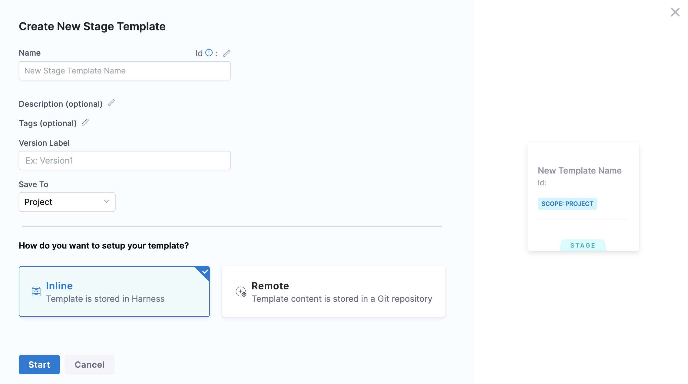
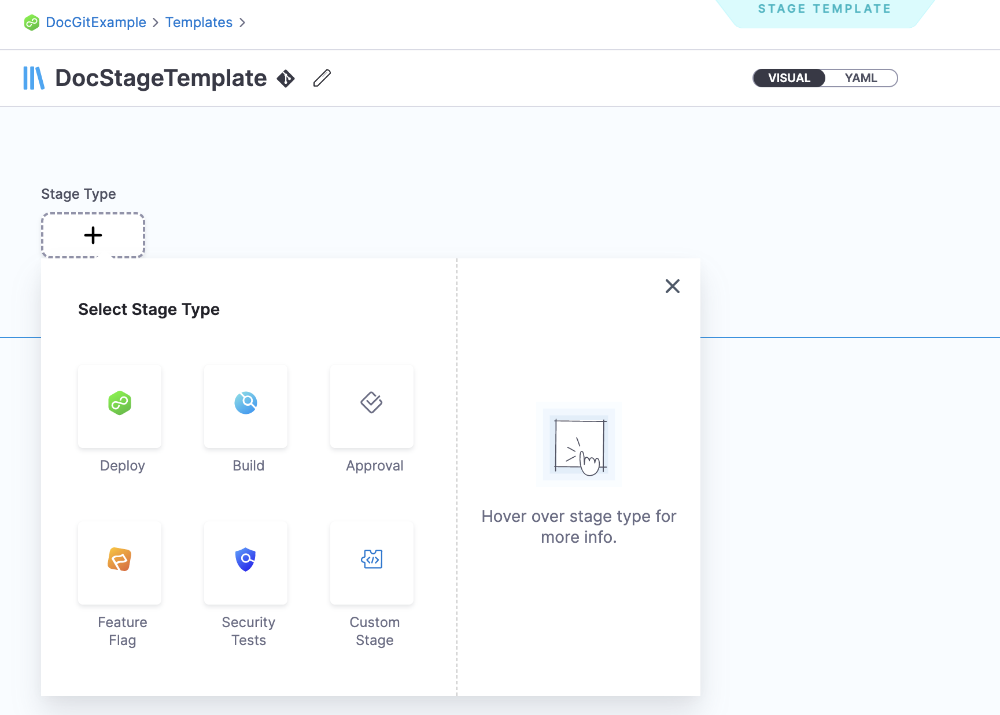
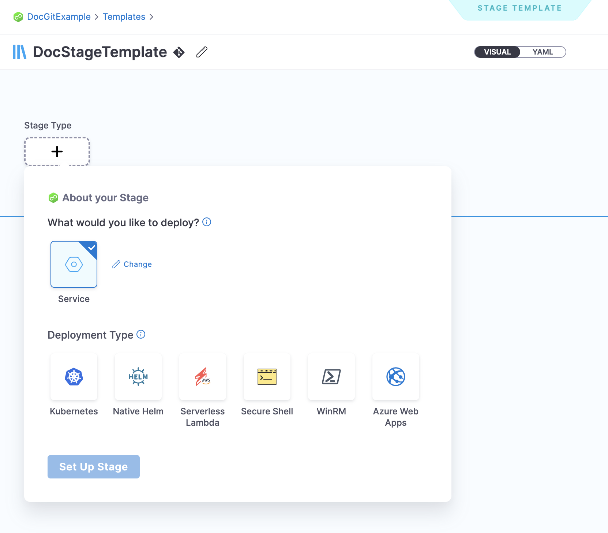
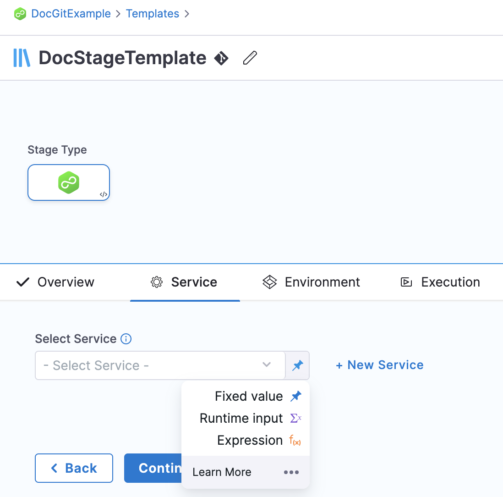
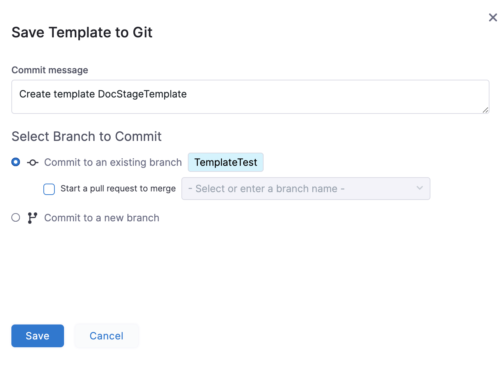
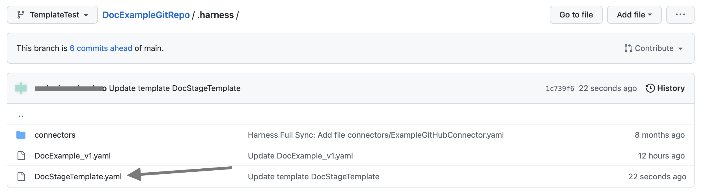
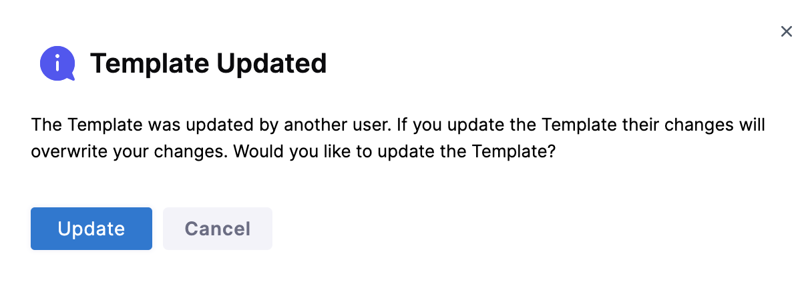

Currently, this feature is behind the feature flag `NG_TEMPLATE_GITX`. Contact Harness Support to enable the feature.​​Harness enables you to add Templates to create re-usable logic and Harness entities (like Steps, Stages, and Pipelines) in your Pipelines. You can link these Templates in your Pipelines or share them with your teams for improved efficiency.

Templates enhance developer productivity, reduce onboarding time, and enforce standardization across the teams that use Harness.

You can create a Template and save it either in Harness or in a Git repository using the Inline or Remote option respectively.​

This topic walks you through the steps to create a Remote Stage Template.​

### Objectives

You will learn how to:

* Create a Remote Stage Template
* Define Template parameters.​​

### Before you begin

* Review [Harness Key Concepts​](https://docs.harness.io/article/4o7oqwih6h-harness-key-concepts)
* See [Templates Overview](template.md)
* See [CIE Quickstarts​](../../continuous-integration/ci-quickstarts/ci-pipeline-quickstart.md)

### Permissions

To create a Remote Stage Template make sure you have **Create/Edit** and **Access** permissions for Templates.​

### Remote Stage Template overview

A Stage Template is a Harness CD, CI, or Approval Stage Template that can be used in any Pipeline in any Project. Harness lets you create Stage Templates that you can use when creating a new Pipeline or adding a stage to your exisitng one.

All your templates can be seen in **Templates** based on their scope. ​We will also call this Template Library in this topic.

A Remote Stage Template is one which you save in your Git repositories.

For information on inline Stage Template, see [Create a Stage Template](add-a-stage-template.md).

### Use Template in a Pipeline

Harness resolves the repositories when your Pipeline starts up. ​After that, the same resource is used during the execution of the Pipeline. Whenever you use the templates in your Pipelines, once the templates are fully expanded, the final Pipeline runs as if it were defined entirely in the source repo.​

You can have one of the following scenarios when using a Template in your Pipeline:​

* ​Remote Stage Template and the Pipeline exist in the same Git repo.
* Remote Stage Template and the Pipeline exist in different Git repos​.
* Pipeline exists in Harness and the Stage Template exists in Git repo.​

Let us see how you can use Template in each of these situations.​

#### Remote Stage Template and the Pipeline exist in the same Git repo

In order to use the Template in your Pipeline if your remote Stage Template and Pipeline are both present in the same Git repository, make sure your Pipeline and Template are both present in the same branch.​​

#### Remote Stage Template and the Pipeline exist in different Git repos

In order to use the Template in your Pipeline if your remote Stage Template and Pipeline are present in different Git repositories,​ make sure your Template is present in the default branch of the specific repo.​

#### Pipeline exists in Harness and the Stage Template exists in Git repo

In order to use the Template in your inline Pipeline​, make sure your Template is present in the default branch of your Git repository.​

### Step 1: Create a Remote Stage Template

You can create a Stage Template from your Account, Org or Project. ​This topic explains the steps to create a Stage Template from the Project scope.

1. In your Harness Account, go to your Project.​
2. In **Project SETUP** click **Templates**.
3. Click **New Template** and then click **Stage**. ​The **Create New Stage Template** settings appear.
4. In **Name**, enter a name for the Template.​
5. In **Version Label**, enter a version for the Template.​
6. Click **Remote**.
7. In **Git Connector**, select or create a Git Connector to the repo for your Project.​ For steps, see [Code Repo Connectors](https://docs.harness.io/category/code-repo-connectors).Important: Connector must use the Enable API access option and TokenThe Connector must use the Enable API access option and Username and Token authentication. ​Harness requires the token for API access. Generate the token in your account on the Git provider and add it to Harness as a Secret. Next, use the token in the credentials for the Git Connector.​​  
  
For GitHub, the token must have the following scopes:​  

8. In **Repository**, select your repository. If your repository isn't listed, enter its name since only a select few repositories are filled here.​Create the repository in Git before entering it in Select Repository. Harness does not create the repository for you.​
9. In **Git Branch**, select your branch. If your branch isn't listed, enter its name since only a select few branches are filled here.Create the branch in your repository before entering it in Git Branch. Harness does not create the branch for you.​​
10. ​Harness auto-populates the **YAML Path**. You can change this path and the file name.
11. Click **Start**.​​  
Your Stage Template is created and the Select Stage Type settings appear.

### Step 2: Add the Stage parameters

1. Select **Deploy** in the **Select** **Stage Type** settings.  
The Deploy stage type is a CD Stage that enables you to deploy any Service to your target environment.​  
The **About your Stage** settings appear.
2. Select the type of deployment this Stage must perform.​  
A stage can deploy Services, and other workloads. The default selection is **Service**.
3. Click **Set Up Stage**. The Template Studio page appears.
4. In **Select Service**, select an existing service or add a new one. Click **Continue.**
5. In **Specify** **Environment**, select an existing environment or add a new one.
6. In **Specify Infrastructure**, select an existing infrastructure or add a new one. Click **Continue**.
7. In **Execution Strategies**, select **Rolling** and click **Use Strategy**.  
In Execution, you can see the **Rollout Deployment** step is added automatically.
8. Click **Save**. The **Save Template to Git** settings appear.
9. In **Select Branch to Commit**, You can select one of the following:​
	1. **Commit to an existing branch**: you can start a pull request if you like.​​
	2. **Commit to a new branch**:​ enter the new branch name. You can start a pull request if you like.​
10. Click **Save**. Your Remote Stage Template is saved to the repo branch.​​
11. Click the YAML file to see the YAML for the Stage Template.​
12. Edit the YAML. For example, change the name of the Template.​​
13. Commit your changes to Git.​​
14. Return to Harness and refresh the page.​​​  
A **Template Updated** message appears.​

### Next steps

* [Use a Template](use-a-template.md)

