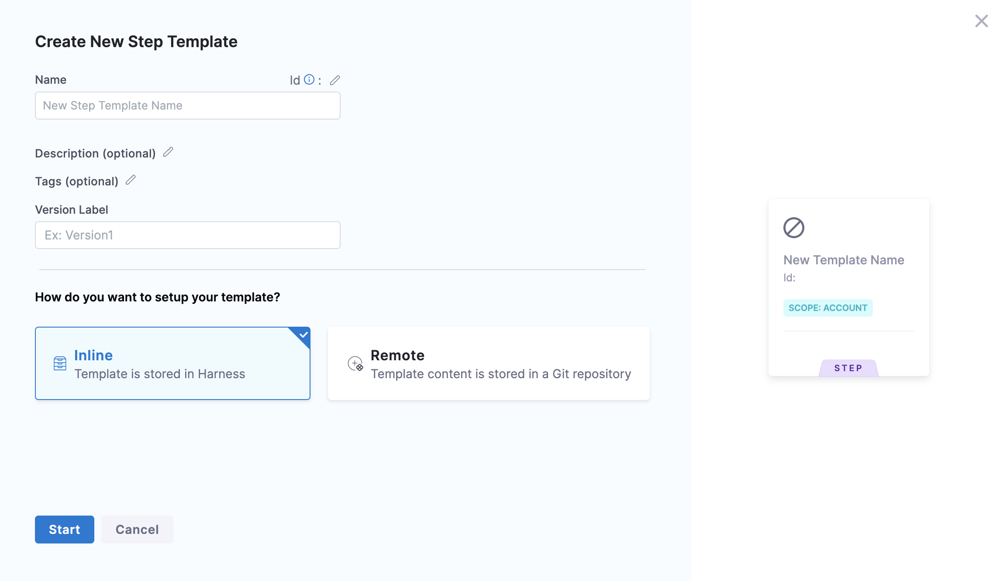
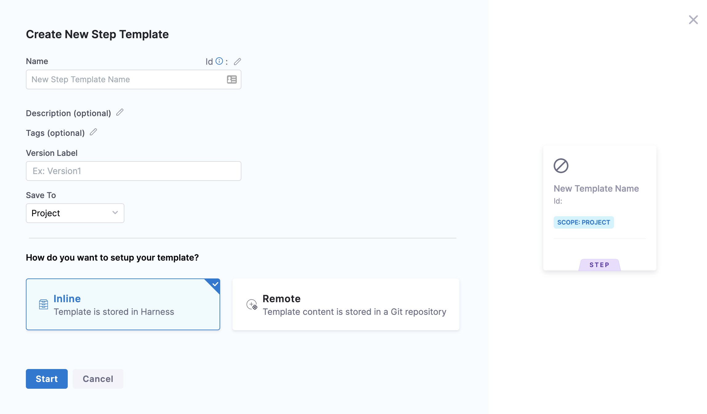
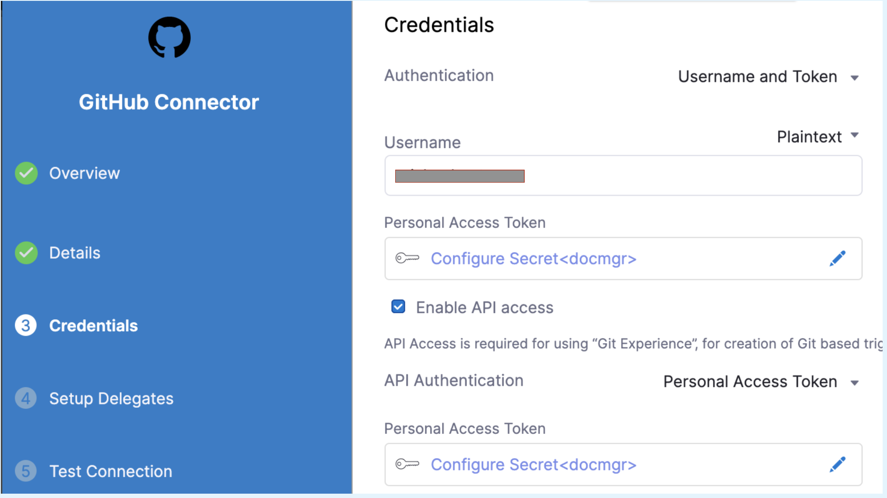
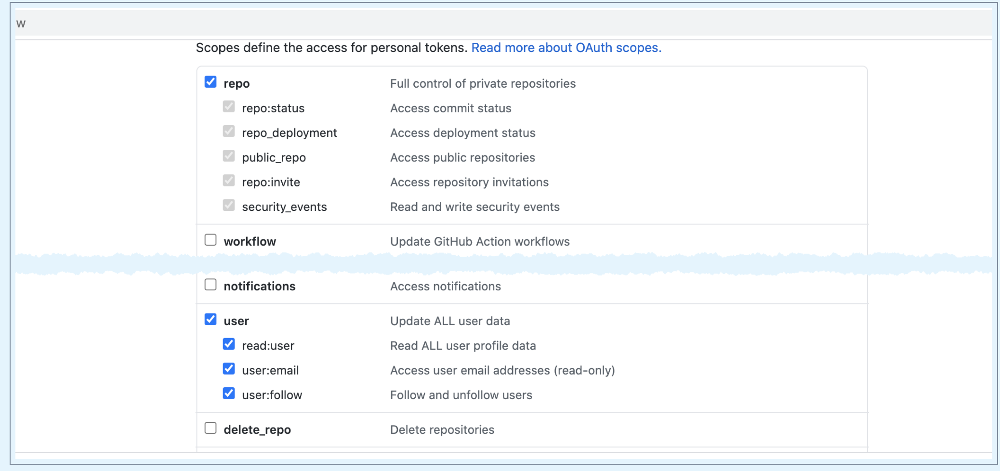
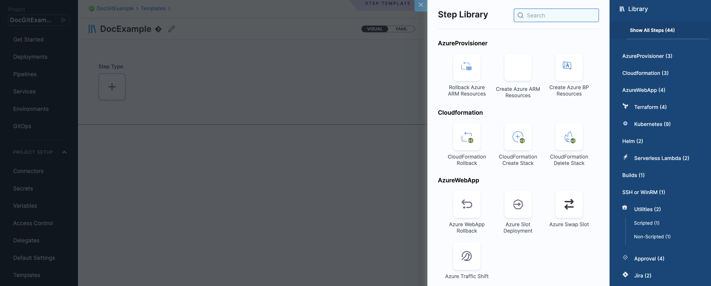
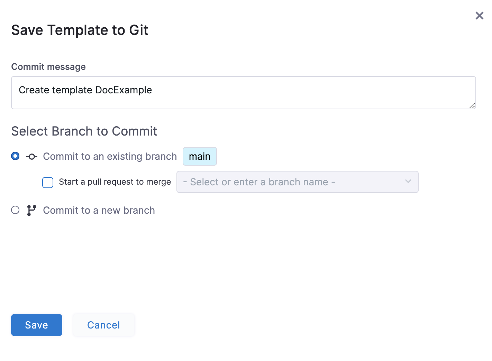
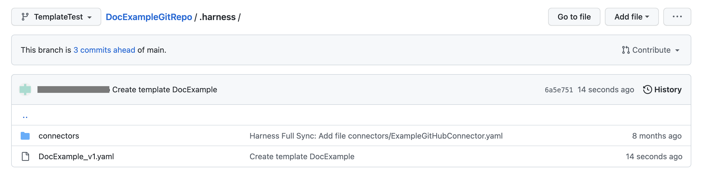
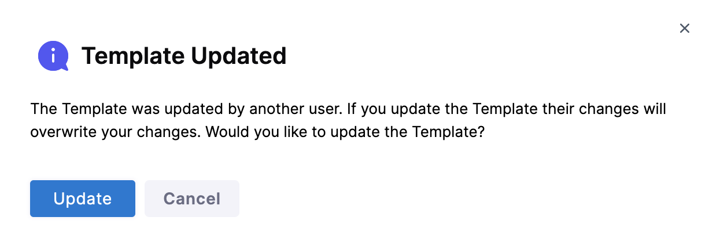

Currently, this feature is behind the feature flag `NG_TEMPLATE_GITX`. Contact Harness Support to enable the feature.​Harness enables you to add Templates to create re-usable logic and Harness entities (like Steps, Stages, and Pipelines) in your Pipelines. You can link these Templates in your Pipelines or share them with your teams for improved efficiency.

Templates enhance developer productivity, reduce onboarding time, and enforce standardization across the teams that use Harness.

You can create a Template and save it either in Harness or in a Git repository using the **Inline** or **Remote** option respectively.

This topic walks you through the steps to create a Remote Step Template.

### Objectives

You'll learn how to: 

* Create a Remote Run Step Template.​
* Define Template parameters.​

### Before you begin

* Review [Harness Key Concepts](https://docs.harness.io/article/4o7oqwih6h-harness-key-concepts)
* See [Templates Overview](template.md).
* See [CIE Quickstarts](../../continuous-integration/ci-quickstarts/ci-pipeline-quickstart.md)

### Permissions

To create a Remote Step Template make sure you have **Create/Edit** and **Access** permissions for Templates.

### Remote Step Template overview

Harness' templates allow you to design reusable content, logic, and parameters, ensuring that the application is the major focus of your Pipelines.​ Instead of creating Pipelines from scratch each time, Harness lets you select from pre-built Templates and just link them to your Pipelines. The process of developing Pipelines thus becomes easier by reducing duplication and increasing reusability.

You can reshare your work with your team and reuse it in your Pipelines.​

All your templates can be seen in **Templates** based on their scope. ​We will also call this Template Library in this topic.

Harness lets you save your Templates in Git repositories.​ For example, if you have a core Step that you want all of your Pipelines to use, you can put the template in a core repo and then refer to it. Now you can reuse this Step Template in multiple Pipelines.

For information on inline Step Template, see [Create a Step Template](run-step-template-quickstart.md).

### Use Template in a Pipeline

Harness resolves the repositories when your Pipeline starts up. After that, the same resource is used during the execution of the Pipeline. Whenever you use the templates in your Pipelines, once the templates are fully expanded, the final Pipeline runs as if it were defined entirely in the source repo.​

You can have one of the following scenarios when using a Template in your Pipeline:

* Remote Step Template and the Pipeline exist in the same Git repo.
* Remote Step Template and the Pipeline exist in different Git repos.
* Pipeline exists in Harness and the Step Template exists in Git repo.

Let us see how you can use Template in each of these situations.

#### Remote Step Template and the Pipeline exist in the same Git repo

In order to use the Template in your Pipeline if your remote Step Template and Pipeline are both present in the same Git repository, make sure your Pipeline and Template are both present in the same branch.​

#### Remote Step Template and the Pipeline exist in different Git repos

In order to use the Template in your Pipeline if your remote Step Template and Pipeline are present in different Git repositories,​ make sure your Template is present in the default branch of the specific repo.

#### Pipeline exists in Harness and the Step Template exists in Git repo

In order to use the Template in your inline Pipeline​, make sure your Template is present in the default branch of your Git repository.

### Step 1: Create a Remote Step Template

You can create a Step Template from your Account, Org or Project. This topic explains the steps to create a Step Template from the Project scope.

1. In your Harness Account, go to your Project.
2. In **Project SETUP** click **Templates**.
3. Click **New Template** and then click **Step**. The Create New Step Template settings appear.
4. In **Name**, enter a name for the Template.
5. In **Version Label**, enter a version for the Template.
6. Click **Remote**.
7. In **Git Connector**, select or create a Git Connector to the repo for your Project. For steps, see [Code Repo Connectors](https://docs.harness.io/category/code-repo-connectors).Important: Connector must use the Enable API access option and TokenImportant: The Connector must use the Enable API access option and Username and Token authentication. Harness requires the token for API access. Generate the token in your account on the Git provider and add it to Harness as a Secret. Next, use the token in the credentials for the Git Connector.​​  
For GitHub, the token must have the following scopes:​  

8. In **Repository**, select your repository. If your repository isn't listed, enter its name since only a select few repositories are filled here.​Create the repository in Git before entering it in Select Repository. Harness does not create the repository for you.
9. In **Git Branch**, select your branch. If your branch isn't listed, enter its name since only a select few branches are filled here.​Create the branch in your repository before entering it in Git Branch. Harness does not create the branch for you.​
10. Harness auto-populates the **YAML Path**. You can change this path and the file name.
11. Click **Start**.​  
Your Step Template is created and you can now add steps from the Step Library.

### Step 2: Add Step Parameters

1. In **Step Library**, select **Shell Script** under **Utilities**.  
The **Step Parameters** settings appear.​
2. ​In **Script**, enter your script.
3. Specify your **Input** **Variables** and **Output** **Variables**.
4. In **Execution Target**,​ specify where you want to execute the script.  
You can select **Specify on Target Host** or **On Delegate**.  
For more information, see [Using Shell Scripts in CD Stages](https://docs.harness.io/article/k5lu0u6i1i-using-shell-scripts).
5. Click **Save**. The **Save Template to Git** settings appear.
6. In **Select Branch to Commit**, You can select one of the following:
	1. **Commit to an existing branch**: you can start a pull request if you like.​
	2. **Commit to a new branch**:​ enter the new branch name. You can start a pull request if you like.
7. Click **Save**. Your Step Template is saved to the repo branch.​
8. Click the YAML file to see the YAML for the Step Template.
9. Edit the YAML. For example, change the name of the Template.​
10. Commit your changes to Git.​
11. Return to Harness and refresh the page.​​  
A **Template Updated** message appears.
12. Click **Update**.  
The changes you made in Git are now applied to Harness.​​

### Next steps

* [Use a Template](use-a-template.md)

