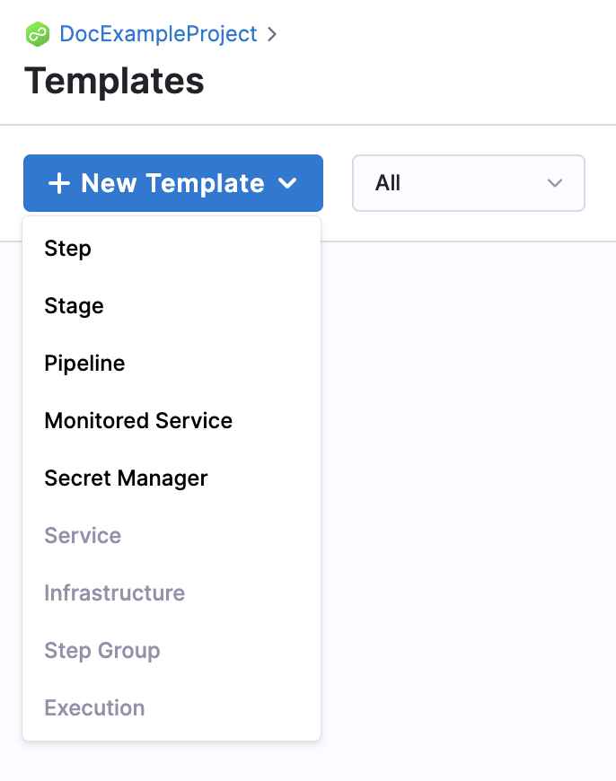
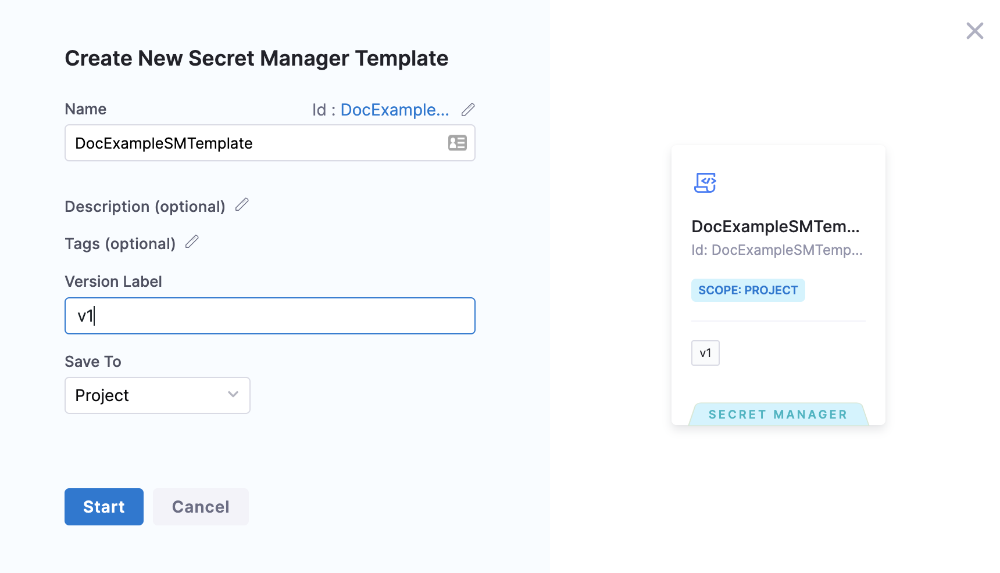
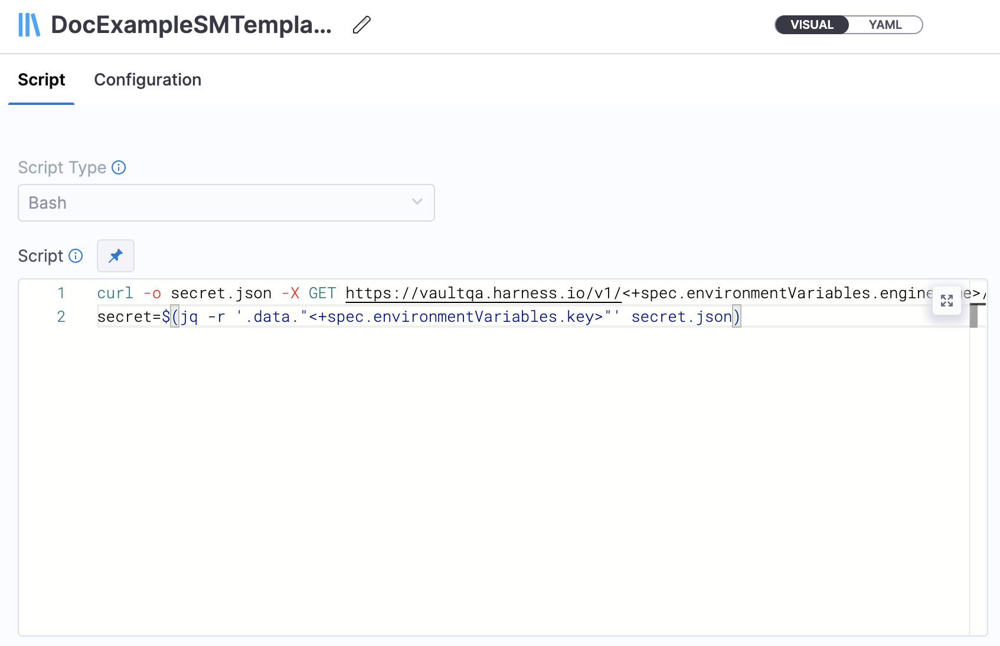
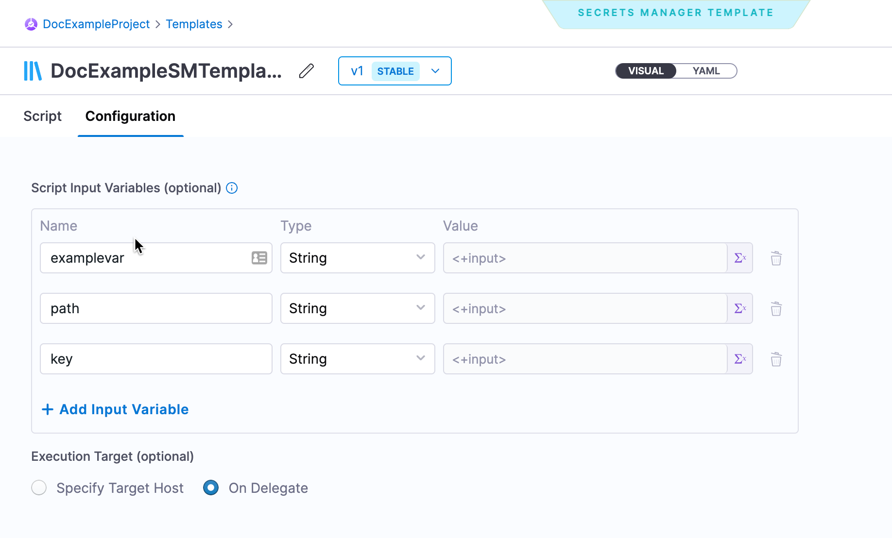
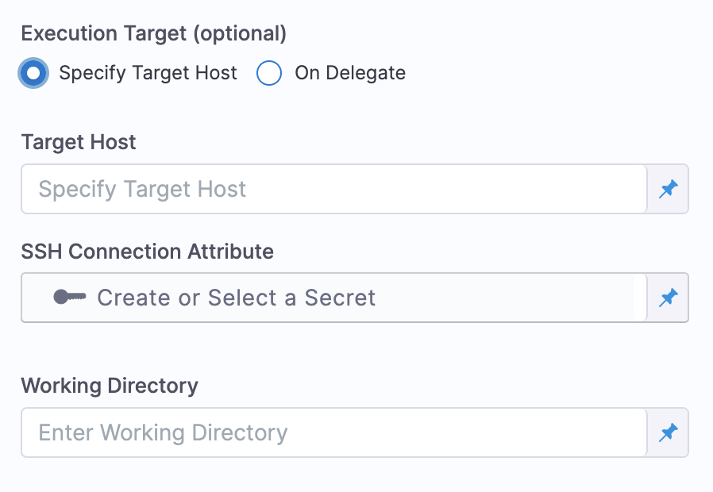

Harness enables you to add templates to create reusable logic and Harness entities like steps, stages, pipelines, and secret managers.

Harness secret manager templates let you add a shell script that you can execute either on a delegate or on a remote host that is connected to the delegate. Harness fetches and reads your secrets from the third-party secret manager through this shell script.

This topic explains how to create a secret manager template in Harness.

### Objectives

You will learn how to:

* Create a secret manager template.
* Add a shell script to the secret manager template.
* Configure input variables for the shell script.
* Use the secret manager template in a custom secret manager.

### Before you begin

* [Templates overview](template.md)
* [Harness secrets management overview](../Secrets/Secrets-Management/1-harness-secret-manager-overview.md)

### Required permissions

* You must have **Create/Edit** permissions for templates.
* You must have **Create/Edit** permissions for secrets.
* You must have **Create/Edit** permissions for connectors.

### Templates overview

* You can add secret manager templates to template libraries at any [scope](/docs/platform/role-based-access-control/rbac-in-harness#permissions-hierarchy-scopes).
* You can use [tags](../20_References/tags-reference.md) to group templates. You can search or filter templates using these tags.
* If you change the template inputs, you must update the entities referencing the template for the changes to be reflected.

### Secret manager template scope

You can add secret manager templates at any [scope](/docs/platform/role-based-access-control/rbac-in-harness#permissions-hierarchy-scopes) in Harness.

The following table shows what it means to add templates at different scopes or hierarchies:

| **Scope** | **When to add templates?** |
| --- | --- |
| **Account** | To share secret manager templates with users in the account, as well as users within the organizations and projects created within this account. |
| **Organization** | To share secret manager templates with users in the organization, as well as within the projects created within the org. |
| **Project** | To share secret manager templates with users within the project. |

### Step 1: Create a secret manager template

You can create a secret manager template in the account, org, or project scope.​ This topic shows you how to create a secret manager template at the project scope.​

To create a secret manager template, do the following:

1. In your Harness Account, go to your project.​
2. In **Project Setup**, select **Templates**, and then select **New Template**.​

   

3. Select **Secret Manager**. The **Secret Manager Template** settings appear.​
4. Enter a **Name** for your secret manager template.​
5. In **Version Label**, enter the version of the secret manager template, for example `v1`.

   

    Versioning a template enables you to create a new template without modifying the existing one. For more information, go to [Versioning](template.md).

6. Select **Start**.​

### Step 2: Add a shell script to the secret manager template

1. Enter your shell script in **Script**.

    ​

    Here is an example:
   ```
   curl -o secret.json -X GET https://vaultqa.harness.io/v1/<+spec.environmentVariables.engineName>/<+spec.environmentVariables.path> -H 'X-Vault-Token: <+secrets.getValue("vaultTokenOne")>'  
   secret=$(jq -r '.data."<+spec.environmentVariables.key>"' secret.json)
   ```
   In this example, this script assigns the secret variable to your final value. Here are the details of the entries in the script.
   - This script makes a cURL call to the API URL of the third-party secrets manager and stores the output in the file secret.json.
   - It includes some parameters such as engine name and path.
   - It uses an existing, already configured Secrets Manager for API access.
   - After fetching the file, as shown in the example, it gets the secret by using a third-party tool to retrieve the key from the data object. The key is also a parameter that can be assigned later.
   - In the script, make sure to include a variable to store the fetched secret, and make sure to name the variable `secret`.

### Configure input variables for the shell script

You can define all the parameters (engine name, path, and key in this case) as input variables when you create or edit the secret manager template.

To configure input variables for the shell script, do the following:

1. Select **Configuration**, and then select **Add Input Variable**.
2. Add **Name**, **Type**, and **Value** for the input variables in your script.  
Harness allows you to use [Fixed values and runtime inputs](../20_References/runtime-inputs.md).

   
3. Select **Execution Target**. This is where you want to execute the script that you just added.  
If you want to run the shell script on a target host and not on the Harness Delegate, you must first create the required connection attributes.  
To access an SSH-based custom secrets manager, create an SSH credential first. Go to [Add SSH keys](../Secrets/4-add-use-ssh-secrets.md) for the procedure to create SSH credentials.  
This does not apply if you want to run the custom secrets manager on the Harness Delegate.
4. Select **Specify Host** to execute the script on a specific host.
   
       

5. In **Target Host**, enter the host address.
6. In **SSH Connection Attribute**, create or select an existing secret that has the SSH credential as its value.  
7. In **Working Directory**, enter the directory name.
8. Select **Delegate**, to execute the script on a specific delegate.
9. Select **Save**. 
   Your secret manager template is now listed in the Template Library.

### See also

* [Add a custom secret manager](../Secrets/Secrets-Management/9-custom-secret-manager.md)

