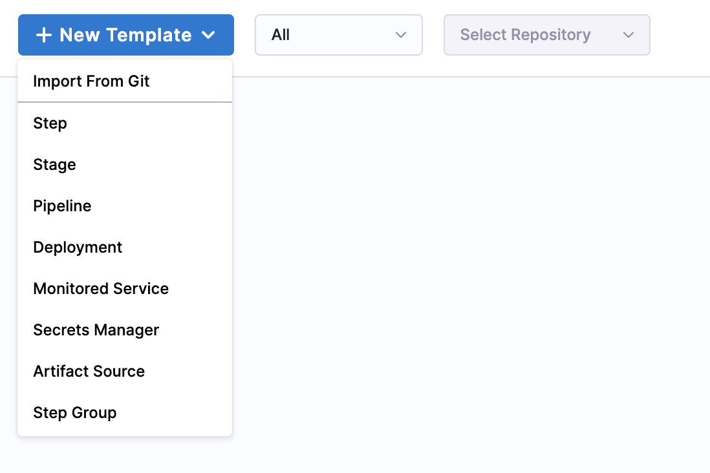
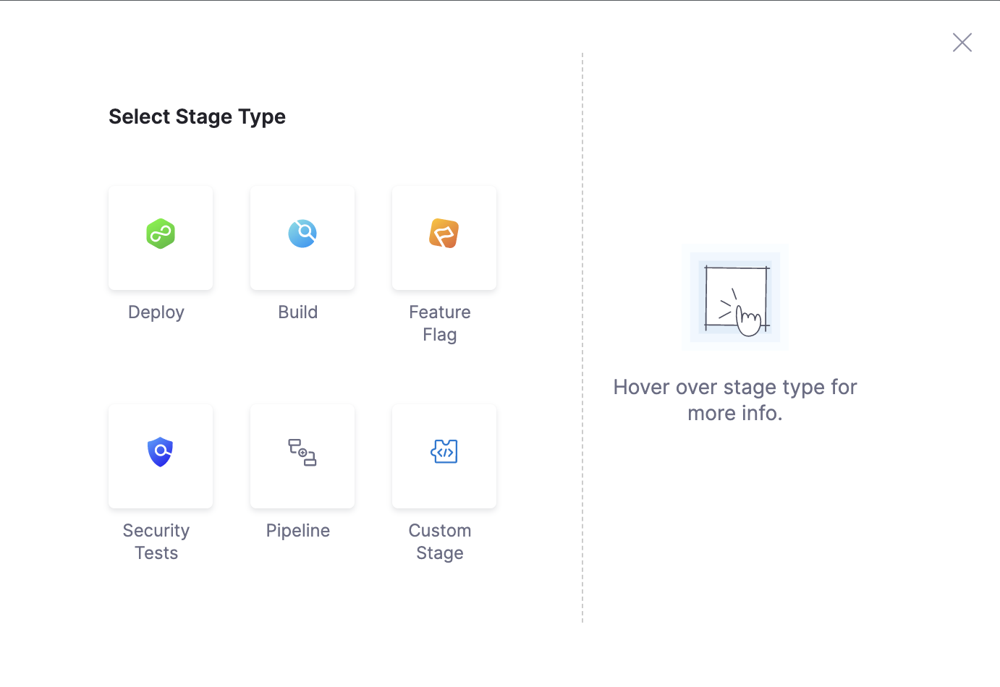

A step group in Harness is a collection of deployment steps that are executed together as a single unit. This allows you to organize and manage complex deployment processes by dividing them into smaller, manageable steps. A step group can contain any type of pipeline step, including script steps, artifact deployment steps, and infrastructure deployment steps. You can also control the order in which the steps in a step group are executed. In addition, you can specify conditions for skipping certain steps based on the outcome of previous steps. Overall, step groups are a useful tool for streamlining and organizing your deployment processes in Harness.

By creating a step group template, you can standardize and simplify your deployment processes, and reduce the time and effort required to create new pipelines and templates. When using in a deployment, you can customize certain aspects of the template. Additionally, you can apply conditions to the steps in a step group template to make it more flexible and reusable in different deployment scenarios. 

You can create a step group template at the project, organization, and account levels.

## Video

Here is a video that provides a quick overview of the step group template:
<!-- Video:
https://harness-1.wistia.com/medias/x5wsia9i08-->
<docvideo src="https://harness-1.wistia.com/medias/x5wsia9i08" />

## Create a step group template

Let's start by creating a template in the project scope within the **Deployments** module. You can do this in any project.

To create a template, do the following:

1. In Harness, navigate to the **Deployments** module.
2. In **Projects**, select the desired project.
3. Under **Project Setup**, select **Templates**.
4. Select **New Template**.
5. Select **Step Group** to create a stage template.
   
   

   The **Create New Step Group Template** settings appear.

6. In **Name**, enter a name for the template.
7. In **Version Label**, enter the version of the stage, for example `v1`.
8. In **Save To**, select the scope at which you want save the template.
9. To set up your template, select one of the following: 
   - **Inline**: Save the template in Harness.
   - **Remote**: Save the template in a Git repository.
   
### Create a remote template

To create a remote template, do the following:

  1. In **Git Connector**, select or create a Git Connector to the repo for your project.​ For more information, go to [Code Repo Connectors](../7_Connectors/Code-Repositories/connect-to-code-repo.md).
  2. In **Repository**, select your repository.

     :::note
     If your repository is not listed, enter the repository name to search and select it. Create the repository in Git before entering it in **Select Repository**. Harness does not create the repository for you.

     :::
     
  3. In **Git Branch**, select your branch.​
     
     :::note
     If your branch is not listed, enter the branch name to search and select it. Create the branch in your repository before entering it in **Git Branch**. ​Harness does not create the branch for you​​
     :::

  4. ​Harness auto-populates the **YAML Path**.​ You can change this path and the file name.
  5. Select **Start**.

## Select the stage type

To select the stage type, do the following:

1. Select **Deploy**. The deploy stage type is a CD stage that enables you to deploy any service to your target environment.

   

   This topic uses the **Deploy** stage type. You can select a different stage type. 
   
   The stage type you select determines where you can reference the step group template in the pipeline. If you select **Deploy** as the stage type, you can reference the template in any pipeline's deploy stage. If you select **Build** as the stage type, you can reference the template in any pipeline's build stage.

2. In your stage, select **Add Step**, and then select **Add Step**.

   1. Select a step type from the step library.

   2. For this example, let's add a **Canary Deployment** step.

   3. Enter a name for the step, and then select **Apply Changes**.

3. Next, add an approval step.

   1. Select **Add Step** and then select **Add Step**.

   2. In **Approval**, select **Harness Approval**.

   3. Enter a name for the step. Select the user groups, and then select **Apply Changes**.

   You can add more steps to form a step group.
   
   You can also create step group templates using the Harness API or Harness Terraform provider.

   Harness detects the step group object and automatically creates the step group template based on the YAML body. You need not define any additional fields in the API or Terraform provider.

   For more information on creating templates using API, go to [Create a Template](https://apidocs.harness.io/tag/Templates#operation/createTemplate).

   For more information on creating templates using Terraform Provider, go to [Platform Template](https://registry.terraform.io/providers/harness/harness/latest/docs/resources/platform_template).

Here is an example of a step group template YAML.
   
   ```YAML
    template:
    name: Validate Kubernetes Rollout
    type: StepGroup
    projectIdentifier: docproject
    orgIdentifier: docorg
    spec:
        steps:
        - step:
            type: K8sDryRun
            name: Output Servie Manifest
            identifier: Output_Servie_Manifest
            spec: {}
            timeout: 10m
        - step:
            type: HarnessApproval
            name: Approve Harness Manifests
            identifier: Approve_Harness_Manifests
            spec:
                approvalMessage: Please review the following information and approve the pipeline progression
                includePipelineExecutionHistory: true
                approvers:
                userGroups:
                    - account._account_all_users
                minimumCount: 1
                disallowPipelineExecutor: false
                approverInputs: []
            timeout: 1d
        - step:
            type: K8sRollingDeploy
            name: Rolling Deployment
            identifier: Rolling_Deployment
            spec:
                skipDryRun: false
                pruningEnabled: false
            timeout: 10m
        stageType: Deployment
        when:
        stageStatus: Success
        condition: <+input>
    identifier: Validate_Kubernetes_Rollout
    versionLabel: "1.0"
```

4. Select **Save** to save the step group template.

## Add details for conditional execution

A step group can have its own conditional execution settings. This is in addition to the conditional execution settings at the stage level. The conditional execution settings of the step group apply to all of its steps.

For more information, go to [Step Skip Condition Settings](../8_Pipelines/w_pipeline-steps-reference/step-skip-condition-settings.md).

The conditional execution settings of any step in a step group overrides the conditional execution settings of the step group.

If you do not use step group conditional execution settings, then the stage's conditional execution settings are applied.

## Add a failure strategy

A step group can have its own **Failure Strategy** separate from the failure strategy for the stage.

The failure strategy can execute the rollback steps for the step group.

For more information, go to [Step and stage failure strategy references](../8_Pipelines/w_pipeline-steps-reference/step-failure-strategy-settings.md).

The failure strategy of any step in a step group overrides the failure strategy of the step group.

If you do not use a step group failure strategy, then the stage's failure strategy is applied.

## Add looping strategy

Select one of the following **Looping Strategy** options to run step multiple times with different inputs: 
- Matrix
- Repeat
- Parallelism

For more information, go to [Looping strategies overview](../8_Pipelines/looping-strategies-matrix-repeat-and-parallelism.md)

Select **Save**. Enter a comment for the changes, and then select **Save**.

## Add the step group template to a pipeline

You can use the step group template in any pipeline within your project.

To add a step group template to a pipeline, do the following: 

1. Go to the pipeline, and then select the stage where you want to add the template.
2. Select **Add Step**.
3. Select **Use template**.
4. Select your step group template from the list of templates.
5. Select **Use Template**.
6. Enter a name for the template, and then select **Apply Changes**.
7. Select **Save**.
   Your pipeline now includes a reference to the template.
