Harness Templates let you standardize builds for all your services and distribute them across teams. Simply put, Templates are reusable builds with a common configuration that conforms to organizational standards, making maintenance easier and less prone to errors.

A Pipeline Template lets you distribute reusable pipelines across your team or among multiple teams. Instead of building pipelines from scratch, Pipeline templates simplify the process by having parameters already built-in.

For example, you can automate your build and deploy services by adding a Pipeline Template. You can link the following Templates to your Pipeline Template:

* Build stage - To push the artifact to the registry, run tests, and security scans.
* Staging deploy stage - To deploy to Dev, QA.
* Approval stage - To add approval stages for PROD.
* Prod deploy stage - To deploy to Production.

This topic walks you through the steps to create a Pipeline Template.

### Before you begin

* Review [Templates Overview](template.md) to understand different concepts of Templates.
* Review [Permissions Reference](../4_Role-Based-Access-Control/ref-access-management/permissions-reference.md) to know about the permissions required to create a Template at various scopes.
* Review [Pipelines and Stages](https://docs.harness.io/category/pipelines).

### Limitations

Failure strategy and notification settings can only be provided when you create a Template.

### Review: Permissions Requirements

You need Create/Edit, Delete, and Access permissions on Templates to create a Pipeline Template. See [Permissions Reference](../4_Role-Based-Access-Control/ref-access-management/permissions-reference.md).

### Review: Pipeline Template Scope

You can add Templates at any [scope](../4_Role-Based-Access-Control/1-rbac-in-harness.md) in Harness.

The following table shows what it means to add Templates at different scopes or hierarchies:

|  |  |
| --- | --- |
| **Scope** | **When to add Templates?** |
| **Account** | To share Step/Stage/Pipeline Templates with users in the Account, as well as users within the Organizations and Projects created within this Account. |
| **Organization** | To share Step/Stage/Pipeline Templates with users in the Organization as well as within the Projects created within the Org. |
| **Project** | To share Step/Stage/Pipeline Templates with users within the Project. |

### Visual Summary

Here is a quick overview of Pipeline Templates:

* You can add a Pipeline Template to Account, Org, or Project [scope](../4_Role-Based-Access-Control/1-rbac-in-harness.md#rbac-scope).
* You can either link an existing Stage Template or add a stage to your Pipeline Template.
* For any new step that you add to your Pipeline stage, you can either link to a Step Template or add a step.

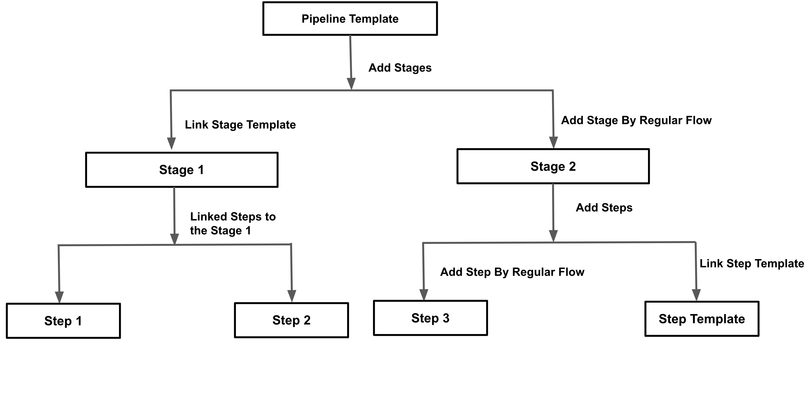

### Step 1: Add a Template

First, we'll create a Project-level Template in the Deployments module. You can do this in any Project.

Navigate to the **Deployments** module and in **Projects** select the desired project.

Select **Templates** under Project Setup.

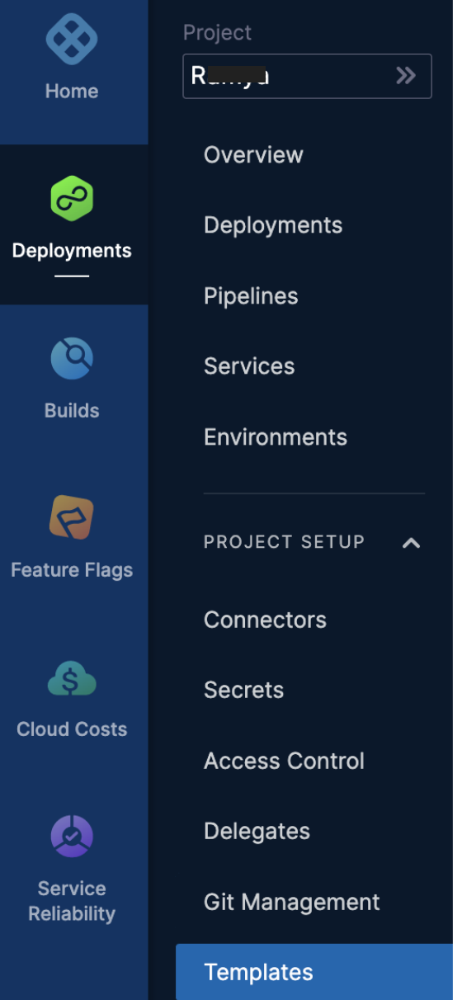

In **Templates**, click **New Template**.

Select **Pipeline** to create a Pipeline Template**.**

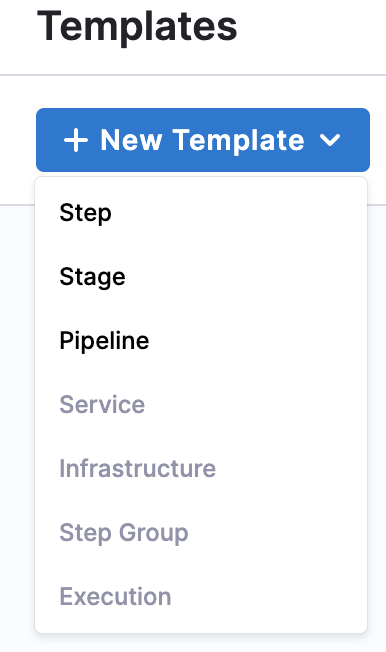

The **Create New Pipeline Template** settings appear.

In **Name**, enter a name for the Pipeline. For example Quickstart.

In **Version Label**, enter the version of the stage. For example v1. [Versioning](template.md) a Template enables you to create a new Template without modifying the existing one. For more information, see Versioning.

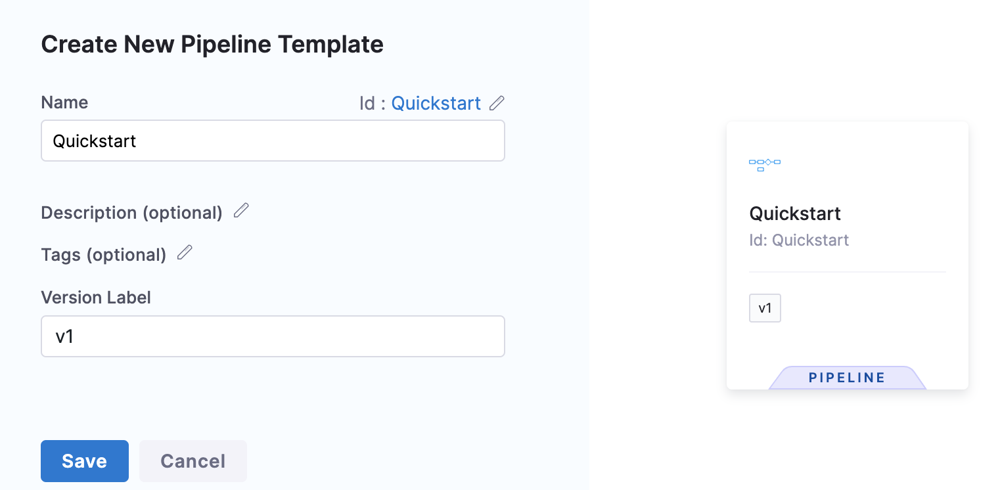

You'll see the Git Repository Details option only if you're creating a Template on a Git-enabled Project. For more information on Git Sync, see [Harness Git Sync](../10_Git-Experience/git-experience-overview.md).In **Git Repository Details**, in **Repository Display Name**, select your Git repository and Branch.

Once you've entered all the details, click **Continue**.

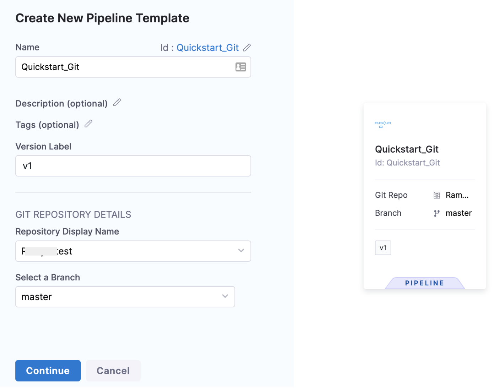

### Step 2: Add a Stage

Click **Add Stage**. The **Select Stage Type** settings appear.

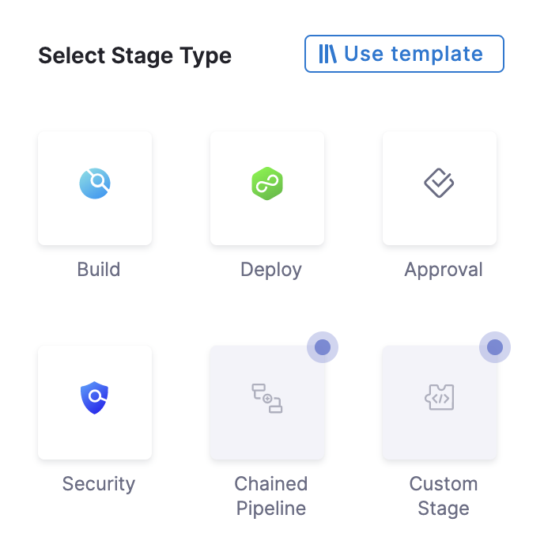

Select **Deploy**. The Deploy stage type is a CD Stage that enables you to deploy any Service to your target environment.

You can also select Build for CI, and Approval for Manual and Jira Approval Stages. More options will be added soon. This document uses the Deploy stage type.The **About Your Stage** settings appear.

In **Stage Name**, enter a name for your Stage.

Select the entity that this stage should deploy. Currently, for Deploy, only Service can be deployed and it is selected by default.

Click **Set Up Stage**.

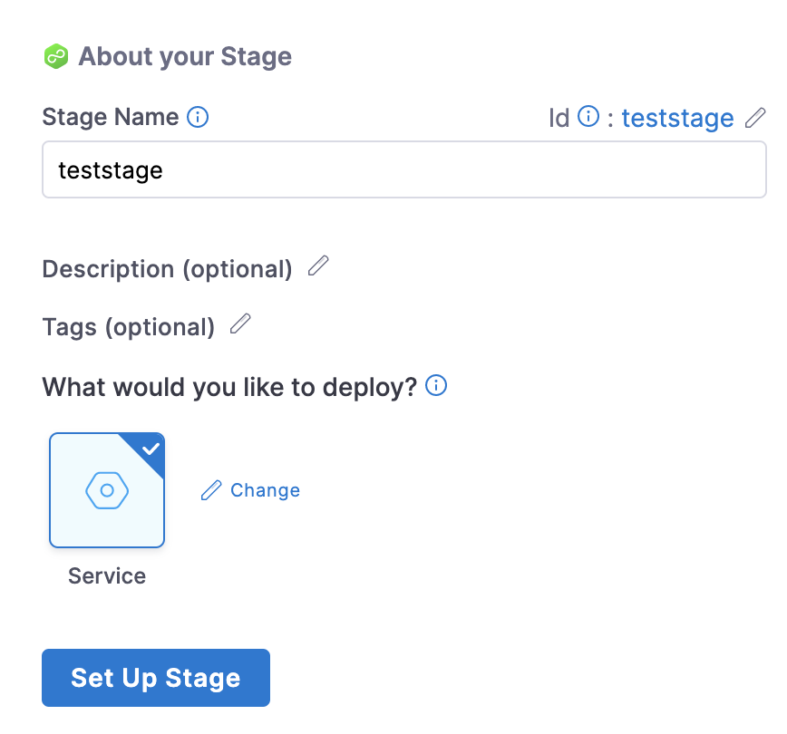

### Step 3: Add Service Details

In **About the Service**, select the Service that you want to deploy from the **Specify Service** drop-down list. You can also use [Fixed Values, Runtime Inputs, and Expressions](../20_References/runtime-inputs.md).

**Use Runtime Inputs instead of variable expressions:** when you update Template settings in a Stage or step Template, use [Runtime Inputs](../20_References/runtime-inputs.md) instead of variable expressions. When Harness tries to resolve variable expressions to specific Stage-level settings using fully-qualified names, it can cause issues at runtime. Every Pipeline where the Stage or step Template is inserted must use the same names for fully-qualified name references to operate. With Runtime Inputs, you can supply values for a setting at deployment runtime.In **Service Definition**, select the **Deployment Type**. Deployment Type defines how your Service will be deployed.

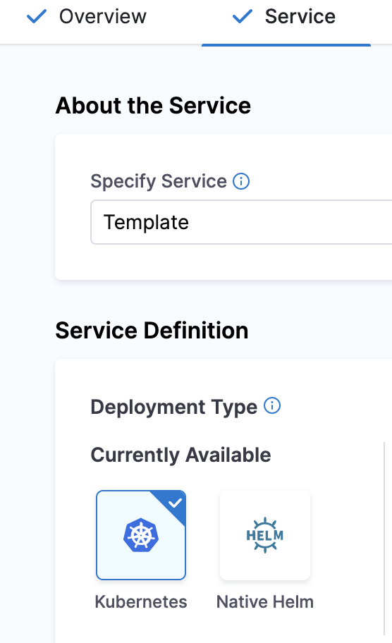

### Step 4: Add Infrastructure Details

In **Infrastructure**, in **Specify Environment**, select the setting for your Pipeline execution, for example, **Runtime input**. Harness Pipelines allow you to use [Fixed Values, Runtime Inputs, and Expressions](../20_References/runtime-inputs.md). Environments represent your deployment targets logically (QA, Prod, etc). You can add the same Environment to as many stages as you need.

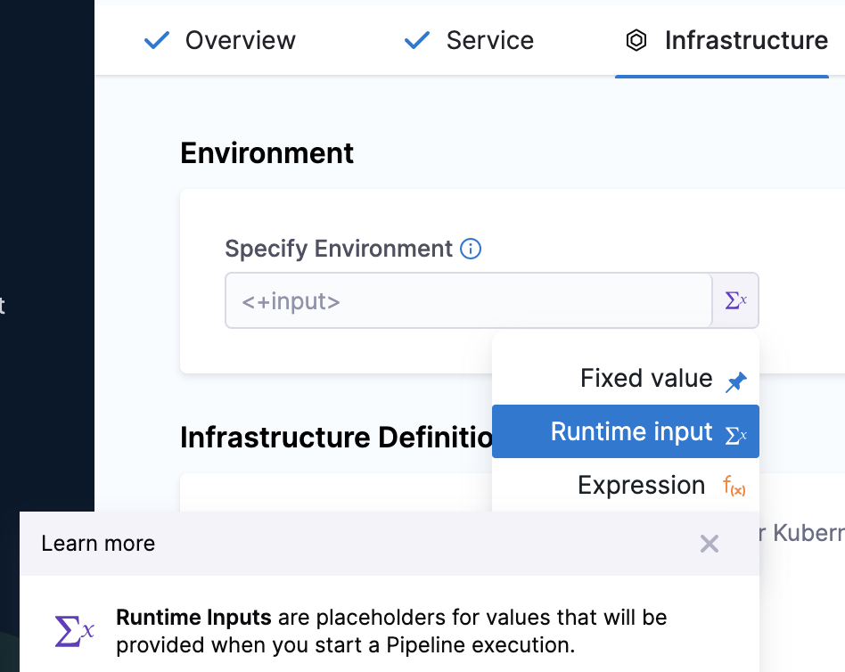

In **Infrastructure Definition**, select the method for Harness to reach your Kubernetes Cluster. Infrastructure Definitions represent the physical infrastructure of the Environment. They are the actual clusters, hosts, etc. For example, the target Infrastructure Definition for a Kubernetes deployment. By separating Environments and Infrastructure Definitions, you can use the same Environment in multiple stages while changing the target infrastructure settings with each stage.

In **Cluster Details**, enter **Connector** and **Namespace** details. Harness Pipelines allow you to use [Fixed Values, Runtime Inputs, and Expressions](../20_References/runtime-inputs.md) also.

In **Connector**, select a Connector from the drop-down list. To create a new Connector, see [Kubernetes Cluster Connector Settings Reference](../7_Connectors/ref-cloud-providers/kubernetes-cluster-connector-settings-reference.md) and [Add a Kubernetes Cluster Connector](../7_Connectors/add-a-kubernetes-cluster-connector.md).

In **Namespace**, enter the namespace. For example, default.

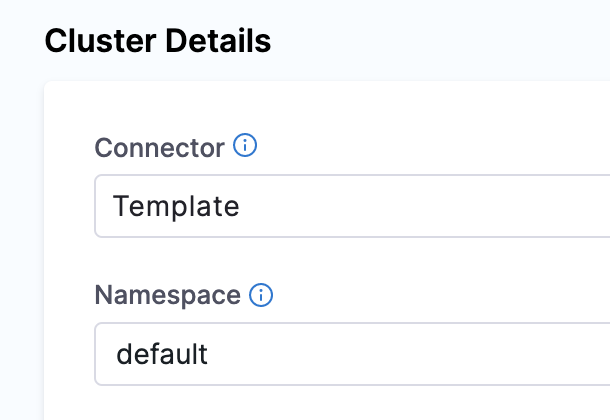

Click **Next**. The **Execution Strategies** settings appear.

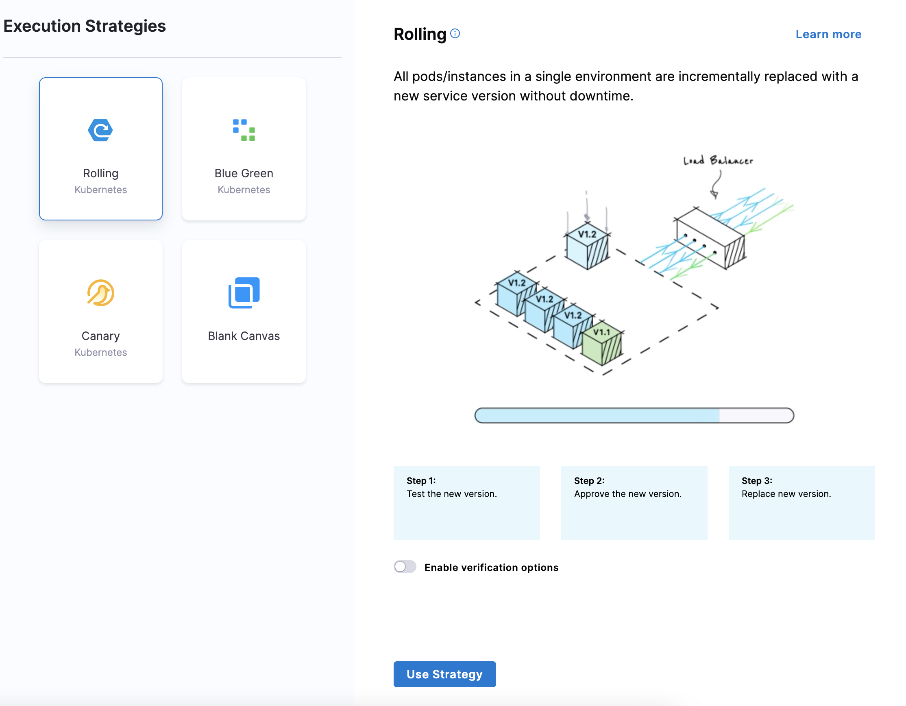

### Step 5: Define Execution Strategies

In **Execution Strategies**, select the deployment strategy for your Pipeline Template. We've used **Rolling** in this document. For more information on different execution strategies, see [Deployment Concepts and Strategies](https://docs.harness.io/article/0zsf97lo3c-deployment-concepts).

Click **Use Strategy**.

Click **Save**. The Pipeline Template is published successfully.

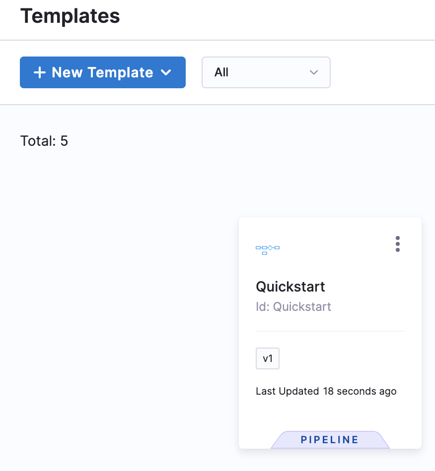

If you're using a Project which is Git-enabled, you need to provide **Save Template to Git** settings.

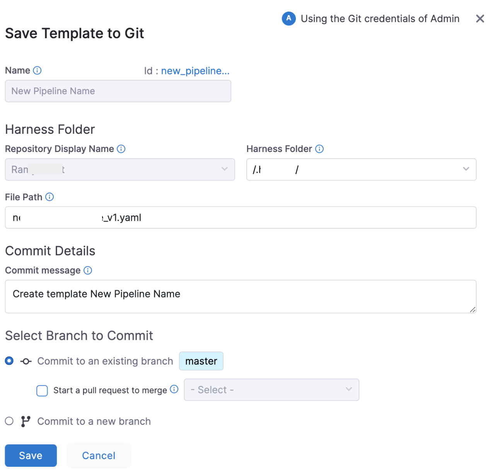

In **Harness Folder**, enter the name of the folder in your repo where you want to sync. The Harness Folder is the default folder in the repository where you are syncing your Project.

In **File Path**, enter a name for the YAML file. For example, enter`Example.yaml`. Harness will generate one automatically from the Pipeline name, but you can add your own.

In **Commit message**, enter a message for the commit that adds this Connector.

Click **Save**, and click **Save** again. You can save the Pipeline in two ways:

* As new version
* As a new Template

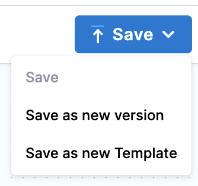

Click **Save as new Template**.

**Save as new Template** settings appear.

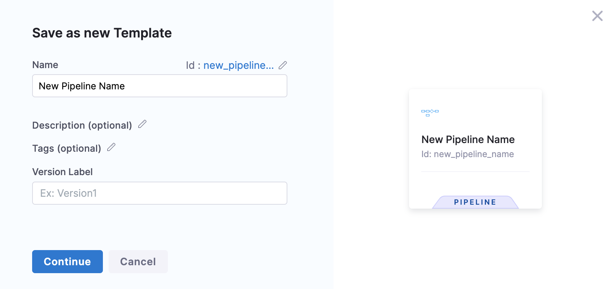

Click **Continue**. The Template is published successfully.

### Next Step

* [Use a Template](use-a-template.md)

### See also

* [Create a Step Template](run-step-template-quickstart.md)
* [Create an HTTP Step Template](harness-template-library.md)
* [Create a Stage Template](add-a-stage-template.md)

