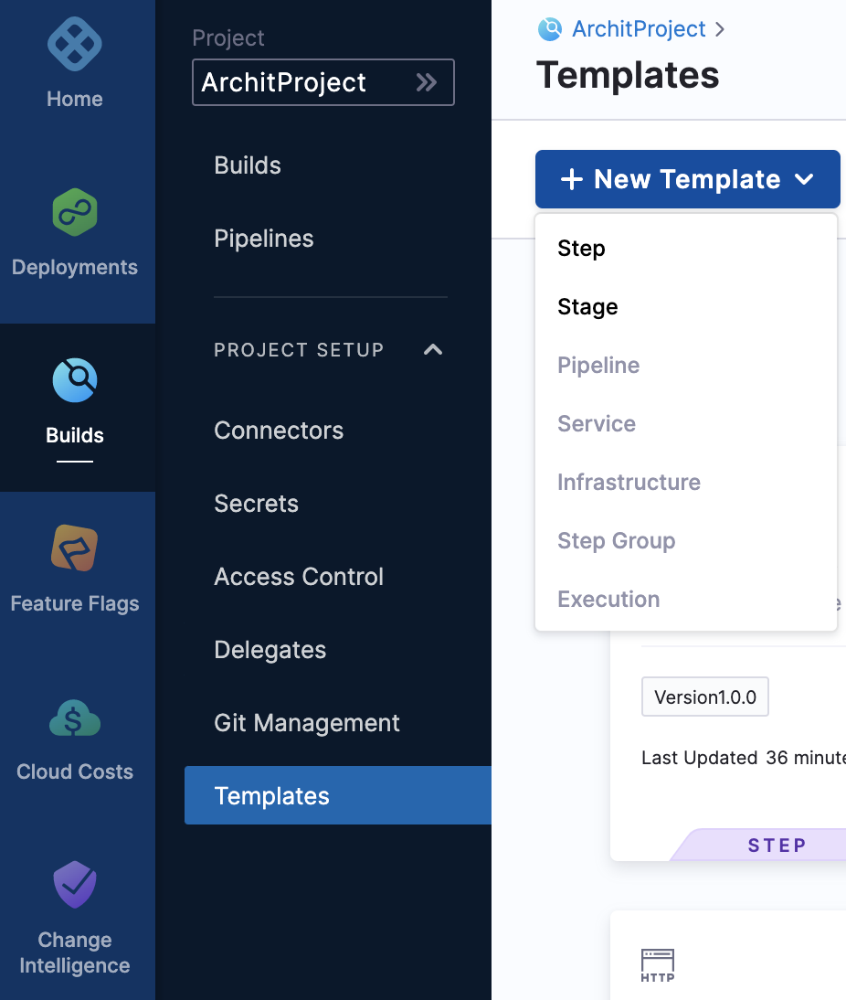
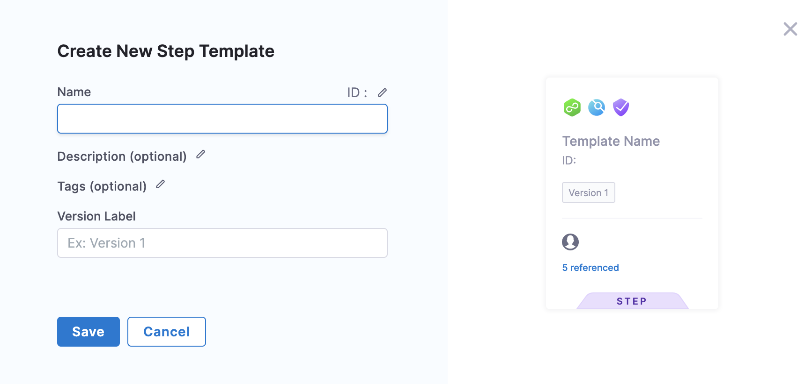
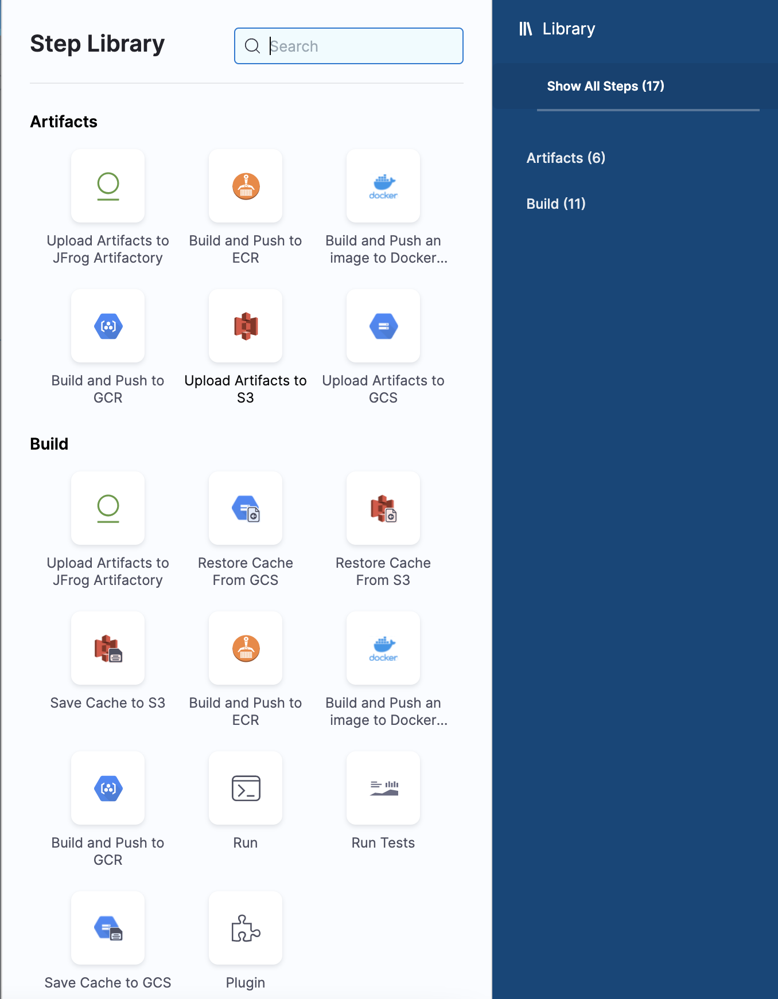
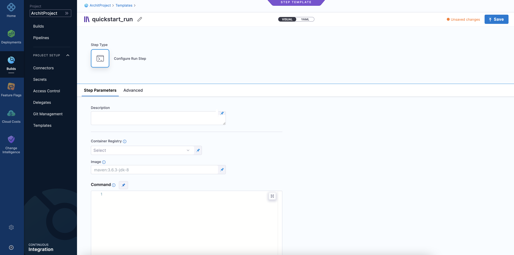
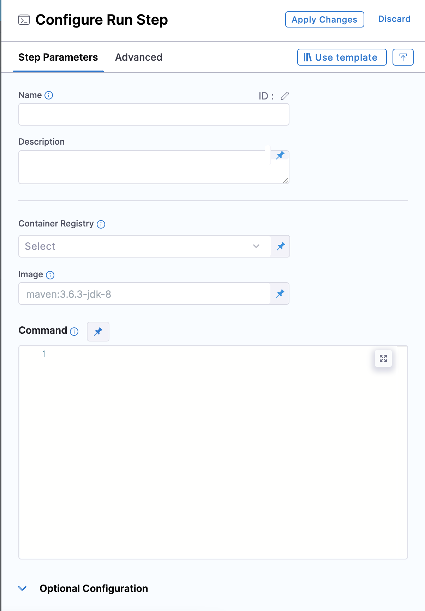
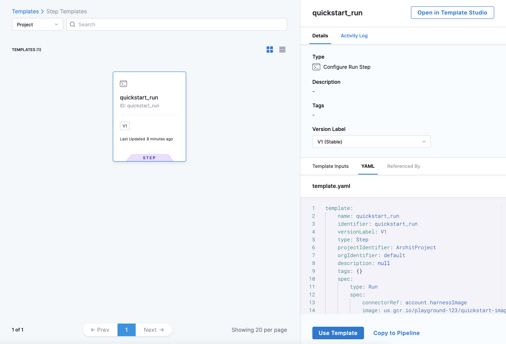
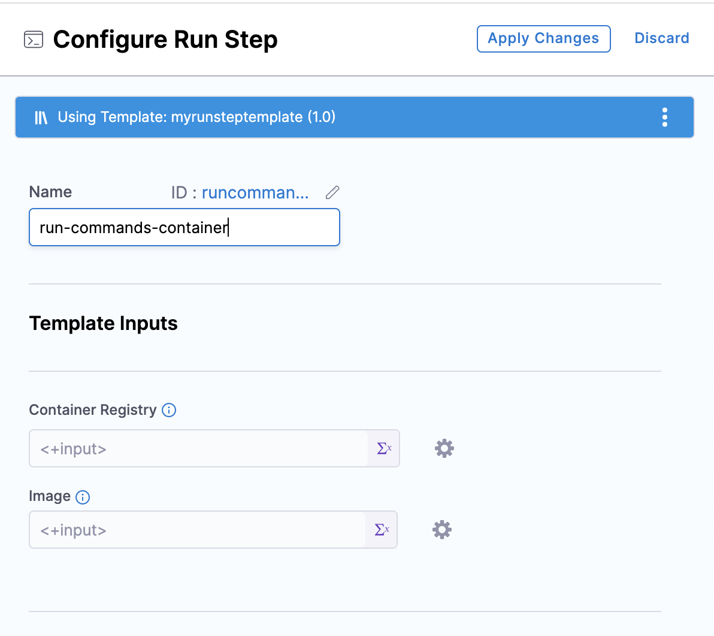

The Harness Template Library enables you to standardize and create step templates that can be re-used across Pipelines and teams that use Harness.

This topic walks you through the steps to create a Run Step template.

### Objectives

You'll learn how to: 

* Create a Run Step Template.
* Define Template parameters.
* Use the Run Step Template in a Pipeline.

### Before you begin

* Review [Harness Key Concepts](https://docs.harness.io/article/4o7oqwih6h-harness-key-concepts) to establish a general understanding of Harness.
* The Run template in this quickstart is added to a CD Pipeline. If you are new to Harness CD, see [CD Quickstarts](https://ngdocs.harness.io/category/c9j6jejsws-cd-quickstarts).
* See ​[CIE Quickstarts](../../continuous-integration/ci-quickstarts/ci-pipeline-quickstart.md).

### Step 1: Create a Template

First, we'll create a Project-level Template in the **Builds** module. You can do this in any Project.

Navigate to the **Builds** module and in **Projects** select the desired project.

Next select **Templates** under Project Setup.

Click **New Template**.

Select **Step** to create a Step Template**.**

The **Create New Step Template** settings appear.

In **Name**, enter a name for the template. You can enter Quickstart.

In **Version Label**, enter a name for the version of the template. You can enter V1.

Click **Save**. The **Step Library** panel appears.

### Step 2: Add Step Parameters

In **Step Library,** select **Run** under **Build**.

The **Step Parameters** settings appear.

Click **Container Registry** and select **Runtime input** which lets you add values when you start a pipeline execution.

In **Image,** select **Runtime input**. You can use any docker image from any docker registry, including docker images from private registries.

In **Command**, select **Runtime input.**

Click **Save**. The new Template appears under the **Templates** list.

**Use Runtime Inputs instead of variable expressions:** when you want to template settings in a Stage or step template, use [Runtime Inputs](../20_References/runtime-inputs.md) instead of variable expressions. When Harness tries to resolve variable expressions to specific Stage-level settings using fully-qualified names, it can cause issues at runtime. Every Pipeline where the Stage or step template is inserted must utilize the exact same names for fully-qualified name references to operate. With Runtime Inputs, you can supply values for a setting at deployment runtime.

### Step 3: Add the Run Step Template to a Pipeline

To add a Run Step Template in a Pipeline Execution select the step and click **Add Step**.

The **Step Library** panel appears.

In **Step Library,** select **Run** under **Build**. The **Configure Run** **Step** settings appear.

Click **Use Template.** The next page lists all the Project-level templates.

Select the Template that you created.

Click the **Activity Log** to track all Template events. It shows you details like who created the Template and Template version changes.

Click **Version Label.**

Select **Always use the** **Stable** **version** of the template. This ensures that any changes that you make to this version are propagated automatically to the Pipelines using this template.

Click **Use Template.**

In **Container Registry**, select **Runtime input**.

In **Image**, select **Runtime input**.

In Command, select **Runtime input.**

Click **Apply Changes**.

Click **Save**.

