Harness enables you to add Templates to create re-usable logic and Harness entities (like Steps, Stages, and Pipelines) in your Pipelines. You can link these Templates in your Pipelines or share them with your teams for improved efficiency.

Templates enhance developer productivity, reduce onboarding time, and enforce standardization across the teams that use Harness.

This topic provides an overview of Templates in Harness.

### Limitations

Harness Templates have the following temporary limitations at this point:

* Deleting an existing Template with active Pipeline references, deletes the references too.
* If you convert a runtime input in a Template to a fixed value, the input type does not change in the linked Pipeline. You must manually edit the linked Pipeline YAML and give the fixed values.
* If you convert a fixed type input to a runtime input in your Template, the input type does not change in the linked Pipeline. You must click the Template in the linked Pipeline to refresh it and save the Pipeline again.

### What is a Template in Harness?

Harness' templates allow you to design reusable content, logic, and parameters, ensuring that the application is the major focus of your Pipelines. Instead of creating Pipelines from scratch each time, Harness lets you select from pre-built Templates and just link them to your Pipelines. The process of developing Pipelines thus becomes easier by reducing duplication and increasing reusability.

You can reshare your work with your team and reuse it in your Pipelines.

You can add Templates to Harness CI and CD modules. All your Templates can be seen in **Templates** based on their scope. We will also call this **Template Library** in this topic.

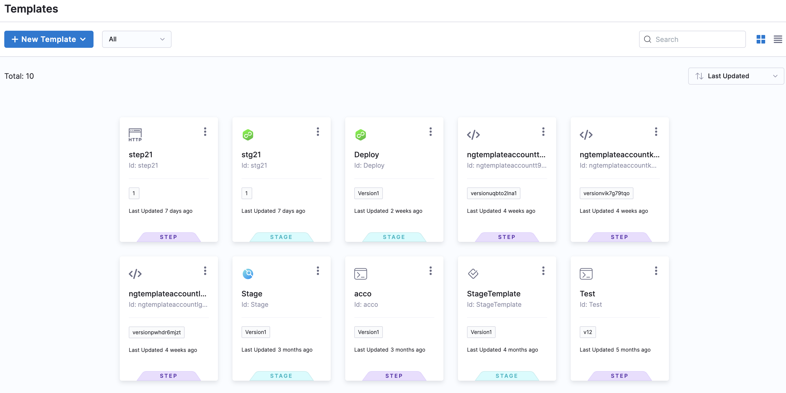

You can do the following with Templates in Harness:

* Add multiple versions for a specific Template.
* Preview, Copy, Edit, and Delete a specific Template.
* Create nested Templates. For example, you can link a Step Template to a Stage Template and link this Stage Template to a Pipeline template.
* Keep track of all Template events with the **Activity Log** option. It shows you details like who created the Template and Template version changes.
* Clone Templates in Git and then sync them with Harness using [Harness Git Experience](../10_Git-Experience/git-experience-overview.md).

### Why Should You Use Templates?

* Templates are a very convenient way of sharing common logic in a centralized way without duplicating it on multiple Pipelines.  
For example, if you have some tasks or operations that every Pipeline must do, then make them a part of a Template. Now use this Template in your Pipelines.
* Reduce the complexity and size of creating a single Pipeline.
* Set a pattern that you and your team can follow throughout your Pipelines.
* Save time and create generic templates that you can use across the scopes in your Harness Account.
* Add or remove a change in one file rather than a lot of stages.

### Templates at Scopes

You can add Templates at any [scope](../4_Role-Based-Access-Control/1-rbac-in-harness.md) in Harness.

The following table shows what it means to add Templates at different scopes or hierarchies:


|  |  |
| --- | --- |
| **Scope** | **When to add Templates?** |
| **Account** | To share Step/Stage/Pipeline Templates with users in the Account, as well as users within the Organizations, and Projects created within this Account. |
| **Organization** | To share Step/Stage/Pipeline Templates with users in the Organization as well as within the Projects created within the Org. |
| **Project** | To share Step/Stage/Pipeline Templates with users within the Project. |

### What Are The Types of Templates in Harness?

You can add the following types of Templates to your Harness Account/Org/Project:

* Step
* Stage
* Pipeline

#### Step Template

To define a linear sequence of operations for a job.

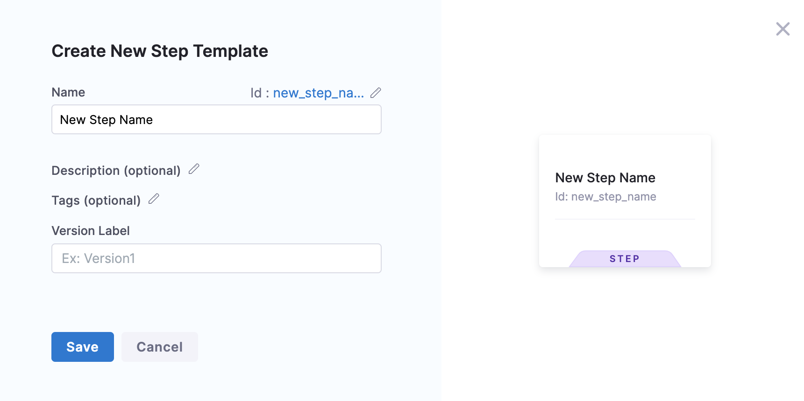
For detailed steps to add a Step Template, see [Create a Step Template](run-step-template-quickstart.md).

#### Stage Template

To define a set of stages of related jobs.

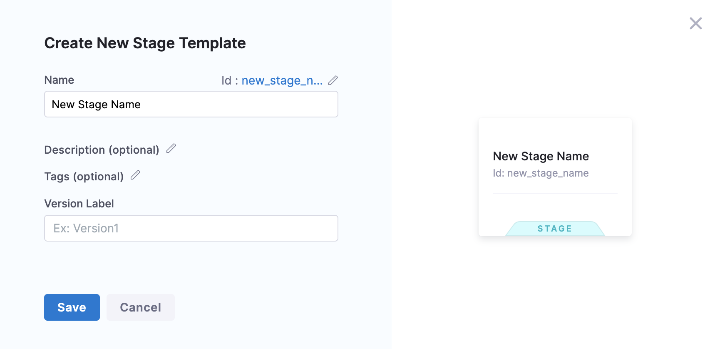
For detailed steps to create a Stage Template, see [Create a Stage Template](add-a-stage-template.md).

#### Pipeline Template

You can create your own Pipeline Templates to standardize and distribute reusable Pipelines across your team or among multiple teams. The underlying structure of a Pipeline Template is the same as that of a Pipeline YAML.

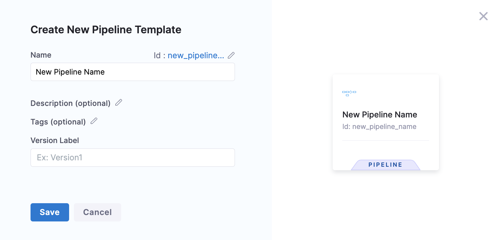
With Pipeline Templates you can:

* Create a Template based on an existing Pipeline.
* Share the Template across scopes in Harness.

For detailed steps to create a Pipeline Template, see [Create a Pipeline Template](create-pipeline-template.md).

### Versioning

Versioning a Template enables you to create a new Template without modifying the existing one. When you plan to introduce a major change in a Project that depends on an existing Template, you can use versioning. You can create multiple versions of a Template.

You can make changes to the same version of the Template as long as the Template's inputs remain unaltered. You must create a new version of the Template for any changes in the inputs.

#### Stable Version

A stable version is a template that only introduces breaking changes in major release milestones.

When using a Template, you can either link to a specific version or always use the stable version. When you mark a new version of the template as stable, it is automatically picked up to link to the Pipeline.

You can set any version of your Template as the stable version using the **Set as Stable** option.

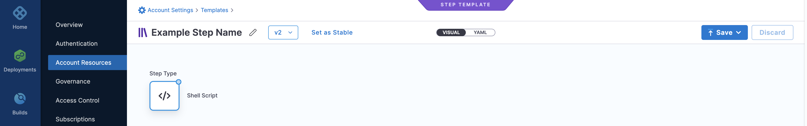
### Preview a Template

You can view the **Details** and **Activity Log** of your Template by clicking **Preview Template**.


Activity Log enables you to view and track all the events corresponding to your Template.

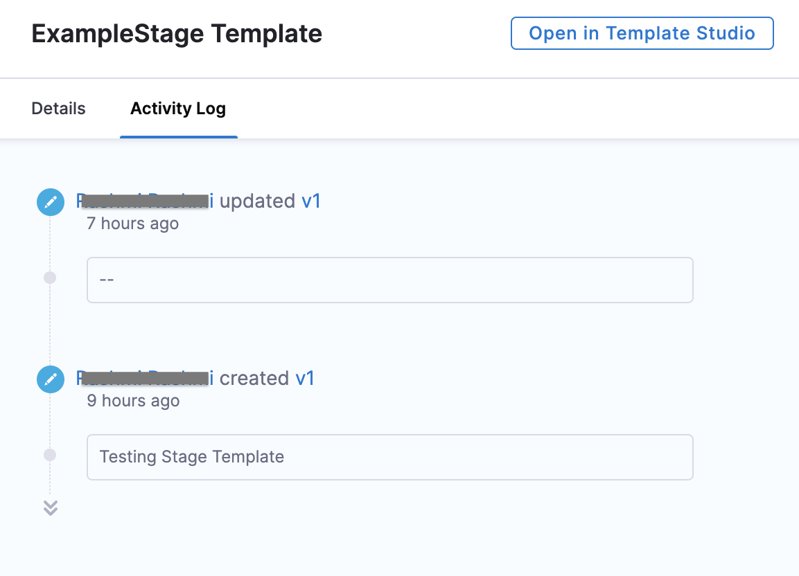
### Open/Edit a Template

You can use the **Open/Edit Template** option and navigate to the Template Studio to edit the Template as per your needs.

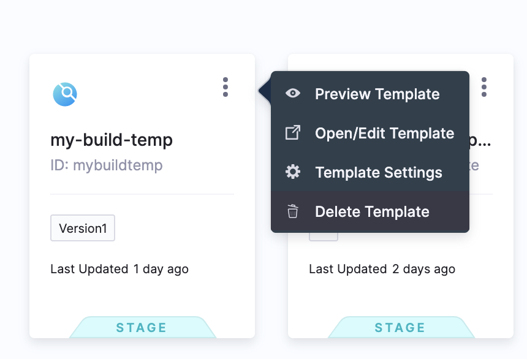
You can perform the following actions while editing a Template:

* Modify the name and version details of the Template
* Set the Template version ( to stable or any other version)
* View the YAML file for the Template
* Modify Step or Stage configurations

You can edit any version of your Template.

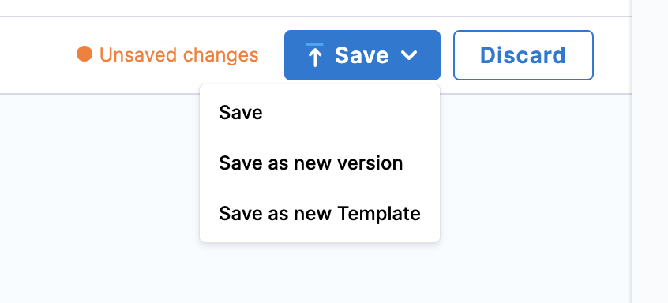
Harness enables you to choose any one of the following:

* **Save** - Save the updates in the selected version where you made the changes.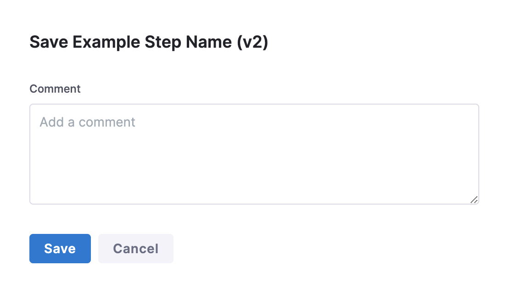
* **Save as new version** - Create a new version of the selected Template and save with the changes you just made.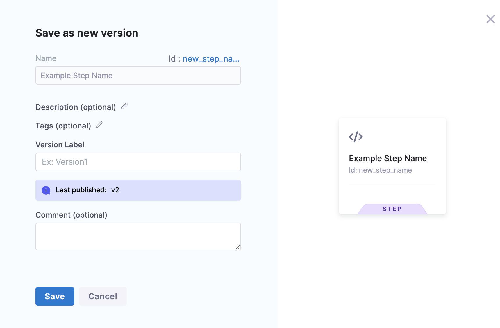
* **Save as new Template** - Create a new Template from the selected Template and save the changes you just made.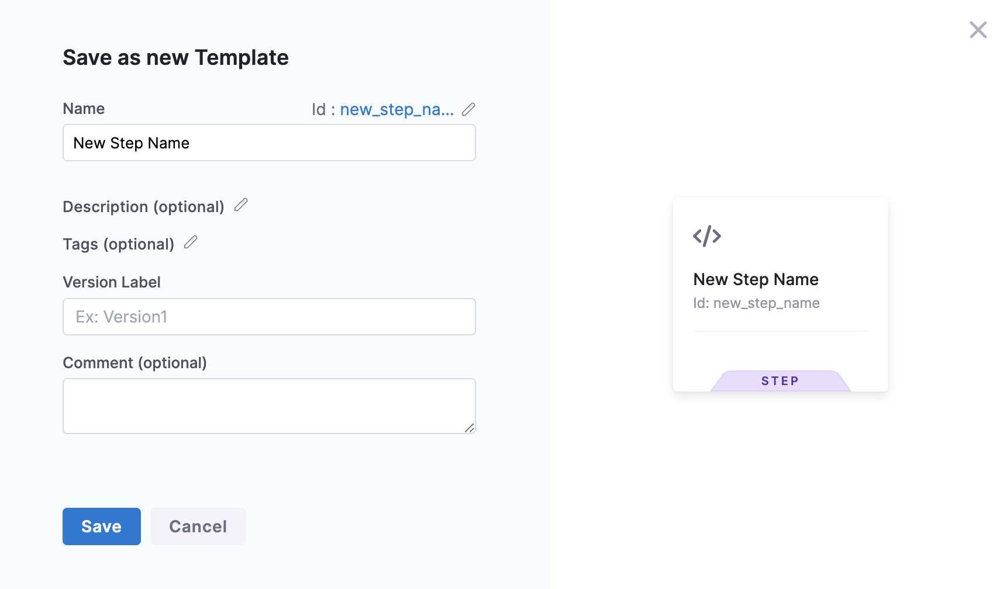

### Template Settings

You can set a specific version of your Template as the stable version by clicking on **Template Settings**.

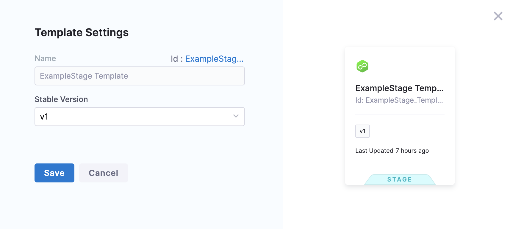
### Delete a Template

You can delete your Templates at any point. Deletion of a Template will also remove any of its references in your Pipelines.

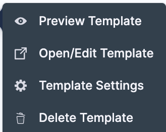
### Template Inputs

You can customize Templates by using placeholder expressions and [Runtime Inputs](../20_References/runtime-inputs.md) for their parameters and data types. Each time you run a Pipeline that uses the Template, users can provide values for these inputs.

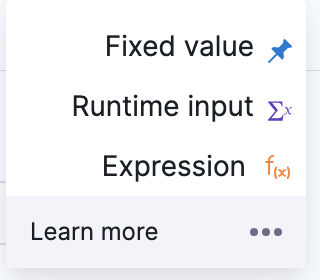
See [Fixed Values, Runtime Inputs, and Expressions](../20_References/runtime-inputs.md).

### Template YAML

You can use the Harness visual or YAML editors to create your Templates.

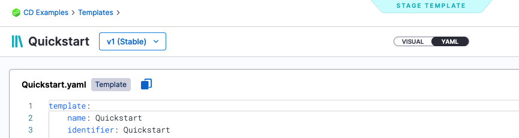
Here's an example of the YAML for a CD Stage template:


```
template:  
    name: Quickstart  
    identifier: Quickstart  
    versionLabel: v1  
    type: Stage  
    projectIdentifier: CD_Examples  
    orgIdentifier: default  
    tags: {}  
    spec:  
        type: Deployment  
        spec:  
            serviceConfig:  
                serviceDefinition:  
                    type: Kubernetes  
                    spec:  
                        variables: []  
                serviceRef: nginx  
            infrastructure:  
                infrastructureDefinition:  
                    type: KubernetesDirect  
                    spec:  
                        connectorRef: docbuilds  
                        namespace: default  
                        releaseName: release-<+INFRA_KEY>  
                allowSimultaneousDeployments: false  
                environmentRef: helmchart  
            execution:  
                steps:  
                    - step:  
                          type: K8sRollingDeploy  
                          name: Rolling  
                          identifier: Rolling  
                          spec:  
                              skipDryRun: false  
                          timeout: 10m  
                rollbackSteps: []  
            serviceDependencies: []  
        failureStrategies:  
            - onFailure:  
                  errors:  
                      - AllErrors  
                  action:  
                      type: StageRollback
```
The YAML editor is a full-fledged YAML IDE with autocomplete and other features. See [Harness YAML Quickstart](../8_Pipelines/harness-yaml-quickstart.md).

