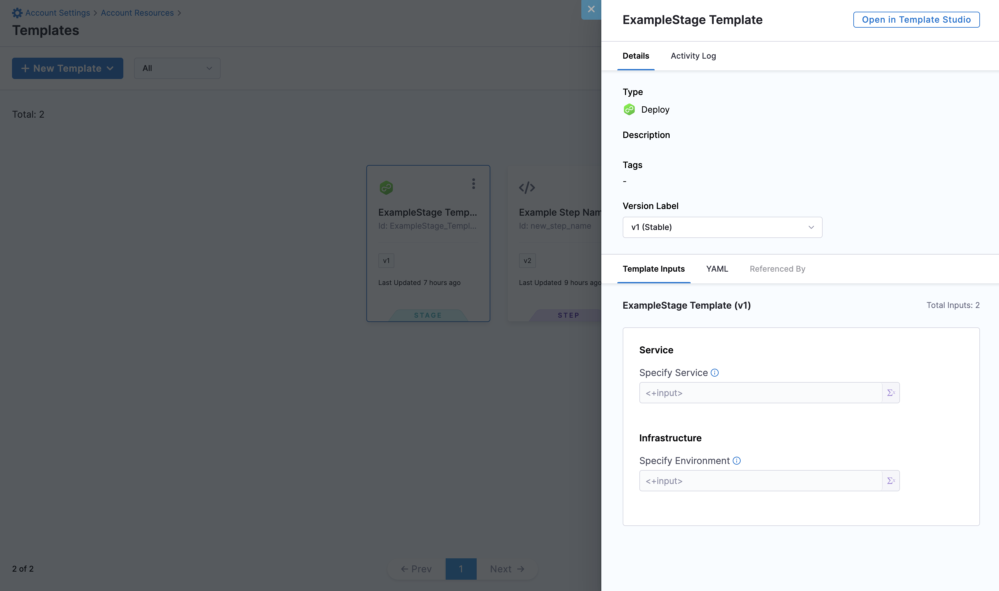
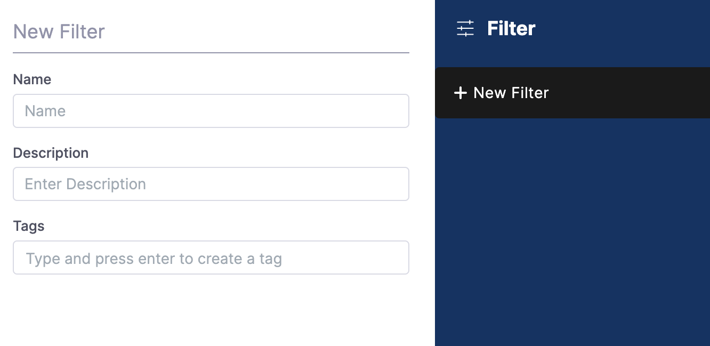

Harness enables you to add templates to create re-usable logic and Harness entities (like steps, stages, and pipelines) in your pipelines. You can link templates in your pipelines or share them with your teams for improved efficiency.

Templates enhance developer productivity, reduce onboarding time, and enforce standardization across the teams that use Harness.

This topic provides an overview of templates in Harness.

## Important notes

* When you delete an existing template with active pipeline references, Harness deletes the references.
* When you convert a runtime input in a template to a fixed value, the input type does not change in the linked pipeline. You must manually edit the linked pipeline YAML and provide the fixed values. You must reconcile the template state in the pipeline before executing it.
* When you convert a fixed type input to a runtime input in your template, the input type does not change in the linked pipeline. You must click the template in the linked pipeline to refresh it and save the pipeline again.
* Pipeline templates with chained pipeline stages are not supported.

## What is a template in Harness?

Harness' templates allow you to design reusable content, logic, and parameters, ensuring that the application is the major focus of your pipelines. Instead of creating pipelines from scratch each time, Harness lets you select from pre-built templates and link them to your pipelines. The process of developing pipelines thus becomes easier by reducing duplication and increasing reusability.

You can share your work with your team and reuse it in your pipelines.

You can add templates to Harness CI and CD modules. You can view templates in **Templates**, based on their scope. This is also referred to as the **Template Library** in this topic.


You can do the following with templates in Harness:

* Add multiple versions for a specific template.
* Preview, copy, edit, and delete a specific template.
* Create nested templates. For example, you can link a step template to a stage template and link the stage template to a pipeline template.
* Track all template events using the **Activity Log** option. It shows you details like who created the template and template version changes.
* Clone templates in Git and then sync them with Harness using [Harness Git Experience](../10_Git-Experience/git-experience-overview.md).

## Why should you use templates?

* Share common logic without duplicating it on multiple pipelines.  
For example, if you have some tasks or operations that every pipeline must do, then make them a part of a template to use in your pipelines.
* Reduce the complexity and size of creating a single pipeline.
* Set a pattern that you and your team can follow throughout your pipelines.
* Save time and create generic templates that you can use across the scopes in your Harness account.
* Add or remove a change in one file rather than a lot of stages.

## Templates scopes

You can add templates at any [scope](/docs/platform/role-based-access-control/rbac-in-harness#permissions-hierarchy-scopes) in Harness.

The following table shows what it means to add templates at different scopes or hierarchies:


| **Scope** | **When to add templates?** |
| --- | --- |
| **Account** | To share step/stage/pipeline templates with users in the account, as well as users within the organizations, and projects created within this account. |
| **Organization** | To share step/stage/pipeline templates with users in the organization as well as within the projects created within the org. |
| **Project** | To share step/stage/pipeline templates with users within the project. |

### Referencing objects within a scope

When leveraging a template at a specific scope (project, org, or account), you can only reference resources within the respective scope or higher in the Harness object hierarchy (project --> org --> account). 

For example, if you create an account-level stage deploy template, the service, the environment, the infrastructure definition, the connectors, and the secrets referenced in its steps must be defined at the account level in order to be referenced as a fixed value or expression in the template.

You cannot reference an **org** or **project** level service, environment, connector, or infrastructure definition as a fixed value in the **account-level** template. All those resources must be at the account level in order to be fixed in a template.

You cannot reference objects downwards in the hierarchy; however, given the correct RBAC access, you can use resources upwards in the hierarchy (project --> org --> account).

The project and org-level templates can reference higher level objects like services, environments, connectors, and secrets. A project-level template can reference org and account-level objects and an org-level template can reference account-level objects.

You can define a fixed value service at the org or account level according to your RBAC permissions. The same is true with environments and infrastructure definitions, as they can come from higher level resources. With secrets, you can reference org and account level secrets from a project-scoped template.

## What are the types of templates in Harness?

You can add the following types of templates to your Harness account/org/project:

* Step
* Step Group
* Stage
* Pipeline
* Deployment
* Monitored Service
* Secrets Manager
* Artifact Source

### Step template

Step templates define a linear sequence of operations for a job. For detailed steps to add a Step template, go to [Create a step template](run-step-template-quickstart.md).


### Stage template

Stage templates define a set of stages of related jobs. For detailed steps to create a Stage template, go to [Create a stage template](add-a-stage-template.md).


### Pipeline template

You can create your own pipeline templates to standardize and distribute reusable pipelines across your team or among multiple teams. The underlying structure of a pipeline template is the same as that of a pipeline YAML.


With pipeline templates you can:

* Create a template based on an existing pipeline.
* Share the template across scopes in Harness.

For detailed steps to create a pipeline template, go to [Create a pipeline template](create-pipeline-template.md).

## Versioning

Versioning a template enables you to create a new template without modifying the existing one. When you plan to introduce a major change in a project that depends on an existing template, you can use versioning. You can create multiple versions of a template.

You can make changes to the same version of the template, as long as the template's inputs remain unaltered. You must create a new version of the template for any changes in the inputs.

#### Versioning with Git Experience 

You can store different versions of templates on:
1. Different branches in different repositories.
2. Different branches in the same repository.
3. The same branch and same repository.

Before switching to a different template version, be sure to set the branch and repository context. Since versions can exist in multiple branches, Harness needs to know where to render template versions.

For more information on branching and version management with branching, go to [Template Library with Git Experience docs](https://developer.harness.io/docs/platform/git-experience/configure-git-experience-for-harness-entities/#branch-selection-logic-for-fetching-referenced-entities-in-remote-pipelines).

### Stable version

A stable version is a template that only introduces breaking changes in major release milestones.

When using a template, you can either link to a specific version or always use the stable version. When you mark a new version of the template as stable, it is automatically picked up to link to the pipeline.

You can set any version of your template as the stable version using the **Set as Stable** option.


## Preview a template

You can view the **Details** and **Activity Log** of your template by selecting **Preview Template**.



**Activity Log** enables you to view and track all the events corresponding to your template.


## Open/edit a template

You can use the **Open/Edit Template** option and navigate to the Template Studio to edit templates.


You can perform the following actions while editing a Template:

* Modify the name and version details
* Set the template version (to stable or any other version)
* View the YAML file for the template
* Modify step or stage configurations

You can edit any version of your template.


Harness enables you to choose any one of the following:

* **Save:** Save the updates in the selected version where you made the changes.
* **Save as new version:** Create a new version of the selected template and save with the changes you just made.
* **Save as new Template:** Create a new template from the selected template and save the changes you just made.

## Template settings

You can set a specific version of your template as the stable version by selecting **Template Settings**.


## Delete a template

You can delete your templates at any time. When you delete a template, all references to the template in your pipelines are also deleted.


## Template inputs

You can customize templates using placeholder expressions and [Runtime Inputs](../20_References/runtime-inputs.md) for their parameters and data types. Each time you run a pipeline that uses the template, users can provide values for these inputs.


Go to [Fixed values, runtime inputs, and expressions](../20_References/runtime-inputs.md) for more information.

## Template YAML

You can use the Harness visual or YAML editors to create your templates.


Here's an example of the YAML for a CD stage template:


```yaml
template:  
    name: Quickstart  
    identifier: Quickstart  
    versionLabel: v1  
    type: Stage  
    projectIdentifier: CD_Examples  
    orgIdentifier: default  
    tags: {}  
    spec:  
        type: Deployment  
        spec:  
            serviceConfig:  
                serviceDefinition:  
                    type: Kubernetes  
                    spec:  
                        variables: []  
                serviceRef: nginx  
            infrastructure:  
                infrastructureDefinition:  
                    type: KubernetesDirect  
                    spec:  
                        connectorRef: docbuilds  
                        namespace: default  
                        releaseName: release-<+INFRA_KEY>  
                allowSimultaneousDeployments: false  
                environmentRef: helmchart  
            execution:  
                steps:  
                    - step:  
                          type: K8sRollingDeploy  
                          name: Rolling  
                          identifier: Rolling  
                          spec:  
                              skipDryRun: false  
                          timeout: 10m  
                rollbackSteps: []  
        failureStrategies:  
            - onFailure:  
                  errors:  
                      - AllErrors  
                  action:  
                      type: StageRollback
```
The YAML editor is a full-fledged YAML IDE with autocomplete and other features. Go to [Harness YAML quickstart](../8_Pipelines/harness-yaml-quickstart.md) for more information.

## Template filter

You can create your own template filter and use it later to view those templates in Harness. You can create a template filter at any scope.
This topic explains the steps to create a template filter at the account scope.

To create a template filter in Harness, do the following: 
1. Select **ACCOUNT SETTINGS**, and then select **Account Resources**.
2. Select **Templates**.
3. In the top right corner, select the filter icon.
   
   

   The **New Filter** settings appear.
4. In **Name**, enter the name of an existing template, and then select **New Filter**.
   
   
   
6. In **Filter Name**, enter a name for the filter.
7. Set the visibility of the filter by selecting one of the following: 
   - **Only me**
   - **Everyone**

   If you do not select anything, the visibility is set to **Only me** by default.

   

8. Select **Save**, and then **Apply**.

Your filter now appears in the saved filter list. You can view the templates by selecting this filter.
