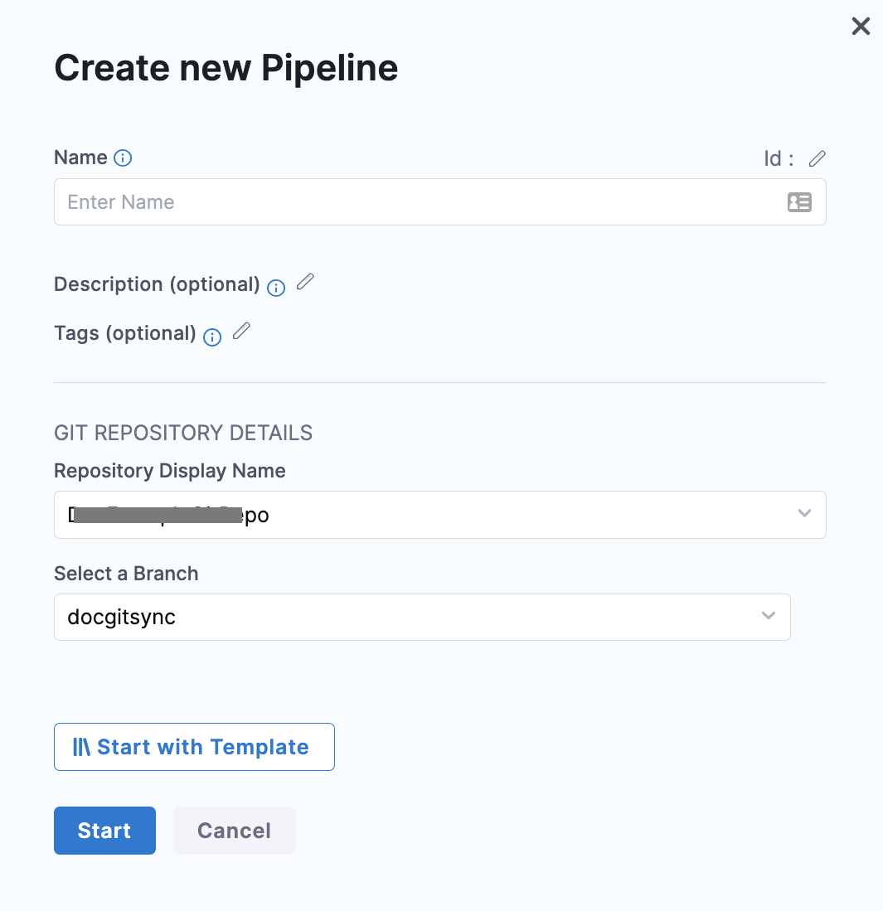
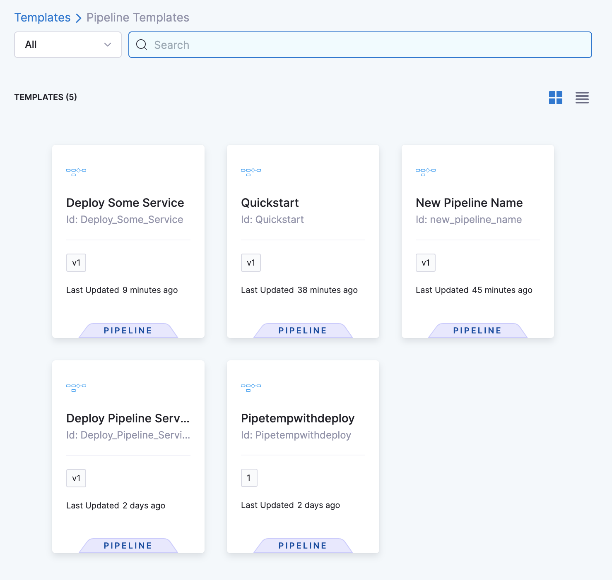
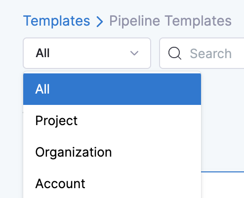
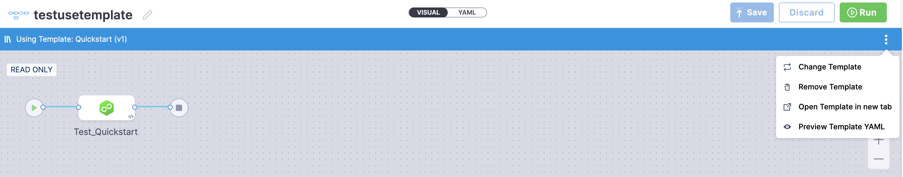
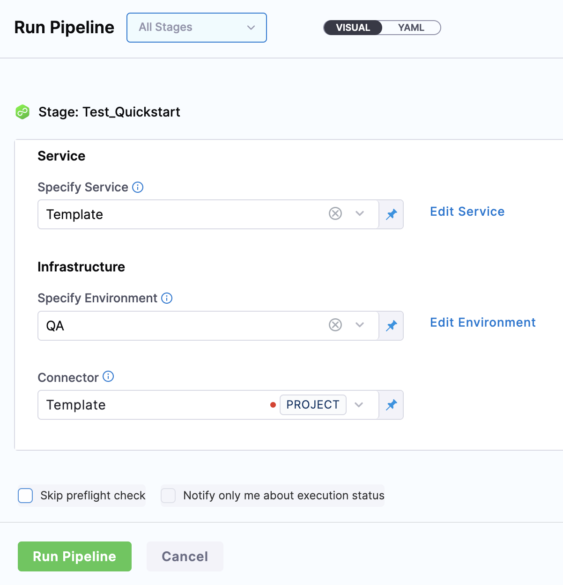
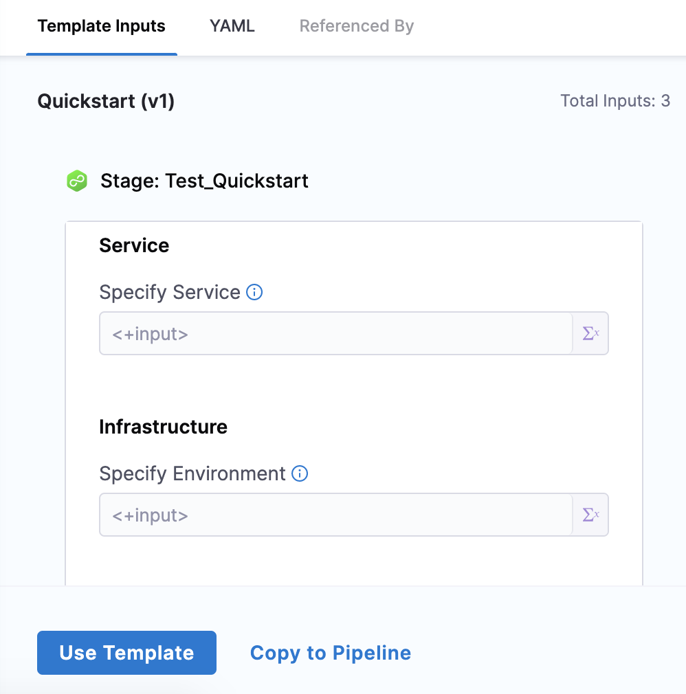
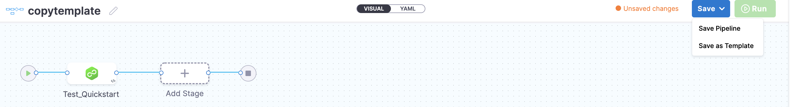

Harness enables you to add Templates to create reusable logic and Harness entities (like Steps, Stages, and Pipelines) in your Pipelines. You can link these Templates in your Pipelines or share them with your teams for improved efficiency. Templates enhance developer productivity, reduce onboarding time, are enforce standardization across the teams that use Harness.

Harness Templates also give you the option of reusing a Pipeline Templates to create a Pipeline. You do not have to create a Template all the time. Once you've [created a Template](create-pipeline-template.md), you can reuse it to create multiple Pipelines.

This topic explains how to use an existing Pipeline Template in a Pipeline.

### Before you begin

* [Templates Overview](template.md)
* [Create a Pipeline Template](create-pipeline-template.md)

### Step: Use a Template

To use a Pipeline Template, navigate to the **Deployments** module, and select **Pipelines**.

Click **New Pipeline**.

Enter **Name** for your Pipeline and click **Start with Template**.

The next page lists all the available Pipeline Templates.

Select the Template that you want to use.

You can filter the Templates by scope. You can also use the search bar to search the Template that you want to use.

In **Details**, you can see the following details about the selected Template:

* Type
* Description
* Tags
* Verison Label: Select the version label. Harness recommends using the **Stable** version of the Template. This ensures that any changes that you make to this version are propagated automatically to the Pipelines using this Template.

In **Template Inputs**, you can view the number of Step or Stage inputs in that Template.

Click **YAML** to view the YAML details of the Template.

Click the **Activity Log** to track all Template events. It shows you details, like who created the Template and Template version changes.

Click **Use Template** to use this Template to create your Pipeline.

Add the runtime input values (if required), and click **Save**. The **Pipeline is published successfully** message appears.

You can also perform the following actions:

* Change Template
* Remove Template
* Open Template in new tab
* Preview Template YAML

Once you've made all the changes, click **Run** and then click **Run Pipeline**. The Template is deployed.

### Option: Copy to Pipeline

You can also copy the contents of a specific Template to your Pipeline using the **Copy to Pipeline** option. This doesn't add any reference to the Template. Copying a Template to a Pipeline is different from using a Template for your Pipeline. You can't change any step or stage parameters when you link to a Template from your Pipeline.

Select the Pipeline Template that you want to copy.

In **Template Inputs**, click **Copy to Pipeline**.

In **Create new Pipeline**, enter a name and click **Start**.

Add a Stage (if required).

Once you've made all the changes, click **Save**. You can **Save Pipeline** or **Save as Template**.

Click **Run** to deploy the Template.

### See also

* [Create a Step Template](run-step-template-quickstart.md)
* [Create an HTTP Step Template](harness-template-library.md)
* [Create a Stage Template](add-a-stage-template.md)

