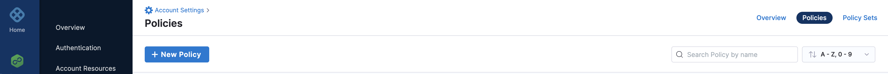

Harness provides governance using Open Policy Agent (OPA), Policy Management, and Rego policies.

You can create the policy and apply it to all Connectors in your Account, Org, and Project. The policy is evaluated on Connector-level event like On Save which occurs during Connector Creation and Updates. See [Harness Governance Quickstart](harness-governance-quickstart.md).

### Before you begin

* [Harness Governance Overview](harness-governance-overview.md)
* [Harness Governance Quickstart](harness-governance-quickstart.md)
* Policies use OPA authoring language Rego. For more information, see [OPA Policy Authoring](https://academy.styra.com/courses/opa-rego).

### Step 1: Add a Policy

In Harness, go to **Account Settings**.

Click **Policies**.


Click **Policies**, and then click **New Policy**.


The **New Policy** settings appear.

Enter a **Name** for your policy and click **Apply**.


Next you need to add your policy. Enter your own Rego policy. For example:


```
package docexamplepolicy  
  
deny ["Connector of type vault cannot be created"] {   
        input.entity.type == "Vault"  
 }​
```
Click **Save**.

### Step 2: Add the Policy to a Policy Set

After you create your policy, you must add it to a Policy Set before applying it to your Connectors.

In **Policies**, click **Policy Sets**, then click **New Policy Set**.

The **Policy Set** settings appear.

In **Name**, enter the name of the Policy Set.

In **Description**, enter a description of the Policy Set.

In **Entity type**, select **Connector**.

In **On what event should the Policy Set be evaluated**, select **On save.**

Click **Continue**.


Existing Connectors are not automatically updated with policies. Policies can be applied to Connectors only on a save when they are created or updated.In **Policy evaluation criteria**, click **Add Policy.**

The **Select Policy** settings appear. Select the policy you want to use from the list.

 

Select the severity and action you want to apply when the policy isn’t adhered to. You can select one of the following

* **Warn & continue** - You will receive a warning if the policy is not met when the Connector is evaluated, but the Connector will be saved and you may proceed.
* **Error and exit** - You'll get an error and be exited without saving the Connector if the policy isn't met when the Connector is examined.


Click **Apply**, and then click **Finish**.

Now your Policy Set is automatically set to Enforced, to make it unenforced, toggle off the **Enforced** button.


### Step 3: Apply a Policy to a Connector

After you have created your Policy Set, and added your policies to it, apply the policy to a Connector. 

Let us take the example of a [GitHub Connector](../7_Connectors/add-a-git-hub-connector.md).

You can add a Connector from any module in your Project in Project setup, or in your Organization, or Account Resources.

In Account Resources, click **Connectors**.

Click **New Connector**, and then click **GitHub**.

Enter all the required fields and click **Save and Continue**.

Based on your selection in the Policy Evaluation criteria, you will either receive a warning or an error.


### See also

* [Harness Policy As Code Overview](../../feature-flags/2-ff-using-flags/8-harness-policy-engine.md)

