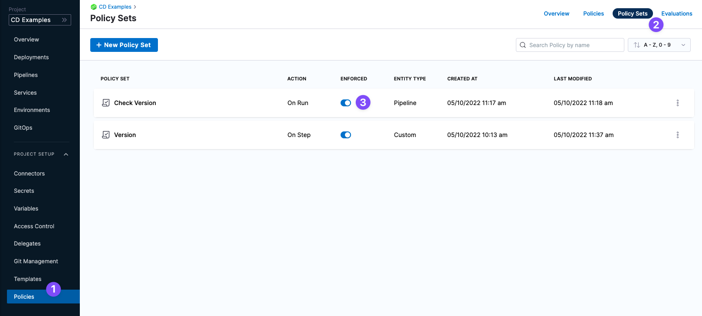

By default, a new Harness Policy Set is disabled. This default prevents someone from enforcing a Policy Set and accidentally impacting Pipelines and other Harness resources.

In some cases, you might have an enabled Policy Set and need to disable it. For example, if a Policy Set is enabled and an unintended Pipeline or other resource does not pass the Policy Set's evaluation, you will receive a failure, like this:

You can contact your Harness account admin to resolve the issue or, if the Policy Set is in error, you can disable it by locating the Policy Set and toggling the **Enforced** setting to off:

### Before you begin

* [Harness Policy As Code Overview](harness-governance-overview.md)
* [Harness Policy As Code Quickstart](harness-governance-quickstart.md)

### Step 1: Locate the Policy Set

In your Harness account/Org/Project, click **Policies**.

Click **Policy Sets**.

Toggle the **Enforced** setting to off.

### Notes

* To prevent issues with team members Pipelines and resources when creating a new Policy Set, a new Policy Set is disabled by default.

### See also

* [Add a Policy Step to a Pipeline](add-a-governance-policy-step-to-a-pipeline.md)

