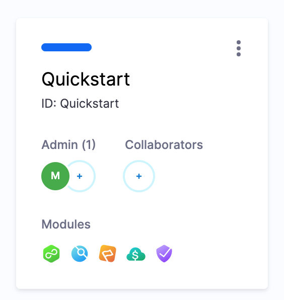
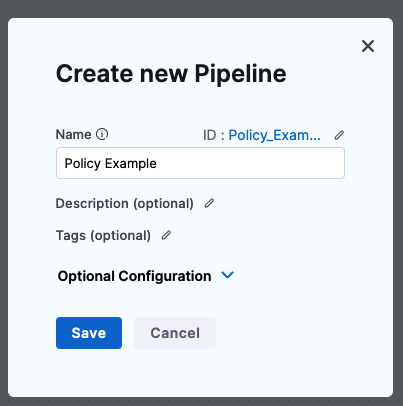
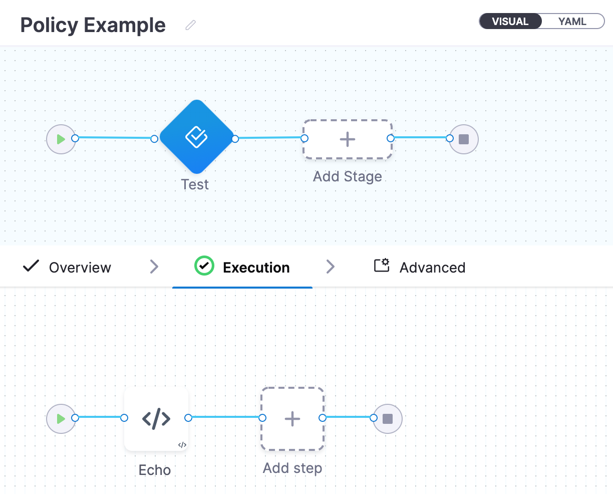
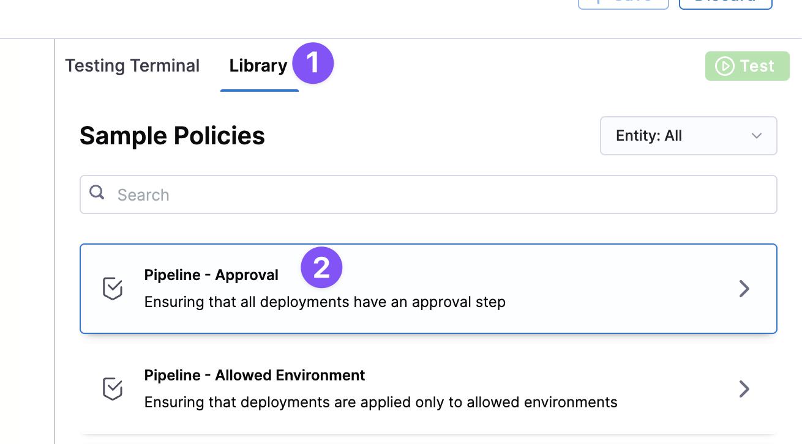
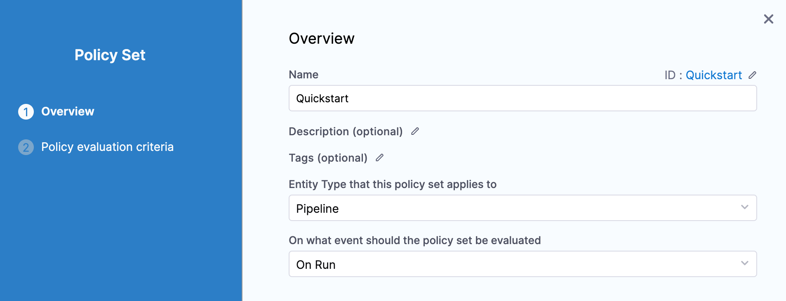
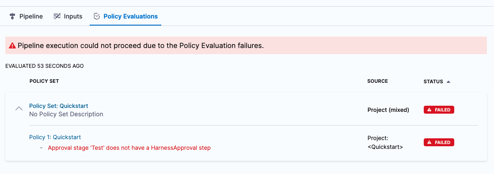

:::note
Currently, this feature is behind the Feature Flag `OPA_PIPELINE_GOVERNANCE`. Contact [Harness Support](mailto:support@harness.io) to enable the feature.

:::

Harness Policy As Code provides governance using Open Policy Agent (OPA), Policy Management, and Rego policies. You can use Harness Policy As Code to ensure that Harness entities like Pipelines meet specific compliance requirements when specific events happen (On Save, On Run, etc).

This quickstart shows you how to use Harness OPA integration to enforce Pipeline governance.

We'll show you how to use OPA's Rego policy language to create policies, test them against Pipelines, enforce them when saving and running Pipelines, and reviewing all of the policy evaluations for a Pipeline.

Let's get started.

### Objectives

You'll learn how to:

1. Create and test Rego policies in Harness.
2. Create a Policy Set using your new policy.
3. Run a Pipeline that fails a policy evaluation.
4. Run a Pipeline that passes a policy evaluation.
5. Review policy evaluations for a Pipeline.

### Before you begin

* **What you don't need:** this quickstart is only intended to show you how Pipeline governance works and so we use a simple Pipeline that only contains an Approval stage. You do not need a Kubernetes cluster or other host as a CD deployment target or CI build farm. You do not need a running Harness Delegate.
* Review [Harness Key Concepts](https://docs.harness.io/article/4o7oqwih6h-harness-key-concepts) to establish a general understanding of Harness.
* The [Harness Policy As Code Overview](harness-governance-overview.md) provides a concise overview of Harness Policy As Code.
* **New to OPA Policy Authoring?** OPA policies are written in OPA's Rego policy language. We'll provide the policy you need for this quickstart, but it's also helpful to have some familiarity with Rego before writing and reading policies.
	+ **Highly recommend:** Free online course on Rego from Styra founder and OPA co-creator Tim Hendricks: [OPA Policy Authoring](https://academy.styra.com/courses/opa-rego).
	+ See [Policy Language](https://www.openpolicyagent.org/docs/latest/policy-language/) from OPA. The [Rego Cheatsheet](https://dboles-opa-docs.netlify.app/docs/v0.10.7/rego-cheatsheet/) is also helpful to have on hand.


:::warning
When you create Policy Sets they are applied to all matching entities (for example, Pipelines). Be careful that you do not create a Policy Set that might impact existing Pipelines unintentionally.  

For this quickstart, we'll create a new Harness Project and only apply Policy Sets to its Pipelines. We will not impact Pipelines outside of this Project.

:::

#### How does Harness use OPA?

The Harness OPA server is an OPA server managed by Harness.

In Harness, you add Rego policies to a Policy Set and select the Harness entities for evaluation (e.g. Pipelines). At that point, the policies are configured on the Harness OPA Server via a Kubernetes ConfigMap.

When certain events happen (e.g. saving or running a Pipeline), Harness reaches out to the Harness OPA server to evaluate the action using the Policy Set.

For more details, see [Harness Policy As Code Overview](harness-governance-overview.md).

### Step 1: Create a Project

In your Harness account, click **Home**.

Click **Projects**, and then click **New Project**.


Name the Project **Quickstart**, and click **Save and Continue**.

In **Invite Collaborators**, click **Save and Continue**. You automatically be added as a Project Admin.

Your new Project is created.



Next we'll add a Pipeline that we'll evaluate later using OPA policies.

### Step 2: Create a Pipeline

For this quickstart, we'll use a very simple Pipeline that only contains an [Approval stage](../9_Approvals/adding-harness-approval-stages.md).

Open the new Harness Project you created and click **Deployments**.

Click **Pipelines**, and then click **Create a Pipeline**.

Name the Pipeline **Policy Example** and click **Start**.



In Pipeline Studio, click **YAML** to switch to the YAML editor.


Click **Edit YAML**.

Replace the existing YAML with the following YAML:


```
pipeline:  
    name: Policy Example  
    identifier: Policy_Example  
    projectIdentifier: Quickstart  
    orgIdentifier: default  
    tags: {}  
    stages:  
        - stage:  
              name: Test  
              identifier: Test  
              description: ""  
              type: Approval  
              spec:  
                  execution:  
                      steps:  
                          - step:  
                                type: ShellScript  
                                name: Echo  
                                identifier: Echo  
                                spec:  
                                    shell: Bash  
                                    onDelegate: true  
                                    source:  
                                        type: Inline  
                                        spec:  
                                            script: echo "hello"  
                                    environmentVariables: []  
                                    outputVariables: []  
                                    executionTarget: {}  
                                timeout: 10m  
                  serviceDependencies: []  
              tags: {}
```


:::note
We use the **Quickstart** `projectIdentifier` and the **default** `orgIdentifier`. If you are in a different org, you can replace **default** with the current org Id. You can get Ids from the URL in your browser: `.../orgs/<Org Id>/projects/<Project Id>/...`.

:::

Click **Save**. The Pipeline is now saved.

Click **Visual** and you can see it's a simple Pipeline with a manual [Approval stage](../9_Approvals/adding-harness-approval-stages.md) and one [Shell Script](https://docs.harness.io/article/k5lu0u6i1i-using-shell-scripts) step that echoes `hello`.



Next, we'll create a policy that requires any Pipeline with an Approval stage to also contain an Approval step in that stage.

### Step 2: Create and Test a Policy

In this step, we'll quickly review a Rego policy, add the policy in Harness, and then test our Pipeline using the policy.

#### Review: Rego Policies

Harness uses the [Rego policy language](https://www.openpolicyagent.org/docs/latest/policy-language/) for defining rules that are evaluated by the OPA engine. Basically, you use Rego to answer queries such as "does the Pipeline have an Approval step?" and so on.

Your Harness Pipelines and entities might be created using the Harness UI or YAML, but your Rego policies will validate the JSON of your Pipelines or other entities.

Let's look at a simple example:


```
package pipeline  
  
# Deny pipelines that don't have an approval step  
# NOTE: Try removing the HarnessApproval step from your input to see the policy fail  
deny[msg] {  
	# Find all stages that are Deployments ...  
	input.pipeline.stages[i].stage.type == "Approval"  
  
	# ... that are not in the set of stages with HarnessApproval steps  
	not stages_with_approval[i]  
  
	# Show a human-friendly error message  
	msg := sprintf("deployment stage '%s' does not have a HarnessApproval step", [input.pipeline.stages[i].stage.name])  
}  
  
# Find the set of stages that contain a HarnessApproval step  
stages_with_approval[i] {  
	input.pipeline.stages[i].stage.spec.execution.steps[_].step.type == "HarnessApproval"  
}
```
Basically, this policy checks whether a Pipeline has an Approval stage containing Approval steps. If the Pipeline does not, then the policy `deny` is enforced.

The Pipeline fails the policy if:

* `deny` is true.
* `deny` is a non-empty string.
* `deny` is a non-empty array of strings.

The Pipeline passes the policy if:

* `deny` is undefined.
* `deny` is false.
* `deny` is an empty string.
* `deny` is an empty array of strings.

You also must consider severity, but that is discussed later.

#### Create the Policy

In the Harness Project, in **Project Setup**, click **Policies**.

Click **Policies**, and then click **New Policy**.


Name the new policy **Quickstart**, and click **Apply**. The policy editor appears.


In **Library**, in **Sample Policies**, click **Pipeline - Approval**.



The policy appears:


```
package pipeline  
  
# Deny pipelines that don't have an approval step  
# NOTE: Try removing the HarnessApproval step from your input to see the policy fail  
deny[msg] {  
	# Find all stages that are Deployments ...  
	input.pipeline.stages[i].stage.type == "Deployment"  
  
	# ... that are not in the set of stages with HarnessApproval steps  
	not stages_with_approval[i]  
  
	# Show a human-friendly error message  
	msg := sprintf("deployment stage '%s' does not have a HarnessApproval step", [input.pipeline.stages[i].stage.name])  
}  
  
# Find the set of stages that contain a HarnessApproval step  
stages_with_approval[i] {  
	input.pipeline.stages[i].stage.spec.execution.steps[_].step.type == "HarnessApproval"  
}
```
Click **Use this Sample**.

The policy is selected and sample input is provided.


Let's edit this policy to test the Pipeline we created.

The Pipeline uses an Approval stage, not a Deployment stage, so we need to change the policy.

On line 7 and 13, replace `Deployment` with `Approval`.


```
...  
	input.pipeline.stages[i].stage.type == "Approval"  
...  
	msg := sprintf("Approval stage '%s' does not have a HarnessApproval step", [input.pipeline.stages[i].stage.name])
```
Now we can test the policy using our Pipeline.

#### Test the Policy against you Pipeline

In **Input**, delete the sample and paste the YAML for the Pipeline we created. You can copy it from earlier in this doc.

Since **Input** only uses JSON and we pasted in YAML, you will see an error like `Unexpected token p in JSON at line 1`.

Click the format button (&lt;/&gt;) to convert the YAML to JSON.


Harness Pipelines can be created in YAML, but Rego evaluates JSON.In the JSON, you can see the Fully Qualified Names (FQNs) of the labels your Rego references.


The input payload contains user `metadata` for the user that initiated the event. Metadata includes roles, groups, etc, and is added to every evaluation automatically. This can be used for policies where you want to evaluate users.Click **Test**.

In **Output**, you can see that the Pipeline failed the policy because it is missing an Approval step.


We'll fix the Pipeline later in this quickstart. The important thing is we know it works.

Click **Save**.

We tested the policy, but we still need to enforce it. To enforce a policy, you add it to a Policy Set.

### Step 3: Create a Policy Set

OPA evaluates rules using Policy Sets. Policy Sets are groups of related policies. A single policy can be a member of many Policy Sets.

For this quickstart, we'll just create a Policy Set using our single policy.

Click **Policy Sets**.


In **Policy Sets**, click **New Policy Set**.


Name the new Policy Set **Quickstart**.

Now we can select the Harness entity for the Policy Set, and the event that triggers evaluation.

In **Entity Type that this policy set applies to**, select **Pipeline**.

In **On what event should the policy set be evaluated**, select **On Run**.



Click **Continue**.

Now we can select the policies for this Policy Set.

In **Policy to Evaluate**, click **Add Policy**.

In **Select** **Policy**, click **Project Quickstart**, and select the **Quickstart** policy you created.


Be sure to select **Error and exit**.

Click **Apply**.


Click **Finish**. The new Policy Set is listed.


This Policy Set will be evaluated on every Pipeline.


:::warning
When you create Policy Sets they are applied to all matching entities (for example, Pipelines). Be careful that you do not create a Policy Set that might impact existing Pipelines unintentionally.

:::

### Step 4: Evaluate a Pipeline on Run

Now that we have a Policy Set, let's see it in action.

Click **Pipelines** to navigate back to the Pipeline you created earlier. Remember, it does not have an Approval step and it will fail the Policy Set evaluation.

Click **Run**, and then **Run Pipeline**.

The Policy Set is evaluated and the Pipeline execution fails.

In the Pipeline execution, click **Policy Evaluations**.



You can see the Policy Set that failed the Pipeline, and the reason for the failure. Clicking the Policy Set name will take you to the Policy Set.

Let's fix the Pipeline and try again.

### Step 5: Conform a Failed Pipeline and Rerun

Open the Pipeline in Pipeline Studio. Click the Pipeline name in the breadcrumbs and click **Pipeline Studio**.

Switch to the YAML editor and click **Edit YAML**.

Add a new line before the `- step:` for the **Shell Script** step.


On the new line, paste the YAML for a [Manual Approval](https://docs.harness.io/article/43pzzhrcbv-using-harness-approval-steps-in-cd-stages) step:


```
                          - step:  
                                type: HarnessApproval  
                                name: Approval  
                                identifier: Approval  
                                spec:  
                                    approvalMessage: Please review the following information and approve the pipeline progression  
                                    includePipelineExecutionHistory: true  
                                    approvers:  
                                        userGroups:  
                                            - account.admin  
                                        minimumCount: 1  
                                        disallowPipelineExecutor: false  
                                    approverInputs: []  
                                timeout: 1d
```
Note the `userGroups` setting. This is the Harness User Group that is allowed to approve this step. You can edit this in the Visual editor if you want to add your User Group(s), but it's not necessary for this quickstart.Click **Save**.

Click **Run**, and then **Run Pipeline**.

The Pipeline runs. It passed the Policy Set successfully.

The new Approval step appears during execution.


Click **Approve** to finish running the Pipeline.

### Step 6: Review Policy Evaluations

You can review policy evaluations in a few places.

#### Review in Pipeline Execution

On the Pipeline deployment summary (**Execution History**), click **Policy Evaluations**.


You can see Policy Set evaluations listed.


#### Review in Governance Overview

Click **Project Setup**, and then click **Policies**.

Click **Evaluations**.

You can see the evaluation you just performed.

### Summary

In this tutorial, you:

1. Created and tested a Rego policy in Harness.
2. Created a Policy Set from your new policy.
3. Ran a Pipeline that failed a policy evaluation.
4. Ran a Pipeline that passed a policy evaluation.
5. Reviewed policy evaluations for a Pipeline.

### See also

* [Add a Policy Engine Step to a Pipeline](add-a-governance-policy-step-to-a-pipeline.md)
* [Harness Policy As Code Overview](harness-governance-overview.md)
* [Harness Policy As Code Overview for Feature Flags](../../feature-flags/2-ff-using-flags/8-harness-policy-engine.md)

