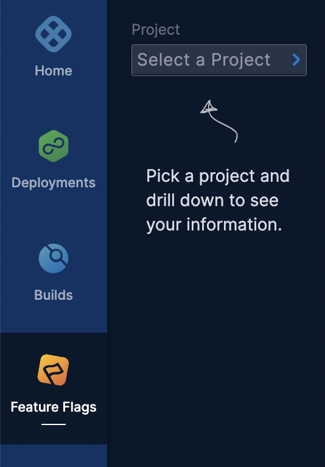
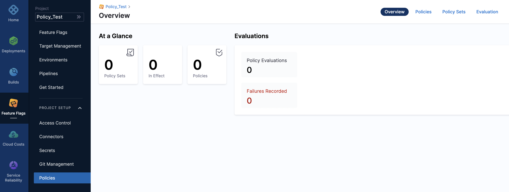
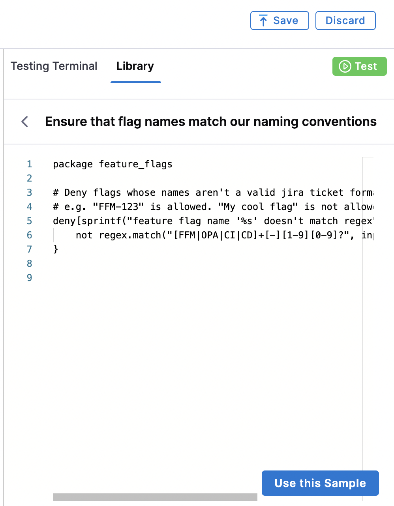
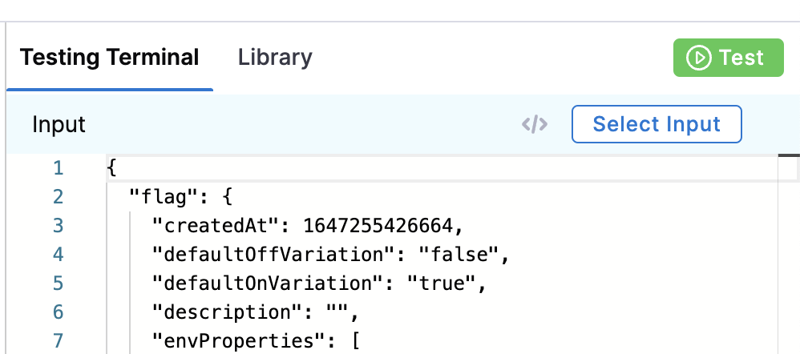
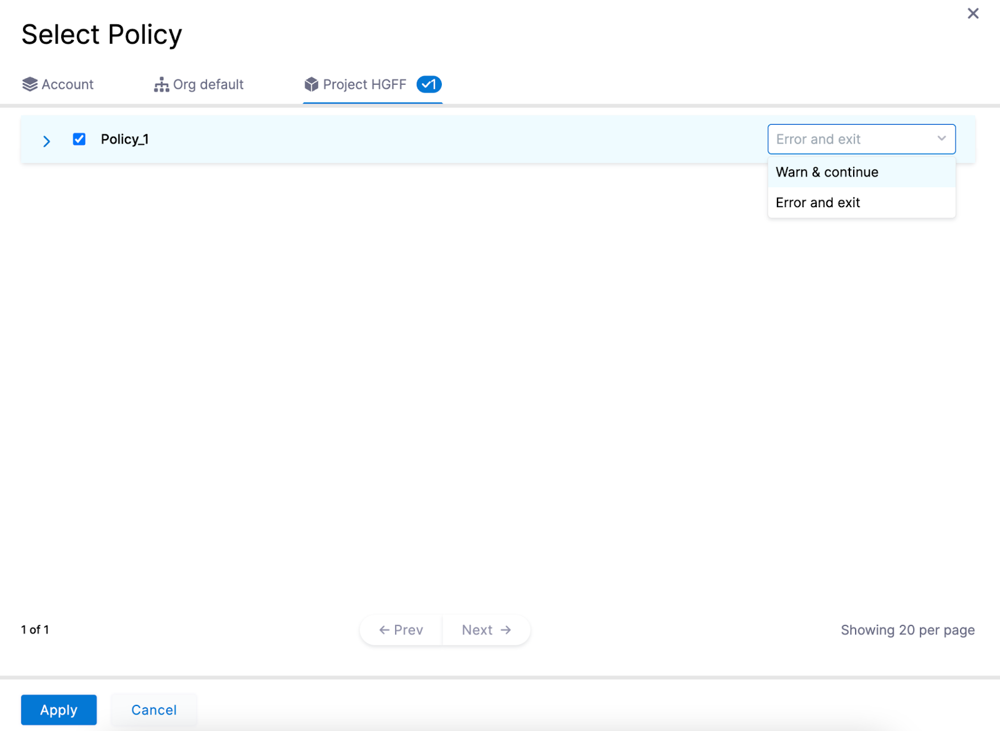
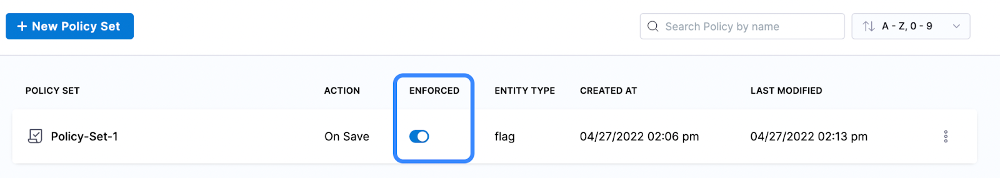
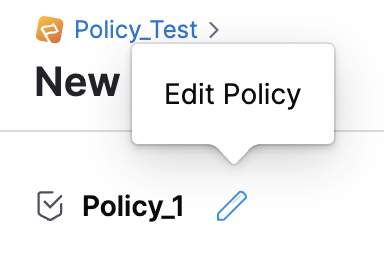
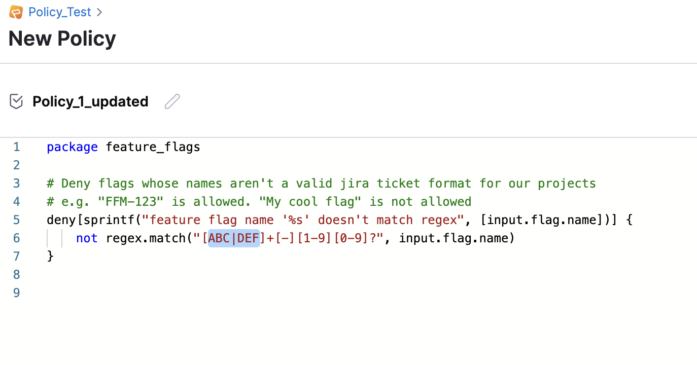
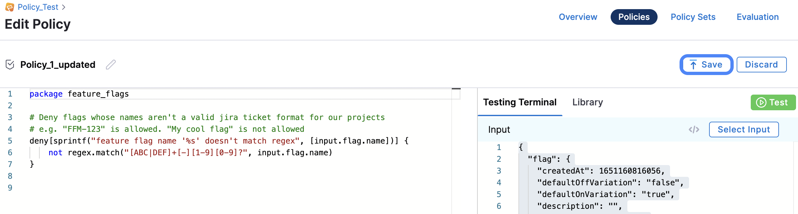

:::note
Currently, this feature is behind the Feature Flags `OPA_PIPELINE_GOVERNANCE`, `CUSTOM_POLICY_STEP`, and `OPA_FF_GOVERNANCE`. Contact [Harness Support](mailto:support@harness.io) to enable the feature.

:::

This topic describes how to create policies using the Harness Policy As Code and apply them to your Feature Flags. Harness Policy As Code uses the Open Policy Agency (OPA) to store policies on the Harness platform. For more information about how OPA and Harness Policy As Code work, see [Harness Policy As Code Overview](../../feature-flags/2-ff-using-flags/8-harness-policy-engine.md).

### Before you begin

* Ensure you have read and understood [Harness Policy As Code Overview](../../feature-flags/2-ff-using-flags/8-harness-policy-engine.md).
* Ensure you have [created your project and environment](../../feature-flags/2-ff-using-flags/1-ff-creating-flag/4-create-a-feature-flag.md) in the Harness platform.
* Policies use OPA authoring language Rego. New to Rego? Use the following resources to learn it:
	+ Free online course on Rego from Styra founder and OPA co-creator Tim Hendricks: [OPA Policy Authoring](https://academy.styra.com/courses/opa-rego).
	+ See [Policy Language](https://www.openpolicyagent.org/docs/latest/policy-language/) from OPA. The [Rego Cheat Sheet](https://dboles-opa-docs.netlify.app/docs/v0.10.7/rego-cheatsheet/) is also helpful to have on hand.

### Step: Create and Apply a Policy

To create and apply a policy, follow the steps below:

#### Step 1: Create a Policy

The first step of using policies with your Feature Flags is creating a policy.

1. In Harness Platform, click **Feature Flags** and select your project.



2. In **Project Setup**, click **Policies**.


:::note
You can view an overview of your policies and how many times they have been evaluated on the [Overview](../../feature-flags/2-ff-using-flags/8-harness-policy-engine.md) page.

:::



3. Click **Policies**, then click **New Policy**.

   

4. In the **New Policy** page, enter the **Name** of the Policy and click **Apply**. This is the Policy name that appears on the Policy Overview page.
   
5. Then, you can either enter your own Rego policy or use a pre-existing policy from the policy library.


:::note
Policies are written in Rego, for more information about Rego, see the [OPA documentation for Policy Language](https://www.openpolicyagent.org/docs/latest/policy-language/). 

:::

##### Use Your Own Rego Policy

To use your own Rego policy:

1. Enter your Rego policy into the policy editor. For example:  
  

```
package feature_flags  
  
# Deny flags that aren't booleans  
deny[sprintf("feature flag '%s' isn't of type boolean", [input.flag.identifier])] {    
  input.flag.kind != "boolean"  
}
```
2. Click **Save**.


##### Use an Existing Rego Policy from the Harness Policy Library

To select a pre-existing policy:

1. In the right-hand panel, click the **Library**.
2. In the **Entity** drop-down menu, select **Flags**.
   
   
   
3. Select a pre-existing flag policy from the list. The Rego code will populate in the **Library** editor.
4. Click **Use this Sample**.

   

5. In **File Overwrite**, click **Confirm** to add the sample to your editor.

   

6. Click **Save**.

##### Use the Testing Terminal to Check Your Code

1. To check your policy code is valid, test your policy against a previous **Policy Evaluation** in the **Testing Terminal**:


:::note
You can only test a policy in the Testing Terminal if you have previously run a Policy Evaluation. If you are creating your first ever policy for the Project, continue to [Step 2: Add the Policy to a Policy Set](#step-2-add-the-policy-to-a-policy-set). After you have applied your first policy to a Feature Flag, you can then use the Testing Terminal.

:::

2. In the **Testing Terminal**, click **Select Input.**

   

3. Select **Feature Flag** as the **Entity Type**. **Event Type** and **Action** are automatically completed.

4. Select the **Feature Flag** you want to test, then click **Apply**. This will automatically populate the **Testing Terminal** using the details of the Feature Flag you selected.

   

5. Click **Test**. Depending on whether the updated policy successfully applies to the existing Feature Flag, you receive one of the following:
* **Input failed Policy Evaluation**: The Feature Flag doesn’t adhere to the updated policy.

 

* **Input succeeded Policy Evaluation**: The Feature Flag adheres to the updated policy.


#### Step 2: Add the Policy to a Policy Set

After you create an individual policy, you must add it to a Policy Set before you can apply it to your Feature Flags.

1. In **Policies**, click **Policy Sets**, then click **New Policy Set**.


2. In **Name**, enter the name of the Policy Set.
3. (Optional) In **Description**, enter a description of the Policy Set.
4. In **Entity type** that this policy applies to, select **Feature Flag**.
5. In **On what event should the Policy Set be evaluated**, select **On save**, then click **Continue**.


:::note
Policies are not automatically applied to existing Feature Flags. Policies can be applied to Feature Flags only on a save when they are created, updated, or switched on or off.

:::

6. In Policy evaluation criteria, click **Add Policy**, then click your Project to display all the policies you created for that project.
7. Select the policy you want to use. In the drop down menu next to the policy name, select the severity and action you want to apply when the policy isn’t adhered to:
* **Warn & continue**: If a policy isn’t met when the Feature Flag is evaluated, you receive a warning but the flag is saved and you can continue.
* **Error and exit:** If a policy isn’t met when the Feature Flag is evaluated, you receive an error and are exited without saving the flag.



8. Click **Apply**, then click **Finish**.
9.  The Policy Set is automatically set to Enforced, to make it unenforced, toggle off the **Enforced** button.


:::note
You need to enforce the policy before it evaluates your Feature Flags.

:::



### Step: Apply a Policy to a Feature Flag

After you have created your Policy Set and added your policies to it, apply the policy to a Feature Flag. 

1. In Harness Platform, click **Feature Flags**.
2. Click **+ Flag**.
3. [Create a new Feature Flag](../../feature-flags/2-ff-using-flags/1-ff-creating-flag/4-create-a-feature-flag.md#before-you-begin). Make sure the flag [adheres to the policy you are testing.](using-harness-policy-engine-for-feature-flags.md#step-1-create-a-policy)
4. Click **Save and Close**. The result is one of the following:
* **Success**: When you save the flag, the policy rule is evaluated, returns Flag created, and the flag is saved.
* **Failure**:
	+ If you selected **Warn and continue** when creating the policy, the flag is saved but you receive the following warning message:
      

	+ If you selected **Error and exit** when creating the policy, the flag doesn’t save and you receive the following error message:


After you have successfully created a Policy Set and applied it to your feature flags, you can:

* [Edit a Policy](using-harness-policy-engine-for-feature-flags.md#edit-a-policy)
* [Edit a Policy Set](using-harness-policy-engine-for-feature-flags.md#edit-a-policy-set)
* [View a History of Policy Evaluations](using-harness-policy-engine-for-feature-flags.md#view-a-history-of-policy-evaluations)

### Edit a Policy

After you have created a policy, you can edit it by renaming it or updating its rules in the policy editor.

1. In Feature Flags, click **Policies**.
2. Click **Policies**, then click the three dots next to the policy you want to change, then click **Edit**.

   

3. To update the policy name, click **Edit Policy**.



4. Enter the new name and click **Apply**.


5. To update the policy rules, edit the Rego code in the policy editor.



6. Test the updated policy in the Testing Terminal against a previous Policy Evaluation to ensure it is valid. For more information about how to do this, see [Step 9 in Create a Policy](using-harness-policy-engine-for-feature-flags.md#step-1-create-a-policy).
7. When you've made all the changes, click **Save**.



### Edit a Policy Set

You can edit a Policy Set to amend the name or add a new policy. 

1. In Feature Flags, click **Policies**.
2. Click **Policy Sets**, then click the three dots next to the Policy Set you want to change, then click **Edit**.


3. The Policy Set's settings are displayed. Follow the steps in [Add the Policy to a Policy Set](using-harness-policy-engine-for-feature-flags.md#step-2-add-the-policy-to-a-policy-set) to edit the details.

4. Click **Apply**, then click **Finish**.

### View a History of Policy Evaluations

You can view all failures, warnings, and successes of evaluations for each of your Policy Sets. 

1. In Feature Flags, click **Policies**. On the Overview page, you can view the total number of:
* Policy Sets.
* Policy Sets in effect.
* Number of policies across all Policy Sets.
* Policy evaluations.
* Passed, failed, and warning results from evaluations.
2. Click **Evaluation**.


3. To view further details of a particular evaluation, click on it and expand the relevant evaluation.


### See also

* [Harness Policy As Code Overview](../../feature-flags/2-ff-using-flags/8-harness-policy-engine.md)

