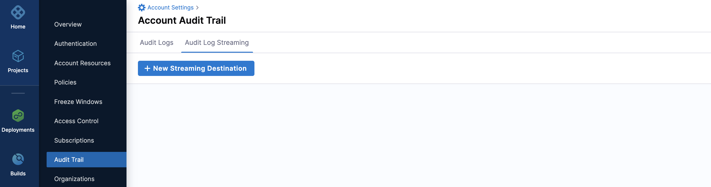
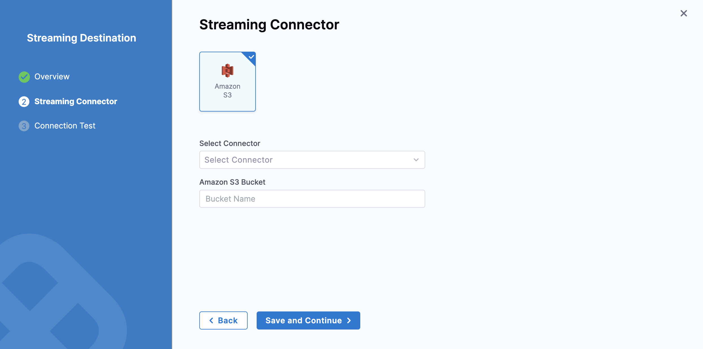
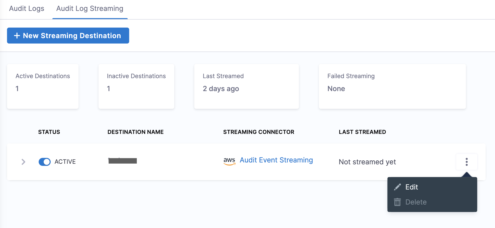

:::note
Currently, this feature is in Beta and behind the feature flag `PL_AUDIT_LOG_STREAMING_ENABLED`. Contact Harness Support to enable the feature.
:::

You can configure a streaming destination in Harness to send audit log data to another location for processing. Integrating audit data with other Security Incident and Event Management (SIEM) tools lets you do the following:

- Trigger alerts for specific events.

- Create views of audit data.

- Perform anomaly detection. 

- Store more than 2 years worth of auditing data, which is the maximum amount of data that Harness keeps for your accounts.

- Keep your resources and data protected, and ensure compliance with regulations.

Harness streams the audit events to your chosen SIEM tool as structured JSON.

## Important

- Streaming destinations receive all audit event data, which could include sensitive information. Make sure you trust the streaming destination.
- Harness supports streaming to Amazon S3.
- You can add multiple streaming destinations in Harness.

## Add a streaming destination

You can configure the audit stream from the **Audit Log Streaming** option in **Audit Trail**.

1. In your Harness account, select **Account Settings**.

2. Select **Audit Trail** and then select **Audit Log Streaming**.

3. Select **New Streaming Destination** to open the configuration settings.

4. Enter a name for the streaming destination.

5. Harness automatically populates the Id for the destination. You can choose to retain the Id or modify it.

6. Enter a description and tag(s) for the streaming destination.

7. Select **Continue**.
   


## Configure the streaming connector

1. Select **Amazon S3**.

2. In **Select Connector**, select an existing AWS Cloud Provider connector or create a new one.

   Go to [Add an AWS connector](../7_Connectors/add-aws-connector.md) for steps to create a new AWS Cloud Provider connector.

3. Select **Apply Selected**.

4. In **Amazon S3 Bucket**, enter the bucket name.
   
   This is where Harness will write all the streaming records.

   

5. Select Save and Continue.

6. After the connection test is successful, select **Finish**.
   
   :::note
   AWS buckets are not taken into account during the test connection. Also, it tests the connector used without testing the bucket.
   :::
   

## Activate or deactivate streaming

1. After you configure the streaming destination, it appears in the list of destinations in **Audit Log Streaming**.
   
   By default, this destination is inactive.

2. To activate streaming to this destination, toggle the status to **Active** besides the streaming destination.

   After you activate the destination, Harness starts writing audit logs in the destination.

   Post that every 30 mins audit logs are streamed.

3. You can pause audit streaming, preventing any new audit events from being streamed to the configured endpoint by setting the status to **Inactive**. 
   
   Harness streams audit logs from where it was paused later when you reactivate such a streaming destination.

## Update audit stream

You can change the audit stream configuration by clicking three dots beside the stream destination. This will open a pop-up menu with the following options:

- Edit: You can select a different streaming destination or make changes to the configured destination.

- Delete: You can delete the audit stream destination.



## Payload schema

Streamed audit events have a predictable schema in the body of the response.

|**Field**       |  **Description**     |   **Is required**    |
|  ---  |  ---  |  ---  |
|   auditEventId    |  Unique ID for the audit event.     |   Required    |
|   auditEventAuthor    |  [Principal](../4_Role-Based-Access-Control/1-rbac-in-harness.md#harness-rbac-components) attached with audit event.    |   Required    |
|    auditModule   | Module for which the audit event is generated.      |   Required    |
|   auditResource    |  Resource audited.     |  Required     |
|   auditResourceScope    |  [Scope](../4_Role-Based-Access-Control/1-rbac-in-harness.md#rbac-scope) of the audited resource.     |   Required    |
|  auditAction     |  Action on the audited resource.     |  Required     |
|    auditEventTime   |  Date and time of the event.     | Required      |
|   auditHttpRequestInfo    |  Details of the HTTP request.     |  Optional     |
|   auditEventMetadata    |     Additional details required for streaming the audit log.  |  Optional     |


### JSON payload


```
{
  "$schema": "http://json-schema.org/draft-04/schema#",
  "type": "object",
  "properties": {
    "auditEventId": {
      "type": "string"
      "description":"Unique ID for each audit event"
    },
    "auditEventAuthor": {
      "type": "object",
      "properties": {
        "principal": {
          "type": "object",
          "properties": {
            "type": {
              "type": "string"
            },
            "identifier": {
              "type": "string"
            },
            "email": {
              "type": "string"
            }
          },
          "required": [
            "type",
            "identifier",
          ]
        }
      },
      "required": [
        "principal"
      ]
      "description":"Information about Author of the audit event"
    },
    "auditModule": {
      "type": "string"
      "description":"Information about Module of audit event origin"
    },
    "auditResource": {
      "type": "object",
      "properties": {
        "type": {
          "type": "string"
        },
        "identifier": {
          "type": "string"
        }
      },
      "required": [
        "type",
        "identifier"
      ]
      "description":"Information about resource for which Audit event was generated"
    },
    "auditResourceScope": {
      "type": "object",
      "properties": {
        "accountIdentifier": {
          "type": "string"
        },
        "orgIdentifier": {
          "type": "string"
        },
        "projectIdentifier": {
          "type": "string"
        }
      },
      "required": [
        "accountIdentifier",
      ]
      "description":"Information about scope of the resource in Harness"
    },
    "auditAction": {
      "type": "string"
      "description":"Action CREATE,UPDATE,DELETE,TRIGGERED,ABORTED,FAILED , Not exhaustive list of events"
    },
    "auditHttpRequestInfo": {
      "type": "object",
      "properties": {
        "requestMethod": {
          "type": "string"
        }
        "clientIP": {
          "type": "string"
        }
      },
      "required": [
        "requestMethod",
        "clientIP"
      ]
      "description":"Information about HTTP Request"
    },
    "auditEventTime": {
      "type": "string"
      "description":"Time of auditEvent in miliiseconds"
    },
    "auditEventMetadata": {
      "type": "object"
      "description":"No fixed schema , Additional meta about audit event"
    }
  },
  "required": [
    "auditEventId",
    "auditEventAuthor",
    "auditModule",
    "auditResource",
    "auditResourceScope",
    "auditAction",
    "auditEventTime",
  ]
}
```
