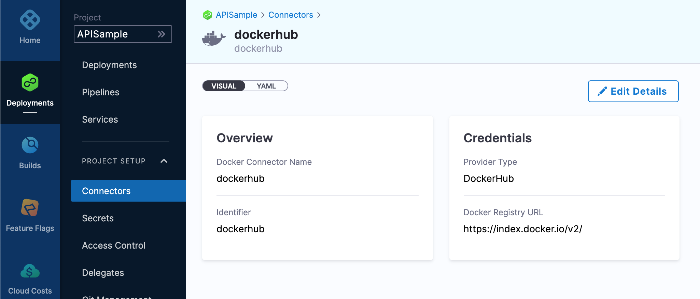

Everything you can create in the Harness Manager you can create using our REST APIs.

This quickstart shows how to onboard Harness resources using the APIs. We'll add a new Project, Connector, and Pipeline using curl and the APIs.


:::note
**Looking for the API reference docs?** See [Harness API Reference Docs](https://harness.io/docs/api/).

:::

### Objectives

You'll learn how to:

* Authenticate with Harness via API using API keys.
* Onboard Harness Projects, Connectors, and Pipelines using the Harness API.


:::note
The API requests in this topic use curl, but Harness supports multiple languages, such as Go, Java, and Node.js. The [Harness API Reference Docs](https://harness.io/docs/api/) provides examples for all supported languages.

:::

### Before you begin

* [Harness Key Concepts](https://docs.harness.io/article/4o7oqwih6h-harness-key-concepts)
* [Access Management(RBAC) Overview](../4_Role-Based-Access-Control/1-rbac-in-harness.md)
* This quickstart walks you through adding the Harness API keys needed to authenticate with the API. To review Harness API keys, see [Add and Manage API Keys](../4_Role-Based-Access-Control/7-add-and-manage-api-keys.md).
* Make sure your Harness account has the required permissions to Create, Edit, Delete, and View the Harness resources you are creating via API. Any of the following default roles are sufficient: Account Administrator, Organization Admin, Project Admin. For more, see [Permissions Reference](../4_Role-Based-Access-Control/ref-access-management/permissions-reference.md).

### Step 1: Create a Harness API Key and PAT

The Harness API uses API keys to authenticate requests. You create the API key in your Harness Manager User Profile, add a Personal Access Token (PAT) to the key, and then use the PAT in your API requests.


:::note
For an overview of Harness API keys, see [Add and Manage API Keys](../4_Role-Based-Access-Control/7-add-and-manage-api-keys.md).

:::

Let's create the API key and its Personal Access Token.

Here's a quick visual summary:


#### Create API Key

In Harness, navigate to your **Profile**.


In **My API Keys**, Click **API Key**. The API Key settings appear.


Enter **Name, Description,** and **Tags** for your API.

Click **Save**. The new API Key is created.

#### Create Personal Access Token

Next, we'll add the Personal Access Token (PAT) that you will use when you make API requests.

Click **Token** below the API Key you just created.


In the **New Token** settings, enter a Name, Description, and Tags.

To set an expiration date for this token, select **Set Expiration Date** and enter the date in **Expiration Date (mm/dd/yyyy)**.

Click **Generate Token**.

Your new token is generated.


:::warning
Please copy and store your token value somewhere safe. You won't be able to see it again.  
  
Your API keys carry many privileges, so be sure not to share them in publicly accessible areas. Make sure you always use the updated API Key value after you rotate the token. For more details, see [Rotate Token](../4_Role-Based-Access-Control/7-add-and-manage-api-keys.md#rotate-token).
:::


#### Service Account Tokens

You can also use a Service Account Tokens instead of PAT. See [Add and Manage Service Accounts](../4_Role-Based-Access-Control/6-add-and-manage-service-account.md).

### Step 2: Create a Project via API

Now that we have our token, we can create a Harness Project. A Harness [Project](https://docs.harness.io/article/hv2758ro4e-learn-harness-key-concepts#organizations_and_projects) is a group of Harness modules and their Pipelines.

To send the API request, you will need your Harness account Id and the token you created.

The account Id can be found in every URL when using Harness following `account`:


```
https://app.harness.io/ng/#/account/{accountid}/home/get-started
```
Open a terminal to run the API request.

We're going to create this Project in the built-in **default** Organization. If you want to use a different Org, just replace the instances of **default** in the command.

Copy the following curl command and paste it into a text editor:


```
curl --location --request POST 'https://app.harness.io/gateway/ng/api/projects?accountIdentifier={accountIdentifier}&orgIdentifier=default' \  
--header 'Content-Type: application/yaml' \  
--header 'x-api-key: {api-key}' \  
--data-raw 'project:  
  name: APISample  
  orgIdentifier: default  
  color: "#0063F7"  
  description: ''  
  identifier: APISample  
  tags: {}  
  modules: []'
```
Replace `{accountidentifier}` with your Harness account Id and `{api-key}` with the PAT you created.

Paste the updated curl command into a terminal and run it.

The successful response will be something like this:


```
{"status":"SUCCESS","data":{"project":{"orgIdentifier":"default","identifier":"APISample","name":"APISample","color":"#0063F7","modules":["CD","CI","CV","CF","CE","CORE","PMS","TEMPLATESERVICE"],"description":"","tags":{}},"createdAt":1636410020671,"lastModifiedAt":1636410020671},"metaData":null,"correlationId":"3aa01bdd-e45c-4eb2-a65d-7673ec287fcc"}
```
Open Harness to see your new Project (you might need to refresh the Project page):


### Step 3: Create a Connector via API

A Harness Connector contains the information necessary to integrate and work with 3rd party tools.

Harness uses Connectors at Pipeline runtime to authenticate and perform operations with a 3rd party tool.

Let's create a [Docker Registry Connector](../7_Connectors/ref-cloud-providers/docker-registry-connector-settings-reference.md) that connects to DockerHub anonymously.

Copy the following curl command:


```
curl --location --request POST 'https://app.harness.io/gateway/ng/api/connectors?accountIdentifier=H5W8iol5TNWc4G9h5A2MXg' \  
--header 'Content-Type: text/yaml' \  
--header 'x-api-key: pat.6186f434cce56f2962ae9bbf.HpGoIx7O4ZvFSE4rEuuF' \  
--data-raw 'connector:  
  name: dockerhub  
  identifier: dockerhub  
  description: ""  
  tags: {}  
  orgIdentifier: default  
  projectIdentifier: APISample  
  type: DockerRegistry  
  spec:  
    dockerRegistryUrl: https://index.docker.io/v2/  
    providerType: DockerHub  
    auth:  
      type: Anonymous'
```
Replace `{accountidentifier}` with your Harness account Id and `{api-key}` with the PAT you created.

Paste the updated curl command into a terminal and run it.

The successful response will be something like this:


```
{"status":"SUCCESS","data":{"connector":{"name":"dockerhub","identifier":"dockerhub","description":"","orgIdentifier":"default","projectIdentifier":"APISample","tags":{},"type":"DockerRegistry","spec":{"dockerRegistryUrl":"https://index.docker.io/v2/","providerType":"DockerHub","auth":{"type":"Anonymous"},"delegateSelectors":[]}},"createdAt":1636476303660,"lastModifiedAt":1636476303657,"status":null,"activityDetails":{"lastActivityTime":1636476303657},"harnessManaged":false,"gitDetails":{"objectId":null,"branch":null,"repoIdentifier":null,"rootFolder":null,"filePath":null},"entityValidityDetails":{"valid":true,"invalidYaml":null}},"metaData":null,"correlationId":"fab579bc-bc6f-46d1-95be-d6ed02844cd4"}
```
Take a look at your new Connector in Harness:


### Step 4: Create a Pipeline

A CD Pipeline is an end-to-end process that delivers a new version of your software.

Let's create a simple CD Pipeline that contains a Shell Script step that echoes "hello world!".

The Pipeline uses [Runtime Inputs](../20_References/runtime-inputs.md) (`<+input>`) for most settings.Copy the following curl command:


```
curl --location --request POST 'https://app.harness.io/gateway/pipeline/api/pipelines?accountIdentifier={accountidentifier}&orgIdentifier=default&projectIdentifier=APISample' \  
--header 'Content-Type: application/yaml' \  
--header 'x-api-key: {api-key}' \  
--data-raw 'pipeline:  
    name: apiexample  
    identifier: apiexample  
    projectIdentifier: APISample  
    orgIdentifier: default  
    tags: {}  
    stages:  
        - stage:  
              name: demo  
              identifier: demo  
              description: ""  
              type: Deployment  
              spec:  
                  serviceConfig:  
                      serviceRef: <+input>  
                      serviceDefinition:  
                          type: Kubernetes  
                          spec:  
                              variables: []  
                  infrastructure:  
                      environmentRef: <+input>  
                      infrastructureDefinition:  
                          type: KubernetesDirect  
                          spec:  
                              connectorRef: <+input>  
                              namespace: <+input>  
                              releaseName: release-<+INFRA_KEY>  
                      allowSimultaneousDeployments: false  
                  execution:  
                      steps:  
                          - step:  
                                type: ShellScript  
                                name: shell  
                                identifier: shell  
                                spec:  
                                    shell: Bash  
                                    onDelegate: true  
                                    source:  
                                        type: Inline  
                                        spec:  
                                            script: echo "hello world!"  
                                    environmentVariables: []  
                                    outputVariables: []  
                                    executionTarget: {}  
                                timeout: 10m  
                      rollbackSteps: []  
              tags: {}  
              failureStrategies:  
                  - onFailure:  
                        errors:  
                            - AllErrors  
                        action:  
                            type: StageRollback'
```
This sample using [Runtime Inputs](../20_References/runtime-inputs.md) for many settings.Replace `{accountidentifier}` with your Harness account Id and `{api-key}` with the PAT you created.

Paste the updated curl command into a terminal and run it.

The successful response will be something like this:


```
{"status":"SUCCESS","data":"apiexample","metaData":null,"correlationId":"6375a5cc-f1ce-4a82-9428-0cf6ead6140c"}
```
Take a look at your new Pipeline in Harness:


You're all done.

In this tutorial, you learned how to:

* Authenticate with Harness via API using API keys.
* Onboard Harness Projects, Connectors, and Pipelines using the Harness API.

To explore the Harness API, see [Harness API Reference Docs](https://harness.io/docs/api/).

### Notes

* **Rate Limiting:** the Harness API does not impose any rate limits per account. Harness reserves the right to change these limits, to optimize performance for all API consumers.
* **Cross-origin Resource Sharing (CORS):** Harness APIs support CORS. This allows interactions between resources from different origins, which is normally prohibited to prevent malicious behavior. Each request must provide credentials (personal access tokens and service access tokens are both supported options).
* **Errors:** Harness uses conventional HTTP response codes to indicate the success or failure of an API request.


|  |  |
| --- | --- |
| **HTTPS Status Code** | **Summary** |
| 200 - OK | The request has been processed successfully on the server. |
| 400 - Bad Request | The request was not processed successfully due to incorrect syntax or missing parameters. |
| 401 - Unauthorized | The request was unauthorized due to an invalid API Key. |
| 402 - Request Failed | The request cannot be processed. |
| 403 - Forbidden | The API Key does not have permission to perform the request. |
| 404 - Not Found | The requested resource does not exist. |
| 500, 502, 503, 504 - Server Errors | The Harness server encountered an unexpected error. |

