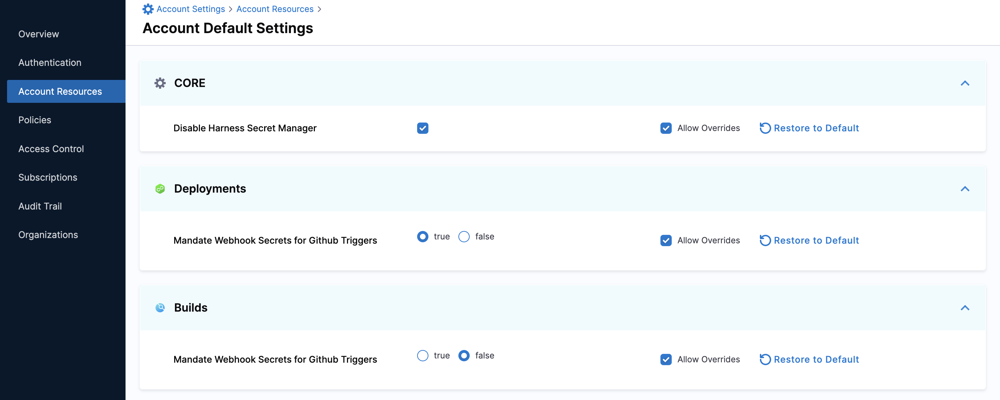

Currently, this feature is behind the feature flag `NG_SETTINGS`. Contact Harness Support to enable the feature.Harness Default Settings lets you configure parameters in your Account, Org, or Project scope for specific Harness modules.

This topic explains how to view and edit Default Settings for your modules.

Harness supports the configuration of Default Settings for the following modules:

* Core
* Deployments
* Builds

### Required Permissions

* Make sure you have the **view** and **edit** permissions for Default Settings.

### Review

Default Settings include module-specific configurable parameters that you can customize as per your needs.

For example, enabling/disabling a feature at a specific scope.

You can group a set of parameters into settings.

### View and Edit Default Settings

This topic explains how to view and edit Default Settings at the Account scope.

1. In your Harness Account, go to Account Resources.
2. Click **Default Settings**. The **Account Default Settings** appear.  
Harness onboards the module-specific settings in **Account Default Settings**.

#### Allow Override

* If you select Allow Override at the parent scope, your setting can be overridden at the child scope.​
* To have the settings of a child scope the same as that of a parent scope, disable **Allow Override**.  
For example, if you want to have the same settings for all the Organizations and Projects within an Account.

#### Restore to Default

Harness has default values for the parameters in Default Settings. You can change these values as per your needs.

When you change any default setting, you have the option to change it back to the default value for that scope, using the **Restore to Default** option.

