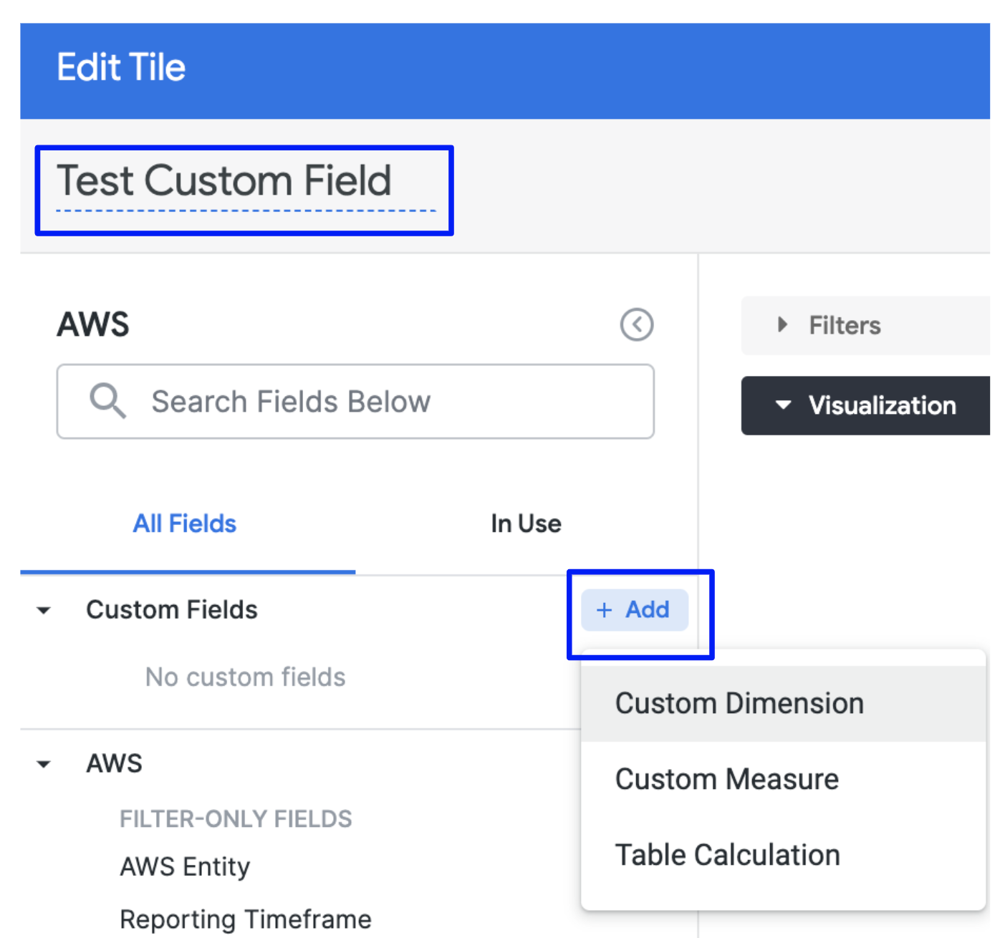
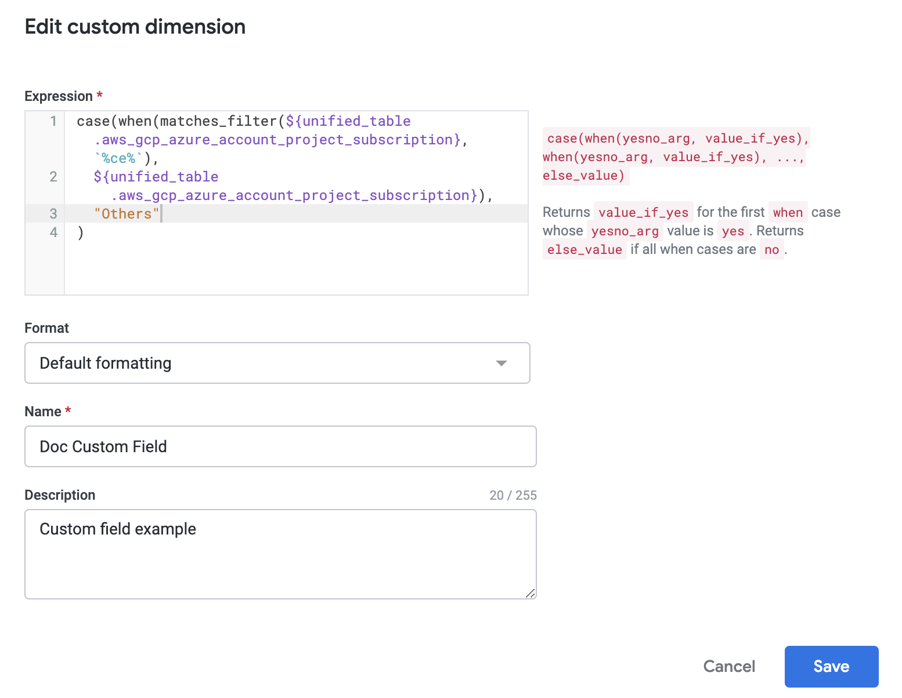
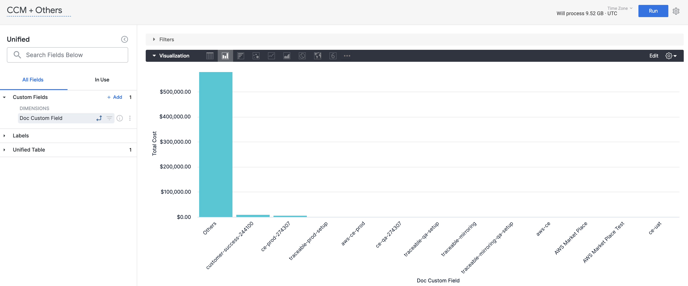
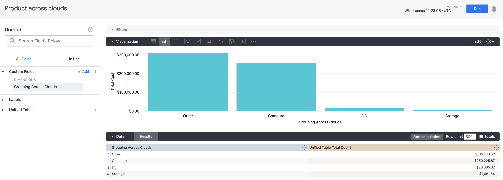
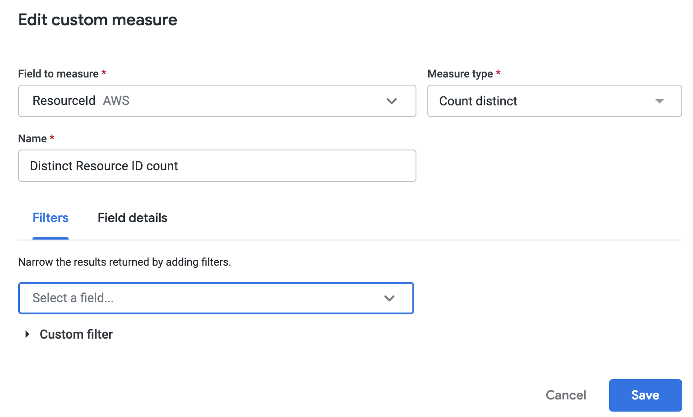
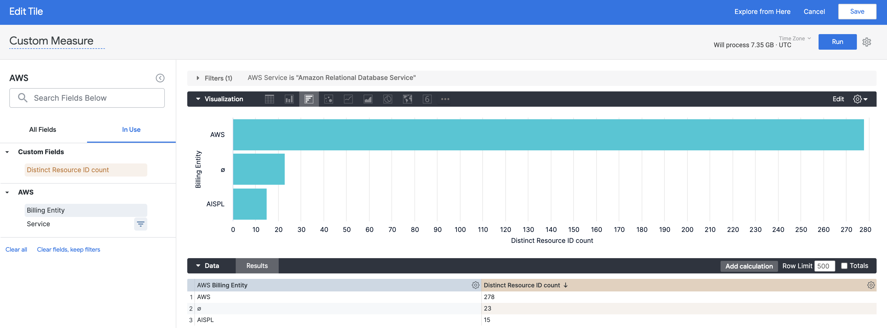

Dashboards provide the flexibility to add custom fields to the query. Using custom fields you can build new ad hoc custom dimensions and measures in Explore. Adding custom fields to the query allows to gain deeper insights into your data.

This topic talks about how to add custom fields (dimensions and measures) to your dashboard query and how to utilize them to improve the data analysis.

### Before you begin

* [Create Dashboards](create-dashboards.md)

### Review: Scope of Custom Fields

Custom fields are a combination of first-class dimensions and predefined functions like concat, contains, case, and so on. They can't be used to pull data from any third party or external source.

### Step: Add Custom Fields

To get started with the custom fields, you need to select an Explore for your tile.

1. Create a Dashboard. See [Step 1: Create a Dashboard](create-dashboards.md#step-1-create-a-dashboard).
2. Add tiles to your Dashboard. See [Step 2: Add Tiles to a Dashboard](create-dashboards.md#step-2-add-tiles-to-a-dashboard).
3. Select an Explore for your tile.
4. Give your tile a name. This will be the name of the tile on the dashboard.
5. In **Custom Fields**, click **Add**.
6. You can create the following types of custom fields:  

	* Custom Dimension
	* Custom Measure
	* Table Calculation
	* For more information, see [Custom Field Types](https://connect.looker.com/library/document/adding-custom-fields?version=22.2#custom_field_types).

### Create Custom Dimension

Perform the following steps to create a Custom Dimension.

1. In **Custom Fields**, click **Add**, and then click **Custom Dimension**.
2. In **Edit custom dimension**, in **Expression**, enter the expression for your dimension. For supported functions and operators see, [Functions and operators](https://docs.looker.com/exploring-data/creating-looker-expressions/looker-functions-and-operators).
3. (Optional) Select the format for your dimension.
4. In **Name**, enter a name for your dimension. The name will appear in Custom Fields to identify your dimension.
5. Once you're done, click **Save**.
6. Once you have set up your query, click **Run**.
7. Click **Save** to save the query as a tile on your dashboard.

#### Examples: Custom Dimension

Let’s take a look at some of the custom dimension examples with the corresponding visualizations.

##### Example 1: Filter Based on the String Data Type

This custom field is a regex search on all cloud cost management accounts for the string `ce`. Any account, project, or subscription without this string is bucketed under **Others**. You can use custom fields to get more specific and granular data for your analysis.


```
case(when(matches_filter(${unified_table.aws_gcp_azure_account_project_subscription}, `%ce%`),   
  ${unified_table.aws_gcp_azure_account_project_subscription}),   
  "Others"  
)
```

##### Example 2: Group Resources Across Your Environment

This example shows how you can group resources across your cloud environment.


```
case(  
  when(${unified_table.product} = "Amazon Simple Storage Service" OR ${unified_table.product} = "Cloud Storage", "Storage"),  
  when(${unified_table.product} = "Amazon DynamoDB" OR ${unified_table.product} = "Cloud SQL", "DB"),  
  when(${unified_table.product} = "Amazon Elastic Compute Cloud" OR ${unified_table.product} = "Compute Engine", "Compute"),  
  "Other"  
)
```

### Create Custom Measure

Perform the following steps to create a Custom Measure.

1. In **Custom Fields**, click **Add**, and then click **Custom Measure**.
2. In **Edit custom measure**, in **Field to measure** select the field for which you want to create measure. For example, Resource ID.
3. Select the **Measure type**. For example, **Count distinct** or **List of unique values**.
4. In **Name**, enter a name for your custom measure. The name will appear in Custom Fields to identify your measure.
5. (Optional) You can add filters to further narrow the results.
6. Once you're done, click **Save**.
7. Once you have set up your query, click **Run**.
8. Click **Save** to save the query as a tile on your dashboard.

### Use Table Calculation

Table calculations make it easy to create ad hoc metrics. They are similar to formulas that are found in spreadsheet tools like Excel. Table calculations appear as green columns in the data table, rather than as blue columns (dimensions) or orange columns (measures).

Table calculations can perform mathematical, logical (true/false), lexical (text-based), and date-based calculations on the dimensions, measures, and other table calculations in your query.

Perform the following steps to use Table Calculation for your custom fields.

In **Custom Fields**, click **Add**, and then click **Table Calculation**. For details, see [Using Table Calculation](https://connect.looker.com/library/document/using-table-calculations?version=22.2).

### Next steps

* [Create Visualizations and Graphs](create-visualizations-and-graphs.md)
* [Create Conditional Alerts](create-conditional-alerts.md)
* [Schedule and Share Dashboards](share-dashboards.md)
* [Use Dashboard Actions](use-dashboard-actions.md)
* [Download Dashboard Data](download-dashboard-data.md)

