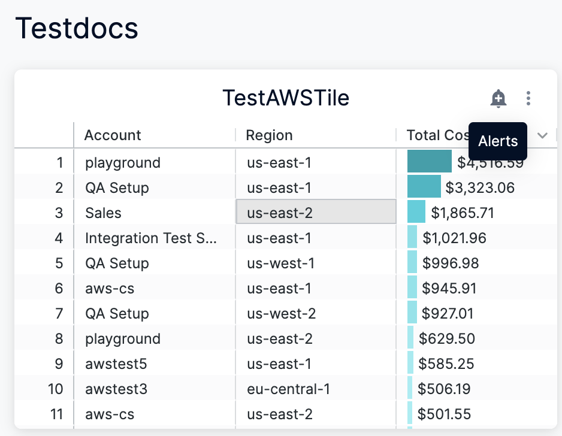
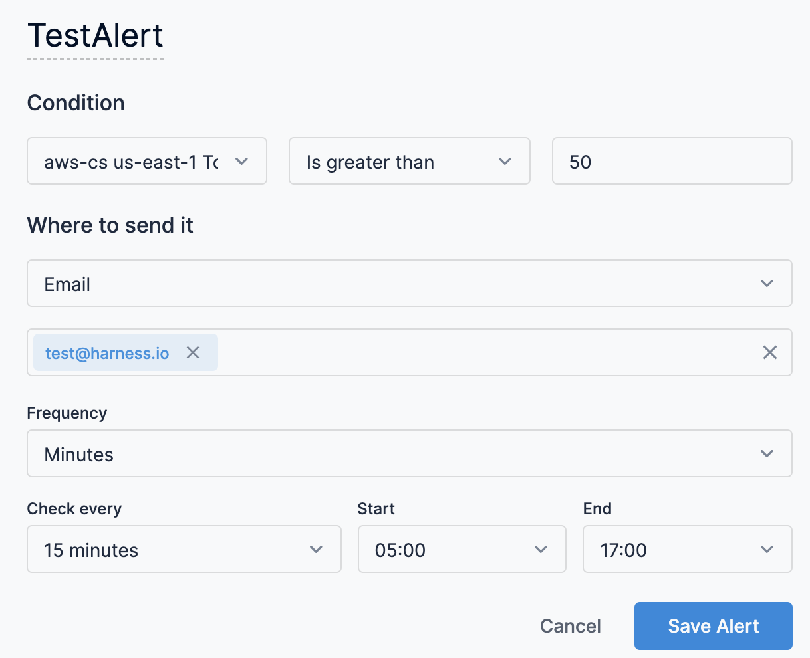
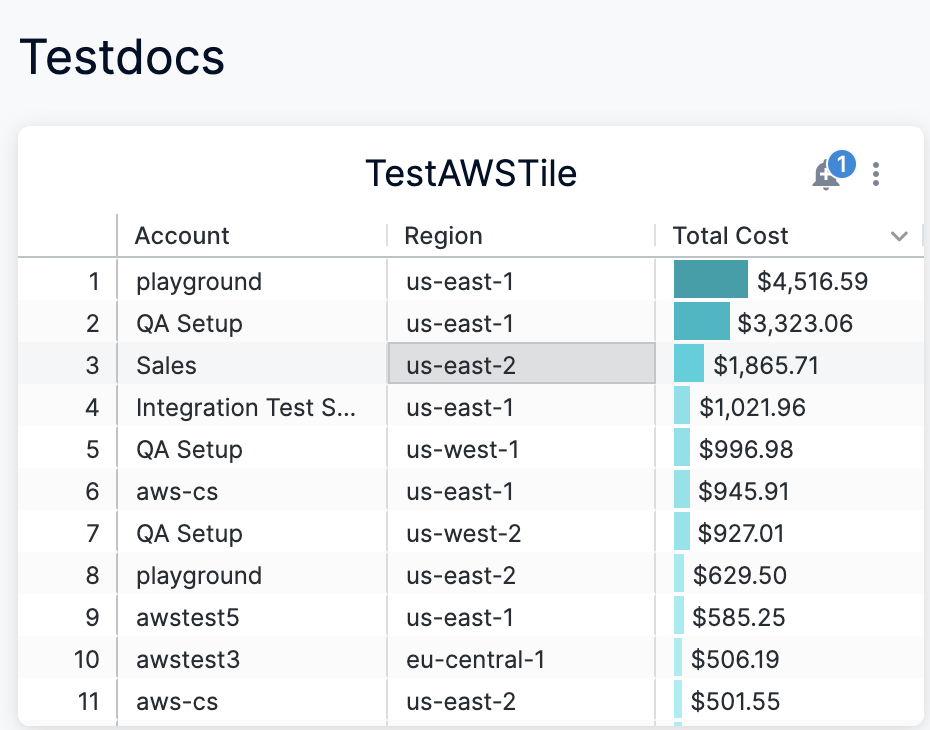

Conditional alerts let you trigger notifications when the specific conditions are met or exceeded. Notifications can be sent to specific recipients at a desired frequency. The alert conditions use the dashboard filters that exist when the alert is created.

* Alerts are set on dashboard tiles.
* Dashboards check whether each alert’s conditions have been met or exceeded based on the alert’s frequency, and then notifies users of this change.
* To create alerts, your dashboard must be out of edit mode.

### Before you begin

* [Create Dashboards](create-dashboards.md)

### Visual Summary

The following video explains how to create conditional alerts for a dashboard:

### Step: Create Conditional Alerts

To create an alert on a dashboard tile, perform the following steps:

1. Click the tile’s bell icon.
2. The default alert title indicates which conditions need to be true for the alert to be triggered. If you want to rename your alert, enter a custom title.
3. In the **Condition** drop-down, set the components that tell dashboard how to check the tile data for changes and the kinds of changes that trigger an alert notification.  
The alert condition is represented by these components:
	* The list of fields or table calculations that appear in the dashboard tile’s visualization
	* The change that the selected field, fields, table calculation, or table calculations must undergo to trigger the alert notification
	* The magnitude of the change that would trigger the alert notificationThese conditions include:
	* **Is greater than**
	* **Is less than**
	* **Is equal to**
	* **Is greater than or equal to**
	* **Is less than or equal to**If the query contains a date or time field, additional conditions are available:
	* **Increases by**
	* **Decreases by**
	* **Changes by** (a combination of **Increases by** and **Decreases by**)
4. In **Where to send it**, enter the email address(es) of the recepients.
5. Set the frequency at which dashboard will check your data for changes to send an alert notification (if the alert conditions are met). These are the available frequency options:
	* **Monthly** on a specified **Day** of the month (the default is the **1st** of the month) at a specified **Time** (the default is **05:00**)
	* **Weekly** on a specified **Day** of the week (the default is **Sun** for Sunday) at a specified **Time** (the default is **05:00**)
	* **Daily** at a specified **Time** (the default is **05:00**)
	* **Hourly** at a specified interval (the default is to check the data every hour) with specified **Start** and **End** times (the default is **05:00** and **17:00**). With hourly intervals you can have Looker check the data at these intervals:
		+ **Hour**
		+ **2 hours**
		+ **3 hours**
		+ **4 hours**
		+ **6 hours**
		+ **8 hours**
		+ **12 hours**
	* **Minutes** at a specified interval (the default is to check the data every 15 minutes) with specified **Start** and **End** times (the default is **05:00** and **17:00**). With minute-based intervals, you can have Looker check the data at these intervals:
		+ **15 minutes**
		+ **30 minutes****Start** and **End** times are inclusive. For example, if you set **Check every** to **12 hours** with a **Start** time of **05:00** and an **End** time of **17:00**, Dashboard will check the data at 05:00 *and* 17:00
6. Click **Save Alert**.
7. Hover over the bell icon that appears on the dashboard tile. A numeric indicator shows how many alerts you have created for that tile.

