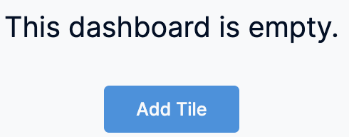

The Dashboard allows you to organize, explore, and present structured data logically. You can use this data to improve deployments and inform operations and business decisions.

This topic describes how to create your own Dashboard.

### Visual Summary

The following video explains how to create a Dashboard:

### Step 1: Create a Dashboard

To create a Dashboard you first need to first create a Folder. The Dashboards are created inside a folder.

1. In Harness, click **Dashboards**.
2. In **Dashboards**, click **+ Dashboard**.
   
   

3. In **About the Dashboard**, in **Folder**, select **Organization Shared Folder**.
4. In **Name**, enter a name for your dashboard. For example, GCP.
5. (Optional) In **Tags**, type a name for your tag and press enter to create a tag, and click **Continue**.
6. Click **Edit Dashboard**.
   
   
   
7.  Click **Add Tile**.
   
    

### Step 2: Add Tiles to a Dashboard

Once you create a dashboard, the next step is to add tiles and text to the dashboard. As you add tiles to a dashboard, CCM Dashboards automatically sizes them and places them at the bottom of the dashboard, but you can move and resize tiles however you like. You can also edit tiles after you’ve created them to adjust the names of the tiles, the visualizations, or the underlying queries.

1. Click **Add Tile** from the top left of the dashboard pane and then click **Visualization**, or click the **Add Tile** button in the center of the dashboard pane.
   
   
   
2. Select an Explore to get started.
	* An Explore is a starting point for a query, designed to explore a particular subject area.
	* The data shown in an Explore is determined by the dimensionsand measures you select from the field picker.
		+ **Dimension**: A dimension can be thought of as a group or bucket of data.
		+ **Measure**: A measure is information aboutthat bucket of data.
  
          
  
3. Click the Explore that corresponds to the fields you want to include in your dashboard. For example, AWS.

### Step 3: Choose an Explore to Build Your Query

The next step is to understand how to build a query and how to pull data in the dashboard to see the details and gain deeper insights into your data. To get started, you need to select an Explore for your tile.

1. Give your query a name. This will be the name of the tile on the dashboard.
2. Select the filters for your query.
3. Select the dimensions and measures for your query. In this example, AWS Account, AWS Region, and AWS Total Cost is selected.
4. Configure your visualization options. For more information, see [Create Visualizations and Graphs](create-visualizations-and-graphs.md).
5. Once you have set up your query, click **Run**.
6. Click **Save** to save the query as a tile on your dashboard.
   
   
   
7.  Once you're done adding all the required tiles to your dashboard, click **Save**.

### Option: Working with Folders

You can create folders for organizing your dashboards.

You can edit the names of the folders in the **Folders** page. 

You can move a dashboard between folders.

### Next steps

* [Create Visualizations and Graphs](create-visualizations-and-graphs.md)
* [Create Conditional Alerts](create-conditional-alerts.md)
* [Schedule and Share Dashboards](share-dashboards.md)
* [Use Dashboard Actions](use-dashboard-actions.md)
* [Download Dashboard Data](download-dashboard-data.md)
* [Add Custom Fields](add-custom-fields.md)

