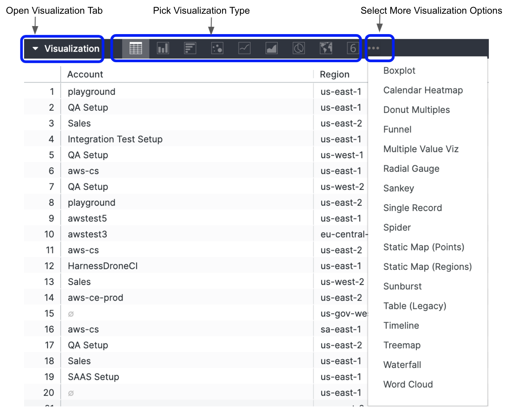

You can add an eye-catching chart to any query result set on the Explore. The Dashboard keeps query details and visualization configuration data together, so when you share a query, recipients get the picture as well as the data.

This topic explains how to create visualizations that best show off your data.

### Before you begin

* [Create Dashboards](create-dashboards.md)

### Step: Choose a Visualization Type

Once you’ve created and run your query, click the Visualization tab in the Explore to configure visualization options for the query. Use the chart buttons to pick the visualization type that’s right for the data.

1. Create and run your query.
2. Click the **Visualization** tab to start configuring your visualization options.
3. Use the chart buttons to pick the visualization type that’s right for the data. For more information, see [Visualization types](https://docs.looker.com/exploring-data/visualizing-query-results/visualization-types).  

### Step: Fine-Tune Your Visualizations

You can customize a visualization to make the data more readable and to add visual styling, for example:

* Customize visualizations with chart settings
* Include multiple visualization types on a single chart
* Create stacked charts with multiple visualization types

#### Customize Visualizations with Chart Settings

To see the visualization options available for a particular visualization type, click that type on the [Visualization types](https://docs.looker.com/exploring-data/visualizing-query-results/visualization-types) documentation page.

1. In **Visualization**, click **Edit**. The edit options vary depending on the visualization type.
2. Click the **Plot** tab. For details, see [Visualization types](https://docs.looker.com/exploring-data/visualizing-query-results/visualization-types).

#### Include Multiple Visualization Types on a Single Chart

You can also create charts that include more than one visualization type:

1. In **Visualization**, click **Edit**. The edit options vary depending on the visualization type.
2. Click the **Series** tab.
3. In the **Customizations** section, you’ll see an entry for each series in the chart. Click the arrow next to the series you want to change to display its customization options.
4. In the **Type** box, select the type of visualization to use for that series.  
Charts with multiple series types always layer line and scatter series in front, then they layer area, column, and bar series.  
You can alter the layering order of column, bar, and area series by changing the series’ positions in the data table and clicking the **Run** button. The leftmost series will layer on top and the rightmost series will layer on the bottom.

#### Create Stacked Charts with Multiple Visualization Types

You can include stacked series in a chart with multiple visualization types. All the series of the same type as the chart overall will be stacked together; series of other types will not stack.

1. In **Visualization**, click **Edit**. The edit options vary depending on the visualization type.
2. Click the **Series** tab.
3. To create a stacked chart that uses multiple y-axes, drag any series to a different axis in the **Y** menu. The stacked series will appear together, but all other series can be moved independently. See [Creating stacked charts](https://docs.looker.com/exploring-data/visualizing-query-results#creating_stacked_charts_with_multiple_visualization_types).

