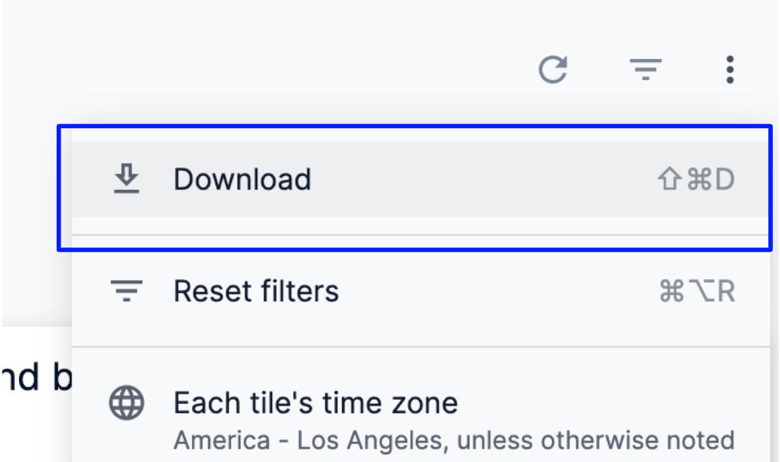
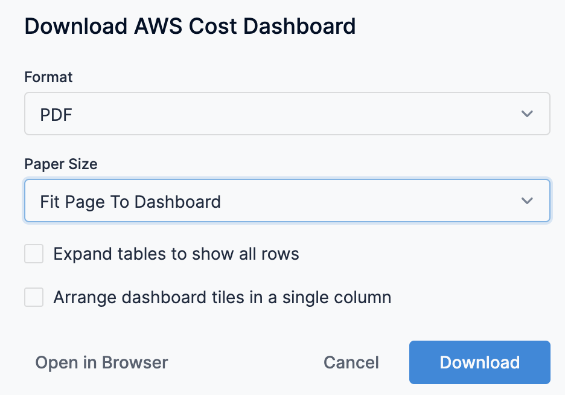
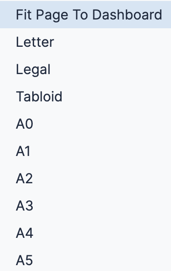
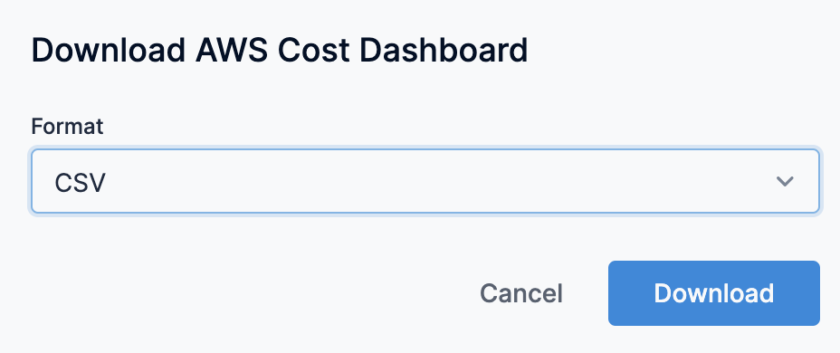
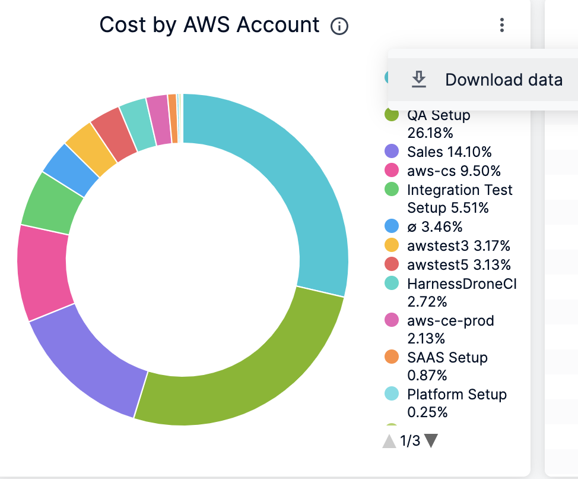
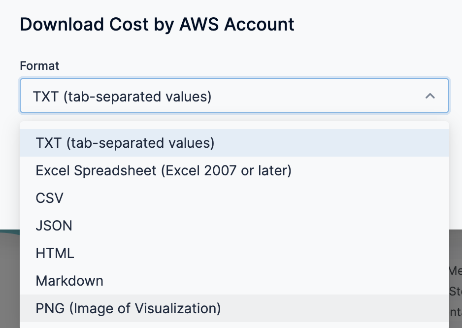

This page describes how to download content, visualizations or data, from the **Dashboards**. You can download data using the following options:

* Download Data from a Dashboard
* Download Data from a Dashboard Tile

### Before you begin

* [Create Dashboards](create-dashboards.md)
* [Create Visualizations and Graphs](create-visualizations-and-graphs.md)

### Download Data from a Dashboard

Perform the following steps to download data from a Dashboard.

1. To download the entire dashboard, select **Download** from the dashboard’s three-dot menu.
2. Select PDF or CSV as your download format.

#### Download a Dashboard as a PDF

You can download your entire dashboard as a PDF. The PDF contains the dashboard title, any dashboard filters, all the dashboard tiles, and the time zone the dashboard was run in. The PDF also includes a timestamp showing when the dashboard was downloaded.

1. In **Download AWS Cost Dashboard**, in **Format**, select **PDF**.
   
   
   
2. Select an option from the **Paper Size** drop-down menu. The **Fit Page to Dashboard** option is the default; it sizes the PDF to match the layout of the dashboard on the screen. Other paper size options size the PDF to match a standard paper size and fit the dashboard within it.  
  
   Depending on the layout of the dashboard, large visualizations or groups of overlapping tiles may need to be resized to fit on given page size.

   

3. If you select something other than **Fit Page to Dashboard** in the **Paper Size** drop-down, an **Orientation** option appears. You can choose to orient the dashboard in portrait or landscape position.
4. Do not select **Expand tables to show all rows**. This option is relevant only for the table visualizations. If selected, the PDF will show all the rows available in the table visualization, not just the rows displayed in the dashboard tile thumbnail.
5. Select or leave unselected **Arrange dashboard tiles in a single column**. If you select this option, the PDF displays dashboard tiles in a single vertical column. If you do not select this option, the dashboard tiles appear as they are arranged in the dashboard.
6. Click **Open in Browser** to see an image of the PDF in a new tab of your browser. This also downloads a PDF in the Download folder.
7. Click **Cancel** if you no longer want to download the dashboard.
8. Click **Download** to initiate the download. A new tab in your browser will open, showing the status of your download.!
   
    
    

#### Download a Dashboard as CSVs

You can download all the tiles from your dashboard as a zipped collection of CSV files. 

1. In **Download AWS Cost Dashboard**, in **Format**, select **CSV** from the **Format** drop-down menu.
   
   
   
2. Click **Cancel** if you no longer want to download the dashboard.
3. Click **Download** to initiate the download your zipped CSV collection.

### Download Data from a Dashboard Tile

Perform the following steps to download the data from a dashboard tile:

1. Click the three-dot icon (Tile action) on the tile and click **Download data**.
2. Select the format for your download. Data can be downloaded from dashboard tiles in the following formats:
	* TXT (tab-separated values)
	* Excel spreadsheet (Excel 2007 or later)
	* CSV
	* JSON
	* HTML
	* Markdown
	* PNG (image of visualization)Depending on the format you select, some options in the **Advanced data options** menu may not be available.
  
      
  
3. (Optional) For more options, click the arrow next to **Advanced data options**.
	1. In **Results**, select **As displayed in the data table**.
	2. In **Data** **Values**, choose how you want the downloaded query results to appear:  
	
		* If you choose **Unformatted**, special formatting is not applied to your query results, such as rounding long numbers or adding special characters that may have been put in place.
		* If you choose **Formatted**, the data appears more similar to the Dashboard experience in Harness.
	3. In the Number of rows to include, choose how much data you want to download:  
	
		* **Current results table**: Number of rows specified by the row limit
		* **All Results**: All results returned by the query
		* **Custom**: Custom number of rows
4. Once you’ve selected your options, click the **Download** button to download a file to your computer, or click **Open in Browser** to view the file in the browser.

### See also

You can choose to download the following By Harness CCM Dashboards:

* [View AWS Cost Dashboard](https://docs.harness.io/article/u3yxrebj6r-aws-dashboard)
* [View AWS Reservation Efficiency Dashboard](https://docs.harness.io/article/o86lf6qgr2-aws-reservation-coverage-and-service-cost)
* [View Azure Cost Dashboard](https://docs.harness.io/article/n7vpieto0n-azure-cost-dashboard)
* [View GCP Dashboard](https://docs.harness.io/article/tk55quhfi4-gcp-dashboard)
* [View Cluster Cost Dashboard](https://docs.harness.io/article/uai4ud1ibi-cluster-cost-dashboard)
* [View Multi-cloud Cost Overview Dashboard](https://docs.harness.io/article/ff5f08g4v4-multi-cloud-cost-overview-dashboard)
* [Orphaned EBS Volumes and Snapshots Dashboard](https://docs.harness.io/article/itn49ytd8u-orphaned-ebs-volumes-and-snapshots-dashboard)
* [View AWS EC2 Inventory Cost Dashboard](https://docs.harness.io/article/xbekog2ith-view-aws-ec-2-inventory-cost-dashboard)
* [View AWS EC2 Instance Metrics Dashboard](https://docs.harness.io/article/mwhraec911-view-aws-ec-2-instance-metrics)

