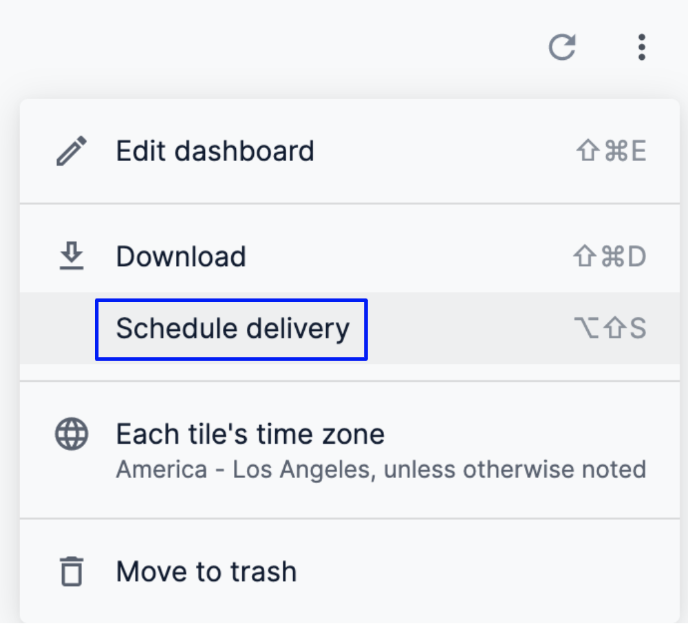
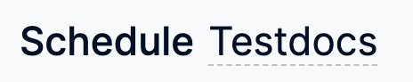
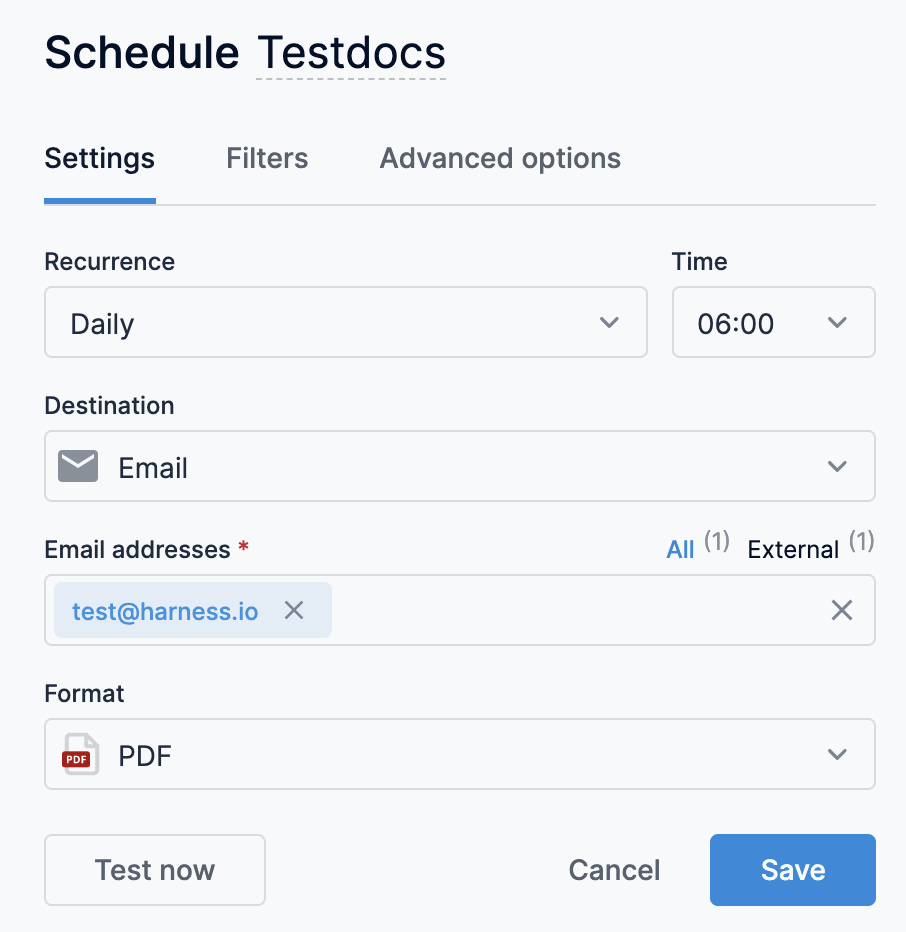
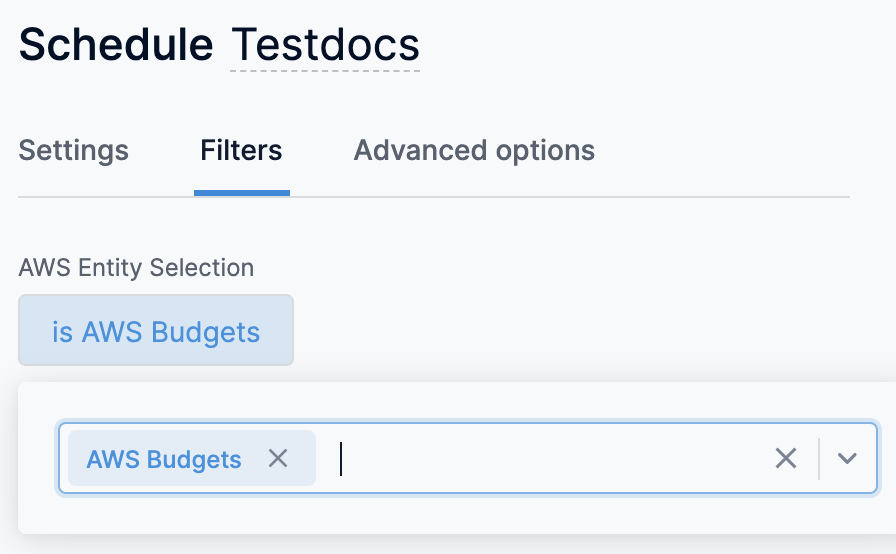
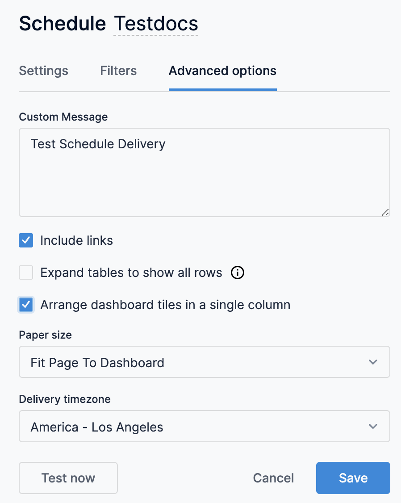
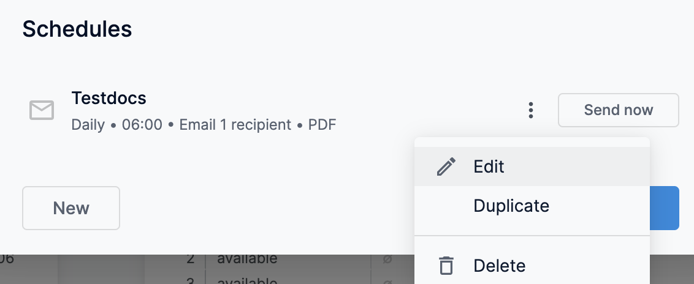

A Dashboard lets you schedule immediate or recurring delivery of dashboards. This topic describes how to schedule and share dashboards.

### Before you begin

* [Create Dashboards](create-dashboards.md)
* Make sure the dashboard is not in edit mode.

### Visual Summary

The following video explains how to create a Dashboard:

### Step: Schedule a Delivery

Perform the following steps to schedule a delivery:

1. Click the three-dot menu in the upper right of the dashboard and select **Schedule delivery**.
2. In Schedule, the top of the schedule window shows the name automatically given to the delivery. The name defaults to the dashboard’s name. To edit the delivery’s name, click the name (indicated by the dotted underscore), and make your edits.
3. In **Schedule**, the following options are available:
	* Settings
	* Filters
	* Advanced options

### Settings

The settings tab allows you to customize your delivery’s recurrence, destination, format, and more.

#### Recurrence

Customize the timing of your delivery in the **Recurrence** section.

##### Send now

If you select **Send now** from the **Recurrence** drop-down menu, a one-time delivery of the dashboard will be sent once you fill in the required fields and click the **Send now** button at the bottom of the window.

##### Time-based and date-based schedules

Select one of the following options from the **Recurrence** drop-down menu:

* Monthly
* Weekly
* Daily
* Hourly
* Minutes
* Specific months
* Specific days

The timing options change depending on the option you’ve chosen. 

<!-- For example, here are the setting options when you select **Specific months**: -->

<!--  -->

<!-- Here are the settings when you select **Hourly**: -->

<!--  -->

The **Time**, **Start**, and **End** fields use a 24-hour clock. If the time you want is not available in the drop-down menu, click within the field and manually enter your desired time, such as 9:15, 15:37, and so on.

**Hourly** and **Minutes** schedules repeat daily within the **Start** and **End** timeframe you set. The end time for **Hourly** and **Minutes** intervals is not inclusive. The last delivery will be sent at the last selected interval prior to the specified end time. For example, if a dashboard is scheduled **Hourly** between 12:00 a.m. and 11:00 p.m., it will be sent on the hour, every hour, from 12:00 a.m. to 10:00 p.m. Or, if a recurrence is every 30 minutes between 12:00 a.m. and 11:00 p.m., the last delivery will be sent at 10:30 p.m.

#### Destination

In **Email addresses**, enter the email address(es) of the recipients and press **Enter**.

#### Format

The **Format** field contains a drop-down menu of available formats:

* **CSV zip file**: The unformatted data from the dashboard delivered as a collection of comma-separated values (CSV) files in a zipped directory. For deliveries to email, the ZIP file is delivered as an email attachment.
* **PDF**: An image of the dashboard as a single PDF file. The default layout displays tiles as they are arranged in the dashboard, but other layout and sizing options are available under **Advanced options**. For deliveries to email, the file is delivered as an email attachment.
* **PNG visualization**: An image of the dashboard as a single PNG file. The default layout displays tiles as they are arranged in the dashboard, but other layout options are available under **Advanced options**. For deliveries to email, the image appears inline within the body of the email.  

### Filters

The Filters tab in the schedule and send window shows any filters applied to the dashboard as well as their values.

In this tab, you can edit the values for any existing filters applied to the dashboard and the new values will be applied to the delivery. The dashboard itself will not be affected.

### Advanced Options

The **Advanced options** tab provides additional customization for your delivery. The options available depend on the selected format of your delivery.

#### Custom Message

Enter a message you would like included in the body of emails to recipients.

#### Include Links

Select this option to include in the data delivery emails a View full dashboard link that goes to the dashboard.

#### Results

This field is available only for CSV ZIP file formats of dashboard deliveries. It contains two options: With visualizations options applied or As displayed in the data table. You can choose one or the other.

Choose the With visualizations options applied option to apply some of the visualization settings from the dashboard tiles to your dashboard delivery. This causes the files in your delivery to appear similar to table charts. Any of the following settings in the Plot, Series, and Formatting menus that are configured for a visualization will be applied to the data delivery:

* Show Row Numbers
* Hide Totals
* Hide Row Totals
* Limit Displayed Rows to a maximum of 500 rows shown or hidden
* Show Full Field Name
* Custom labels for each column

Choose the As displayed in the data table option to deliver the data as it appears in the data table of each dashboard tile’s Explore from here window.

#### Values

This field is available only for CSV ZIP file formats of dashboard deliveries. It contains two options: Formatted or Unformatted. You can choose one or the other.

* Select Formatted if you want the data to appear similar to how it appears in the Explore experience in Dashboard, although some features (such as linking) aren’t supported by all file types.
* Select Unformatted if you do not want to apply any special formatting of your query results, such as rounding long numbers or adding special characters. This is often preferred when data is being fed into another tool for processing.

#### Expand Tables to Show all Rows

This option is available only for PDF formats of dashboard deliveries.

Select the Expand tables to show all rows box to display all rows of any table visualizations in the dashboard — rather than just those rows that display in the dashboard tile thumbnails.

#### Arrange Dashboard Tiles in a Single Column

This option is available only for the PDF and PNG visualization formats of dashboard deliveries.

Select the **Arrange dashboard tiles in a single column** box to format your PDF or your PNG visualization in a single column layout. This layout displays dashboard tiles in a single vertical column.

#### Paper Size

This option is available only for PDF formats of dashboard deliveries.

You have the option to specify the optimal size and orientation of dashboard PDFs by selecting from the Paper size drop-down menu.

#### Delivery Time Zone

By default, dashboard uses the time zone associated with your account to determine when to send your data delivery.

If you want to specify a different time zone, select the time zone from the drop-down menu. The time zone you select does not affect the data in your dashboard, just the timing of the delivery.

### Save a Schedule Delivery

* If you set the **Recurrence** field to **Send now**, click the **Send now** button at the bottom of the window for a one-time delivery to the listed destination.
* If you set the Recurrence field to anything other than **Send now**, click the **Save** button to save your schedule.

### Edit a Schedule

You can edit only the schedules you have created. To edit a schedule:

1. Click the three-dot menu at the top right of the dashboard.
2. Select **Schedule delivery** from the drop-down menu.
3. In **Schedules**, click the three-dot menu that applies to the schedule you would like to edit.
4. Choose **Edit** from the drop-down menu.
5. Make your edits and click **Save**.

### Duplicate a Schedule

To duplicate a schedule:

1. Click the three-dot menu at the top right of the dashboard.
2. Select **Schedule delivery** from the drop-down menu.
3. In **Schedules**, click the three-dot menu that applies to the schedule you would like to duplicate.
4. Choose **Duplicate** from the drop-down menu. **Copy** is appended to the schedule name.
5. Make your edits and click **Save**.

