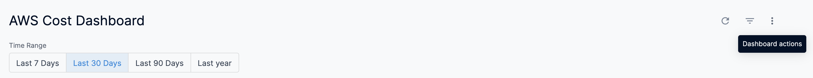

This topic describes how to use different dashboard actions. The document uses [AWS Cost Dashboard](https://docs.harness.io/article/u3yxrebj6r-aws-dashboard) as an example. You can use **Dashboard actions** in the same way for other **By Harness Dashboards** too. For example, [GCP Cost Dashboard](https://docs.harness.io/article/tk55quhfi4-gcp-dashboard), [Azure Cost Dashboard](https://docs.harness.io/article/n7vpieto0n-azure-cost-dashboard), [Cluster Cost Dashboard](https://docs.harness.io/article/uai4ud1ibi-cluster-cost-dashboard), and so on.

### Step: Use Dashboard Actions

Perform the following steps to use Dashboard actions:

1. In Harness, click **Dashboards**.
2. In **All Dashboards**, select **By Harness** and click **AWS Cost Dashboard**.
3. In AWS Cost Dashboard, click **Dashboard actions** (3-dot menu to the right of the filter button).The **Dashboard actions** provide the following options:  
  

|  |  |
| --- | --- |
| **Option** | **Description** |
| Download | Downloads the dashboard in PDF or CSV format. See [Download Dashboard Data](download-dashboard-data.md). |
| Reset filters | Resets the filter to its default value. By default, AWS Cost Dashboard displays the last 30 days' data. |
| Each tile's time zone | Updates the time zone of the dashboard. The time zone applied to your dashboard can affect the results shown, because of slight differences in the exact hours used for time-based data. If you are interested in the data as it applies to a different region, change the time zone of your dashboard to reflect that region.You can choose one of the following options:
	* Choose **Each tile’s time zone** to run all tiles in the time zone in which they were saved.
	* Choose **Viewer time zone** to run all tiles in the time zone selected in your account settings.
	* Choose any of the time zones listed in the drop-down to run all tiles in that time zone.After you select your time zone, click **Update** in the dashboard time zone window; the dashboard will update for the new time zone.Once you navigate away from the dashboard, the dashboard will return to its default time zone setting. |

