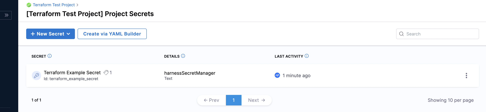

Terraform is an infrastructure as code (IaC) tool that allows you to build, change, and version infrastructure safely and efficiently.​

Harness Terraform Provider is a library that you can use to create Harness Infrastructure. You can administer and use Harness functionality from within your Terraform setup using Harness Terraform Provider.

This quickstart shows you how to write your configurations in Terraform and provision your Harness resources using the Harness Terraform Provider.

### Before you begin

* [Introduction to Terraform](https://www.terraform.io/intro)
* [Terraform Registry](https://www.terraform.io/registry)
* [Terraform Configuration Language](https://www.terraform.io/language)

### Prerequisites

* You must have a Harness Account.
* You must have an admin setup for your Harness Account.
* You must have a Personal Access Token (PAT).  
For detailed steps on how to generate a PAT, see [Create a Personal Access Token](../4_Role-Based-Access-Control/7-add-and-manage-api-keys.md#create-personal-access-token).

### Important

* Harness Terraform Provider lets you provision the following:
	+ Organizations
	+ Projects
	+ Permissions setup
	+ Connectors
	+ Secrets
	+ Pipelines
* You cannot provision users using Harness Terraform Provider.  
You can provision users through SCIM using [Okta](../3_Authentication/6-provision-users-with-okta-scim.md), [OneLogin](../3_Authentication/7provision-users-and-groups-with-one-login-scim.md) or [Azure AD](../3_Authentication/8-provision-users-and-groups-using-azure-ad-scim.md).
* You cannot run or monitor your Pipelines using Harness Terraform Provider.

### Why use Harness Terraform Provider?

Harness Terraform Provider lets you use Terraform scripts to configure Harness. Through scripts, it supports the creation of all the key Harness objects, including Projects, Pipelines, Connectors, and Secrets.

It thus lets you create a repeatable and scalable structure of Harness infrastructure.​​

### Visual summary

Here is a quick overview of Harness Terraform Provider:

* You write your Terraform Configuration in `.tf` file.  
You declare all the resources that represent your infrastructure objects in this file.  
For more details, see [Configuration Language](https://www.terraform.io/language).
* Next, you initialize, plan, and apply your resources using the following commands:
	+ `Terraform init`
	+ `Terraform plan`
	+ `Terraform apply`
* Once you confirm Terraform apply, a state file .statetf is generated.
* Your resources are provisioned successfully.

### Install Harness Terraform Provider

To install the Harness Terraform Provider, copy, and paste the following code into your Terraform configuration.

Enter your Harness Account Id in `account_id`.

The account Id is in every URL when using Harness:

`https://app.harness.io/ng/#/account/``**{accountid}**``/home/get-started​`

Enter your Personal Access Token (PAT) in `platform_api_key`.

For detailed steps on how to generate a PAT, see [Create a Personal Access Token](../4_Role-Based-Access-Control/7-add-and-manage-api-keys.md#create-personal-access-token).​


```
terraform {  
    required_providers {  
        harness = {  
            source = "harness/harness"  
            version = "<version_number>"  
           }  
        }  
    }  
provider "harness" {  
    endpoint   = "https://app.harness.io/gateway"  
    account_id = "<your_harness_accountid"  
    platform_api_key    = "your_pat"  
   }
```
### Add Harness Resource configurations to Terraform files

Before you start provisioning Harness Resources, make sure you have written your Terraform Configuration as declarative scripts as a`.tf` file.

The `.tf` Terraform file will contain the Harness infrastructure details that you want to provision.

Let us see examples of adding the following resources to your Terraform Configuration:

* Organization
* Project
* Encrypted Text Secret within a Project

#### Add Organization details


```
resource "harness_platform_organization" "org" {​  
    name      = "Terraform Example Org"  
    identifier = "terraform_example_org"  
    description = "Demo Organization, created through Terraform"  
}
```
Your Organization now appears in the list of Organizations within the scope of your Harness Account.


To try it out, see [Harness Organization](https://registry.terraform.io/providers/harness/harness/latest/docs/resources/platform_organization).

#### Add Project details


```
resource "harness_platform_project" "project" {  
    name      = "Terraform Test Project"  
    identifier = "terraform_test_project"  
    org_id    = "terraform_example_org"  
}
```
Your Project now appears in the list of Projects within the scope of your Organization.


To try it out, see [Harness Project](https://registry.terraform.io/providers/harness/harness/latest/docs/resources/platform_project).

#### Add Encrypted Text Secret details


```
resource "harness_platform_secret_text" "textsecret" {​  
    identifier  = "terraform_example_secret"  
    name        = "Terraform Example Secret"  
    description = "This is a text Secret, generated through Terraform"  
    org_id      = "terraform_example_org"  
    project_id  = "terraform_test_project"  
    tags        = ["example:tags"]  
  
    secret_manager_identifier = "harnessSecretManager"  
    value_type                = "Inline"  
    value                     = "secret"  
    lifecycle {  
        ignore_changes = [  
            value,  
        ]  
    }  
}
```
Your Text Secret now appears in the list of Secrets within the scope of your Project.


To try it out, see [Harness Text Secret](https://registry.terraform.io/providers/harness/harness/latest/docs/resources/platform_secret_text).

If you do not provide the `org_id` and the `project_id` in the configuration, the Secret is created at the Account scope.

#### Add Pipeline details


```
resource "harness_platform_pipeline" "approval_pipeline" {  
    identifier  = "approval_pipeline"  
    name        = "Approval Pipeline"  
    description = "Simple Approval Stage pipeline generated through Terraform"  
    project_id  = "terraform_test_project"  
    org_id      = "terraform_example_org"  
  
    yaml        = <<PIPETEXT  
    pipeline:  
        name: "Approval Pipeline"  
        identifier: "Approval_Pipeline"  
        projectIdentifier: "terraform_test_project"  
        orgIdentifier: "terraform_example_org"  
        tags: {}  
        stages:  
             - stage:  
                name: Approval  
                identifier: Approval  
                description: ""  
                type: Approval  
                spec:  
                    execution:  
                        steps:  
                            - step:  
                                name: Approval Step  
                                identifier: Approval_Step  
                                type: HarnessApproval  
                                timeout: 1d  
                                spec:  
                                    approvalMessage: Please review the following information and approve the pipeline progression  
  
includePipelineExecutionHistory: true  
                                    approvers:  
                                        minimumCount: 1  
disallowPipelineExecutor: false  
                                        userGroups:  
                                            - account.testmv  
                                    approverInputs: []  
                    tags: {}  
PIPETEXT  
}
```
Your Pipeline now appears in the list of Pipelines within the scope of your Project.


To try it out, see [Harness Pipeline](https://registry.terraform.io/providers/harness/harness/latest/docs/resources/platform_pipeline).

### Provision Harness infrastructure

You can create the Harness infrastructure by performing the following steps:

1. **Initialize**: run the following command to initialize a working directory and set up the correct version of the Harness Terraform Provider.
```
terraform init
```
This command also creates a `.terraform` directory and downloads specific plugins.
2. **Plan**: run the following command to add desired resources.
```
terraform plan
```
This command creates an execution plan.
3. **Apply**: run the following command to apply the plan you just created.
```
terraform apply
```
This command executes your plan.Once you confirm the execution plan, Terraform generates a state file `terraform.tfstate` to track the state of all the resources it manages. This file is used to detect differences during the plan and detect configuration drift.​ For more details, see [State](https://www.terraform.io/language/state).

### Terraform import

You can provision existing resources that you have created and bring them under Terraform management.

To do this, use the following command:


```
terraform import
```
To learn more about the life cycle of a Terraform resource, see [Lifecycle of a Terraform Resource](https://freecontent.manning.com/the-lifecycle-of-a-terraform-resource/).

To try out Harness Terraform provider, see [Harness Provider](https://registry.terraform.io/providers/harness/harness/latest/docs).

### Next steps

* [Customize Terraform Configuration with Variables](https://www.terraform.io/language/values)
* [Reuse Configuration with Modules](https://www.terraform.io/language/modules)

